# 用 NodeJS、Express 和 MongoDB 构建一个 REST API 第三部分

> 原文：<https://medium.com/codex/build-a-rest-api-with-nodejs-express-and-mongodb-part-iii-f146665d3e3b?source=collection_archive---------9----------------------->

这个博客系列是用 NodeJS，Express 和 MongoDB 创建一个 REST API。在本教程中，我们将使用 PassportJS 对后端进行身份验证和授权


# 先决条件

本教程是上一篇博客的延续，[用 NodeJS、Express 和 MongoDB 构建 REST API 第二部分](/@dmmnissanka/build-a-rest-api-with-nodejs-express-and-mongodb-2ed0fd7a90cf)。

# 入门指南

在前一篇博客中，我们为一个博客管理系统创建了一个 REST API，它能够创建和获取用户，并从系统中创建、获取、更新和删除博客。我们使用`Joi`实现了一个请求验证机制，并使用`mongoose`连接数据库。

但是我们没有在 REST 端点中实现身份验证。因此，CRUD 操作可以由系统中的任何用户执行，这不是一个好的实现。在本教程中，让我们探索如何使用 [PassportJs](http://www.passportjs.org/) 实现认证和授权。

# 认证和授权

## 什么是身份验证和授权？

身份验证和授权代表着根本不同的活动。**认证**是识别用户的过程，**授权**是识别用户权限的过程。

举个例子，我们拿一个学校来说。进入大门时，安检人员会检查你的学校身份证。这是认证。只有持有有效身份证的人才能进入学校。学生不允许进入教师办公室。这是授权书。只有有进入教员室特权的人才能进入教员室。我相信现在您已经知道身份验证和授权之间的区别了。

在我们的博客管理 API 中，我们有几个不受保护的端点。

*   任何用户都可以访问所有端点
*   博客上的所有 CUD 操作都可以由任何用户进行

上述两个问题都可以通过在系统中实现 API 认证和 API 授权来解决。首先，让我们看看如何在我们的 API 中实现一个简单的身份验证模块。

## 证明

身份验证是 API 开发的重要组成部分。身份验证将确保 API 端点只对系统可以识别的用户可用。`PassportJS`是一款出色的认证中间件，提供多种认证策略。对于本教程，我们将使用`PassportJS` JWT 认证策略。
在我们当前的项目中，用户可以从`/api/vi/users`端点创建。我们将删除所有与用户相关的端点，并为用户注册和用户登录活动创建新的 API 端点。

首先，安装必要的依赖项。

```
npm install --save passport passport-jwt jsonwebtoken bcrypt
```

安装开发依赖项

```
npm install --save-dev @types/passport-jwt @types/bcrypt 
```

现在让我们把重点放在代码实现上。

首先，让我们尝试为用户生成一个 JSON Web 令牌。当用户被创建或登录时，会生成一个 JWT 并发送给用户。然后，用户可以使用该 JWT 来访问其他 API 端点。我们需要做的第一件事是，我们需要删除当前的用户 API 端点。请从项目中删除`user.controller.ts`和`user.route.ts`文件。

我们将添加两个新的 API 端点

*   用户注册的端点
*   用户登录的端点

到目前为止，用户模型不包含任何存储用户密码的字段。通过添加一个`password`字段来修改`user.model.ts`。

我们应该始终避免以纯文本形式存储密码。在上面的代码片段中，我们已经使用 [bcrypt](https://github.com/kelektiv/node.bcrypt.js#readme) 模块对密码进行了加密，并在将密码存储到数据库之前将其替换为原始密码。此外，还引入了一种比较纯文本密码和存储的哈希密码的新方法。

更换`user.service.ts`

我们引进了两种新的服务方法。一个是验证用户登录，另一个是验证用户创建。最后，两个函数都返回一个带有用户 id 的 JWT 令牌。它需要一个`ttl`值和一个私钥来生成 JWT 令牌，我们可以提供所需的参数作为环境变量。

更新转换器函数、用户类型和验证模式

为身份验证失败创建异常类。

创建`auth.controller.ts`和`auth.route.ts`

让我们尝试通过新的注册端点创建一个用户。

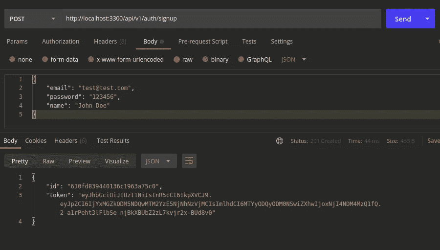

让我们验证它是如何存储在数据库中的。

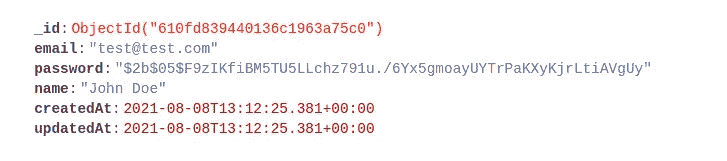

验证登录端点

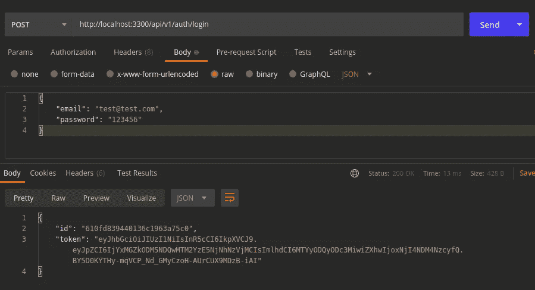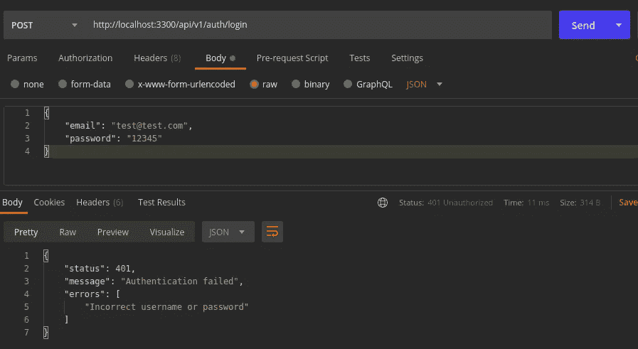

太好了。现在，我们已经为用户创建和用户登录定义了两个端点，它们返回一个令牌作为响应。让我们看看如何使用这个带有`PassportJS`的令牌来实现认证。

`PassportJS`提供大量认证[策略](http://www.passportjs.org/packages/)。在本教程中，我们将使用 PassportJS [策略](http://www.passportjs.org/packages/passport-jwt/)通过 JSON web 令牌进行身份验证

在`middlewares`里面创造`auth.middleware.ts`。该文件包含身份验证策略和身份验证中间件功能。

在`authStrategy`函数中定义了认证的`PassportJS`策略。在`authStrategy`函数中，我们从请求中提取`Authorization`头。这里我们使用了默认的`fromAuthHeaderAsBearerToken`函数，如果您想将`Authorization`头从`Bearer`改为其他的，您可以简单地创建您自己的提取函数并获取令牌。然后 passport 将尝试解密提取的令牌。为此，我们需要通过环境变量提供一个好的私钥。如果出现任何错误，这意味着无法用给定的密钥解密所提供的令牌。如果解密和用户获取成功，`PassportJS`将用从服务层获取的用户对象替换请求中的用户组件。

更新 `blog.route.ts`

新创建的`authenticate`中间件功能已经应用于所有博客路径。

用认证策略更新`app.ts`。

让我们通过访问博客端点来验证身份验证。

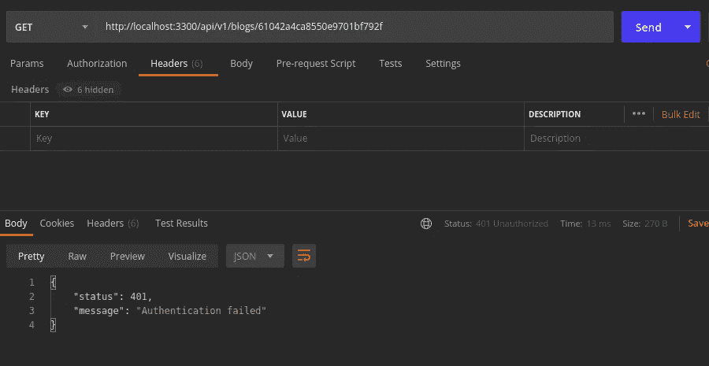

现在，当`Authorization`头丢失时，端点返回一个未授权的错误响应。

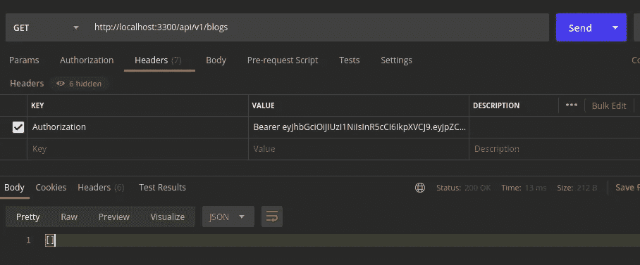

使用正确的授权头，它返回预期的响应。

我们使用 PassportJS 及其 JSON web 令牌认证策略成功地创建了一个认证中间件。现在让我们来关注一下授权。

## 批准

尽管我们在 API 中实现了身份验证，但实现仍然缺乏授权。任何有权访问 API 端点的用户都可以创建、更新和删除博客。这不是一个很好的实现。应该只有作者能够执行创建、更新和删除操作。为了解决这个问题，我们应该为每个用户引入一个角色。

对于本教程，让我们考虑两个用户角色

*   作者
*   读者

作者可以创建博客、更新博客、删除博客和阅读博客，而读者只有阅读博客的能力。

创建一个新文件夹`constants`并添加`user-role.ts`

用角色更新`user.model.ts`。

更新`user.schema.ts`、`user.transformer.ts`和`user.type.ts`

好了，现在角色已经被添加到每个必需的文件中，我们可以专注于实现授权中间件了。

在`middlewares`内部创建`authorize.middleware.ts`

授权中间件功能将接收有权访问端点的角色数组，并且它将检查给定的角色数组是否包含用户的角色。但是在实现的时候，上面的代码片段会给你一个错误，指出 user 类型上不存在属性 role。

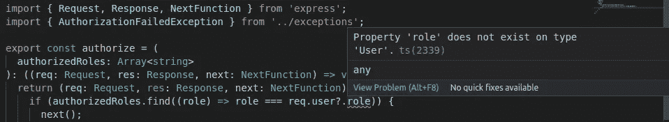

这是因为`Express.Request`中用户对象的类型是默认的`Express.User`类型。我们需要用我们的用户类型中的字段来改变默认类型`Express.User`。首先，在`types/express`文件夹中创建`index.d.ts`。请在`src`之外创建这个文件夹，这样就不会与代码库中使用的类型混淆。

然后更新`tsconfig.json`

现在，您将能够正确无误地从请求中获得用户的角色。

为授权失败创建一个异常类

用授权中间件更新`blog.route.ts`内的端点。

博客创建、更新和删除端点由授权中间件包装，这三个端点只对角色为`AUTHOR`的用户可用。

这里请确保在认证函数之后应用授权函数，因为认证函数是更新请求中的用户对象的中间件，而授权中间件需要更新的用户对象来获取用户角色。

然后更改现有的创建博客和更新博客端点。在现有的 API 中，我们在创建和更新博客时发送作者 id。但是现在我们可以从请求本身提取用户详细信息。

更新`blog.controller.ts`中的`createBlogHandler`，更新`blog.schema.ts`和`blog.type.ts`

让我们验证一下授权中间件。由于我们已经将用户的默认角色值定义为`READER`，所以现有用户只有阅读能力。尝试从现有用户令牌创建博客。

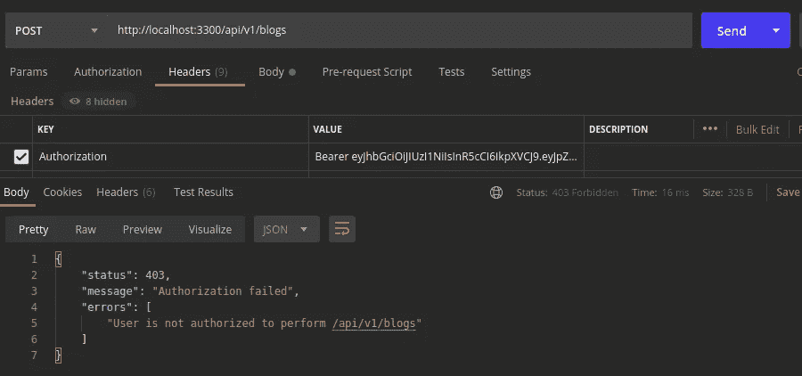

现在创建一个角色为`AUTHOR`的用户，并尝试从该用户创建一个博客

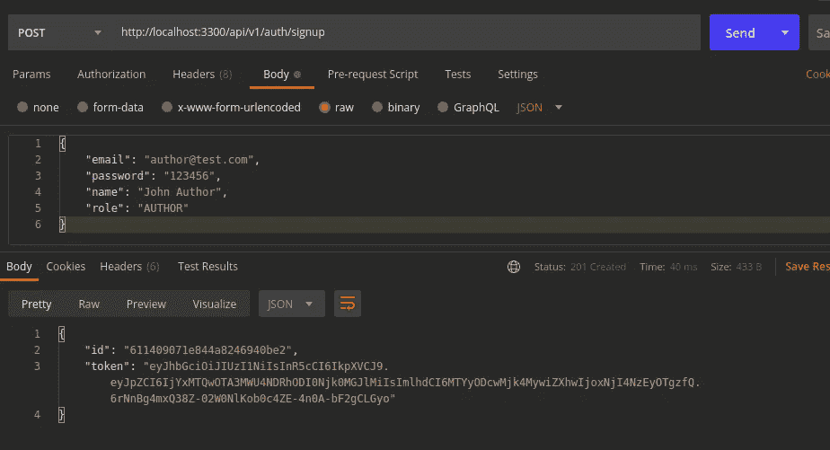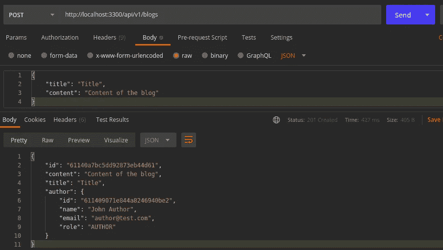

授权模块如我们预期的那样工作。但这是更高级别的授权，我们只检查用户的角色。但是，拥有`AUTHOR`角色的用户仍然可以删除或更新其他用户的博客。因此，我们需要确保用户只能更新或删除自己创建的博客。

更改`blog.service.ts`中的`updateBlog`和`deleteBlog`来验证请求用户的博客作者

现在尝试更新另一个用户的博客，你会得到一个错误响应

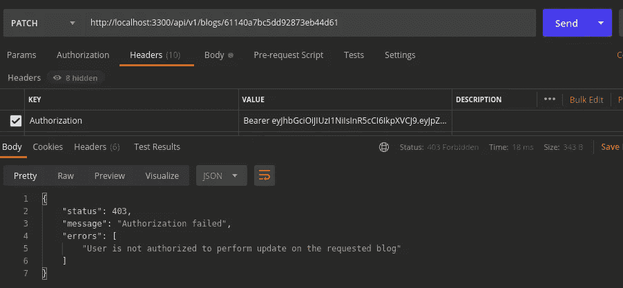

# 结论

在本系列教程中，我们使用`NodeJS`和`Express`为博客管理系统创建了一个简单的基本 REST API。系统使用`PassportJS`提供的 JSON web 令牌认证策略进行认证。并且根据用户角色对端点进行授权。我们使用`MongoDB`作为系统的数据库，并使用`Joi`验证 API 请求。我们还设法使用`morgan`和`winston`创建了一个可以覆盖大多数基本日志实例的日志记录器。希望这一系列教程能够帮助您理解 NodeJS 中 REST API 实现的基础知识。

你可以在 [GitHub](https://github.com/Dinindu-Nissanka/nodejs-typescript-rest-api/tree/build_rest_api_with_nodejs_part_3) 上找到本教程的完整源代码。