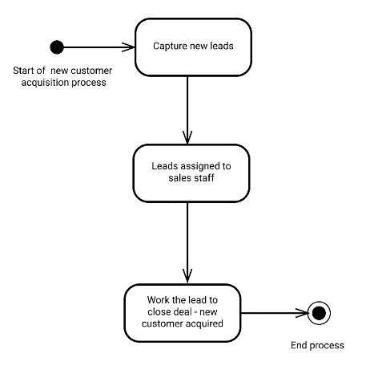
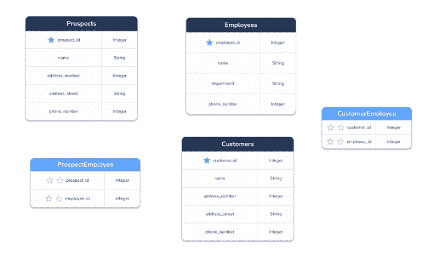
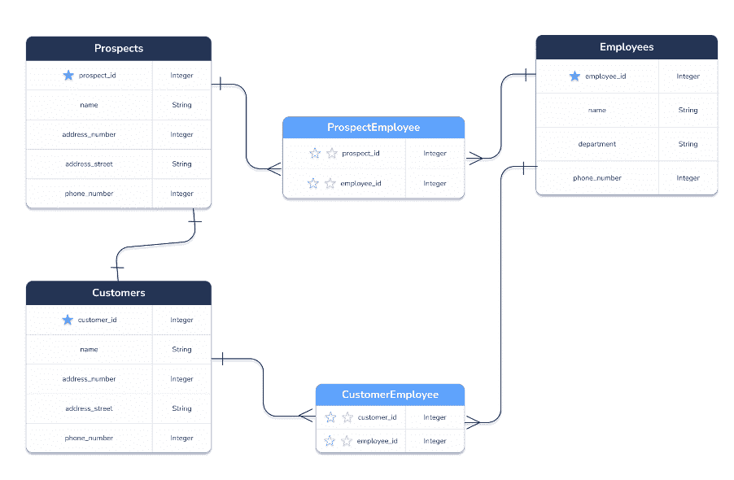

# 构建一个简单的 CRM 数据模型

> 原文：<https://medium.com/codex/build-a-simple-crm-data-model-cb1c61f5b43e?source=collection_archive---------6----------------------->

客户和企业之间的关系是每一个成功的商业模式不可或缺的一部分。可以说，没有忠诚的顾客；生意能成功也不会成功。因此，开发和部署客户关系管理(CRM)系统至关重要。为了实现这一目标，让我们深入到构建简单 CRM 数据模型的分步指南中，这是整个 CRM 应用程序开发过程中不可或缺的一部分。

**注:**客户关系管理系统很复杂。客户和企业之间的关系包含许多方面，包括了解客户、开发销售方案、获得客户和留住客户。因此，为了方便和简单起见，我们将从 CRM 数据模型中提炼出它的核心特性，作为开发 CRM 数据模型的指南。

## 什么是 CRM 数据模型？

总之，CRM 数据模型是对象及其关系的概念性形式化，用于描述如何管理客户和业务组织之间的关系。

## 1.什么是数据模型？

[Wikipedia.com](https://en.wikipedia.org/wiki/Data_model)将数据模型描述为一种“*抽象模型，它组织数据元素并标准化它们如何相互关联以及与现实世界实体的属性关联*换句话说，数据模型或实体关系(er)数据模型是数据库设计的一种图形化方法。

开发一个全面的 ER 数据模型是 CRM 软件开发生命周期的一个重要部分。简而言之，如果没有这个模型作为数据库设计的框架或基础，数据库就会有缺陷，导致应用程序或系统功能不全，不能满足利益相关者和最终用户的需求。

entrepreneur.com 的 Thomas Smale 报告的统计数据显示，75%的 IT 主管承认他们的内部软件开发项目失败了。因此，在开始 CRM 开发项目的软件开发部分之前，生成高质量、完整的数据模型是至关重要的。

## 2.什么是 CRM 系统？

如上所述，CRM 系统是一种软件应用程序，其设计、开发和部署的功能能够管理整个客户生命周期以及企业和客户之间的关系。

## 构建 CRM 数据库模型的分步指南

现在我们已经了解了什么是数据模型和 CRM 系统，让我们考虑一个创建简单 CRM 数据模型的逐步指南。

## 1.实体或对象

第一步是确定需要在数据模型中表示的实体或对象，比如客户管理、人员管理、销售线索管理和客户服务管理对象。

出于讨论的目的，让我们看一下 CRM 新客户获取工作流程图。

CRM 工作流程图

此图展示了对客户主实体、新的潜在客户或潜在客户实体和员工主实体的需求。

换句话说，新的销售线索或潜在客户对象存储销售人员捕获的新的销售线索列表。employee 对象记录了公司雇用的所有员工。分配给销售员工对象的销售线索将新的潜在客户与销售员工联系起来。并且客户主数据为获得的每个新客户记录新客户细节。

使用 [Arctype ER 图表模板](https://arctype.com/blog/erd-builder/)创建的图像。

## 2.创建实体关系(ER)模型

一旦实体被定义并添加到数据模型图中，下一步就是描述不同实体或对象之间的关系。这些关系通过添加指示每个实体之间关系的箭头来定义。

总之，两个实体之间可能存在四种关系或基数:多对一、一对一、多对多和一对多。

*   **一对一关系:**两个实体之间的一对一关系是每个实体只有一个实例与第二个实体的一个实例相关。例如，在上面突出显示的场景中，客户实体链接到潜在客户实体。一个潜在客户只能转化为一个客户。一个潜在客户不可能匹配多个客户。
*   **一对多关系:**一对多关系或基数描述了两个实体之间的关系，比如客户及其联系方式。因此，一个客户可以有许多不同的联系人类型，如邮政地址、实际办公地址、电子邮件、电话和移动电话。
*   **多对一关系:**多对一关系是一对多关系的逆关系。例如，许多客户可能把他们的办公室放在一个大的办公大楼里。实际上，许多客户会有相同的办公地址。
*   **多对多关系:**简单地说，多对多基数描述了两个实体之间的关系，每个实体的多个实例相互链接。例如，许多客户可以连接到同一个地址。许多地址与许多客户相关联。并且，如下所示，许多潜在客户或潜在客户与许多销售员工或代表相关。

**注意:**多对多关系必须建模为两个多对一关系，如下图所示。例如，潜在客户和员工之间的关系是多对多的关系。同样的规则也适用于客户-员工关系。

一个潜在客户与多个员工相关联，一个员工与多个潜在客户或销售线索相关联。因此，使用名为 ProspectEmployee 的对象(或表)将这种多对多关系描述为 Prospect 和 ProspectEmployee 以及 Employee 和 ProspectEmployee 两个一对多关系。

最后，潜在客户和客户之间是一对一的关系。

使用 [Arctype ER 图表模板](https://arctype.com/blog/erd-builder/)创建的图像。

## 其他考虑和最终想法

一旦 CRM 数据模型完成，下一步是将数据模型转换为 SQL 以创建 CRM 数据库，并从项目的软件开发部分开始开发一个简单的 CRM 系统。如果您需要一个实时数据库创建工具来编写数据定义语言(DDL)脚本，可以考虑使用 [Arctype SQL 编辑器](https://www.arctype.com)。它内置了到几个不同关系数据库的本地连接，包括 Postgres、SQLite、MySQL、BigQuery 和 Firebase。

虽然放弃数据建模过程看起来很诱人，但它构成了软件开发生命周期不可分割的一部分。如果没有完成详细的 CRM 数据库模型，就存在很大的失败风险。