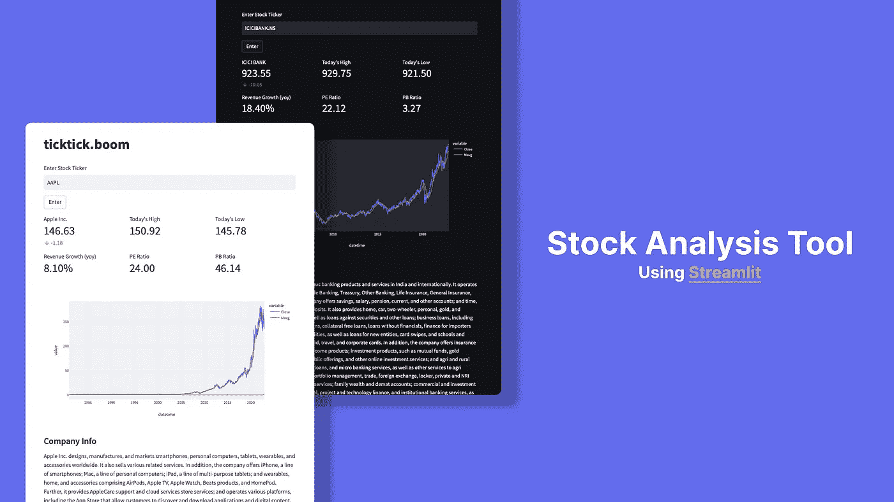
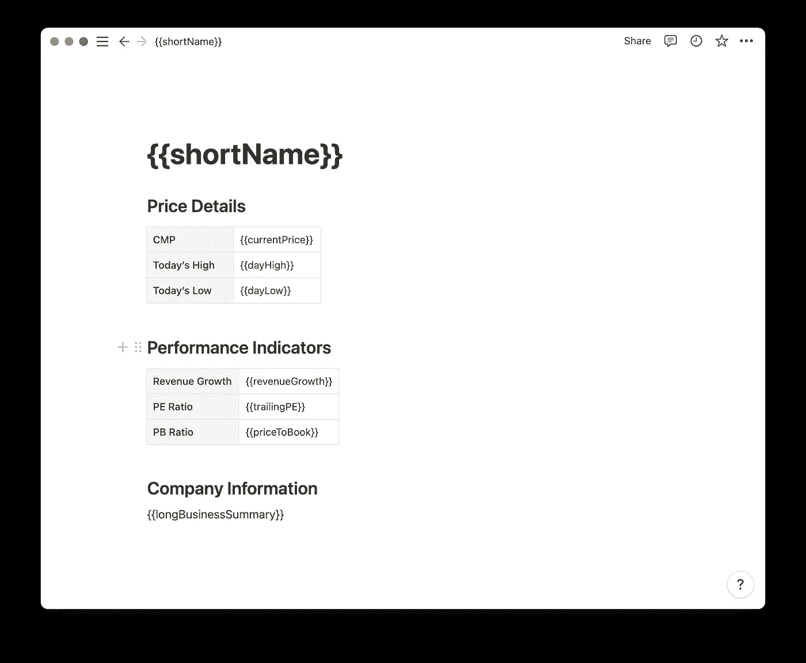
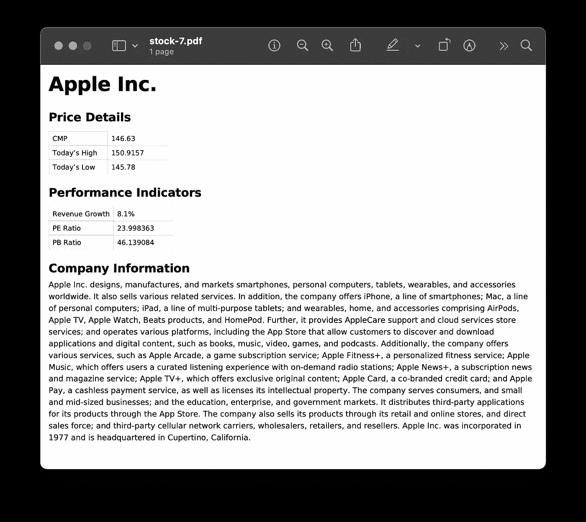
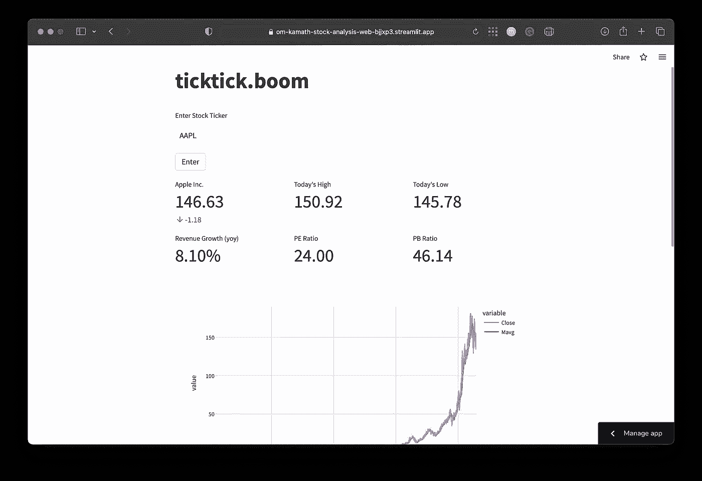

# 用不到 100 行代码构建一个股票分析工具。

> 原文：<https://medium.com/codex/build-a-stock-analysis-tool-in-under-100-lines-of-code-1f5dc6e1473a?source=collection_archive---------2----------------------->

## 使用 Streamlit——Python 的开源应用框架。



由于目前可用的 web 框架数不胜数，构建数据驱动的 web 应用程序一直令我望而生畏。因为 **Python** 因其简单而成为我大多数任务的首选编程语言，我决定用它来构建一个股票分析工具，以抑制我对网络开发的恐惧。

**Streamlit** 是 Python 中的一个开源应用框架，可以在几分钟内将数据脚本转化为可共享的 web 应用。这个框架允许您主要用 Python 构建 web 应用程序。如果你像我一样，不想在前端的设计和原型开发上花费时间，streamlit 是适合你的框架。

这个工具使用 **Yahoo Finance API** 来获取股票数据。这是我第一次用 **Streamlit** 做实验，我找不到任何有趣的免费 API。

# 该应用程序的功能

1.  使用股票代码搜索股票。
2.  显示库存详情和绩效指标。
3.  查看股票的历史表现(图表)。
4.  下载 PDF 格式的股票详情。

# 内容

1.  装置
2.  项目结构
3.  发展
4.  部署

## 装置

打开命令提示符或终端，键入`pip install streamlit`安装库。要测试是否成功安装了 streamlit，请键入命令`streamlit hello`。

## 项目结构

1.  web.py(主应用程序)
2.  requirements.txt
3.  package.txt
4.  template.html

*requirements.txt* 和 *package.txt* 是必需的，因为我们将免费在 **Streamlit Cloud** 上部署该应用。这是热爱 Streamlit 的又一个理由。

*将要求 template.html*将库存详情导出为 pdf 格式。

## 发展

**定义需求和包。**

*requirements.txt*

```
yfinance
streamlit
pandas
pdfkit
plotly
```

*packages . txt*(pdf kit 使用)

```
wkhtmltopdf
```

**导入库**

```
import yfinance as yf
import pandas as pd
import streamlit as st
import plotly.express as px
import pdfkit as pdf
from jinja2 import Environment, select_autoescape, FileSystemLoader
```

**设置页面标题和图标**

```
st.set_page_config(
   page_title="ticktick.boom",
   page_icon="💣",
)
```

**定义功能**

```
@st.experimental_memo
## FETCHING HISTORIC DATA
def historic_data(stock):
    ticker = yf.Ticker(stock)
    hist = ticker.history(period="max")
    return hist

@st.experimental_memo
## FETCHING COMPANY INFO
def price_info(stock):
    ticker = yf.Ticker(stock)
    return ticker.info
```

`@st.experiment_memo`是一个函数装饰器，用于**记忆**函数的执行。内存化数据以 pickled 形式存储，这意味着内存化函数的返回值必须是可拾取的。**pickle**是将 python 中的对象转换成简单的二进制表示的过程，可用于将该对象写入可存储的文本文件中。这种存储 Python 对象的方法也被称为**序列化**。内存化函数的调用者得到缓存数据的副本。这有助于改善应用程序的响应时间。

**添加输入栏和按钮**

```
## MAIN APP
st.title("ticktick.boom") # Title of app
c1 = st.container() # Main container
s = c1.text_input("Enter Stock Ticker", placeholder="Eg. AAPL") # Ticker Input
btn = c1.button("Enter") # Submit button
```

**插入指标**

```
# Creating 3 columns (Details)
col1, col2, col3 = c1.columns(3)

# Adding metric components to each column 
with col1:
    st.metric(
        label=info["shortName"],
        value="%.2f" % info["currentPrice"],
        delta="%.2f" % (info["currentPrice"] - info["previousClose"]),
    )
with col2:
    st.metric(label="Today's High", value="%.2f" % info["dayHigh"])
with col3:
    st.metric(label="Today's Low", value="%.2f" % info["dayLow"])

# Lower columns (Performance Indicators)
col6, col7, col8 = c1.columns(3)

# Adding metric components to each column 
with col6:
    st.metric(
        label="Revenue Growth (yoy)",
        value="%.2f" % (info["revenueGrowth"]*100)+"%"
    )
with col7:
    st.metric(label="PE Ratio", value="%.2f" % info["trailingPE"])
with col8:
    st.metric(label="PB Ratio", value="%.2f" % info["priceToBook"])
```

**显示图表和公司信息**

```
# Generating Chart
close_px = df["Close"]
mavg = close_px.rolling(window=100).mean() # Calculating Moving Average of Stock Close
df["Mavg"] = mavg
df["datetime"] = pd.to_datetime(df.index)

fig = px.line(df, x="datetime",y=["Close","Mavg"]) # Using Plotly Express to create line chart
c1.plotly_chart(fig,use_container_width=True)

# Adding Company Business Details
c1.markdown("### Company Info")
c1.write(info["longBusinessSummary"])
```

**创建 PDF 模板**

我使用**概念**创建了一个 PDF 模板。您可以将概念文档导出为 **HTML** 并将其添加到您的项目中。每个变量都应该用花括号括起来(例如{{variable}})。



概念模板

一旦您成功定制了 PDF 模板并将其导出，就该生成 PDF 了。

**生成 PDF**

```
## SETTING THE FILE PATH FOR PDF TEMPLATE
env = Environment(loader=FileSystemLoader("."), autoescape=select_autoescape())
template = env.get_template("template.html")

# Generating PDF using the template
html = template.render(
    shortName=info["shortName"],
    currentPrice=info["currentPrice"],
    dayHigh=info["dayHigh"],
    dayLow=info["dayLow"],
    revenueGrowth=info["revenueGrowth"]*100,
    trailingPE=info["trailingPE"],
    priceToBook=info["priceToBook"],
    longBusinessSummary=info["longBusinessSummary"],
)
pdf = pdf.from_string(html, False)
c1.download_button(label="Download",data=pdf,file_name="stock.pdf", mime="application/octet-stream")
```

使用`render()`函数，我们将股票详细信息作为参数传递，并自动执行 PDF 生成过程。



PDF 已生成

> 即使尝试了多种方法，我也无法将 Plotly 图表导出为 PDF。如果我将来能够做到这一点，我将对代码进行必要的更新，这将反映在我的 Github repo 中。Streamlit Cloud 在使用 Kaleido(将图表转换为图像所需的库)时遇到问题。

## 部署

1.  创建一个 [Streamlit 云](https://streamlit.io/cloud)账户。
2.  将您的项目部署到 GitHub 存储库中。
3.  从云仪表板中选择存储库。
4.  将您的应用部署到 [Streamlit Cloud](https://streamlit.io/cloud) 。



Streamlit 本身支持黑暗和光明模式以及更多的主题定制。

## 链接

1.  [GitHub](https://github.com/Om-Kamath/stock-analysis)
2.  [App](https://om-kamath-stock-analysis-web-bjjxp3.streamlit.app)
3.  [简化文档](https://docs.streamlit.io)

我希望这个简单的项目能让您对 Streamlit 框架有一个大致的了解，并了解它有多强大。它可能不是最好的 web 开发框架，但对于创建可以轻松共享、管理和部署的数据驱动的应用程序和仪表板来说，它是一个非常好的框架。

如果你喜欢我的博客，你可以请我喝杯咖啡。

> ***感谢阅读。***