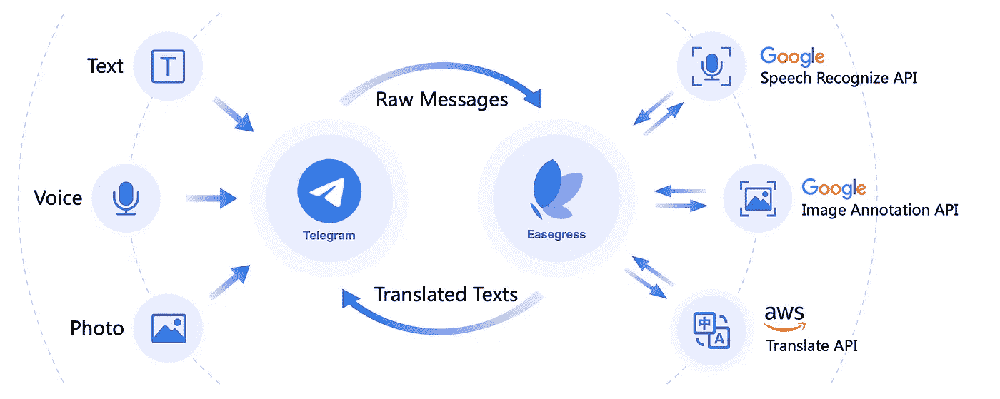
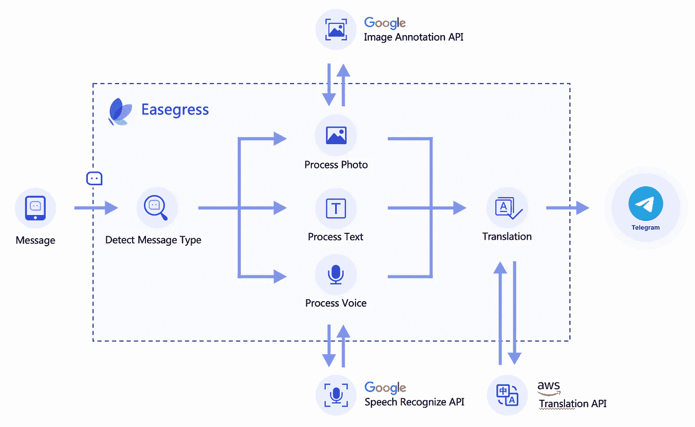
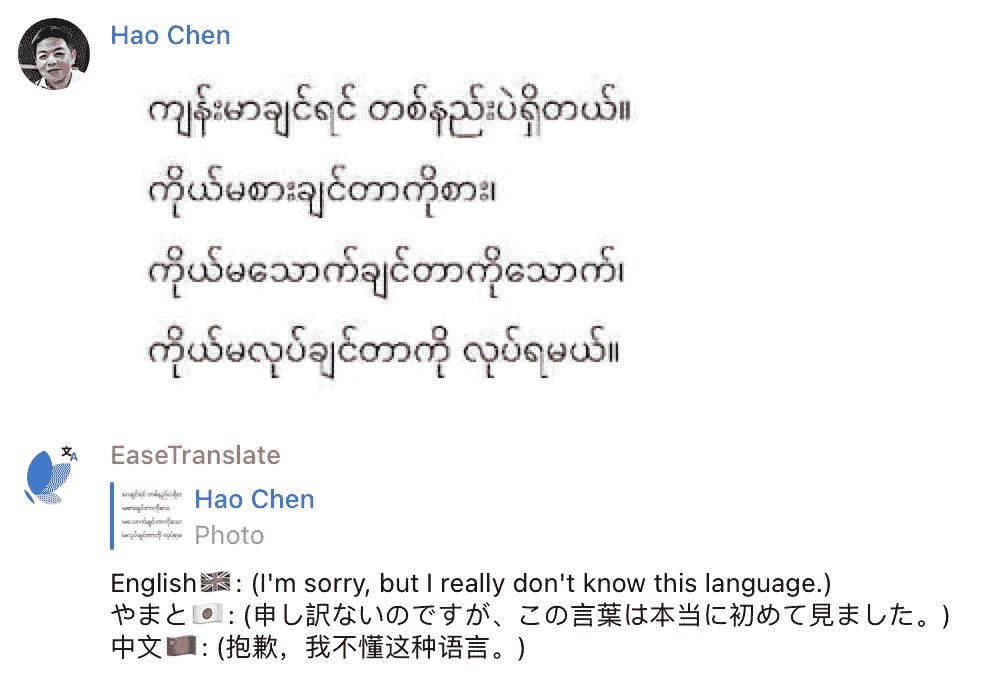

# 用 Easegress 构建一个电报翻译机器人

> 原文：<https://medium.com/codex/build-a-telegram-translation-bot-with-easegress-194bc48cbd6e?source=collection_archive---------14----------------------->

**Easegress 是 [MegaEase](https://megaease.com) 开发的下一代开源(** [**Github**](https://github.com/megaease/easegress) **)基于流量的网关** **产品**。它完全基于云原生技术构建，避免了传统反向代理在高可用性、流量协调、监控、服务发现等方面的缺点。

最近，我们发布了 Easegress v2.0，对流量编排进行了另一次重大增强，允许用户通过编排多个 API 来实现一个超级 API，而无需编写任何代码。本文将通过构建一个电报翻译机器人来演示这一特性。这个机器人可以自动将收到的信息翻译成中文、日文和英文，除了文本信息，它还支持翻译语音和照片信息。

我们有一个 3 分钟的演示和介绍视频。

**如果想试试，可以在电报组中添加** `**@EaseTranslate**` **bot，授予其管理员权限。**

# 1.先决条件

由于 bot 需要接收电报消息通知和调用第三方 API，我们必须提前准备以下内容:

*   根据本文档安装最新版本的 Easegress，并确保外部应用程序可以访问至少一个端口 80、88、443 或 8443 上的 Easegress 实例。
*   按照[这个文档](https://core.telegram.org/bots#3-how-do-i-create-a-bot)创建一个电报机器人，设置它的名字(本文使用的是 EaseTranslateBot)，记下它的令牌，[设置一个 Webhook](https://core.telegram.org/bots/api#setwebhook) 指向上一步安装的 Easegress 实例。我们的机器人将通过这个 Webhook 接收新消息的通知。
*   AWS 访问密钥 ID 和访问密钥 Secret，并确保您可以使用这个访问密钥来使用 AWS 转换 API。
*   Google Cloud 的令牌，并确保您可以使用 Google Cloud 的语音识别 API 和 OCR(图像注释)API 来使用这个令牌。

您可以使用其他供应商的翻译、语音识别或 OCR APIs，但是这需要您相应地修改后面部分中的示例。

# 2.它是如何工作的

下图显示了这个机器人的工作流程。

当通过 webhook 从电报服务器收到新消息的通知时，机器人首先检查消息类型，并相应地执行以下操作:

*   **短信:**直接提取短信文本；
*   **语音消息:**在这种情况下，消息体只包含语音文件的 ID，所以我们需要调用 Telegram 的 API 将 ID 转换成文件地址，然后下载文件并将其内容发送到 Google 的语音识别服务，将其转换成文本；
*   **图片消息:**基本上，这种情况与语音消息相同，但是文件内容被发送到 Google 的图像注释服务。

经过上述处理后，所有三种类型的消息都被转换成文本，然后可以调用 AWS 翻译服务将它们翻译成目标语言，本例中使用的目标语言是中文、日文和英文。

# 3.管道

首先，让我们检查一下 Pipeline 编排的整体流程:

正如我们已经解释了机器人背后的基本思想，从上面的流程可以很容易地看到整个过程。但是，因为最终的响应需要组合多个 API 的执行结果，所以我们需要使用多个名称空间来存储这些 API 的参数和执行结果，即发送的请求和返回的响应。

并且，为了达到更好的效果，我们还在管道上定义了一些数据:

其中 **zh** 、 **ja** 和 **en** 为中文、日文和英文的语言代码， **text** 为语言名称和对应的标志， **fallback** 为翻译失败时的替换文本，如下图所示:

# 4.过滤器

在 Easegress 中，过滤器是处理流量的组件，具体来说，在本例中，管道负责编排流量，而检测消息类型和调用第三方 API 则由过滤器完成。

# 4.1 后端代理

所有的外部 API 请求都是通过代理过滤器发送的，这个例子使用了四个外部服务，所以有四个代理过滤器，由于它们的配置非常简单，我就不多做介绍了。

# 4.2 检测消息类型

这是通过 ResultBuilder 筛选器完成的，配置如下:

它的模板字段是按照 [Go text/template package](https://pkg.go.dev/text/template) 的要求编写的模板，运行时生成一个字符串，ResultBuilder 返回给 Pipeline 作为它的执行结果，Pipeline 可以基于这个执行结果进行跳转。换句话说，ResultBuilder 和 Pipeline 一起工作来实现类似于编程语言的开关情况功能。

Telegram 中的一条消息可能来自一个用户组，也可能来自一个通道，表示消息体的字段不同，所以模板先确定这一点，但两种情况下，消息体的格式都是一样的。

`**DEFAULT**`是请求所属的名称空间，其中`**.requests.DEFAULT**`是 Telegram 通过 webhook 随消息发送的 HTTP 请求。通过检查消息正文中文本、语音和照片字段的有效性，我们可以知道消息的类型。

目前 ResultBuilder 的结果只能是`**result0**` — `**result9**`，所以我们对短信使用`**result0**`，对语音消息使用`**result1**`，对图片消息使用`**result2**`。稍后我们将增强这个过滤器，使结果更具可读性。

# 4.3 读取文件内容

语音和照片消息都需要首先将消息中的文件 ID 转换为文件路径，然后读取文件以获取其内容，这是使用以下过滤器完成的:

请注意，将文件 ID 转换为路径的步骤对于照片来说比对于语音来说要复杂一些。这是因为，对于同一张原始照片，Telegram 可能会生成多个大小不同的缩略图，并将所有缩略图与原始照片一起发送，而最后一张才是原始照片。

# 4.4 语音识别和 OCR

这两个过滤器有点复杂，但是它们都只是根据第三方服务的请求创建相应的 HTTP 请求。

# 4.5 文本提取

对于三种不同的消息类型，我们都使用过滤器来提取文本。

您可能已经注意到，我们在文本消息中使用了一个 **exclude** 字段，这是为了在翻译结果中排除原文，而对于语音或照片消息，识别的文本内容可能会不准确，因此要保留识别的文本供用户参考。

# 4.6 翻译

由于 AWS 要求对所有请求进行签名，因此在通过 RequestBuilder 创建请求之后，使用 RequestAdaptor 来完成签名。

# 4.7 将翻译结果构建到回复消息中

这是本文中最复杂的过滤器，但一般来说，它只是按照 Telegram 的要求，组织我们之前获得的信息。特别是，`**$.data.PIPELINE**`引用了我们在管道上定义的数据。

# 4.8 回应

Telegram 要求我们对每个请求返回一个响应。因为我们不需要通过这个响应来回复消息，所以我们可以简单地将状态代码设置为 200。

# 5.部署

一旦我们准备好了配置文件(可以在这里下载[，我们就可以通过下面的命令将这个管道部署到 Easegress(假设文件名是`translate-pipeline.yaml`)。](https://github.com/megaease/easegress/tree/main/example/translation-bot)

**$ egctl 对象 create-f translate-pipeline . YAML**

但是我们还需要创建一个 HTTPServer，并让它将通过 webhook 发送的 telegram 的消息通知转发到上面的管道，注意，这个管道的外部访问地址必须是我们前面创建的 Telegram webhook 的地址。

仅此而已。只有 yaml 文件，没有编码工作。