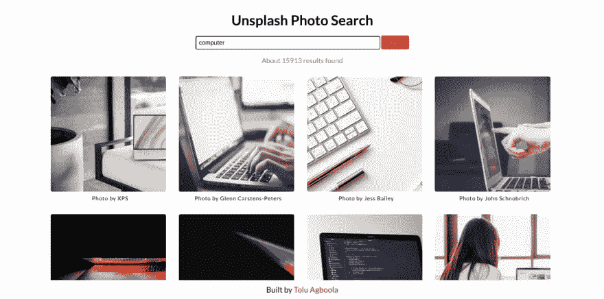
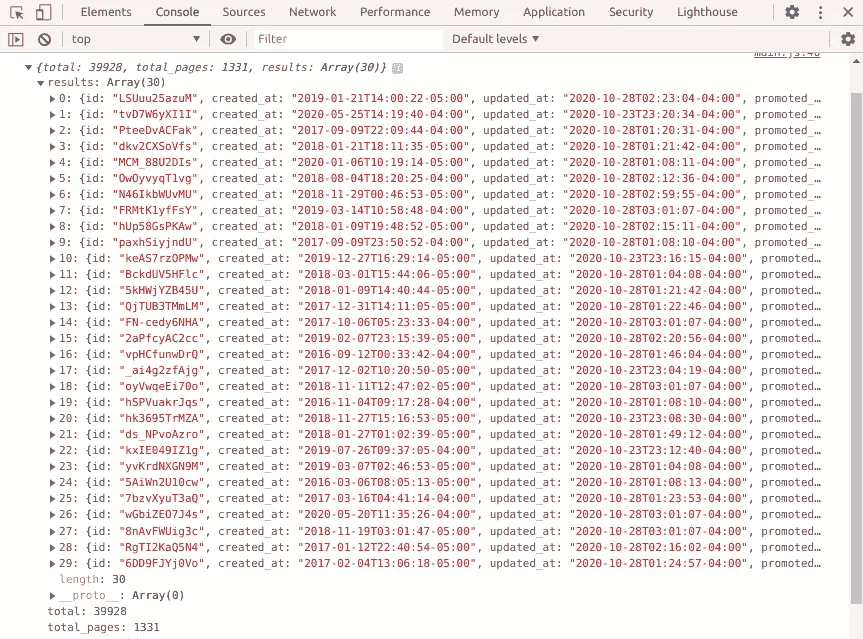
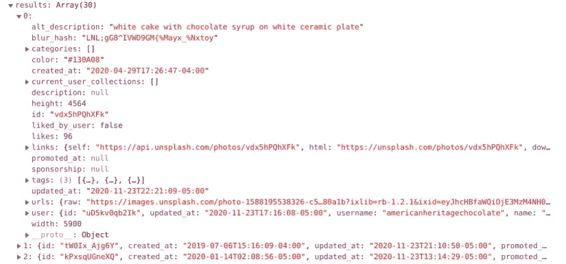

# 使用普通的 JavaScript 构建一个 Unsplash 照片搜索应用程序

> 原文：<https://medium.com/codex/build-an-unsplash-photo-search-app-using-vanilla-javascript-11554126a2e?source=collection_archive---------26----------------------->

在本文中，我将解释我是如何使用 JavaScript 构建一个图片搜索应用程序的。它根据用户的搜索查询从 [Unsplash](https://unsplash.com/) 获取并显示图像。这是我建立的几个个人项目之一，使我能够在我所学的基础上获得一些实践。



# 设置标记和样式

我考虑了一下我想要的页面外观，决定选择一个简单的白色页面(如上所示),顶部有输入和提交按钮，结果是一个网格结构。

# 解决 JavaScript 问题

我首先全局存储了对表单和其他一些我将要使用的 HTML 元素的引用。稍后我仍然会在函数中选择其他函数。我还在表单中添加了一个`submit`事件监听器。

```
const form = document.querySelector('.js-form');
form.addEventListener('submit', handleSubmit);
const nextBtn = document.querySelector('.js-next');
const prevBtn = document.querySelector('.js-prev');
let resultStats = document.querySelector('.js-result-stats');
let searchQuery;
```

然后我在事件监听器中定义了回调函数`handleSubmit`,如下所示:

```
function handleSubmit(event) {
    event.preventDefault();
    const inputValue = document.querySelector('.js-search-input').value;
    searchQuery = inputValue.trim();
    console.log(searchQuery);
    fetchResults(searchQuery);
}
```

这个函数将一个事件作为它的参数，首先使用`preventDefault()`方法阻止页面重新加载。然后，它将搜索输入的值存储在`inputValue`中，并用`trim()`方法删除任何空白。它将调整后的输入值存储在`searchQuery`中，并将其作为参数传递给正在调用的`fetchResults`函数。我将`searchQuery`的值记录到控制台，以确保传递了正确的值。

# 从 Unsplash 获取结果

```
async function searchUnsplash(searchQuery) {
    const endpoint = `https://api.unsplash.com/search/photos?query=${searchQuery}&client_id=YOUR_ACCESS_KEY`;
    const response = await fetch(endpoint);
    if (!response.ok) {
        throw Error(response.statusText);
    }
    const json = await response.json();
    return json;
}

async function fetchResults(searchQuery) {
    try {
        const results = await searchUnsplash(searchQuery);
        console.log(results);
        displayResults(results);
    } catch(err) {
        console.log(err);
        alert('Failed to search Unsplash');
    }
}
```

要想使用 Unsplash 的 API，你必须创建一个开发者账户。只有在那之后，你才能得到你唯一的 API 密匙，用它你可以访问网站上的照片。使用包含端点和相关查询参数的 URL 向 Unsplash 发出 AJAX 请求。他们网站上的[文档](https://unsplash.com/documentation)页面提供了更多相关信息。

函数`searchUnsplash`接受一个参数(`searchQuery`)，该参数作为`query`查询参数的值插入到端点中。现在，URL 存储在变量`endpoint`中，该变量作为参数传递给`fetch`。`fetch()`方法接受一个参数，即您想要获取的资源的路径，在本例中存储在`endpoint`中。它总是返回一个[承诺](https://developer.mozilla.org/en-US/docs/Web/JavaScript/Reference/Global_Objects/Promise)。现在，如果响应是 200 OK，它被解析为 JSON，存储在`json`变量中。结果被记录到控制台，以便查看 JSON 数据的内容。

上面的两个函数都是异步的，这意味着`await`关键字可以用来暂停函数的执行，直到一个承诺被解决。这是通过在声明函数之前放置`async`关键字来实现的。我在`fetchResults`函数中使用了一个`try...catch`块。`try`块“尝试”执行其中的代码，如果出现异常或错误，`catch`块会保存当天的结果，并以其中写入的任何代码做出适当的响应。这是一种控制流机制，如果在获取结果时发生错误，它可以防止代码崩溃。

# 在页面上显示结果

接下来的事情是在页面上显示结果。如果您检查加载到控制台的 JSON 数据，您会发现它包含几个内容不同的属性。



从 Unsplash 获取的 JSON 数据

`results`属性是一个包含搜索结果的数组。每个搜索结果都是一个对象，可以使用点或括号符号来访问。

```
function displayResults(json) {
    const searchResults = document.querySelector('.js-search-results');
    searchResults.textContent = '';
    json.results.forEach(result => {
        const url = result.urls.small;
        const unsplashLink = result.links.html;
        const photographer = result.user.name;
        const photographerPage = result.user.links.html;
        searchResults.insertAdjacentHTML(
            'beforeend',
            `<div>
                <a href="${unsplashLink}" target="_blank">
                    <div class="result-item" style="background-image: url(${url});"></div>
                </a>
                <p class="photographer-name">
                    <a href="${photographerPage}" target="_blank" style="color: black; text-decoration: none;">Photo by ${photographer}</a>
                </p>
            </div>`
        );  
    });
    totalResults = json.total;
    resultStats.textContent = `About ${totalResults} results found`;
};
```

在 HTML 文件中已经创建了一个空的类别为`search-results`的`div`。然后在 JS 文件中的一个名为`displayResults`的新函数中选择它，该函数将一个 JSON 对象作为参数。`textContent`也被设置为空字符串，以清除所有先前的结果。



其中一个提取结果的分解

现在，使用`forEach`方法迭代`results`数组。在回调函数中，嵌套的对象可以通过`result`参数来访问。如果你仔细研究上图，你会发现数组中的每个对象都包含了几个键，比如`links`、`user`、`urls`。这些可用于访问所讨论对象的不同类别的信息。

回调函数中的第一行是变量，其中存储了所需的不同值。它们都是使用点符号访问的，包括:

*   图像 url
*   Unsplash 上图像的链接
*   摄影师的名字
*   链接到摄影师的 Unsplash 个人资料

然后，使用`[insertAdjacentHTML](https://developer.mozilla.org/en/docs/Web/API/Element/insertAdjacentHTML)`方法将每个结果插入到`searchResults`元素中。这个方法有两个参数:元素的位置和要解析为 HTML 的文本。第二个参数中使用了模板文字，因为代码的某些部分会不断变化。这些由代码中的占位符表示。然后在`fetchResults`中调用函数`displayResults`。

每个图像都被设置为其容器的背景，也是指向其 Unsplash 页面的链接。摄影师的名字，链接到他/她的 Unsplash 配置文件，被放置在图像的正下方，结果显示使用 CSS 网格进行了样式化。

# 显示负载指示器

这是在执行搜索查询时显示的内容，让用户知道操作仍在进行中。我从[这个网站](https://tobiasahlin.com/spinkit/)选择了一个微调器，并将 HTML 和 CSS 粘贴到我的代码中。对微调器的引用被全局存储在变量`spinner`中，然后`fectchResults`函数被更新如下:

```
const spinner = document.querySelector('.js-spinner');async function fetchResults(searchQuery) {
    spinner.classList.remove('hidden');
    try {
        const results = await searchUnsplash(searchQuery);
        pagination(results.total_pages);
        console.log(results);
        displayResults(results);
    } catch(err) {
        console.log(err);
        alert('Failed to search Unsplash');
    }
    spinner.classList.add('hidden');
}
```

# 结论

在本教程中，我们看到了如何使用 JavaScript 构建交互式应用程序。我希望你从中学到了很多。

我目前对工作机会持开放态度。任何关于职位空缺的信息都将不胜感激。

感谢阅读！