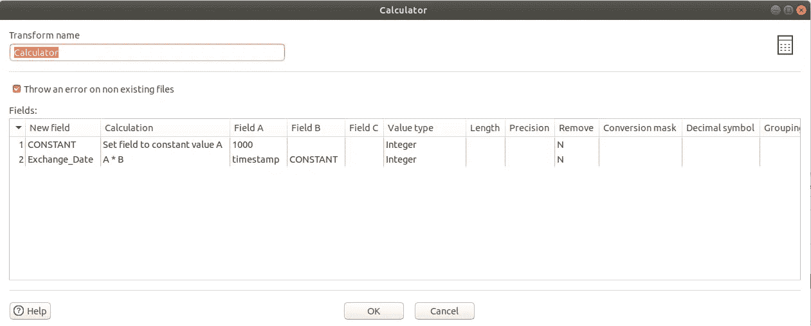

# 使用 Apache Hop 构建数据管道

> 原文：<https://medium.com/codex/build-data-pipeline-with-apache-hop-62417ecee303?source=collection_archive---------0----------------------->

## [法典](http://medium.com/codex)

Apache Airflow 已经成为事实上的数据工程工具，但是不要忽视其他可以提高生产力的工具。[Hop](https://hop.apache.org/)(**H**op**O**r estation**P**platform)项目是 Apache 正在酝酿的一个不太为人所知但功能强大的工具。在本文中，我将简要解释什么是 Apache Hop，并将演示如何不用 Hop 编写任何代码就创建一个简单的管道。


官方 Apache Hop 项目徽标

## 什么是 Apache Hop？

Hop 是一个开源数据集成工具，它是 Pentaho 数据集成(PDI)或 Kettle 的一个分支。它提供了一个可视化的开发工具，可以让开发人员更有效率，对于那些喜欢不用编写任何代码来构建管道的人来说，也不那么令人畏惧。Hop 工作流和管道可以在各种引擎上运行，包括其自己的原生 Hop 引擎、Spark、Flink、Google Dataflow 或 AWS EMR through Beam。Hop 是构建 Apache Beam 管道的第一批基于 GUI 的设计者之一。

## 啤酒花成分

Hop 由以下三个主要组件组成:

*   **跳 GUI。**它是一个图形界面编辑器，用于构建管道(转换)和工作流(作业)。它允许您在不编写任何代码的情况下构建复杂的 ETL(提取转换和加载)作业。它提供了一个拖放界面，允许您创作、编辑、运行或调试管道或工作流。
*   **单脚跳跑。这是一个独立的 CLI 实用程序，可用于执行管道和工作流。**
*   **跳服务器。**这是一个轻量级的 Web 容器，允许您在远程服务器上执行管道和工作流。这可以部署在多台服务器上。它还提供了一个 REST API 来远程调用您的工作流和管道。

## 开始使用 Hop

首先，您可以从官方的 [Apache Hop](https://hop.apache.org/download/) 项目下载一个最近的构建版本。下载文件后，您需要将其解压缩，并使用以下命令启动 Hop GUI:

在 Linux 上:

```
./hop-gui.sh
```

在 Windows 上:

```
hop-gui.bat
```

启动 Hop GUI 后，您将看到以下窗口。


Hop GUI 编辑器

这个编辑器允许您只通过一个拖放界面构建一个复杂的数据管道。为了让您更好地理解 Hop 的工作原理，让我来看一个真实的例子。

## Hop 的真实示例

我将展示一个真实的例子，说明如何使用 API 获取货币兑换数据，并将它们存储在 MySQL 数据库表中。在这个演示中，我将使用[开放汇率](https://openexchangerates.org/) API，它提供一个以美元为基础货币的免费计划。在我们开始使用 Hop 构建管道之前，让我们首先了解我们将如何构建这个管道。

首先，我们将向 Open Exchange Rates 端点发送一个 API 请求，以检索最新的货币兑换数据。请求成功后，端点将发回一个类似下面的 JSON 对象。

```
{
  "disclaimer": "Usage subject to terms: https://openexchangerates.org/terms",
  "license": "https://openexchangerates.org/license",
  "timestamp": 1611871200,
  "base": "USD",
  "rates": {
    "AED": 3.672995,
    "AFN": 77.503946,
    "ALL": 102.210542,
    "AMD": 519.485125,
    "ANG": 1.794941,
    "AOA": 655.668,
    "ARS": 87.146455,
    "AUD": 1.302647,
     /* .... */
  }
} 
```

我们将解析(无需编写任何代码)这个 JSON 对象，它包含一个 UNIX 时间戳(UTC 秒)、一个基础货币(3 个字母的 ISO 代码)和一个 rates 对象(带有“symbol: value”对，相对于 USD 货币)。随后，我们将在将数据插入 MySQL 数据库之前清理掉不必要的数据。最终结果应该适合包含三列的 MySQL 数据库表——Exchange _ Date、Exchange_Currency 和 Exchange_Rate。

让我们通过单击左上角的“new”图标来创建一个新的管道。


一旦你创建了一个新的管道，我们就可以点击编辑器上的任何地方开始构建了。单击编辑器后，您将看到如下所示的对话框。


此对话框显示允许您构建管道的转换列表。看起来 Hop 团队还没有正式发布他们的文档，但是我希望他们能尽快发布。同时，你可以在这里访问它们[。](https://hop.apache.org/manual/latest/plugins/transforms/)

让我们将下面的转换添加到我们的管道中，方法是使用搜索框搜索它们，然后单击它们。

*   生成行
*   JSON 输入
*   计算器
*   选择值
*   行规格化器
*   插入/更新

将它们全部添加到管道后，您可以按如下所示对它们进行排列:


构建我们的管道只需要这六个转换。让我们一次配置一个，并通过在它们之间创建一个跃点来连接这些转换。

*   **生成行:**它生成指定数量的行作为输出。在我们的例子中，我们将使用这个转换来传递开放汇率的 API 端点，如下所示。这一步的输出将成为下一个转换的输入(JSON 输入)。


*   **JSON 输入:**这个转换使用 JSONPath 表达式从 JSON 对象、文件或传入字段中读取数据，以提取数据并输出行。我们将使用这个转换从“生成行”转换中定义的 URL 中提取数据。


为了简化演示，我们将只提取选定的货币，如下所示。我们提供 JSONPath 表达式来从 JSON 响应中提取数据，并提供与每个表达式相关联的字段的名称。此外，我们还需要为每个字段定义数据类型。


*   **Calculator:** 我们使用这个转换将 UNIX 时间戳乘以 1000，从秒转换成毫秒。最后，我们将在下一个转换(选择值)中使用它，将其转换为人类可读的日期。



*   **选择值:**这个转换帮助我们选择、删除、重命名、更改数据类型以及配置流中字段的长度和精度。我们使用这个转换来删除我们在前面的转换中创建的不必要的字段(URL、时间戳和常量)。


现在，让我们使用同样的转换将 UNIX 时间戳从毫秒转换为普通日期。


现在，让我们预览一下我们的管道，看看我们的输出会是什么样子。


为了将它们存储在 MySQL 数据库中，让我们将流规范化，这样我们可以将它们存储在如下所示的三列中。

```
Exchange_Date | Exchange_Currency | Exchange_Rate |
--------------|-------------------|---------------|
 2021-01-28   |        CAD        |     1.283072  |
 2021-01-28   |        AUD        |     1.303642  |
 2021-01-28   |        GBP        |     0.728617  |
 2021-01-28   |        EUR        |     0.825002  |
 2021-01-28   |        INR        |     72.93905  |
 2021-01-28   |        SGD        |      1.32905  |
 2021-01-28   |        NZD        |      1.39401  |
```

*   **行规范化器:**我们使用这个转换将列转换为行，这样我们就可以将它们存储在一个表中。


*   **插入/更新:**

现在让我们使用这个转换来创建一个新的数据库连接。


单击数据库图标打开一个窗口，并填写如下信息:


填写完信息后，您可以在点击“确定”按钮之前点击“测试”按钮以确保连接正常。

现在我们需要定义表和模式信息，以及键和更新字段，如下所示。这允许我们每天多次运行管道，而不会在表中创建重复的记录。


现在可以通过单击“SQL”按钮在数据库中创建一个表了，这将打开一个包含 SQL 语句的新窗口。在单击执行按钮之前，您可以随意修改脚本。


一旦它成功创建了一个表，您就可以通过关闭所有弹出的转换窗口返回到主编辑器窗口。

最后，您已经准备好在 Apache Hop 中运行您的第一个管道。让我们单击左上角的 play 按钮，您将会看到如下所示的运行选项窗口。


单击 Launch 按钮，您的管道将开始在您的本地机器上执行。一旦您的管道成功运行，您将在每个转换的顶部看到一个绿色的复选标记。底部的“执行结果”面板显示指标和日志信息。


让我们在 MySQL 数据库表中验证结果。

```
mysql> SELECT * FROM TEST.currency_exchange;
+---------------+-------------------+---------------+
| Exchange_Date | Exchange_Currency | Exchange_Rate |
+---------------+-------------------+---------------+
| 2021-01-28    | CAD               |      1.283072 |
| 2021-01-28    | AUD               |      1.303642 |
| 2021-01-28    | GBP               |      0.728617 |
| 2021-01-28    | EUR               |      0.825002 |
| 2021-01-28    | INR               |      72.93905 |
| 2021-01-28    | SGD               |       1.32905 |
| 2021-01-28    | NZD               |       1.39401 |
+---------------+-------------------+---------------+
7 rows in set (0.00 sec)
```

## **何去何从？**

现在您有了一个工作管道，您可以创建其他管道，并通过创建工作流来编排它们。您可能还希望在无头计算机上使用 Hop Server 运行工作流或管道。最后，您还可以将它部署在 AWS EC2 实例上。这些你都可以做；但是，请记住，Apache Hop 项目仍然处于酝酿阶段，所以在生产环境中部署任何管道之前都要小心。

## 结论

Apache Hop 是一个新的开源数据集成平台，仍处于培育阶段。我觉得这个项目很有潜力，尤其是它允许你在不同的引擎上运行你的管道——比如 Spark，Flink，Google Dataflow，或者 AWS EMR through Beam。我相信这个平台将会改变数据管道开发的游戏规则，因为它允许你在很多平台上进行可视化开发，比如 Spark、Flink 和 Google Dataflow。我对 Apache Hop 的未来感到兴奋。

[***2021 年 2 月 10 日更新*** :官方文档现已在 https://hop.apache.org/manual/latest/index.html发布