# 如何基于 DolphinScheduler 和拥抱脸变形金刚构建一个可重用的高效文本分类工作流？

> 原文：<https://medium.com/codex/build-hugging-face-quickly-by-apache-dolphinscheduler-4f4381543adc?source=collection_archive---------5----------------------->


# 摘要

拥抱面部变形金刚是一个开源项目，用于构建、训练和部署最先进的 NLP 模型。

本文描述了如何基于 DolphinScheduler 和 Hugging Face transformers 构建一个可重用的高效文本分类工作流，并使用 MLflow 管理实验和模型。

最终产品:您可以一键指定工作流操作参数来训练和管理模型，将模型部署与 MLflow 相关联，选择模型的名称和版本，并连接到部署工作流。

# 装置

## Java8 环境

```
sudo apt-get update
sudo apt-get install openjdk-8-jdk
java -version
```

配置 Java 环境变量，`~/.bashrc`或`~/.zshrc`

```
# Make sure your jdk catalog，and Configure Java environment varibles
export JAVA_HOME=/usr/lib/jvm/java-1.8.0-openjdk-amd64
export PATH=$PATH:$JAVA_HOME/bin
```

## 阿帕奇海豚调度程序 3.1.1

详细安装可登陆官网:[https://dolphin scheduler . Apache . org/en-us/docs/latest/user _ doc/guide/installation/standalone . html](https://dolphinscheduler.apache.org/en-us/docs/latest/user_doc/guide/installation/standalone.html)下载 DolphinScheduler 3.1.1

```
# Enter the catalog of DolphinScheduler needs installation
mkdir dolphinscheduler && cd "$_"
## install DolphinScheduler
wget https://mirrors.tuna.tsinghua.edu.cn/apache/dolphinscheduler/3.1.1/apache-dolphinscheduler-3.1.1-bin.tar.gz
tar -zxvf apache-dolphinscheduler-3.1.1-bin.tar.gz
rm apache-dolphinscheduler-3.1.1-bin.tar.gz
```

启动海豚调度程序

```
## start DolphinScheduler
cd apache-dolphinscheduler-3.1.1-bin
bash bin/dolphinscheduler-daemon.sh start standalone-server
```

```
## You can view the log with the following command
# tail -500f standalone-server/logs/dolphinscheduler-standalone.log
```

启动后，等待一段时间，让服务开始进入 DolphinScheduler 页面

打开[http://localhost:12345/dolphinscheduler/ui，](http://localhost:12345/dolphinscheduler/ui,)可以看到 dolphin scheduler 页面页面账号:`admin`，密码:`dolphinscheduler123`

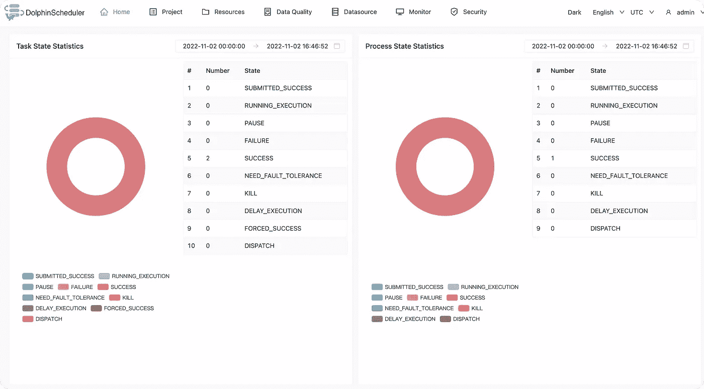

## MLflow

启动 MLflow 跟踪服务器相对简单，只需通过命令 d `ocker run --name mlflow -p 5000:5000 -d jalonzjg/mlflow:latest just start`即可

打开 [http://localhost:5000，](http://localhost:5000,)可以看到 MLflow 模型和实验管理页面

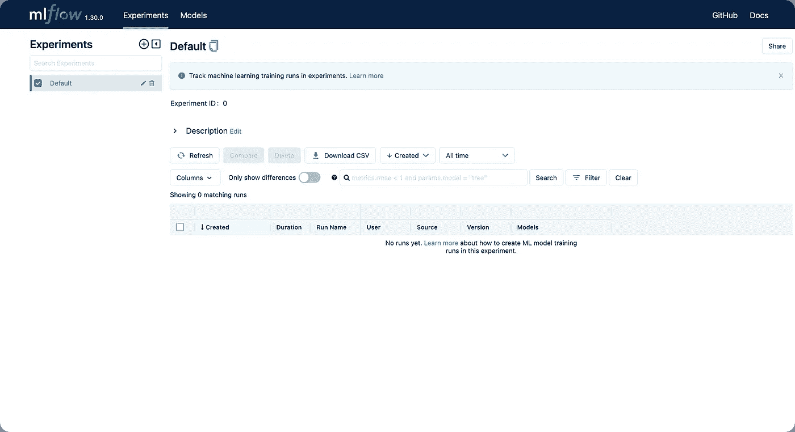

# 工作流构建

## 环境准备

拉代码

```
git clone https://github.com/jieguangzhou/Dolphinscheduler-NLP-Workflow.git 
cd Dolphinscheduler-NLP-Workflow
```

创建环境`transformers-textclassification`，安装运行工作流的依赖项

```
conda create -n transformers-textclassification python==3.8 -y 
conda activate transformers-textclassification
pip install -r requirements.txt
```

配置 ds 任务执行环境，如下图所示，让 python 组件的执行环境为 transformers- `textclassification` Conda 环境。


```
# Please modify the conda path according to the actual situation of the server
export PATH="~/anaconda3/bin:$PATH"
source activate transformers-textclassification 
PYTHON_HOME=$(which python)
```

## 提交工作流

运行以下命令提交工作流

```
# Configure the connection letter of python gateway
bash init_pyds.sh
# Submit workflow
python pyds.py
```

## 工作流定义

有两个工作流，**培训模型工作流**和**部署模型工作流**。本文将重点讨论如何建立可重复的模型训练工作流程。

**培训模型工作流程**

模型训练的工作流程包括三项任务

*   数据预处理:数据预处理，主要是文本数据中的分词等操作，具体实现
*   训练:模型训练，主要用于训练文本分类模型。有关详细信息，请参见
*   mlflow_track:将训练好的模型文件、执行参数、评估指标记录到 mlflow 跟踪服务器，具体实现见 mlflow_track.py .

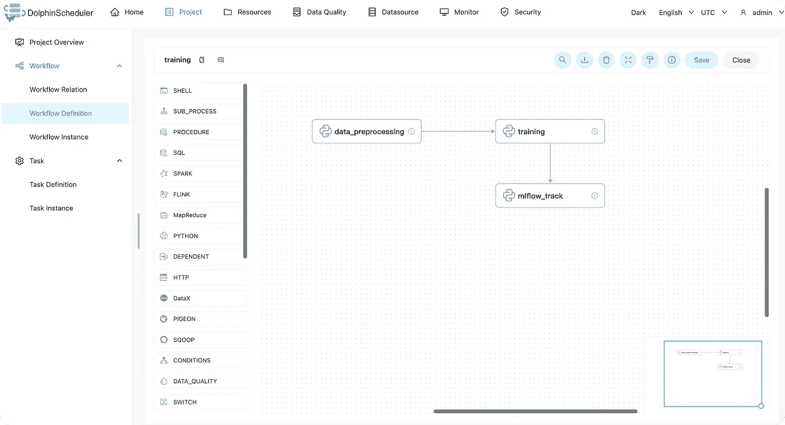

构建工作流后，您可以在以下 UI 界面上启动工作流，其中

*   数据集名称:数据集名称
*   pretrained_model:要使用的预训练模型
*   远程服务器 uri:ml 流跟踪服务器地址

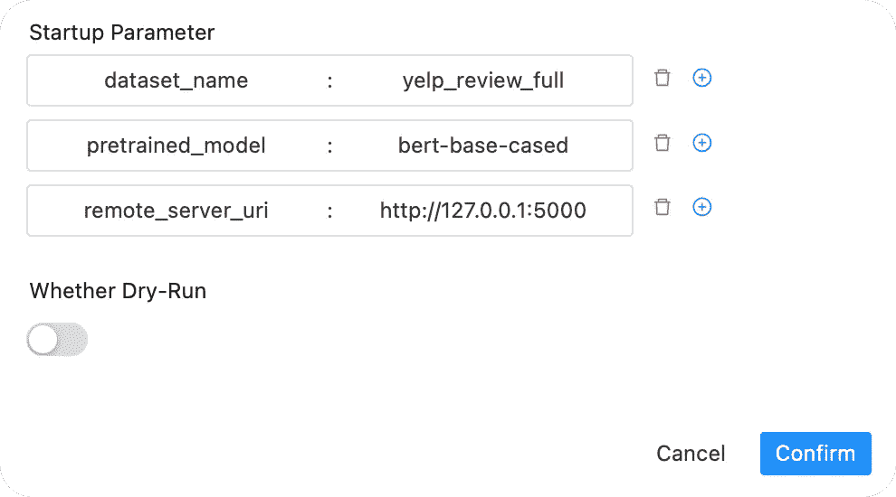

**部署模型工作流**

部署模型的工作流由 4 个任务组成

*   获取模型:从 mlflow 跟踪服务器获取模型文件的指定版本，请参见详细信息
*   check_service:检查模型服务是否启用，如果没有，则报错，如果成功，则继续运行
*   update_model:使用 fetch_model 拉取的模型文件更新模型服务
*   test_service:更新完成后，运行服务测试

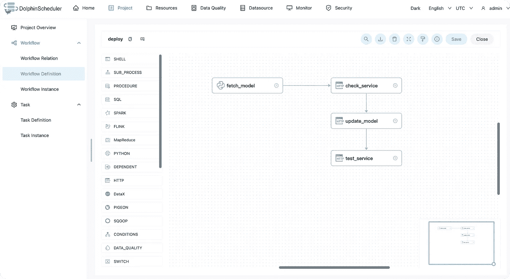

构建工作流后，您可以在以下 UI 界面上启动工作流，其中

*   远程服务器 uri:ml 流跟踪服务器地址
*   model_name:已部署模型的名称
*   model_version:已部署模型的版本号

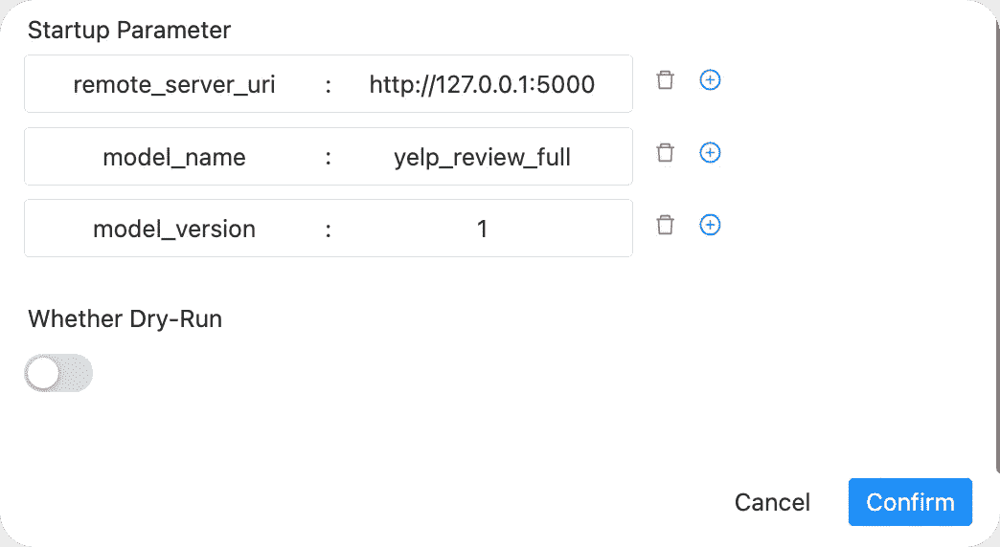

# 运行工作流

## 模特培训

接下来，我们将使用数据集`dataset_name=yelp_review_full`训练模型，在工作流执行页面中分别(如果需要并行运行多个，请确认 GPU 资源是否充足，并修改脚本来指定 GPU 资源)使用预先训练好的模型`bert-base-cased`、`microsoft/debersta-base`、`roberta-base`运行工作流。

如果使用 Roberta-base，启动界面如下图所示

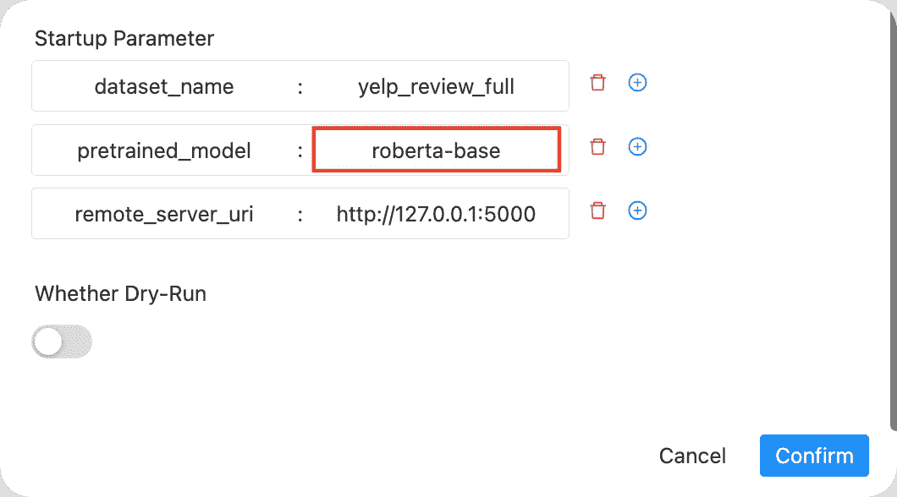

三个工作流程执行完成后，可以在`mlflow tracking server`中查看三个与测试相关的指标，如图所示:

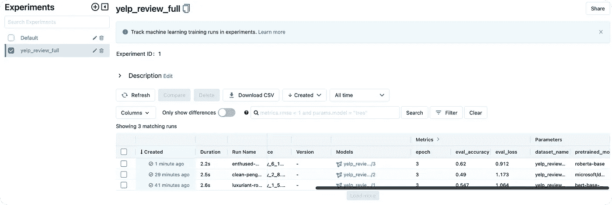

对应于该模型的三个版本如下

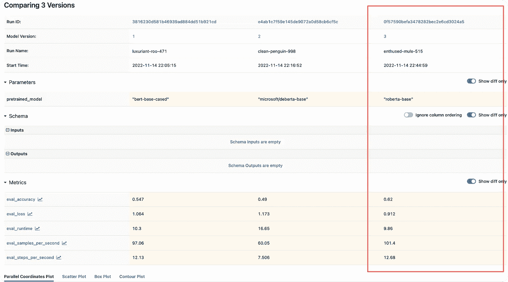

我们可以选择表现最好的车型三(`roberta-base`，acc 为 0.62)，注册为`production`，用于后续车型调配。


## 模型部署

启动模型服务器，如果打包到 docker 中，可以根据自己的喜好打包模型服务，或者使用更健壮的模型部署框架如`BentoML`、`Seldon Core`等。

```
# Start the server
uvicorn predict_service:app
```

运行工作流，如图所示

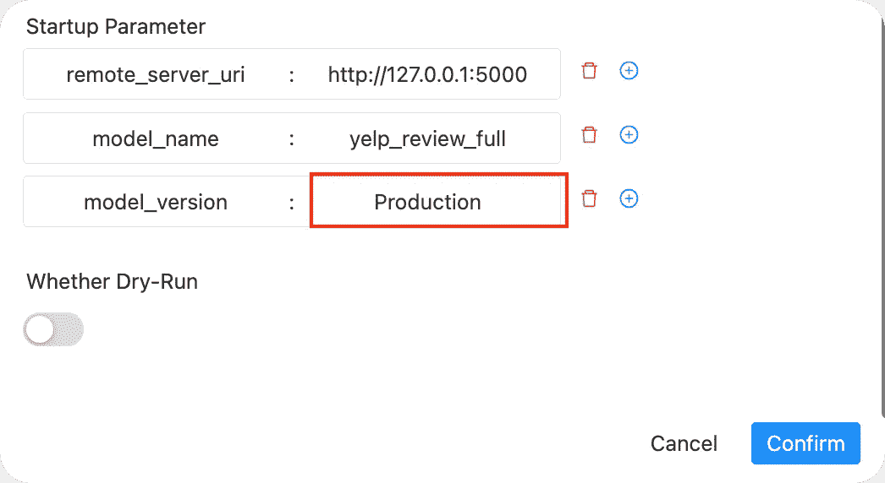

工作流完成，如下图所示

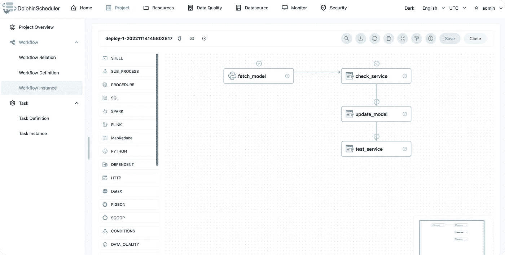

其中，模型服务器在工作流运行期间接收以下请求。

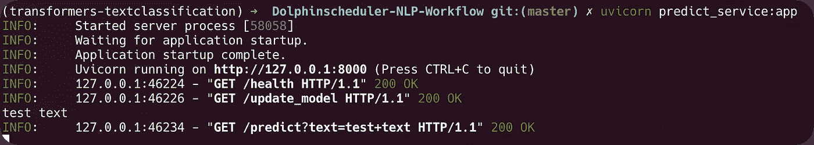

# 总结

本文主要介绍在 Apache DolphinScheduler 中使用 Hugging Face 的`transformers`库构建文本分类的工作流程。

基于工作流执行机器学习训练任务并将所有代码写在脚本中(或 Jupyter 笔记本中)的优势在于:

1.  基于 DolphinScheduler 调度系统的特点，它可以稳定地执行机器学习的各种任务，容错机制、调度机制和对丰富类型执行任务的支持可以更好地运行机器学习工作流，包括模型训练和模型部署等工作流。
2.  工作流的重用，以及工作流内任务的重用，可以提高算法团队开发的效率。像上面的模型培训工作流程和模型部署工作流程，适应各自团队的特点，是可以长期使用的。
3.  在完成的工作流程中，可以使用 DolphinScheduler 的接口连接企业内部系统，以 DolphinScheduler 作为 AI 平台的底层调度系统，然后在业务端实现系统中相应的调用。

📌📌欢迎填写[这份调查](https://www.surveymonkey.com/r/7CHHWGW)，给出您对用户体验的反馈或您对 Apache DolphinScheduler 的想法:)

[https://www.surveymonkey.com/r/7CHHWGW](https://www.surveymonkey.com/r/7CHHWGW)