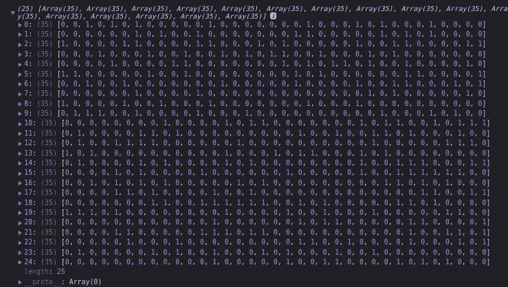

# 用 React 和 TypeScript 构建生活的游戏

> 原文：<https://medium.com/codex/build-the-game-of-life-with-react-and-typescript-a83cec96d18a?source=collection_archive---------18----------------------->


在本教程中，我们将使用 React 和 TypeScript 开发流行的生活游戏。《生命的游戏》是已故的约翰·康威在 1970 年创造的。它由一个细胞网格组成，每个细胞或者是活的，或者是死的，它们按照一套规则与相邻的细胞相互作用。它更像是一个**模拟**或**细胞自动化**而不是一个游戏，因为它不需要用户的输入。

我发现这是一个在 React 中练习一些有用概念的好项目。它相对容易构建，只需要大约 150 行代码就可以完成。这个项目最初是由 Ben Awad [在这个视频](https://www.youtube.com/watch?v=DvVt11mPuM0)中录制的，然而，这个教程对代码库做了一些修改。

# 先决条件

本教程假设对 React(包括[钩子](https://reactjs.org/docs/hooks-intro.html))和[类型脚本](https://www.typescriptlang.org/)有基本的了解。

# 入门指南

让我们通过在终端中运行以下命令，用 TypeScript 设置 React 项目:

```
npx create-react-app game-of-life --template typescript
```

您也可以在这里获取项目[的启动文件，如果您愿意，可以按照自述文件中的说明进行操作。](https://github.com/toluagboola/game-of-life-starter-files)

# 创建网格

网格自然是由许多行和列组成的。让我们首先在`App.tsx`中创建变量来跟踪这些值，包括网格本身。将网格存储在 state 中，以便于更新。为此，我们将使用`[useState](https://reactjs.org/docs/hooks-reference.html#usestate)`挂钩。`useState`钩子返回一个有状态值和一个更新它的函数。将这些返回值析构为如下所示的`grid`和`setGrid`变量。

```
// App.tsx
import { FC, useState } from "react";

const numRows = 25;
const numCols = 35;

const App: FC = () => {
  const [grid, setGrid] = useState();
};
```

注意，我们将组件的类型标注为**功能组件(FC)** 。这确保了我们函数的签名是正确的，并且它返回有效的 JSX。还有，本教程的所有代码都会写在一个文件里，即`App.tsx`。

接下来，我们要初始化网格。`useState`接受一个参数，该参数将在第一次渲染时作为初始状态返回。创建一个返回随机活细胞和死细胞数组的函数。

```
// App.tsx
const randomTiles: = () => {
  const rows = [];
  for (let i = 0; i < numRows; i++) {
    rows.push(Array.from(Array(numCols), () => (Math.random() > 0.7 ? 1 : 0))); // returns a live cell 70% of the time
  }
  return rows;
}

const App = () => {
  const [grid, setGrid] = useState(() => {
    return randomTiles();
  });
};
```

函数创建一个随机放置的 0 和 1 的多维数组。0 表示死亡，1 表示活着。数组的长度是我们之前声明的行数，其中的每个数组包含`numCols`项(在本例中是 35)。请注意，该类型被注释为 0 和 1 的数组。你可以在下面看到我们的网格是什么样子:



0 和 1 的多维数组

现在，每当第一次呈现 App 组件时，初始状态将是随机单元格的网格。接下来就是展示它们。如下所示更新你的`App.tsx`文件:

```
// App.tsx
const App = () => {
  const [grid, setGrid] = useState(() => {
    return randomTiles();
  });

  return (
    <div>
      {grid.map((rows, i) =>
        rows.map((col, k) => (
          <div
            style={{
              width: 20,
              height: 20,
              backgroundColor: grid[i][k] ? "#F68E5F" : undefined,
              border: "1px solid #595959",
            }}
          />
        ))
      )}
    </div>
  );
};
```

上面的代码在网格上迭代，网格已经初始化为`randomTiles`，每次生成一个 20 x 20 的盒子代表一个单元格。每个细胞的背景颜色取决于它是活的还是死的。


此时，形成的细胞呈直线排列，如上图所示。我们需要将它们整齐地排列成网格。为了实现这一点，让我们把包装`div`做成一个网格容器，样式如下:

```
// App.tsx
<div
  style={{
    display: "grid",
    gridTemplateColumns: `repeat(${numCols}, 20px)`,
    width: "fit-content",
    margin: "0 auto",
  }}
>{...}</div>//I use ... to denote code already established.
```

现在我们已经得到了我们想要的东西，您可以用任何您想要的方式来设计页面的样式。


# 处理单元格点击

除了随机生成的细胞状态，我们希望每个细胞都是可点击的，以使其活或死。向单元格`div`添加一个事件处理程序，如下所示:

```
// App.tsx
return (
  <div
    style={
      {
        // ...
      }
    }
  >
    {grid.map((rows, i) =>
      rows.map((col, k) => (
        <div
          key={`${i}-${k}`}
          onClick={() => {
            let newGrid = JSON.parse(JSON.stringify(grid));
            newGrid[i][k] = grid[i][k] ? 0 : 1;
            setGrid(newGrid);
          }}
          style={
            {
              // ...
            }
          }
        ></div>
      ))
    )}
  </div>
);
```

上面的 click 事件处理程序的作用是:

*   它将`grid`数组克隆成`newGrid`，
*   通过索引找到被点击的单元格并检查它是活的还是死的，
*   如果细胞目前是活的，它就使它死亡，反之亦然，
*   最后，它用修改后的`newGrid`更新状态。

最佳实践是始终向 React 中的元素添加唯一的标识，以帮助 React 知道它何时发生了变化。将每个单元格的`key`属性设置为其在网格中的特定位置。

# 运行模拟

没有细胞间的实际相互作用，就没有生命的游戏，所以让我们努力吧。让我们从在 state 中存储模拟的运行状态开始，与我们处理网格的方式相同，然后将其初始化为`false`。让我们允许 TypeScript 在这里为我们推断类型，这将是`boolean`。

```
// App.tsx
const App = () => {
  const [grid, setGrid] = useState(() => {
    return randomTiles();
  });

  const [running, setRunning] = useState(false);

  // ...
};
```

默认情况下，模拟不运行。现在，让我们创建一个按钮来开始或停止模拟:

```
// App.tsx
<button
  onClick={() => {
    setRunning(!running);
  }}
>
  {running ? "Stop" : "Start"}
</button>
```

接下来，我们将按照游戏规则实现细胞与其邻居之间的互动，游戏规则包括:

*   任何少于两个活邻居的活细胞都会死亡，就好像是由于人口减少。
*   任何有两个或三个活邻居的活细胞都会延续到下一代。
*   任何有三个以上活邻居的活细胞都会死亡，好像是由于人口过多。
*   任何一个死细胞，只要有三个活的邻居，就会变成活细胞，就像通过繁殖一样。

在 App 组件外创建一个`positions`数组。这个数组表示一个单元周围的八个邻居，我们将在模拟中使用它们。

```
// App.tsx
import { useState, useCallback } from "react";

const positions = [
  [0, 1],
  [0, -1],
  [1, -1],
  [-1, 1],
  [1, 1],
  [-1, -1],
  [1, 0],
  [-1, 0],
];
```

在 App 组件中，使用`[useCallback](https://reactjs.org/docs/hooks-reference.html#usecallback)`钩子创建一个名为`runSimulation`的函数，并将网格作为参数传递。这里使用`useCallback`的原因是为了防止每次渲染 App 组件时都创建我们的函数。`useCallback`在每次它的依赖数组改变时创建一个**记忆化的**函数，这意味着该函数将只被创建一次，然后在需要时运行。在这种情况下，我们将让依赖数组为空。

```
// App.tsx
const App = () => {
  // ...
  const runningRef = useRef(running);
  runningRef.current = running;

  const runSimulation = useCallback((grid) => {
    if (!runningRef.current) {
      return;
    }

    let gridCopy = JSON.parse(JSON.stringify(grid));
    for (let i = 0; i < numRows; i++) {
      for (let j = 0; j < numCols; j++) {
        let neighbors = 0;

        positions.forEach(([x, y]) => {
          const newI = i + x;
          const newJ = j + y;

          if (newI >= 0 && newI < numRows && newJ >= 0 && newJ < numCols) {
            neighbors += grid[newI][newJ];
          }
        });

        if (neighbors < 2 || neighbors > 3) {
          gridCopy[i][j] = 0;
        } else if (grid[i][j] === 0 && neighbors === 3) {
          gridCopy[i][j] = 1;
        }
      }
    }

    setGrid(gridCopy);
  }, []);

  // ...
};
```

我们创建了一次`runSimulation`,但是我们一直想要当前的`running`值，函数不会一直为我们更新这个值。为了解决这个问题，让我们使用`[useRef](https://reactjs.org/docs/hooks-reference.html#useref)`钩子创建一个`runningRef`变量，并将其初始化为`running`状态的当前值。这样，运行状态在我们的模拟中总是最新的，因为它存储在 ref 中。每当`runningRef`的`.current`属性为假时，该函数将停止，否则它将按照游戏规则继续工作。

现在，`runSimulation`克隆网格，遍历网格中的每个单元，并通过迭代`positions`数组来计算每个单元的活邻居。然后，它检查以确保我们没有越界，并且在网格的行和列内。如果满足该条件，它将增加相关单元的活邻居的数量。对于每个单元，`forEach`循环将运行 8 次。

接下来，它执行规则。如果细胞的活细胞数`neighbors`小于 2 或大于 3，则细胞死亡。否则，如果该细胞死亡，并且它正好有 3 个邻居，则该细胞存活并进行下一代。覆盖所有单元格后，它用`gridCopy`更新网格状态。

# 一个非常有用的自定义钩子

为了使模拟连续进行，我们需要一个函数在指定的时间间隔后运行它。让我们在单击开始按钮时触发`setInterval`方法:

```
// App.tsx
<button
  onClick={() => {
    setRunning(!running);
    if (!running) {
      runningRef.current = true;
    }
    setInterval(() => {
      runSimulation(grid);
    }, 1000);
  }}
>
  {running ? "Stop" : "Start"}
</button>
```

click 事件处理程序将运行状态更新为它的对立面，但如果是 false，它会将 ref 更改为 true，并每秒调用一次`runSimulation`。如果您在浏览器中运行此程序，您将会看到模拟没有正常运行。它似乎陷入了两代或三代人之间的循环。这是由于 React 编程模型和`setInterval`之间的不匹配，你可以在这里阅读更多关于[的内容。](https://overreacted.io/making-setinterval-declarative-with-react-hooks/)


setInterval 引起的 bug

在研究这个问题的解决方案时，我发现了这个由 Dan Abramov 编写的名为`useInterval`的[定制钩子](https://usehooks-typescript.com/react-hook/use-interval)。在您的项目目录中创建一个名为`useInterval.tsx`的文件，并将以下代码粘贴到其中:

```
// useInterval.tsx
import { useEffect, useRef } from "react";

function useInterval(callback: () => void, delay: number | null) {
  const savedCallback = useRef(callback);

  // Remember the latest callback if it changes.
  useEffect(() => {
    savedCallback.current = callback;
  }, [callback]);

  // Set up the interval.
  useEffect(() => {
    // Don't schedule if no delay is specified.
    if (delay === null) {
      return;
    }

    const id = setInterval(() => savedCallback.current(), delay);

    return () => clearInterval(id);
  }, [delay]);
}

export default useInterval;
```

将挂钩导入到 App 组件中，并按如下方式使用它:

```
// App.tsx
import useInterval from "./useInterval";

// Put this right under runSimulation() inside the App function
useInterval(() => {
  runSimulation(grid);
}, 150);
```

这个钩子的语法看起来和`setInterval`一样，但是工作方式有点不同。它更像是`setInterval`和`clearInterval`合二为一，它的自变量是**动态**。从点击处理程序中删除`setInterval`函数，看着我们的应用程序平稳运行。

# 清除网格

让我们添加一个函数来清空所有活细胞的网格。创建一个名为`generateEmptyGrid`的函数:

```
// App.tsx
const generateEmptyGrid = (): number[][] => {
  const rows = [];
  for (let i = 0; i < numRows; i++) {
    rows.push(Array.from(Array(numCols), () => 0));
  }
  return rows;
};
```

这个函数看起来像`randomTiles`，除了它返回一个只包含零的多维数组。创建一个按钮，用新的死单元数组更新状态:

```
// App.tsx
<button
  onClick={() => {
    setGrid(generateEmptyGrid());
  }}
>
  Clear board
</button>
```

当您检查浏览器时，应该会看到如下所示的错误:


浏览器中引发的类型错误

这是因为 TypeScript 的工作方式。当你初始化一个变量时，如果你不明确地注释它，类型脚本**尽可能精确地推断出它的类型。在我们的例子中，当我们声明`grid`状态时，我们将其初始化为`randomTiles`。因为我们没有注释`randomTiles`的类型，所以它的类型被推断为`() => (0 | 1)[][]`，也就是只返回零和一的函数。**

现在，`generateEmptyGrid`的类型被推断为`() => number[][]`，不可赋给`() => (0 | 1)[][]`。这就是上面显示我们的代码无法编译的错误背后的原因。对于我们的应用程序来说，类型必须兼容。让我们注释它们的类型，使它们是相同的:

```
// App.tsx
const generateEmptyGrid = (): number[][] => {
  const rows = [];
  for (let i = 0; i < numRows; i++) {
    rows.push(Array.from(Array(numCols), () => 0));
  }
  return rows;
};

const randomTiles = (): number[][] => {
  const rows = [];
  for (let i = 0; i < numRows; i++) {
    rows.push(Array.from(Array(numCols), () => (Math.random() > 0.7 ? 1 : 0)));
  }
  return rows;
};
```

既然它们都是包含数字的多维数组，并且可以相互赋值，我们的 **Clear** 按钮应该可以正常工作。如果用户愿意，让我们添加另一个按钮来再次随机化瓷砖。

```
// App.tsx
<button
  onClick={() => {
    setGrid(randomTiles());
  }}
>
  Random
</button>
```

这个点击处理程序只是用我们之前声明的返回随机放置的 0 和 1 的`randomTiles`函数来更新状态。

# 结论

在本教程中，我们已经使用 React 和 TypeScript 成功构建了康威的《生活的游戏》。我们介绍了如何使用一些 React 钩子，包括`useState`、`useCallback`和`useRef`。我们看到了 React 和`setInterval`如何不能很好地一起工作，并用一个自定义挂钩修复了这个问题。我们还讨论了 TypeScript 如何在没有注释的情况下推断类型，类型不匹配如何导致我们的代码无法编译，以及如何解决这个问题。

这个项目的完整代码可以在 GitHub 库中找到。我希望你已经从这篇文章中获得了一些价值。我们将在评论中感谢您的反馈。

感谢阅读！