# 在 Flutter 中构建 Windows exe 文件

> 原文：<https://medium.com/codex/build-windows-exe-file-in-flutter-f940f336fd98?source=collection_archive---------0----------------------->

## 在 Flutter 中生成可共享可执行文件的指南。

自从 Flutter 2.10 发布以来，Windows 桌面被标记为稳定。在本文中，我将向您展示构建可执行文件需要做些什么。

# **第一步:**

在您的 Flutter 应用程序中，运行`flutter build windows`。该命令构建位于`yourprojectpath/your_project_build/windows/runner/Release`中的 exe 文件。

# **第二步:**

首先，从这个[链接](https://jrsoftware.org/isdl.php)下载 Inno Setup Downloader。向下滚动，直到找到下图所示的部分:

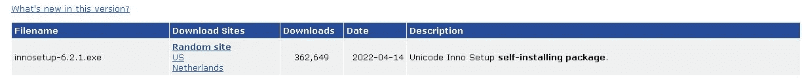

从 D **下载站点**点击任何选项，您将下载 Inno 安装下载器。之后，安装并打开它。

# **第三步:**

打开 Inno Setup Downloader 后，您将看到如图所示的对话框打开。

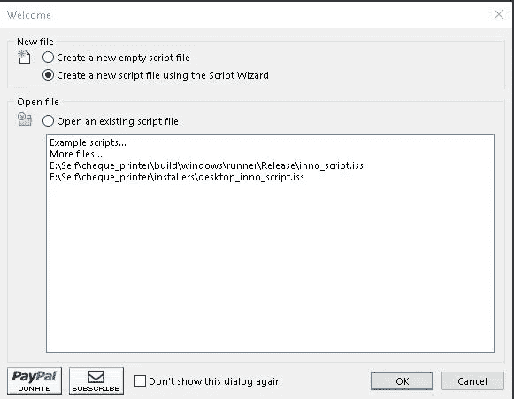

正如你在上面的图片中看到的。

> 点击创建一个新的脚本文件使用脚本向导，并按下确定。

# **第四步:**

在步骤 2 中按下 OK 后，您将会看到下一个对话框，如图所示。

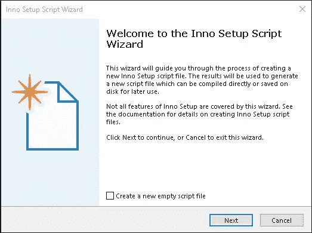

> 点击下一步。

# 第五步:

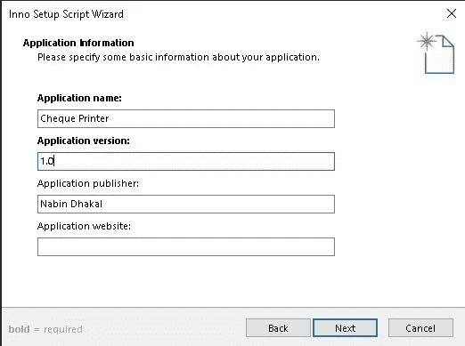

在对话框中输入您的 Windows 应用程序的信息。

**第六步:**

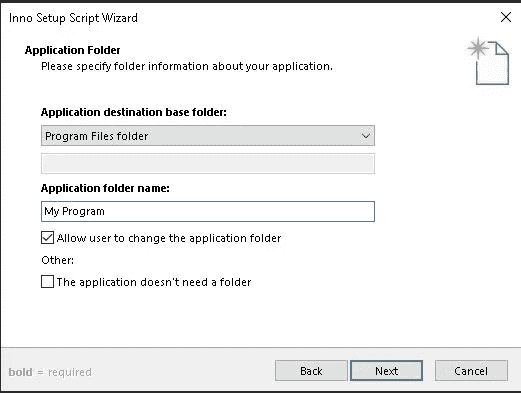

在这里，您不必进行更改。

> 点击下一步。

# **第七步:**

转到您的项目根文件夹。创建文件夹。在这里，我们将保存我们生成的 exe 文件。

# **第八步:**

从第 6 步开始，我们将看到如下对话框:

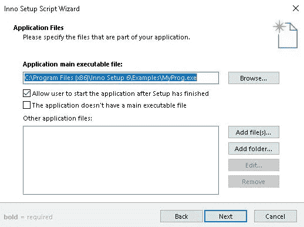

在**应用程序主可执行文件**中，浏览到您拥有`yourprojectpath/your_project_build/windows/runner/Release`的文件夹。这里你有`yourapplicationname.exe`。选择它。

然后你需要添加存在于**发布**文件夹中的`dll`文件。

> 点击添加文件。选择所有出现的`.dll`文件。
> 
> 添加完`.dll`后，您还需要添加名为 data 的文件夹。为此，点击**添加文件夹**，然后选择**数据**文件夹。

添加数据后，对话框将如下所示:

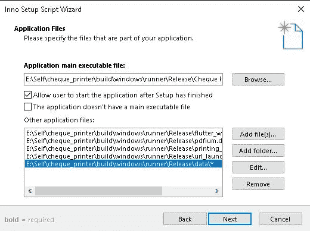

正如你在上面的图片中看到的。我已经选择了图像中的文件。

> 找到`yourprojectpath/your_project_build/windows/runner/Release/data/*`并双击它。

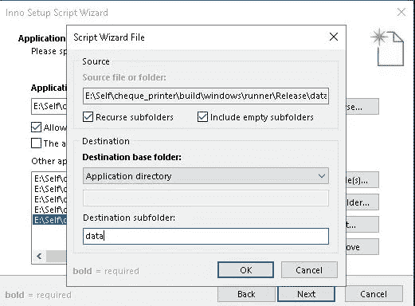

您将看到下一个对话框打开。找到**目标子文件夹**，并输入与**流道**文件夹同名的文件夹。对我来说，就是**数据**。

> 点击确定
> 
> 然后点击下一步

# **第九步:**

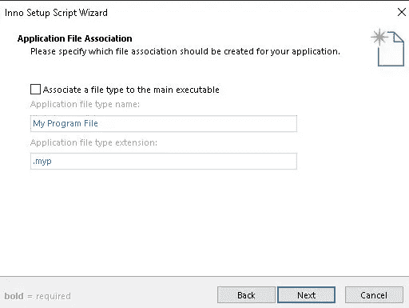

取消勾选**关联一个文件类型到主可执行文件。**

> 点击下一步

# 第十步:

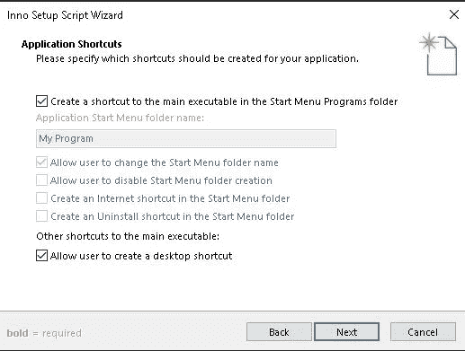

> 点击下一步

# 第十一步:

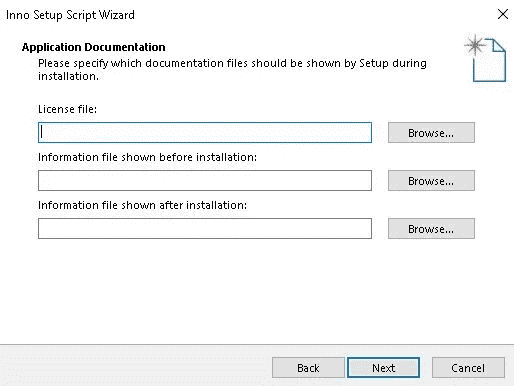

输入你的申请文件。

> 点击下一步

# 第十二步:

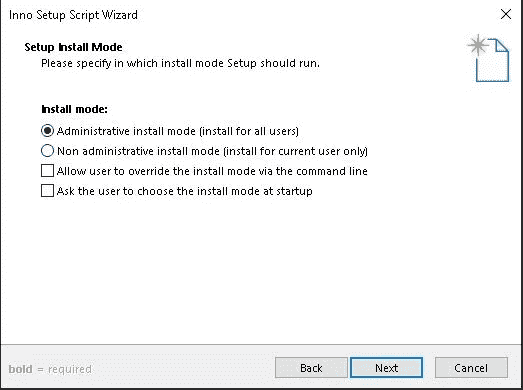

根据需要选择安装模式，然后点击**下一步。**

# 第十三步:

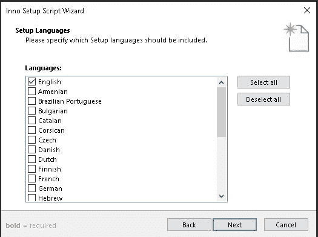

选择语言并点击**下一步**。

# 第十四步:

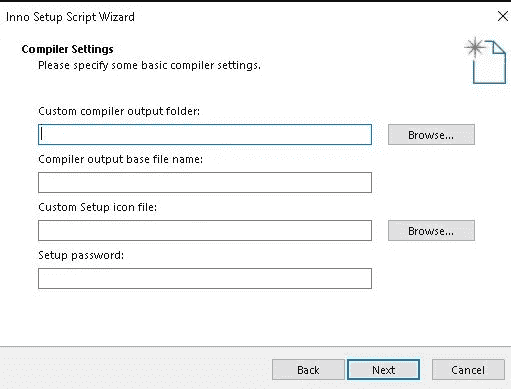

在输出文件夹中，需要选择要保存生成的 exe 的文件夹。由于我们已经在**步骤 7** 中创建了一个文件夹，选择该文件夹。

然后输入文件名。

添加应用程序的图标或徽标。

如果需要，设置密码。

然后点击**下一步。**

# **第十五步:**

单击“下一步”,直到打开以下对话框。

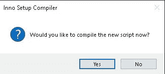

点击是。

# 最后，您应该将 exe 文件放在您在步骤 7 中创建的文件夹中。

# 让我们连接起来

我们可以成为朋友。在[脸书](https://www.facebook.com/nabin.dhakal.714/)、 [Linkedin](https://www.linkedin.com/in/nabindhakal/) 、 [Github](https://github.com/nbnD) 、 [Youtube](https://www.youtube.com/channel/UCW6oYt_3QSl7J2HSHNqwXWw) 、 [BuyMeACoffee](https://www.buymeacoffee.com/nabindhakal) 和 [Instagram](https://www.instagram.com/nbn_d_/) 上查找。

访:[颤振结](https://flutterjunction.com/)

**投稿:** [BuyMeACoffee](https://www.buymeacoffee.com/nabindhakal)

# 结论

希望这篇文章对你有所帮助，让你学到新的东西。我在这篇文章中使用了一些对你们中的一些人来说可能是新的东西。

如果你学到了新的东西或者想提出一些建议，请在评论中告诉我。

如果你喜欢这篇文章，请点击👏图标，为您提供传递所有新事物的动力。

此外，关注令人兴奋的文章和项目的更新。

通过分享学习对学习过程产生了巨大的影响，并使社区越来越大。

分享是吸引其他爱好者的磁石。

因此，让我们朝着扩大我们的学习社区迈出一小步。

与你的朋友分享这篇文章，或者如果你喜欢这篇文章，就在推特上发表评论。