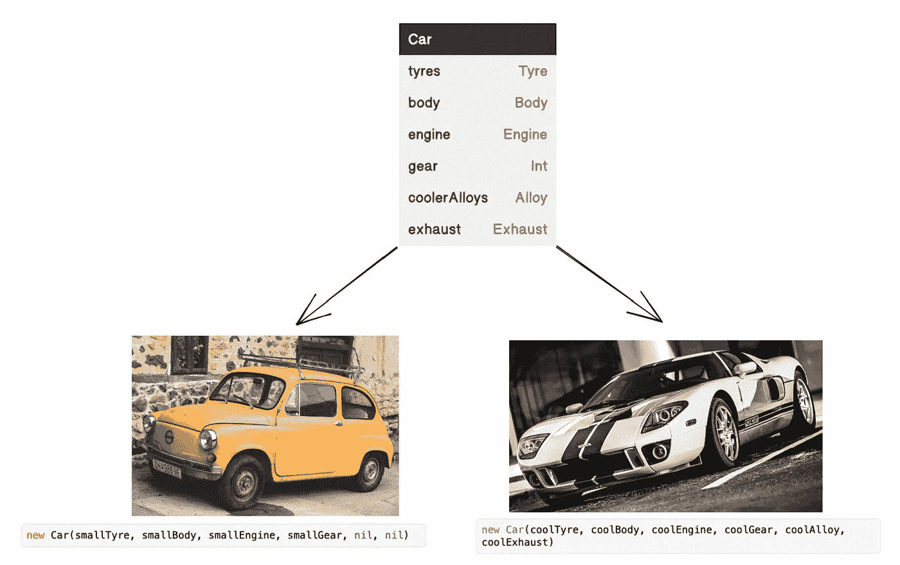
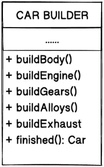
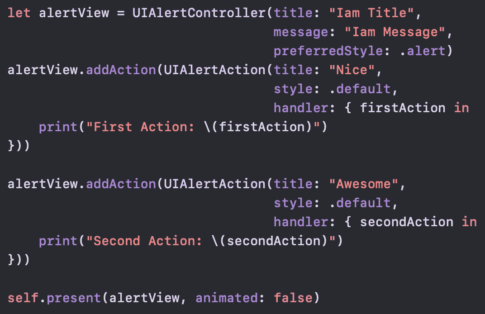
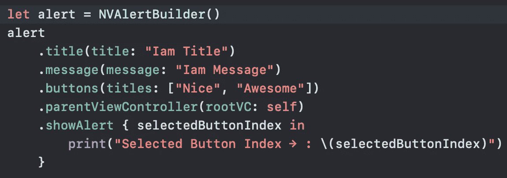

# Swift 中的构建器(链接)

> 原文：<https://medium.com/codex/builder-chaining-in-swift-4aa72a8c09de?source=collection_archive---------6----------------------->

## 在 Swift 中使用 Builder 模式包装 API

## 理解构建器模式

**Builder** 是一个创造性的设计模式，它允许逐步构建复杂的对象。在 **Builder 中，**我们将一个复杂对象的构造从它的表示中分离出来，这样相同的构造过程可以创建不同的表示。

与其他创造模式不同，Builder 不要求产品有一个公共界面。这使得使用相同的制造工艺生产不同的产品成为可能。只有当您的产品非常复杂并且需要大量配置时，使用构建器模式才有意义。

例如，让我们考虑如何创建一个`Car`。要造一辆基本的车，你需要有车身、发动机、轮胎、方向盘、排挡、油门、刹车、离合器等。但是，如果你想要一辆更强壮、更酷的车，有很酷的合金、很响的排气和其他花哨的东西呢？

最简单的解决方案是扩展基本的`Car`类，并创建一组子类来覆盖所有的参数组合。但是最终，你会得到相当多的子类。任何新的参数，比如合金类型，都需要增加层次结构。

还有一种方法不涉及子类的繁殖。你可以在基本的`Car`类中创建一个巨大的构造函数，用所有可能的参数控制汽车对象。虽然这种方法确实消除了对子类的需求，但它也产生了另一个问题。

构造函数问题

在上面的例子中，你可以看到`Car A`没有`Car B`拥有的很多东西。像这样，在大多数情况下，大多数参数都不会被使用，这使得**构造函数调用起来非常难看**。例如，只有一小部分汽车具有 4x4 驱动，因此与 4x4 驱动相关的参数十有八九是无用的。

## 如何解决问题

Builder 模式建议您将对象构造代码从它自己的类中提取出来，并将其移动到名为`***builders***`的单独对象中。

该模式将对象构造组织成一组步骤(`buildCarBody`、`buildCarEngine`等)。).要创建一个对象，您需要对一个构建器对象执行一系列这些步骤。重要的是你不需要调用所有的步骤。您可以只调用产生对象的特定配置所必需的那些步骤。

*构建器模式让您一步一步地构建复杂的对象。构建器不允许其他对象访问正在构建的产品。*

## 使用生成器模式包装 UIAlertController

让我们使用构建器设计模式在 iOS 中创建一个`**UIAlertController**`。通常我们如何创建一个`**UIAlertController**` **？**

正电码

写的和下面一样会有多酷？

建造者代码

是不是超级酷？

现在让我们深入了解如何将`UIAlertController` API 包装成它的构建版本。

## 创造

我们将首先创建我们的`AlertBuilder`类，因为我们需要一些基本的输入。一个`UIAlertController`将需要一个`title`、`message`、`buttons`和一个`rootViewController`。我们将使用下面的代码来创建我们的`AlertBuilder`

这足以帮助我们设置`UIAlertController`的构建版本。这里我们实现了可以在类中识别的构建器模式，它有一个创建方法和几个配置结果对象的方法。这里单个创建方法为`showAlert`，配置方法为`title`、`message`、`buttons`和`parentViewController`。

## 使用

我们将转到我们的`ViewController`文件，并在`viewDidAppear`方法中添加`NVAlertBuilder`用法代码，如下所示。

我希望您理解了什么是构建器模式，以及如何在您的下一个项目中使用构建器模式。如果你有任何疑问或建议，请告诉我。