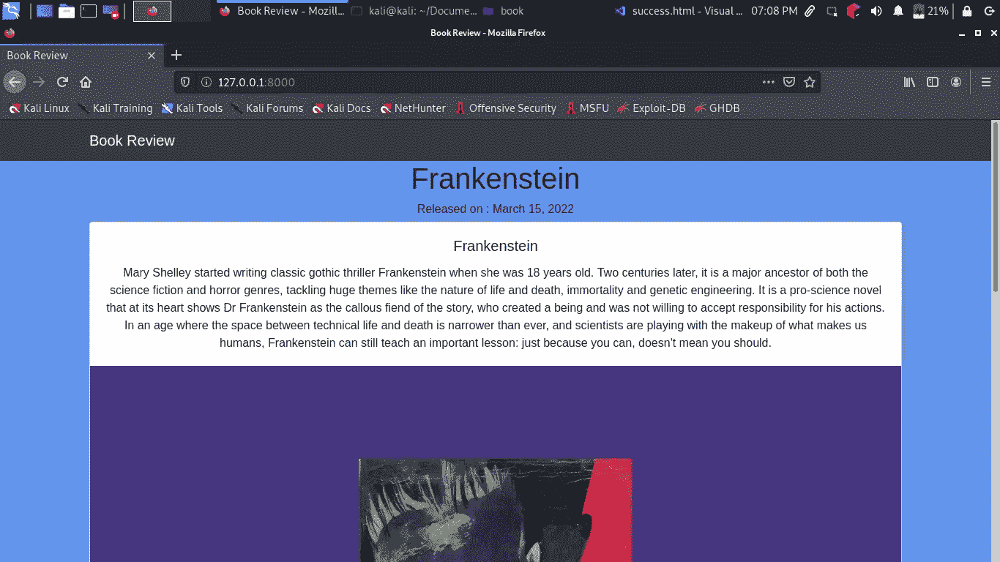
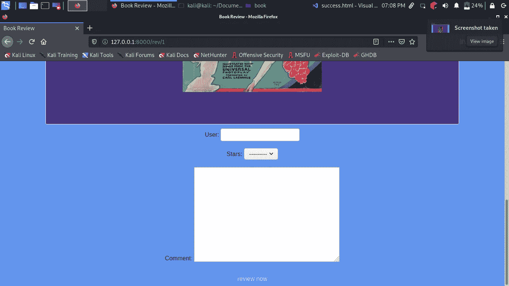
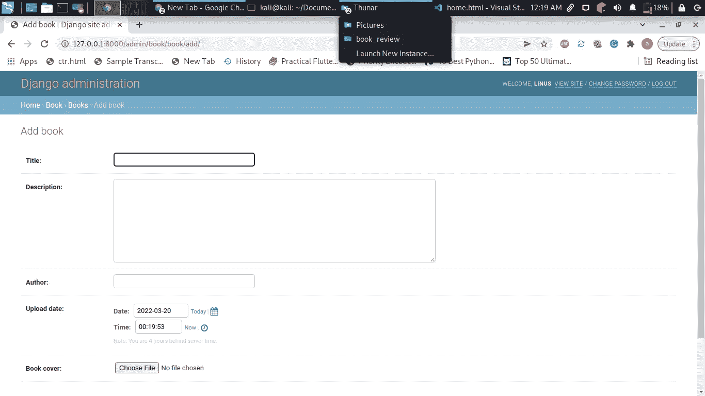
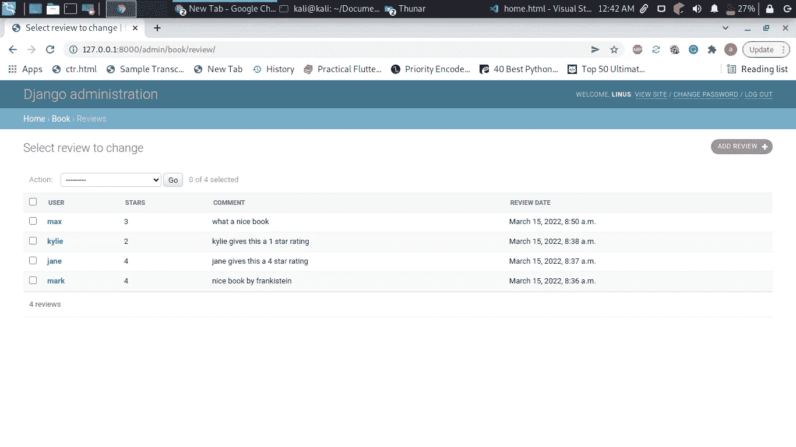

# 使用 python 构建图书审计 web 应用程序

> 原文：<https://medium.com/codex/building-a-book-audit-web-app-with-python-e118e749f03a?source=collection_archive---------8----------------------->

Anthony Tran 在 [Unsplash](https://unsplash.com/s/photos/book-audit?utm_source=unsplash&utm_medium=referral&utm_content=creditCopyText) 上拍摄的照片

在本教程中，我们将建立一个书评网络应用程序。用户可以加入和评价管理员上传的书籍。

我们将使用 django 构建我们的应用程序。这是我们最终的 web 应用程序的截图。

主页

审查页面

基本功能包括发表评论和给出 1 到 5 星的评分。更多功能即将推出。

**要求**

1.  姜戈

`pip3 install django`安装它

**项目设置**

首先，我们需要创建一个包含 django 应用程序的项目。运行`django-admin startproject book_review`。光盘放入`book_review`创建的文件夹。运行`python3 manage.py startapp book`，这将创建一个名为`book`的应用程序

让我们配置我们的项目，在`settings.py`中将我们的应用程序添加到`installed_apps`列表中。添加以下内容

我们的应用程序将需要存储媒体文件，如图书封面图像。为此，我们需要提供文件的路径。在`settings.py`中添加以下内容

**项目路线**

我们需要为我们的主要项目创建路线。在`book_review/urls.py`中添加以下内容

是时候进入我们的主应用程序了。我们首先需要几个模型，一个是要评论的书，下一个模型是要评论的。

我们的图书模型将有一个标题、图书描述、图书封面，最后是图书封面图像。

对于审查模型，我们将有以下一个用户，审查日期，星级槽和评论槽。

现在，让我们创建模型来执行此操作`python3 manage.py makemigrations`这将创建模型定义的表，下一次运行`python3 manage.py migrate`这将迁移数据。我们仍然需要创建一个超级用户，他将负责上传要审阅的书籍。创建一个超级用户运行`python3 manage.py createsuperuser`你将被要求填写你的用户名，电子邮件和一个秘密密码。

足够的模型和管理设置，我们现在需要创建一个评论表，我们的用户将不得不填写，而评级我们的书。在`book/forms.py`中添加以下内容

现在，我们需要管理员来识别我们的模型，在`book/admin.py` 中，让我们注册我们的模型

我们的应用程序现在一起出现了。让我们来看看我们的观点。首先，我们需要一个视图来列出我们需要评论的书。在`book/views.py`中添加以下内容

主页视图将列出要评论的书籍

为主页创建一个模板。在`book/templates/book/home.html`中添加以下内容。

**路线**

创建一个保存我们路线的文件`book/urls.py`。在内部添加以下内容

要查看我们的应用程序的进展，我们首先需要运行我们的服务器。跑`python3 manage.py runserver`。在您的浏览器中，转到`[http://127.0.0.1:8000/admin](http://127.0.0.1:8000/admin)`，使用您在**创建超级用户**步骤中创建的凭证登录。在图书槽中添加图书，如下所示。

添加您的图书并返回到您的主页路径，您应该会看到类似这样的内容

**查看功能**

在`book/views.py`中添加以下内容。

这里是`book/rev.html`中的对应模板

**成功重定向**

在一个成功的审查后，我们需要重定向我们的用户到一个成功的页面。这是视图及其模板

`book/templates/book/success.html`

**最终路线**

现在我们需要为剩下的功能创建路线。这是我们最后的`book/urls.py`文件

现在运行您的服务器。做一些评论，并登录到您的管理员，看到在评论仪表板的进展。这是我的评论仪表板

感谢阅读。请随意参与这个项目。下面是 [**的源代码**](https://github.com/bunnythecompiler/book_review)