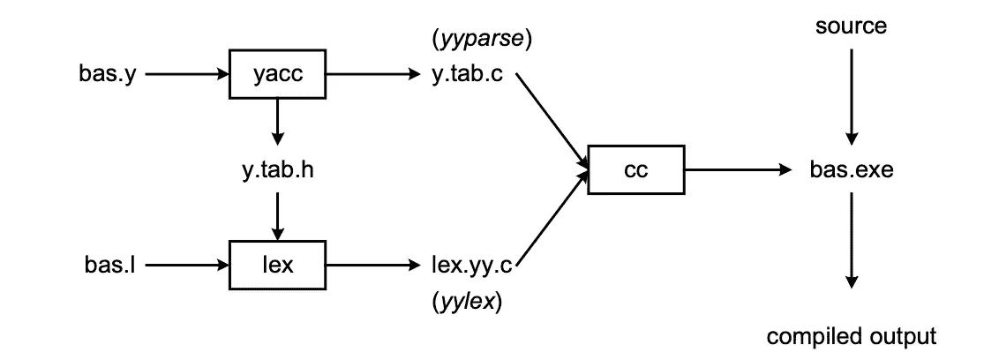
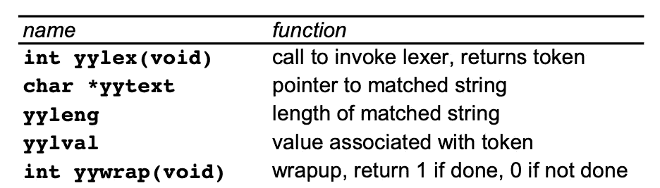
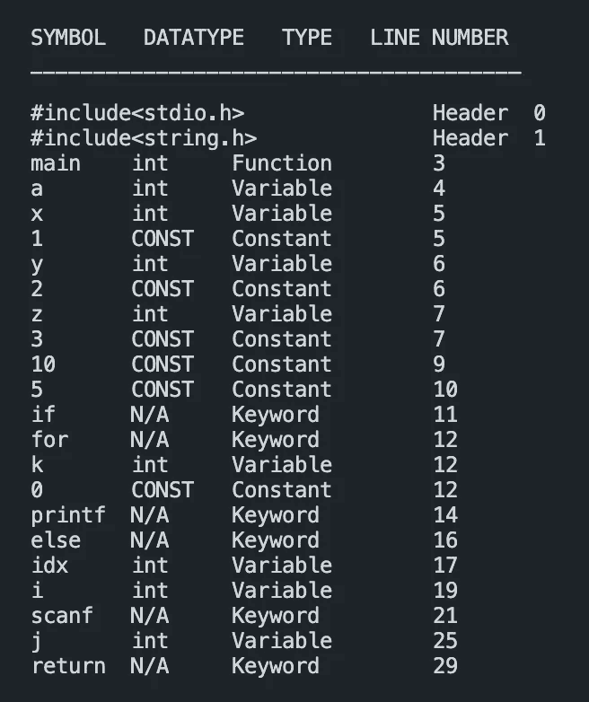

# 如何使用 Lex 和 Yacc 构建 C 编译器

> 原文：<https://medium.com/codex/building-a-c-compiler-using-lex-and-yacc-446262056aaa?source=collection_archive---------0----------------------->


照片由[你好我是尼克](https://unsplash.com/@helloimnik?utm_source=unsplash&utm_medium=referral&utm_content=creditCopyText)在 [Unsplash](https://unsplash.com/s/photos/build?utm_source=unsplash&utm_medium=referral&utm_content=creditCopyText)

创建我们自己的编译器并执行程序该有多酷？听起来很神奇，不是吗？嗯，你来对地方了！

# 介绍

编译器是一个**程序，它将编程语言**(高级)**中的代码转换成机器可理解的格式**(低级)。然后，这个编译器生成一个可执行程序，可以用来解析和执行特定语言的输入文件。

在本文中，我们将看看编译器 ie 的前端阶段。构建符号表、生成语法树、识别语义错误以及生成中间代码。

本文共分六个部分。

> 第 1 部分:创建词法分析器
> 
> 第 2 部分:添加语法规则
> 
> 第 3 部分:创建符号表
> 
> 第 4 部分:添加语法树
> 
> 第 5 部分:执行语义分析
> 
> 第 6 部分:中间代码生成

如果你想直接跳到代码，就去我的 [GitHub](https://github.com/AnjaneyaTripathi/c-compiler) 库开始吧。⭐️如果你喜欢它的内容。😃

## 莱克斯是什么？


来源:[活套](https://www.looper.com/img/gallery/the-untold-truth-of-lex-luthor/intro-1577203159.jpg)

不，不是莱克斯·卢瑟。

Lex 是一个用来创建词法分析器的工具。那么什么是词法分析呢？这是**过程，在这个过程中，一个字符流被转换成一个令牌序列**。这种程序被称为词法分析器或分词器。该文件包含一组正则表达式以及与每个表达式相关联的操作。输出是一个表驱动的扫描器——它告诉我们当我们根据我们所处的状态看到一个特定的输入字符时该做什么。该输出保存在一个名为 lex.yy.c 的文件中。所有 lex 文件的结构都类似于下面给出的结构。

```
{declarations}
%%
{rules}
%%
{subroutines}
```

**声明**有两种类型，在 C 和 Lex 中。所有的导入和全局声明都在 C 中完成，并包含在`%{`和`%}`中。除此之外，Lex 文件可以包含正则表达式和符号的定义。

**规则**由同一行中的动作所遵循的模式组成。

最后，**子程序**包含了我们自己想要编写的函数。


来源:[迷因](https://me.me/i/lex-and-yacc-gcc-18487540)

## 看看 Yacc

Yacc(又一个编译器)是一个用来创建解析器的工具。它解析来自 Lex 文件的标记流，并执行语义分析。Yacc 将给定的上下文无关语法(CFG)规范翻译成 C 实现 y.tab.c。这个 C 程序在编译时会生成一个可执行的解析器。Yacc 文件在许多方面与 Lex 文件相似。

```
{declarations}
%%
{rules}
%%
{subroutines}
```

**声明**和**子程序**与 Lex 中的相同，但规则略有不同。这里，**规则**不是正则表达式，而是 CFG 中的语法定义。这些规则，像 Lex 中一样，有两个部分——产生和动作。



图 1: [托马斯·尼曼](https://arcb.csc.ncsu.edu/~mueller/codeopt/codeopt00/y_man.pdf)

还创建了另一个文件——y . tab . h，我们还没有谈到它。这是我们编译 Yacc 文件时创建的文件。它告诉我们的 Lex 文件在我们的 Yacc 程序中定义的所有有效的令牌声明。

现在我们知道了 Lex 和 Yacc 文件的样子，我们可以更深入地开始构建我们自己的 C 编译器。

## 我们编译器的能力是什么？

在我们开始编码之前， ***我们的编译器将接受*** :

1.  有效的 C 语句，如声明、初始化等。
2.  `if-else`报表
3.  `for`循环
4.  嵌套的`for`和`if-else`语句

我们将 ***实现为前端阶段*** 的编译器，即:

1.  生成符号表
2.  创建解析树
3.  执行语义分析
4.  生成中间代码

有了目标，让我们开始编码吧！

# 第 1 部分:创建词法分析器

我们现在知道，Lex 文件有 3 个部分。我们将从声明开始，然后转到规则，最后添加所有必要的函数。

**1。声明**

让我们首先声明编译器所需的所有导入和全局变量。

```
%{    
     #include "y.tab.h"    
     int countn=0;       /* for keeping track of the line number */
%}
```

我们包括`y.tab.h`和一个计数器来记录我们所在的行号。这将在后面的符号表中使用，并帮助我们调试。

接下来我们有我们的常规定义。

```
%option yylinenoalpha          [a-zA-Z]
digit          [0-9]
unary          "++"|"--"
```

`%option yylineno`创建存储行号的扫描仪。

**2。规则**

这是我们 Lex 文件中最重要的部分之一。我们定义了对从 C 程序获得的输入流进行标记化所需的所有规则。这些标记将被我们的 Yacc 文件使用。

首先，让我们为关键字定义规则。在这里，如果我们遇到`printf`或`scanf`，我们的 lexer 将识别它并分别返回令牌`PRINTFF`和`SCANFF`。

```
"printf"    { strcpy(yylval.nd_obj.name,(yytext)); return PRINTFF; }
"scanf"     { strcpy(yylval.nd_obj.name,(yytext)); return SCANFF; }
```

我们同样描述其他关键字的规则，如`int`、`float`、`for`、`if`、`else`等。为了理解其他规则，熟悉正则表达式语法是必不可少的。

以上代码是我们最后的***Lex 程序*** 。子程序部分将在下面解释。

**3。子程序**

我们的子程序很简单，只有一个函数叫做`yywrap()`。

```
int yywrap() {
    return 1;
}
```

在这一点上，可能会有一些困惑，这些`yy`函数— `yywrap, yylval, yytext`等都是什么？？



图 2: [托马斯·尼曼](https://arcb.csc.ncsu.edu/~mueller/codeopt/codeopt00/y_man.pdf)

完成后，我们的 Lex 文件就完成了！

我们现在可以使用下面的命令编译我们的 Lex 文件

```
lex lexer.l
```

到目前为止，我们已经介绍了什么是编译器，什么是 Lex 和 Yacc，以及它们如何帮助我们制作自己的编译器。最后，我们编写了自己的 Lex 程序来为任何输入 C 程序生成令牌。

在接下来的章节中，我们将致力于创建我们的 Yacc 程序，并最终创建我们自己的 C 编译器。

# 第 2 部分:添加语法规则

在这一节中，我们的目标是用解析输入 C 程序所必需的所有语法规则创建 Yacc 文件。未来的文章将讨论创建符号表、解析树、语义分析和中间代码生成。


迈克尔·泽兹奇在 [Unsplash](https://unsplash.com/s/photos/compiler?utm_source=unsplash&utm_medium=referral&utm_content=creditCopyText) 上拍摄的照片

## 编写我们的 YACC 程序

如前所述，Yacc 项目包括三个部分。我们将依次讲解每个部分。

**1。声明**

在我们的声明中，我们导入了将在 Yacc 程序中使用的必要的头文件和函数声明。

```
%{
    #include<stdio.h>
    #include<string.h>
    #include<stdlib.h>
    #include<ctype.h>
    #include"lex.yy.c"

    void yyerror(const char *s);
    int yylex();
    int yywrap();
%}%token VOID CHARACTER PRINTFF SCANFF INT FLOAT CHAR FOR IF ELSE TRUE FALSE NUMBER FLOAT_NUM ID LE GE EQ NE GT LT AND OR STR ADD MULTIPLY DIVIDE SUBTRACT UNARY INCLUDE RETURN
```

头文件直接来自 C，所以我们将跳过它们。我们定义了 3 个函数— `yyerror(const char *s)`、`yylex()`和`yywrap()`。后两个已经在第 1 部分讨论过了，到了`yyerror()`，它是一个显示错误信息的库函数。

继续，我们看到`%token`后面跟着一堆单词。这些话实际上是 YACC 文件可以接受的象征。这存储在 Lex 程序使用的`y.tab.h`中。

**2。规则**

定义完成后，是时候开始学习解析器的规则了。在我们开始之前，让我们了解规则是如何定义的以及它们的基本结构。

```
production-name: definition 1    { action }
| definition 2                   { more action }
|                                { some more action }
;
```

在`definition 2`之后，我们看到的下一个生产是空生产。对应于每个定义的操作是可选的。它们是根据每个产品所满足的定义来执行的。

让我们看一个简单的 c 语言声明语句。

```
int x = 35;orfloat x;
```

我们现在定义这种语法在这种声明性语句之上的外观。

```
declaration: datatype ID '=' value
| datatype ID
;datatype: INT
| FLOAT
| CHAR
;value: NUMBER
| FLOAT_NUM
| CHARACTER
;
```

我们现在将系统地编写将用于创建我们的解析器的所有语法定义。

第一个语法是针对整个 C 程序结构的。每个 C 程序都有一组头文件，声明了`main`函数，后面是主体和`return`语句。我们的编译器假设 C 代码中只有一个函数——`main`函数。

```
program: headers main '(' ')' '{' body return '}'
;
```

接下来，我们讨论标题。`INCLUDE`是在我们的 Lex 程序中定义的一个令牌。我们使用`headers headers`的原因是为了适应多个头文件。

```
headers: headers headers
| INCLUDE
;
```

`main`是另一种产品，定义如下。我们假设没有参数传递给这个`main`函数。

```
main: datatype ID
;
```

如您所见，datatype 不在上面定义的标记中，而是另一种产品。

```
datatype: INT 
| FLOAT 
| CHAR
| VOID
;
```

main 之后是我们的 C 代码体。主体可以有大量可能的语句和循环。它们在规则中的定义如下。

```
body: FOR '(' statement ';' condition ';' statement ')' '{' body '}'
| IF '(' condition ')' '{' body '}' else
| statement ';' 
| body body
| PRINTFF '(' STR ')' ';'
| SCANFF '(' STR ',' '&' ID ')' ';'
;
```

经过仔细检查，我们发现`for`循环和`if`语句中的代码块再次包含了`body`。这允许我们的编译器接受不同复杂度的嵌套语句。

`if-else`声明包含最后的`else`生产。这允许我们拥有`if-else`以及简单的`if`语句。我们将`else`定义为:

```
else: ELSE '{' body '}'
|
;
```

还有两个产品是需要讨论的`body`的一部分，即`condition`和`statement`。

```
condition: value relop value 
| TRUE 
| FALSE
;statement: datatype ID init 
| ID '=' expression 
| ID relop expression
| ID UNARY 
| UNARY ID;
```

现在我们已经知道了`condition`和`statement`的制作规则，我们可以继续查看它们所使用的其他制作。

`value`可以是整数、十进制值、字符或变量。

```
value: NUMBER
| FLOAT_NUM
| CHARACTER
| ID
;
```

`relop`是一个产品，它定义了可以执行的所有可能的关系操作。

```
relop: LT
| GT
| LE
| GE
| EQ
| NE
;
```

到了`statement`，我们可以看到我们有初始化、声明以及赋值操作。在 C 中声明变量时，没有必要将其初始化为特定的值。这就是为什么`init`生产是**可空**生产。

```
init: '=' value 
|
;
```

继续，我们有`expression`。

```
expression: expression arithmetic expression
| value
;
```

这些表达式可以有算术运算，所以我们为其定义了另一个产品。算术运算被定义为但不限于加法、减法、乘法和除法。

```
arithmetic: ADD
| SUBTRACT
| MULTIPLY
| DIVIDE
;
```

完成所有这些产品后，我们就完成了 C 程序的`body`。C 代码的最后一部分是`return`语句。我们定义`return`如下。

```
return: RETURN value ';' 
|
;
```

`return`也是可空生产。

完成所有这些定义后，我们就完成了 Yacc 文件的第二部分。我们现在可以进入最后一个部分——子程序。

**3。子程序**

我们的子程序由两个函数组成— `main`和`yyerror`。它们的定义如下。

```
int main() {
    yyparse();
}void yyerror(const char* msg) {
    fprintf(stderr, "%s\n", msg);
}
```

`main`函数告诉我们解析输入文件，而`yyerror`打印出编译和执行 Yacc 文件时出现的错误。

我们在规则部分、声明和子例程中定义的所有产品的完整集成代码如下所示。

为了编译我们的 Yacc 程序，我们运行以下命令:

```
yacc -v -d parser1.y
```

为了生成可执行文件，我们运行:

```
gcc -ll y.tab.c
```

为了测试我们的编译器，我们执行下面给出的命令。(假设你有一个叫`input1.c`的 C 程序。

```
./a.out<input1.c
```

至此，我们完成了 Yacc 文件。我们在规则部分、声明和子例程中定义的所有产品的完整集成代码如下所示。

目前，尚未定义任何操作。因此，如果程序是有效的 C 代码，则在执行时不会显示任何`syntax error`。

在下一节，我们将讨论如何为我们的编译器创建符号表。

# 第 3 部分:创建符号表

在这一部分中，我们的目标是构建符号表并存储头文件、变量、关键字和常量以及行号、类型和数据类型等细节。本文将对它们进行更详细的讨论。我们的目标是实现下面的符号表。



图 1:符号表

符号表存储标识符、数据类型(仅适用于变量)、标识符的类型或类别以及行号。

也就是说，让我们开始在前面的代码中添加符号表功能。

## 添加符号表

为了添加我们的符号表，我们必须首先定义结构和细节。我们的符号表将有像符号名称，数据类型，符号类型(关键字，常数，变量等)的细节。)和行号。

```
struct dataType {
        char * id_name;
        char * data_type;
        char * type;
        int line_no;
} symbol_table[40];
```

**注意**:行号在编译器的所有阶段都有很大的帮助，因为每当程序崩溃时，它会告诉我们错误在哪一行。

这里，`40`表示我们符号表中的最大条目数，可以根据我们的要求增加或减少。

下一个需要解决的部分是`insert_type()`函数。每当向符号表中添加函数或变量时，都会调用此函数。它将要添加的变量或函数的数据类型复制到名为`type`的字符数组中。

```
void insert_type() {
    strcpy(type, yytext);
}
```

现在，我们来看符号表功能的主要部分-将符号添加到表中。我们使用`add`函数来达到这个目的。

```
void add(char c) {
  q=search(yytext);
  if(!q) {
    if(c == 'H') {
      symbol_table[count].id_name=strdup(yytext);        
      symbol_table[count].data_type=strdup(type);     
      symbol_table[count].line_no=countn;    
      symbol_table[count].type=strdup("Header");
      count++;  
    }  
    else if(c == 'K') {
      symbol_table[count].id_name=strdup(yytext);
      symbol_table[count].data_type=strdup("N/A");
      symbol_table[count].line_no=countn;
      symbol_table[count].type=strdup("Keyword\t");   
      count++;  
    }  else if(c == 'V') {
      symbol_table[count].id_name=strdup(yytext);
      symbol_table[count].data_type=strdup(type);
      symbol_table[count].line_no=countn;
      symbol_table[count].type=strdup("Variable");   
      count++;  
    }  else if(c == 'C') {
      symbol_table[count].id_name=strdup(yytext);
      symbol_table[count].data_type=strdup("CONST");
      symbol_table[count].line_no=countn;
      symbol_table[count].type=strdup("Constant");   
      count++;  
    }  else if(c == 'F') {
      symbol_table[count].id_name=strdup(yytext);
      symbol_table[count].data_type=strdup(type);
      symbol_table[count].line_no=countn;
      symbol_table[count].type=strdup("Function");   
      count++;  
    }
}
```

为了确保我们的表中不会重复出现相同的符号，我们使用了`search`函数。它被定义为:

```
int search(char *type) { 
    int i; 
    for(i=count-1; i>=0; i--) {
        if(strcmp(symbol_table[i].id_name, type)==0) {   
            return -1;
            break;  
        }
    } 
    return 0;
}
```

一旦函数完成并准备好了，我们要做的就是开始在相关的地方插入函数调用。我们有 5 种类型的符号:

1.  h-Headers:用于所有头文件
2.  K —关键字:针对`for`、`if`、`else`等关键字。
3.  V —变量:仅在变量声明期间调用
4.  C —常量:任何赋值，如`9`、`'A'`、`-3.14`等。
5.  F —功能:目前只有`main`

在正确的地方添加了函数调用之后，我们需要做的就是在 Yacc 文件的`main`函数中打印表格。下面可以看到对`add`的函数调用和更新后的`main`函数。

我们现在需要做的就是编译并运行我们的编译器。这些命令是:

```
yacc -v -d parser2.y
lex lexer.l
gcc -ll y.tab.c
./a.out<input1.c
```

为了得到图 1 所示的输出，相应的 C 代码如下。

我们终于完成了符号表的创建。恭喜你走到这一步！当我们潜得更深时，喝点咖啡。


在下一节中，我们将讨论为我们的 C 程序创建解析树。你可以随意摆弄我们到目前为止所做的任何东西。

# 第 4 部分:添加语法树

我们现在处理使用我们的编译器为 C 程序创建解析树。最后，我们将打印 C 代码解析树的有序遍历。让我们开始吧！


西蒙·威尔克斯在 [Unsplash](https://unsplash.com/s/photos/tree?utm_source=unsplash&utm_medium=referral&utm_content=creditCopyText) 上拍摄的照片

## 创建抽象语法树

我们的解析树将是一棵二叉树——它将有两个子树。树的根将是程序的开始。结构极其简单直观。

```
 program
                         |
   _________________________________________
  |                                         |
headers                                   main
                                            |
                               __________________________
                              |                          |
                             body                     return
```

主体将由多个语句、循环和 if-else 块组成。为了构建这样的树，我们需要首先创建节点。完成后，我们编写一个函数将元素添加到树中，最后打印树。

我们将一步一步地解决这个问题，从定义我们的节点开始。

**1。我们树的节点**

像二叉树的任何节点一样，它将有一个左右子节点以及关于该节点的数据，这里它被称为`token`。

```
struct node {
  struct node *left;
  struct node *right;
  char *token;     
};
```

我们还需要重新定义令牌和产品的类型。

我们称这种新型为`nd_obj`。其定义如下。

```
struct var_name {
   char name[100];
   struct node* nd;
} nd_obj;
```

在编译器的后期，我们将添加不同的节点类型。它们将被称为`nd_obj2`、`nd_obj3`等等。

在我们的定义中，我们通过添加类型做了一点小小的修改。

```
%token VOID%token <nd_obj> CHARACTER PRINTFF SCANFF INT FLOAT CHAR FOR IF ELSE TRUE FALSE NUMBER FLOAT_NUM ID LE GE EQ NE GT LT AND OR STR ADD MULTIPLY DIVIDE SUBTRACT UNARY INCLUDE RETURN

%type <nd_obj> headers main body return datatype expression statement init value arithmetic relop program
```

在这个阶段，我们还必须修改我们的 Lex 文件。所有的令牌现在都是时间的`nd_obj`，所以我们现在可以保存令牌的名称。

更新后的 Lex 文件如下所示。

如本系列的第 1 部分所示，`yylval`是与令牌相关联的值。使用`yytext`，我们将`name`分配给我们的令牌。

**2。制作节点并将它们添加到解析树**

我们定义树的原点为`head`。它的类型是`node`。这将作为访问解析树的入口点。我们在 YACC 文件的第一段中定义了这一点。

```
struct node *head;
```

下一步是创建一个将节点添加到树中的函数。这将被称为`mknode()`。该函数将接受 3 个参数——节点的左子节点、右子节点和名称。

```
struct node* mknode(struct node *left, struct node *right, char *token) {
  struct node *newnode = (struct node*) malloc(sizeof(struct node));
  char *newstr = (char*) malloc(strlen(token)+1);
  strcpy(newstr, token);
  newnode->left = left;
  newnode->right = right;
  newnode->token = newstr;
  return(newnode);
}
```

正如你所看到的，这个函数将帮助我们制作我们的树。下一步是调用这个函数并传递必要的参数。

在我们开始这一部分之前，有必要了解我们如何访问语法中的结果和元素。假设我们有以下产品:

```
print: PRINTFF { add('K'); } '(' STR ')' ';'
```

要访问`PRINTFF`，我们使用`$1`。为了访问`STR`，我们使用`$4`。这些元素从 1 开始索引，在`{}`之间发生的任何动作都算作一个元素。这就是为什么`STR`是`$4`而不是`$3`。我们将用它来调用`mknode()`函数，并在必要时将产品作为子产品传递。为了访问生产 ie。`print`我们用`$$.nd`。

我们开始从`program`产品中生成我们的树。然后，我们将根据我们在本系列第 3 部分制作的`parser2.y`按顺序移动。

```
program: headers main '(' ')' '{' body return '}' { 
    $2.nd = mknode($6.nd, $7.nd, "main"); 
    $$.nd = mknode($1.nd, $2.nd, "program"); 
    head = $$.nd; 
} 
;
```

这里，我们指定`main`有子节点`body`和`return`，而节点被称为“主节点”。`program`叫做“程序”，它的孩子是`header`和`main`。由于这将是我们解析树的入口点，我们将`program`赋给`head`。

我们接下来继续到`header`节点。

```
headers: headers headers { 
    $$.nd = mknode($1.nd, $2.nd, "headers"); }
| INCLUDE { 
    add('H'); 
    $$.nd = mknode(NULL, NULL, $1.name); 
}
;
```

在多个头的情况下，我们再次创建一个具有子节点`header`的新节点。如果只有一个`header`,我们将它保存为头文件的名称，并且没有子文件。

我们现在进入`body`。我们跳过`main`，因为它已经在`program`生产中处理过了。

```
body: FOR { add('K'); } '(' statement ';' condition ';' statement ')' '{' body '}' { 
    struct node *temp = mknode($6.nd, $8.nd, "CONDITION"); 
    struct node *temp2 = mknode($4.nd, temp, "CONDITION"); 
    $$.nd = mknode(temp2, $11.nd, $1.name); 
}
| IF { add('K'); } '(' condition ')' '{' body '}' else { 
    struct node *iff = mknode($4.nd, $8.nd, $1.name);  
    $$.nd = mknode(iff, $11.nd, "if-else"); 
}
| statement ';' { $$.nd = $1.nd; }
| body body { $$.nd = mknode($1.nd, $2.nd, "statements"); }
| PRINTFF { add('K'); } '(' STR ')' ';' { $$.nd = mknode(NULL, NULL, "printf"); }
| SCANFF { add('K'); } '(' STR ',' '&' ID ')' ';' { 
    $$.nd = mknode(NULL, NULL, "scanf"); 
}
;
```

`for`循环有一个复杂的结构，这将在下面解释。

```
for
                          |
                  ________________________________________
                 |                                        |
             condition                                 body
                 |
     __________________________
    |                          |
   declaration            condition
                               |
                      ___________________________
                     |                           |
                   check                     iterator
```

这就是为什么我们的代码中有两个临时节点——处理检查条件和迭代，而另一个临时节点处理迭代器的声明以及上面的临时节点。

```
condition: value relop value { 
    $$.nd = mknode($1.nd, $3.nd, $2.name); 
}
| TRUE { add('K'); $$.nd = NULL; }
| FALSE { add('K'); $$.nd = NULL; }
| { $$.nd = NULL; };
```

`if-else`块的实现类似，可以随意生成一个如上的树来理解它是如何工作的。

```
else: ELSE { add('K'); } '{' body '}' { 
    $$.nd = mknode(NULL, $4.nd, $1.name); 
}
| { $$.nd = NULL; };
```

为了简单起见，我们不在解析树中存储`printf`函数的字符串，因为现在它们是叶节点。请随意将它们添加到您的代码中！

我们接下来看看`statement`。

```
statement: datatype ID { add('V'); } init { 
    $2.nd = mknode(NULL, NULL, $2.name); 
    $$.nd = mknode($2.nd, $4.nd, "declaration"); 
}
| ID '=' expression { 
    $1.nd = mknode(NULL, NULL, $1.name); 
    $$.nd = mknode($1.nd, $3.nd, "="); 
}
| ID relop expression { 
    $1.nd = mknode(NULL, NULL, $1.name); 
    $$.nd = mknode($1.nd, $3.nd, $2.name); 
}
| ID UNARY { 
    $1.nd = mknode(NULL, NULL, $1.name); 
    $2.nd = mknode(NULL, NULL, $2.name); 
    $$.nd = mknode($1.nd, $2.nd, "ITERATOR"); 
}
| UNARY ID { 
    $1.nd = mknode(NULL, NULL, $1.name); 
    $2.nd = mknode(NULL, NULL, $2.name); 
    $$.nd = mknode($1.nd, $2.nd, "ITERATOR"); 
}
;
```

如您所见，我们在本节中为各种语句创建了节点。创建节点的逻辑已经介绍过了，所以我们可以直接写下代码。

看一看`init`。

```
init: '=' value { $$.nd = $2.nd; }
| { $$.nd = mknode(NULL, NULL, "NULL"); }
;
```

我们现在来看看`expression`。

```
expression: expression arithmetic expression { 
    $$.nd = mknode($1.nd, $3.nd, $2.name); 
}
| value { $$.nd = $1.nd; }
;
```

`value`是将添加到树中的另一个产品。但是，它将始终是一个叶节点。

```
value: NUMBER { add('C'); $$.nd = mknode(NULL, NULL, $1.name); }
| FLOAT_NUM { add('C'); $$.nd = mknode(NULL, NULL, $1.name); }
| CHARACTER { add('C'); $$.nd = mknode(NULL, NULL, $1.name); }
| ID { $$.nd = mknode(NULL, NULL, $1.name); }
;
```

我们最终到达需要包含在我们的解析树中的最后一个产品，`return`。

```
return: RETURN { add('K'); } value ';' { 
    $1.nd = mknode(NULL, NULL, "return"); 
    $$.nd = mknode($1.nd, $3.nd, "RETURN"); 
}
| { $$.nd = NULL; }
;
```

我们的解析树最终被构建。我们所需要做的就是对树进行有序的遍历。

**3。抽象语法树的有序遍历**

我们所要做的就是以一种有序的方式遍历树。inorder 遍历的代码如下。

```
void printInorder(struct node *tree) {
    int i; 
    if (tree->left) {
        printInorder(tree->left); 
    } 
    printf("%s, ", tree->token); 
    if (tree->right) {  
        printInorder(tree->right); 
    }
}
```

完整的代码如下所示。

我们现在需要做的就是编译并运行我们的编译器。这些命令是:

```
yacc -v -d parser3.y
lex lexer.l
gcc -ll y.tab.c
./a.out<input1.c
```

恭喜你！我们还成功地执行了语法分析，并通过我们的编译器生成了抽象语法树。也在你自己的 C 程序上测试一下。

# 第 5 部分:执行语义分析

我们现在将在编译器中实现语义阶段。这个阶段将检查类型转换、未声明的变量、变量的多重声明等。我们将打印错误(如果有的话)以及行号。隐式类型转换将显示在带注释的语法树或 AST 中。


来源: [HowStuffWorks](https://people.howstuffworks.com/semantics.htm)

## 向我们的编译器添加语义

我们的语义分析器将涵盖 4 种类型的静态检查。

**1。未声明的变量**

为此，我们使用`check_declaration()`函数检查作为参数传递的标识符是否出现在符号表中。如果没有，将打印一条错误消息，指出该变量尚未声明。除声明性语句外，每次在`statement`中遇到标识符时，都会调用检查声明函数。

```
void check_declaration(char *c) {    
    q = search(c);    
    if(!q) {        
        sprintf(errors[sem_errors], "Line %d: Variable \"%s\" not declared before usage!\n", countn+1, c);  
        sem_errors++;    
    }
}
```

**2。变量的多重声明**

我们的编译器假设 C 程序只有一个作用域，因此，即使在循环中，变量也不能被重声明。对于该检查，修改`add()`函数，以在插入前检查符号是否出现在符号表中。如果该符号已经存在，并且属于`type`变量，则打印一条错误消息，通知用户该标识符有多个声明。

```
if(c == 'V' && q) {
    sprintf(errors[sem_errors], "Line %d: Multiple declarations of \"%s\" not allowed!\n", countn+1, yytext);  
    sem_errors++;    
}
```

**3。变量不是保留字**

我们通过查看变量是否属于保留关键字列表来执行简单的检查。这是在声明期间将它添加到符号表之前执行的。

```
if(c == 'V') {  
    for(int i=0; i<10; i++) {   
        if(!strcmp(reserved[i], strdup(yytext))) {
            sprintf(errors[sem_errors], "Line %d: Variable name  \"%s\" is a reserved keyword!\n", countn+1, yytext);
            sem_errors++;    
            return;
        }  
    } 
}
```

上面的代码段被添加到`add()`函数中。

**4。类型检查**

为此，使用了`check_types`函数，它将两个变量的类型作为输入。如果类型匹配，则不采取任何操作。如果一个变量需要转换成另一个类型，那么在语法树中插入相应的类型转换节点(`inttofloat`或`floattoint`)。将`type`字段添加到表示值和表达式标记的结构中，以跟踪复合表达式的类型。结果，一个名为`nd_obj2`的新结构被创建。这个阶段的**输出是带注释的语法树**。

```
int check_types(char *type1, char *type2) { 
    // declaration with no init 
    if(!strcmp(type2, "null")) return -1; 
    // both datatypes are same 
    if(!strcmp(type1, type2)) return 0; 
    // both datatypes are different 
    if(!strcmp(type1, "int") && !strcmp(type2, "float")) return 1;
    if(!strcmp(type1, "float") && !strcmp(type2, "int")) return 2;
    if(!strcmp(type1, "int") && !strcmp(type2, "char")) return 3;
    if(!strcmp(type1, "char") && !strcmp(type2, "int")) return 4;
    if(!strcmp(type1, "float") && !strcmp(type2, "char")) return 5;
    if(!strcmp(type1, "char") && !strcmp(type2, "float")) return 6;
}
```

变量初始化期间，返回的值用于`statement`生产。

```
statement: datatype ID { add('V'); } init {
    $2.nd = mknode(NULL, NULL, $2.name);  
    int t = check_types($1.name, $4.type);  
    if(t>0) {   
        if(t == 1) {    
            struct node *temp = mknode(NULL, $4.nd, "floattoint");
            $$.nd = mknode($2.nd, temp, "declaration");   
        }   
        else if(t == 2) {
            struct node *temp = mknode(NULL, $4.nd, "inttofloat");
            $$.nd = mknode($2.nd, temp, "declaration");   
        }   
        else if(t == 3) {    
            struct node *temp = mknode(NULL, $4.nd, "chartoint");
            $$.nd = mknode($2.nd, temp, "declaration");   
        }   
        else if(t == 4) {    
            struct node *temp = mknode(NULL, $4.nd, "inttochar");
            $$.nd = mknode($2.nd, temp, "declaration");   
        }   
        else if(t == 5) {    
            struct node *temp = mknode(NULL, $4.nd, "chartofloat");
            $$.nd = mknode($2.nd, temp, "declaration");   
        }   
        else {   
            struct node *temp = mknode(NULL, $4.nd, "floattochar");
            $$.nd = mknode($2.nd, temp, "declaration");   
        }
    }
    else {   
        $$.nd = mknode($2.nd, $4.nd, "declaration");  
    } 
}
```

语句产生的其余部分将在下面讨论。

我们已经定义了另一个名为`get_type`的函数，它将用于剩余的`statement`生产。

```
char *get_type(char *var) { 
    for(int i=0; i<count; i++) {  
        if(!strcmp(symbol_table[i].id_name, var)) {   
            return symbol_table[i].data_type;  
        }
    }
}
```

我们对`statement`中的第二个产品进行了如下修改。

```
statement: ID { check_declaration($1.name); } '=' expression { 
  $1.nd = mknode(NULL, NULL, $1.name);  
  char *id_type = get_type($1.name);  
  if(strcmp(id_type, $4.type)) {  
    if(!strcmp(id_type, "int")) {   
      if(!strcmp($4.type, "float")) {    
        struct node *temp = mknode(NULL, $4.nd, "floattoint");
        $$.nd = mknode($1.nd, temp, "=");    
      }   
      else {    
        struct node *temp = mknode(NULL, $4.nd, "chartoint");
        $$.nd = mknode($1.nd, temp, "=");    
      }     
    }  
    else if(!strcmp(id_type, "float")) {   
      if(!strcmp($4.type, "int")) {    
        struct node *temp = mknode(NULL, $4.nd, "inttofloat");
        $$.nd = mknode($1.nd, temp, "=");    
      }   
      else {    
        struct node *temp = mknode(NULL, $4.nd, "chartofloat");
        $$.nd = mknode($1.nd, temp, "=");    
      }     
    }  
    else {   
      if(!strcmp($4.type, "int")) {    
        struct node *temp = mknode(NULL, $4.nd, "inttochar");
        $$.nd = mknode($1.nd, temp, "=");    
      }   
      else {    
        struct node *temp = mknode(NULL, $4.nd, "floattochar");
        $$.nd = mknode($1.nd, temp, "=");    
      }
    } 
  } 
  else {  
    $$.nd = mknode($1.nd, $4.nd, "=");  
  }
}
```

我们在给变量赋值`expression`时执行类型转换。

同样，对于`expression`，我们也必须检查类型转换。

```
expression: expression arithmetic expression {  
    if(!strcmp($1.type, $3.type)) {  
        sprintf($$.type, $1.type);  
        $$.nd = mknode($1.nd, $3.nd, $2.name);  
    } 
    else {  
        if(!strcmp($1.type, "int") && !strcmp($3.type, "float")) {
            struct node *temp = mknode(NULL, $1.nd, "inttofloat");
            sprintf($$.type, $3.type);   
            $$.nd = mknode(temp, $3.nd, $2.name);  
        }  
        else if(!strcmp($1.type, "float") && !strcmp($3.type, "int")) {   
            struct node *temp = mknode(NULL, $3.nd, "inttofloat");
            sprintf($$.type, $1.type);   
            $$.nd = mknode($1.nd, temp, $2.name);  
        }  
        else if(!strcmp($1.type, "int") && !strcmp($3.type, "char")){   
            struct node *temp = mknode(NULL, $3.nd, "chartoint");
            sprintf($$.type, $1.type);   
            $$.nd = mknode($1.nd, temp, $2.name);  
        }  
        else if(!strcmp($1.type, "char") && !strcmp($3.type, "int")) {   
            struct node *temp = mknode(NULL, $1.nd, "chartoint");
            sprintf($$.type, $3.type);   
            $$.nd = mknode(temp, $3.nd, $2.name);  
        }  
        else if(!strcmp($1.type, "float") && !strcmp($3.type, "char")) {   
            struct node *temp = mknode(NULL, $3.nd, "chartofloat");
            sprintf($$.type, $1.type);   
            $$.nd = mknode($1.nd, temp, $2.name);  
        }  
        else {   
            struct node *temp = mknode(NULL, $1.nd, "chartofloat");
            sprintf($$.type, $3.type);   
            $$.nd = mknode(temp, $3.nd, $2.name);  
        } 
    }
}
| value { 
    strcpy($$.name, $1.name); 
    sprintf($$.type, $1.type); 
    $$.nd = $1.nd; 
}
;
```

一旦完成了这些更改，我们就完成了语义阶段。需要注意的一点是，我们有一个名为`sem_errors`的变量，它跟踪代码中出现的语义错误。这在我们的 Yacc 程序的`main`函数中用来打印相关的消息。

下面给出了实现语义阶段后的最终代码。

我们现在需要做的就是编译并运行我们的编译器。这些命令是:

```
yacc -v -d parser4.y
lex lexer.l
gcc -ll y.tab.c
./a.out<input1.c
```

`input1.c`在本系列的第 3 部分中提供。

我们终于完成了编译器的语义阶段！剩下的就是中间代码生成，然后我们就完成了自己的 C 编译器的前端阶段。

# 第 6 部分:中间代码生成

## 介绍

我们现在讨论编译器前端的最后一个阶段——中间代码生成。为此，使用三个地址码表示。变量用于跟踪下一个临时变量和要生成的标签。`if`和`for`的`condition`语句也被声明为根据条件是否满足来存储要转到的标签。这一步的输出是中间代码。


在 [Unsplash](https://unsplash.com/s/photos/code?utm_source=unsplash&utm_medium=referral&utm_content=creditCopyText) 上[拍摄的照片](https://unsplash.com/@ffstop?utm_source=unsplash&utm_medium=referral&utm_content=creditCopyText)

## 中间代码生成

为了实现这一点，将创建第三个结构，称为`nd_obj3`。它有以下细节。

```
struct var_name3 {
   char name[100];
   struct node* nd;
   char if_body[5];
   char else_body[5];  
} nd_obj3;
```

我们现在也声明`condition`是`nd_obj3`类型的。

```
%type <nd_obj3> condition
```

除此之外，我们还必须跟踪正在使用的临时变量、标签计数器以及检查代码块是`for`还是`if-else`的标志。

```
int temp_var=0; 
int label=0; 
int is_for=0;
```

然后我们继续打印程序的中间代码。让我们来看看`for`回路。之后，我们可以将相同的逻辑扩展到整个程序。

```
body: FOR { add('K'); is_for = 1; } '(' statement ';' condition ';' statement ')' '{' body '}' {  
    struct node *temp = mknode($6.nd, $8.nd, "CONDITION");  
    struct node *temp2 = mknode($4.nd, temp, "CONDITION");  
    $$.nd = mknode(temp2, $11.nd, $1.name);  
    sprintf(icg[ic_idx++], buff); 
    sprintf(icg[ic_idx++], "JUMP to %s\n", $6.if_body);
    sprintf(icg[ic_idx++], "\nLABEL %s:\n", $6.else_body);
}
```

现在，`if_body`和`else_body`是什么，我们的`condition`设置在哪里？让我们来看看。`if_body`和`else_body`存储标签，根据我们的条件结果，控件应该被重定向到这些标签。

```
condition: value relop value {  
    $$.nd = mknode($1.nd, $3.nd, $2.name);  
    if(is_for) {  
        sprintf($$.if_body, "L%d", label++);  
        sprintf(icg[ic_idx++], "\nLABEL %s:\n", $$.if_body);
        sprintf(icg[ic_idx++], "\nif NOT (%s %s %s) GOTO L%d\n", $1.name, $2.name, $3.name, label);  
        sprintf($$.else_body, "L%d", label++); 
    } 
    else {  
        sprintf(icg[ic_idx++], "\nif (%s %s %s) GOTO L%d else GOTO L%d\n", $1.name, $2.name, $3.name, label, label+1);
        sprintf($$.if_body, "L%d", label++);  
        sprintf($$.else_body, "L%d", label++); 
    }
}
| TRUE { add('K'); $$.nd = NULL; }
| FALSE { add('K'); $$.nd = NULL; }
| { $$.nd = NULL; };
```

我们修改`condition`产品来存储关于中间代码的细节。`if_body`和`else_body`存储控件必须重定向的标签，而我们将实际打印存储在一个名为`icg`的字符缓冲区中。这里，我们使用了`is_for`来区分`for`和`if-else`，因为需要生成的中间代码略有不同。

同样，我们将更多关于 ICG 的语句添加到这个缓冲区中，并最终打印出来。下面是完整的代码。

我们现在需要做的就是编译并运行我们的编译器。这些命令是:

```
yacc -v -d parser5.y
lex lexer.l
gcc -ll y.tab.c
./a.out<input1.c
```

# 结论

哒哒！我们已经成功地制作了自己的 C 编译器，并实现了它的前端阶段。我们从一个简单的词法分析器开始，随着我们在这个系列中的进展，我们添加了更多的特性，最终有了一个实现前端阶段的合适的编译器。学习什么是编译器，它是如何工作的，并最终亲手构建一个编译器，这是一个令人惊奇的旅程。希望你们都玩得开心，再见！

这个项目的完整代码可以在我的 GitHub 上找到。如果你觉得它有帮助，请开始吧！⭐️

[](https://github.com/AnjaneyaTripathi/c-compiler) [## GitHub-AnjaneyaTripathi/c-compiler:一个自定义编译器，接受 for 循环，if else 语句…

### 一个自定义编译器，它接受 for 循环、if else 语句和嵌套出现的相同语句，并打印…

github.com](https://github.com/AnjaneyaTripathi/c-compiler) 

请随时在 LinkedIn 上与我联系！

[](https://www.linkedin.com/in/anjaneya-tripathi-610234183/) [## 软件开发人员——蜘蛛 R&D | LinkedIn

### 查看 Anjaneya Tripathi 在全球最大的职业社区 LinkedIn 上的个人资料。Anjaneya 有 6 份工作列在…

www.linkedin.com](https://www.linkedin.com/in/anjaneya-tripathi-610234183/)