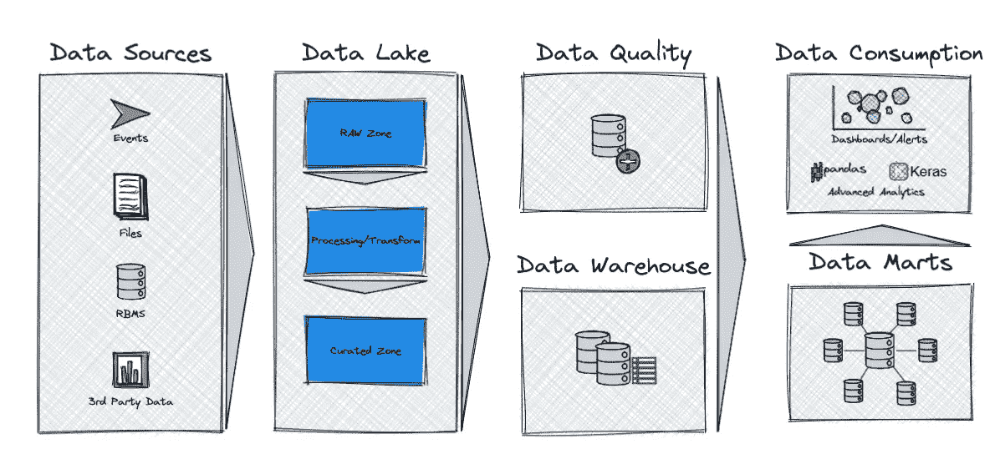
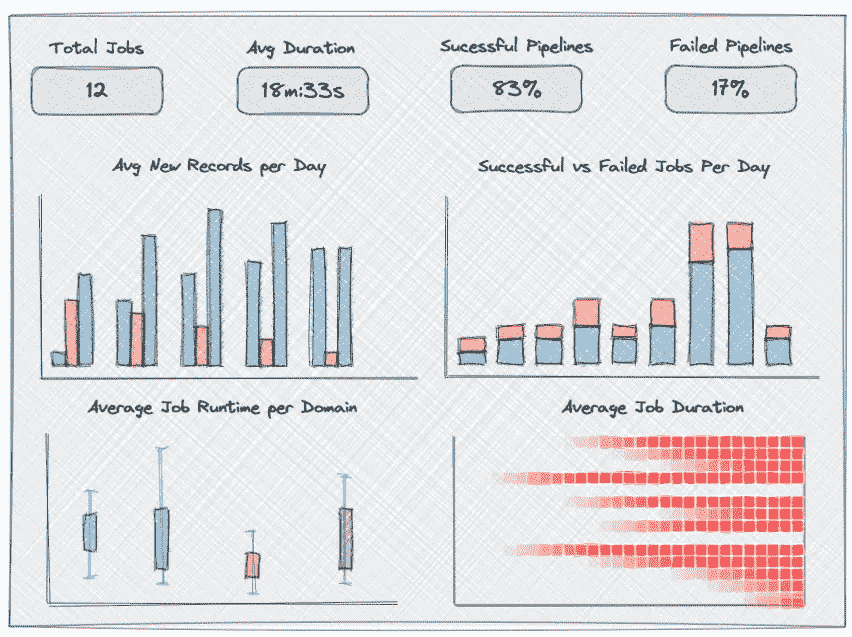
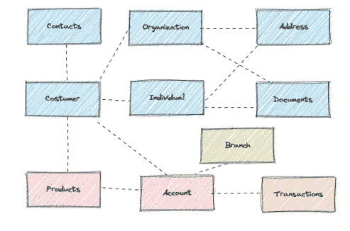
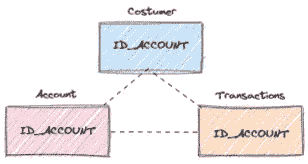
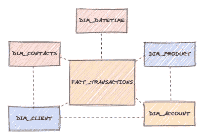
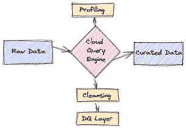
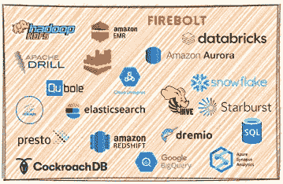

# 构建云数据仓库

> 原文：<https://medium.com/codex/building-a-cloud-data-warehouse-fd2d7899fdfa?source=collection_archive---------3----------------------->


对于数据工程师来说，构建数据仓库是我们所有项目中的常见做法。不幸的是，并不是所有的东西都是独角兽和彩虹，因为在构建几个数据层、ETL 过程、再处理方法和一天结束时的业务需求中涉及到大量的工作。

在本文中，我将借助作为创建数据仓库基础的几个数据层来介绍我过去在构建数据仓库方面的一些经验。尽管如此，我还是会尝试一下**云**来跟上潮流。

# **为什么要利用公共云？**

云数据仓库使用云提供商分配的空间和计算能力来集成和存储用于分析目的(查询和报告)的数据。

*   **可扩展性:**即时放大或缩小。
*   **可用性:**领先云提供商(亚马逊、微软、谷歌)高达 99.99%的正常运行时间。
*   **安全性:**云提供商确保基础设施和数据安全。
*   **性能:**服务于多个地理位置，表现出出色的查询性能(以秒计)。
*   **性价比:**无硬件相关成本。可能只为使用的存储和计算资源付费(尽管对于企业级应用程序，我不推荐这种按需付费的方法)；

# 不同的数据层

在我们讨论数据仓库本身之前，我们需要讨论一下基础。也就是说，支持创建数据仓库的层。



# **数据湖和数据质量层**

借助现有的技术，我们几乎可以接收所有数据类型(结构化、半结构化、非结构化)。利用公共云存储之一(AWS 的 S3、Azure 的 blob 存储等)。)我们可以很容易地将这些信息带入我们的“数据湖”。

这个数据湖可以由几层组成，我定义了两层:**原始区域**和**精选区域**。

我的建议是将这些层分成文件夹和子文件夹，按照来源、年、月、日、小时等将数据分开。

```
├── raw_zone
│├── source1
│  ├── 2021
│     ├── 01
│        ├── 01
│           ├── 08
│              ├── tableA_20210101080000.csv
│           └── 09
│              ├── tableA_2021010109.csv
│              ├── tableB_2021010109.csv
```

接收原始数据的不利之处在于，它可能具有混乱的格式，包含错误的信息，或者只是不同的数据类型。这就是为什么我们需要在这些原始数据中执行一些概要分析、清理和 ETL，这样我们就可以创建一个管理区，利用它来存储所有摄取的数据，这些数据具有正确的质量，并且能够交叉或连接多个数据源，而不会出现不匹配或错误。最后，在相同的存储下(如果我们想的话),它看起来会像这样:

```
├── raw_zone
│├── source1
│  ├── 2021
│     ├── 01
│        ├── 01
│           ├── 08
│              ├── tableA_20210101080000.csv
│           └── 09
│              ├── tableA_2021010109.csv
│              ├── tableB_2021010109.csv
├── curated_zone
│├── source1
│  ├── 2021
│     ├── 01
│        ├── 01
│           ├── 08
│              ├── tableA_cur_20210101080000.csv
│           └── 09
│              ├── tableA_cur_2021010109.csv
│              ├── tableB_cur_2021010109.csv
```

**注意:这些文件夹应该由我们的摄取过程创建。它可以是 ETL，也可以是 PySpark 或其他语言。**

同时，在进行这种清理的同时，我们可以创建数据质量层，这些层可以为仪表板提供信息，从而有效地支持我们的处理和数据纠正流程。



数据管道的数据质量仪表板示例

# 数据模型和数据仓库

为了构建我们的数据仓库，我们需要一个可操作的数据模型作为基础。通常，我们管理的区域有来自一个系统的多种数据——通常可以连接或链接——但是为了简单起见，让我们假设只有一个数据源。



简单操作数据模型

为了维护历史数据或跟踪变更，我们可以利用 CDC(变更数据捕获)或完整快照。

这意味着我们将只接收更新的或插入的记录，如果不可能，我们需要接收整个表。第一种方法也适用于事件驱动的架构，这意味着每个事件都将是我们的数据模型中的一个新行/有效负载，该数据模型可以分成几个记录并分布在几个表中(如果我们决定从半结构化迁移到关系型)。

重新处理信息也是可能的，因为我们将把我们的信息捆绑成“日期快照”。在重新处理一天或几天后，我们将使用更新的信息覆盖特定的加载/参考日期，允许完全替换未处理的数据或纠正未被很好地摄取/导出的数据。

在快速见效的方法中，我们可以利用该模型来提供报告功能，并构建若干运营报告或许多简单指标(例如，账户数量、每个账户的平均交易量、活跃客户数量等)。)但我们的主要目标是实现一个更加非规范化的模型，这将有助于收集见解，并将为业务用户提供访问该模型和进行简单查询的机会(使用自助 BI 工具)。

## 进入非规范化模型

当我们对模型进行反规范化时，它会变得更简单，连接也会变得更灵活，为此我们需要将不同表中的几个列“捆绑”到一个或多个表中，并使信息在几个数据域中保持一致。此外，在我们的列上使用通用术语将有助于交叉过程。

在构建这些术语时，需要记住一些规则:

*   所有日期列都以 DT 开头，所有标识符列都以 ID 开头，等等。
*   跨联接列保持相同的名称:



表之间共享的帐户标识符

*   我们需要跟踪所有的历史变更吗，还是只需要最新的版本？
*   隔离大多数更新的列或属性，并将其排除在我们的维度之外。
*   不要在我们的表格中过多地放置不需要使用的列。

在我们最终的数据仓库模型中，我们将有一些看起来更加简洁的东西，这将允许我们探索信息和一些预定义的指标:



非规范化模型的示例

构建这种模型的主要目标是加速数据的查询和一致性。减少错误数量，使我们能够以更简洁的方式获得数据，并提取一些预先确定的指标或见解，而不会使我们的 BI 工具在数据处理方面过载。

这在本地数据库上是可行的，但要获得适当的性能，我们需要设置分区、索引，并考虑到编写的每一段代码或过程。有了公共云，我们可以利用它的处理能力:执行数据移动、数据分析、表连接、数据清理等。



使用云查询引擎的数据流(云数据仓库)

在我的另一篇[**文章** s](/codex/architecture-for-iot-and-real-time-data-processing-f0a8c7e63c35) 中，我提到了几种可以契合云查询引擎目的的技术。



查询引擎和数据仓库的例子

**尽管如此，在代码开发和查询性能方面保持良好的实践是强制性的，但在处理大量数据时限制较少。**

通过这种方式的数据建模，我们将构建一些星型模式或雪花模型，但也可以使用其他方法，如 data vault、data lake 或 lakehouse，用于更敏捷或快速变化的模型。

我不会详细介绍如何构建这样的模型，但我会为那些更好奇的人留下一些链接:

*   [金博尔方法论](https://towardsdatascience.com/guide-to-data-warehousing-6fdcf30b6fbe#5461)
*   [英蒙方法论](https://towardsdatascience.com/guide-to-data-warehousing-6fdcf30b6fbe#7e71)
*   [数据保险库](https://towardsdatascience.com/guide-to-data-warehousing-6fdcf30b6fbe#9b1c)
*   [数据湖](https://towardsdatascience.com/guide-to-data-warehousing-6fdcf30b6fbe#92fb)
*   [湖畔小屋](https://towardsdatascience.com/guide-to-data-warehousing-6fdcf30b6fbe#016b)

*免责声明:这篇文章反映了我的观点、经历和建筑观点。因此，应该相应地对待，我知道这是一个可以产生多种讨论的主题。*