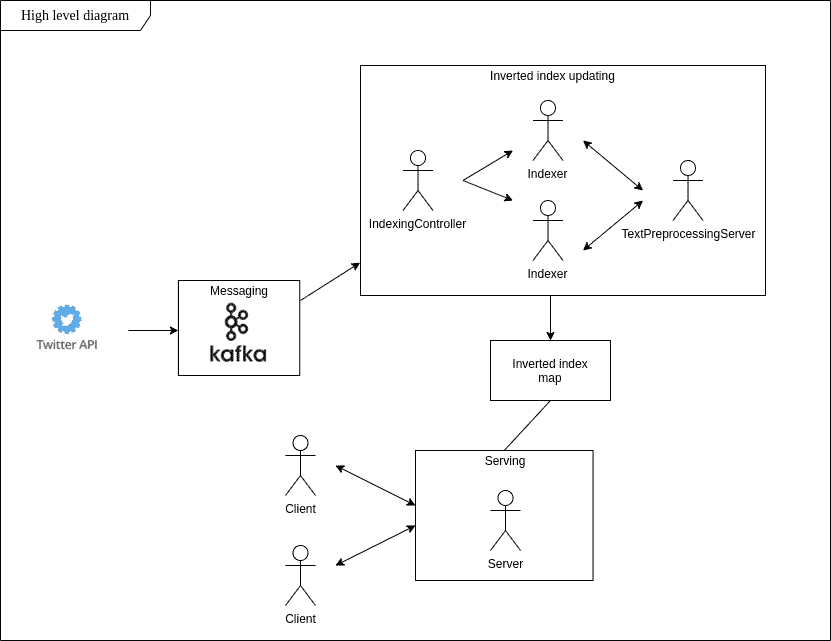

# 构建数据工程项目。第一部分——从想法到设计。

> 原文：<https://medium.com/codex/building-a-data-engineering-project-part-1-from-idea-to-design-67f398148a52?source=collection_archive---------1----------------------->

[图像来源](https://d1m75rqqgidzqn.cloudfront.net/wp-data/2021/05/13160928/iStock-1194430863.jpg)

你有没有问过自己这样一个问题:我该怎么做才能找到一份数据工程的工作？在网上冲浪一段时间后，我们有了我们的首要建议——建立项目。可能你对从哪里开始感到困惑，并问自己这样的问题:我不会再花半年时间来建立一个项目吗？我有能力完成这件事吗？我应该使用什么技术？

我将基于我最近构建的项目，尝试用一系列文章来回答这些问题，那就是 Github 上的[供你免费使用和试验。我希望你会喜欢它！欢迎在评论区问我问题。我们走吧。](https://github.com/cyberpunk317/inverted_index)

# 我们将建造什么

你有没有想过像谷歌或必应这样的搜索引擎是如何工作的？基本上，他们从网页上解析信息，存储并提供服务。但是，当用户搜索“hello world”时，怎么可能存储上亿网页的信息，并在几毫秒内将它们发送出去呢？在继续之前考虑一下。大概就是把单词(键)映射到被认为最适合这个输入的网页(值)。猜一个巨大的哈希表？我建议您点击[此链接](https://developers.google.com/search/docs/basics/how-search-works)了解更多信息。倒排索引是一种数据结构，它允许搜索引擎以惊人的速度响应我们的查询。这样的东西我们怎么自己实现，我们应该用什么作为数据源来构建它，怎么为结果服务？我建议稍微思考一下答案，并阅读设计部分，看看我的建议。

对了！让我们给这个正在兴起的项目增加一点色彩。现在想象一下，我们非常好奇，想知道我们认识的人在 Twitter 上说些什么。巨大的哈希表(我们的查询->人们的推文)？还记得搜索引擎的案例吗？因此，看起来我们将建立一个服务，实时监控 Twitter 上的活动，并允许其用户发现更多关于某些特定人正在说什么的信息。哇，这个听起来比做饭还有点意思，只是倒排索引！

# 设计应用程序

**数据源:**我们的用例是实时事件流，即我们感兴趣的人的推文。Twitter API 是我们的目标，谢天谢地，它允许我们使用一些简单的 Python 对推文进行实时监控。

**数据接收:**由于将数据直接发送到系统中被认为是一种不好的做法，我建议您参考[这篇文章](https://aws.amazon.com/message-queue/benefits/)了解为什么会这样，让我们使用一个消息队列，将我们的流数据源从应用程序中分离出来。在现实世界的项目中，您必须进行大量的研究，以便为队列选择几个备选方案中的最佳方案，比如 RabbitMQ、Redis、Apache Kafka 等等。由于 Apache Kafka 是写作时最受欢迎和记录最完整的工具之一，展示您使用它的技能将会在您的作品集中加分。

**你如何处理原始文本数据？**由于 Python 有一个巨大的文本处理生态系统，我们将使用它的 NLTK 库来清理和标记单词，这些单词将成为倒排索引哈希表中的关键字。对于标记化，我的意思是将单词的字符串表示转换为整数，这将减少潜在的 hashmap 大小问题(字符串比单个整数占用更多的内存空间),并简化与 map 的交互，只要映射 string - > token(一个整数)保持不变。

**构建索引:**让我们选择 Java 作为构建索引的主要工具:它的并发编程支持将为我们提供构建 hashmap(倒排索引)的方法，许多并行工作人员将修改这个 hashmap，使用尽可能多的线程使事情变得更快，只要它不会引入显著的开销，并以客户端-服务器的方式与应用程序用户进行交互。与 Python 一起，这两种语言形成了当今大多数积极使用的数据工程技术中的一道风景。

**最后，用户如何与我们的应用程序互动？**客户机-服务器架构(查看[链接](https://cio-wiki.org/wiki/Client_Server_Architecture#:~:text=Client%20Server%20Architecture%20is%20a,a%20network%20or%20internet%20connection.)了解更多)表示一种设计模式，广泛用于组织服务及其用户之间的网络通信。但是等等，这正是我们的情况！虽然我们的服务知道如何构建地图(query - > tweets)，但它只需要一个额外的实体——服务器——获取构建的地图，并允许用户通过网络发送请求来查询它。

总结上述思想的 UML 图:

应用程序的 UML 图

现在我们可以开始实现我们的应用程序的架构了。借此，我邀请您观看该系列的第二部分。

请使用[这个引用](https://github.com/kirilllzaitsev/inverted_index)到 Github 存储库，用于我们将在这一系列文章中逐步构建的应用程序的最终实现。