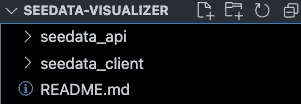
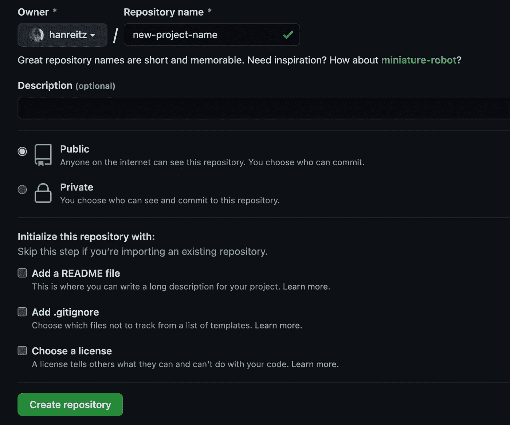
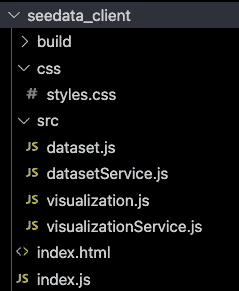
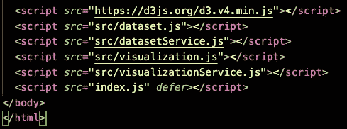
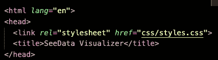
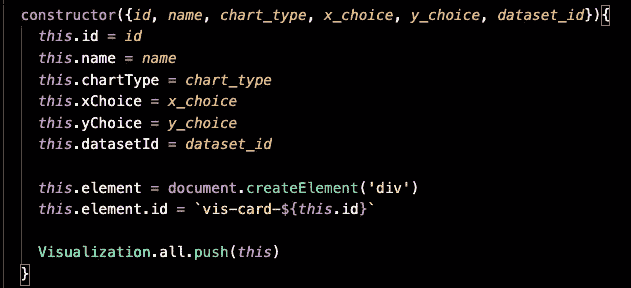

# 用 Rails API 构建 JavaScript 单页面应用程序

> 原文：<https://medium.com/codex/building-a-javascript-single-page-application-with-rails-api-a8e5945128a9?source=collection_archive---------13----------------------->


这是如何利用 monorepo 在后端使用 Rails API 构建 JavaScript 单页面应用程序的概述。在本例中，我主要关注我构建的一个名为 SeeData Visualizer 的小应用程序。

这个应用程序的构建可以大致分为两个部分:Rails API 和 JavaScript 客户端。

# Rails API

要创建 monorepo，从整个项目的单个文件夹开始。按照根据文件夹和文件的内容来命名它们的惯例，我将示例应用程序的 housing 文件夹称为“seedata-visualizer”

在该文件夹中，使用以下命令从终端创建一个新的 Rails API:

```
terminal $ rails new project_name --api
```

Rails 创建完 API 后，在项目中为前端使用的所有 JavaScript、CSS 和 HTML 创建一个名为“projectname_client”的新文件夹。由于我使用了 monorepo，我试图保持命名非常清晰；我把 API 端叫做‘seedata _ API’，所以我把客户端叫做‘seedata _ client’在项目文件夹的最高层，所有应该可见的是这两个文件夹和自述文件。



最高级别的应用程序文件树的屏幕截图，显示了 API 文件夹、客户端文件夹和自述文件。

# 连接到 GitHub &第一次提交

在进行任何其他更改之前，项目的结构应该被初始化为 GitHub 存储库，并链接到一个远程。我更喜欢这样做:在 GitHub 上初始化一个与我的项目同名的存储库，然后将它设置为我的项目的远程源。

在 GitHub 上初始化一个新的存储库。使用不带空格的项目名称作为存储库名称。我避免勾选“初始化此存储库:”部分中的任何复选框，因为自述文件是一个很好的首次提交，我更喜欢以后添加许可证。这是个人喜好问题。



GitHub 上新存储库表单的截图，显示了项目名称和我首选的初始化条件配置(公开，没有添加额外的内容)

创建存储库后，复制其链接。在终端中，访问新项目的 API 文件夹。Rails 在创建 API 时会自动初始化 GitHub 存储库，如果不删除它，会导致提交整个项目的问题。一旦进入 API 文件夹，执行以下命令以删除 GitHub repository Rails 自动初始化:

```
terminal $ rm -rf .git
```

一旦自动生成的 git 文件被删除，返回到终端中的父项目目录并初始化 GitHub 存储库:

```
terminal $ cd ..
terminal $ git init
```

或者，在本地初始化存储库时，可以添加一个分支名称。GitHub 现在原生地将主分支称为“main”，但它过去使用“master”，因此一些编码人员更喜欢将他们的主分支称为 master。要使用分支名称初始化本地存储库，请使用以下命令:

```
terminal $ git init -b branch_name
```

接下来是关键的一步:确保存储库中的某些内容已经被编辑过。为此，我通常使用自述文件。在主目录中，添加一个名为 README.md 的文件，并在该文件中键入一些文本。接下来，准备第一次提交，并通过粘贴 GitHub 存储库链接添加远程:

```
terminal $ git add .
terminal $ git commit -m 'initial commit'
terminal $ git remote add origin <your github repo link>
```

最后要做的事情是将提交推送到远程:

```
terminal $ git push
```

如果第一次推送成功，现在可以从最顶层的目录提交整个项目。如果试图从其中一个子目录提交，GitHub 将显示错误消息，提交将失败。在编写示例应用程序的过程中，我在主文件夹中打开了一个终端窗口来进行提交。

# 完成后端

API 已经设置好了，存储库也链接到了 GitHub。现在应该在构建前端之前添加 API 中数据之间的任何关系。在示例项目中，一个可视化属于一个数据集，而一个数据集有许多可视化。

运行迁移并将任何种子数据添加到数据库:

```
terminal $ rails db:migrate
terminal $ rails db:seed
```

完成后端的最后一步是启用 CORS，跨源资源共享。这使得可以从 API 服务器外部发出获取请求，这是正确运行 JavaScript 前端所必需的。首先，通过在 Gemfile 中取消注释来启用 gem“rack-CORS ”( Rails 自动包含它，但将其注释掉)。

```
# Use Rack CORS for handling Cross-Origin Resource Sharing (CORS), making cross-origin AJAX possiblegem 'rack-cors'
```

最后，在 config 文件夹内的 application.rb 文件中，将以下内容(或者取消注释，如果已经包含)粘贴到' class Application < Rails::Application’ section of the file:

```
config.middleware.insert_before 0, *Rack*::Cors do
  allow do
    origins '*'
    resource '*',
      :headers => :any,
      :methods => [:get, :post, :delete, :put, :patch, :options, :head],
      :max_age => 0
  end
end
```

Nothing should be removed; this code should simply be added into the pre-existing class. This version of the code allows calls from any origin for any resource, so it is not a long-term solution for a hosted application. However, for a test project or practice, this configuration is fine.

# Writing the Client: File Structure

The frontend of the application has a much smaller file tree than the backend. The bare minimum necessary files are index.html and index.js, but if using object-oriented JavaScript, it is recommended to create a source folder containing separate JavaScript files for each class and its AJAX calls.



Example of the frontend file tree showing the source folder, index files, and CSS folder.

In order to include these files in the rendered application, they must be called in index.html. Script files (JavaScript in this case) can be called in the headers of the index file and then run with an event listener for DOM loading, or they can be called at the end of the index file, which will ensure that the DOM content loads before the script files are run. I prefer the latter approach.



The bottom of the example application 标记中，显示为 index.html 调用的脚本。

因为 index.js 包含应用程序中 JavaScript 的全局上下文，所以它是最后加载的。对于更简单的应用程序，将它列在最后可以保持这个顺序。示例应用程序涉及到获取竞争条件，这些条件在外部解决，因此在这种情况下，defer 属性被设置为保存 index.js 直到最后。

对于任何普通 CSS 样式，可以使用相对链接在标题中调用样式表。有些 CSS 库不采用这种技术，所以根据 CSS 的具体实现方式，头文件可能会也可能不会用于调用样式。



显示样式表相对链接的应用程序标题的屏幕截图。

# 客户端-服务器通信

用 API 后端和 JavaScript 前端设置应用程序的目的是利用 fetch AJAX 实用程序在服务器端和客户端之间进行通信。这些通信应该放在像“visualizationService.js”这样的文件中，这是以面向对象的 JavaScript 中它们的类命名的。这与主类文件“visualization.js”不同，后者保存与处理和放置 DOM 元素相关的行为。

一个基本的获取请求包括三个部分:**信息**、**配置**和**请求**本身。在下面的例子中，常量*可视化*是一个包含要发送到服务器的信息的对象， *configObj* 是配置，请求本身是*获取*。

```
createVisualization(){
  const visualization = {
    name: document.getElementById('pass_name').value,
    chart_type: document.getElementById('pass_type').value,
    x_choice: parseInt(document.getElementById('x-data').value),
    y_choice: parseInt(document.getElementById('y-data').value),
    dataset_id: parseInt(document.getElementById('pass_dataset_id').value)
   } const configObj = {
    method: "POST",
    headers: {
     'Content-Type': 'application/json'
    },
    body: JSON.stringify(visualization)
  } fetch(`${*this*.endpoint}/visualizations`, configObj)
  .then(*resp* => *resp*.json())
  .then(*visualization* => {
    const v = **new** Visualization(*visualization*)
    v.addToDom()
  })
}
```

最后一步是根据服务器中的数据向 DOM 添加元素，这些数据是使用 fetch 请求传递给前端的。这通常是分部分进行的，但是最简单的方法在前面的例子中已经说明了:对于从服务器返回的每一段数据，初始化一个正确类的新对象，然后将它添加到 DOM 中。在 visualization 类中，被调用的方法是 constructor 和 addToDom():



应用程序中可视化效果的实际构造函数。

```
addToDom(){
  const renderTarget = *this*.element
  *this*.renderVisualization(*this*.name, 0.35, renderTarget)
}
```

上面的 addToDom()函数是实际函数的简化版本，目的是展示过程的基本要素，而构造函数的截图是实际的构造函数。

# 发布

有了基本的 API 设置、服务器-客户机通信和可以向 DOM 发送数据的工作前端，选择是无穷无尽的。在我的例子中，我使用了一个名为 d3.js 的 JavaScript 库来呈现数据可视化，并弄清楚了如何接受用户上传的 CSV 文件来创建数据集。我编写的站点具有添加数据集、从新的或现有的数据创建可视化以及查看和删除可视化的功能。

使用 Rails 后端提供了可靠而灵活的数据存储解决方案，而前端的 JavaScript 创建了快速且用户友好的体验。这种组合是快速构建功能性应用程序的理想选择。

可视化应用程序中 seed 的 youtube 演练