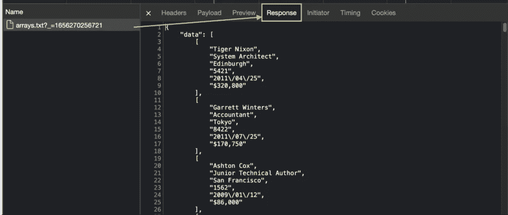

# 在没有无头浏览器的情况下使用 Python 构建一个 JavaScript Table Web Scraper

> 原文：<https://medium.com/codex/building-a-javascript-table-web-scraper-using-python-without-headless-browsers-cafb8f94a4d?source=collection_archive---------11----------------------->

Web 表格是 web 上一些最大的数据源。它们已经有了易于阅读和理解的格式，并用于显示大量有用的信息，如员工数据、统计数据、原始研究模型等。

也就是说，并不是所有的桌子都是一样的，有些用传统技术刮起来会很棘手。

在本教程中，我们将了解 HTML 和 JavaScript 表格之间的区别，为什么后者更难抓取，我们将创建一个脚本来规避呈现表格的挑战，而不使用任何高度复杂的技术。

# 什么是 JavaScript 表？

JavaScript 表也称为动态表或 AJAX 表，是一组行和列，用于直接在网页上以网格格式显示动态数据。

与 HTML 表不同，JS 表中的数据在呈现阶段后被注入到页面中，从而可以根据需要自动生成尽可能多的行和列来容纳数据，根据需要自动填充内容，并对数据使用任何 JavaScript 函数来排序、排名或更改表本身。

# Web 抓取中 HTML 表与 JavaScript 表的比较

在前端，HTML 表和 JavaScript 表看起来一样，都以网格格式显示数据。然而，HTML 表，顾名思义，是直接在 HTML 文件上构建的表，而动态 web 表是由浏览器呈现的——在大多数情况下——通过获取包含信息的 JSON 文件并遵循 JavaScript 上编写的指令将数据注入 HTML。

但这对我们意味着什么呢？只需请求网站的 HTML 文件，然后使用 CSS 类和 id 解析它以获得我们想要的信息，就可以访问 HTML 表。

对于 JavaScript 表，这种方法没有用，因为我们需要的数据不在 HTML 文件中。最多，我们将最终抓取大量的空 HTML 元素。

相反，我们的第一个选择是使用一个无头浏览器，比如 Selenium，来访问和呈现网站。一旦数据被注入到浏览器中，我们现在就可以使用 XPath 和 CSS 选择器来访问它。

尽管 Selenium 是自动化任何类型的浏览器任务(甚至是 web 抓取)的一个很好的工具，但是有一个更简单的选项不需要这样一个过分的解决方案:

# 用请求抓取 Python 中的动态表

是的，我们刚刚说过不能通过请求 HTML 文件来访问 JavaScript 表，但这不是我们要做的。

如果你仔细阅读过，你就会知道动态表需要从某个地方提取数据，所以如果我们可以模仿浏览器在呈现页面时发送的请求，我们就可以访问完全相同的数据，而不需要无头浏览器。

对于本教程，我们将使用 Python 的[请求库](https://www.scraperapi.com/blog/web-scraping-python/)抓取[https://datatables.net/examples/data_sources/ajax.html](https://datatables.net/examples/data_sources/ajax.html)来提取网站上显示的所有员工数据。

**注:**如果这是你第一次用 Python 做网页抓取，我们推荐你看一下我们的[Python 网页抓取初学者教程](https://www.scraperapi.com/blog/web-scraping-python/)。您将学习收集几乎所有您能找到的 HTML 数据所需的所有基础知识。

# 1.寻找隐藏的 API 来访问 JSON 数据

我们已经知道这个页面上的表格是动态生成的。但是，如果我们想要测试它，我们可以首先查看页面的源代码，并从表中查找一些数据。

我们复制了第一个名字，然后按 CTRL + F 来查找元素，但什么也没有。该名称在页面的未呈现版本中不存在。这清楚地表明我们正在处理一个 JavaScript 生成的表。

现在清楚了，让我们打开 Chrome 的 DevTools，进入网络选项卡>获取/XHR。

在这个报告中，我们将能够看到浏览器发送的每个获取请求。要填充它，我们只需要用 open 选项卡重新加载页面。

**注意:**在这个场景中，只有一个文件被获取。在大多数情况下，你的目标网站会发送更多的请求，这使得找到正确的请求变得更加困难。根据经验，您可以使用文件大小作为参考。文件越大，它返回的数据就越多，这很好地表明它包含了我们想要收集的信息。

现在我们已经找到了我们的目标，我们将单击它并转到 Response 选项卡来查看这个请求中有什么。

太棒了，没有 JSON 格式的数据可供使用！要从我们的脚本中访问这个文件，我们需要单击 Headers 选项卡来获取请求的 URL，并将我们的 HTTP 请求发送到所述 URL。

# 2.发送我们的初始 HTTP 请求

向我们的目标 URL 发送请求非常简单，只需将 URL 存储到一个变量中，然后使用 requests.get(url)方法下载文件——这对于这个示例页面来说就足够了。

然而，当处理更复杂的网站时，你需要[添加适当的请求头](https://www.scraperapi.com/blog/headers-and-cookies-for-web-scraping/)以避免被禁止或屏蔽。例如，许多网站使用 [Cookies](https://developer.mozilla.org/en-US/docs/Web/HTTP/Cookies) 来验证向数据源文件发送请求的是人类用户而不是脚本。

好消息是，我们已经在 open Headers 选项卡中获得了我们需要的所有信息。

从这里开始，我们将只选取三个最重要的标题:

*   用户代理
*   甜饼干
*   接受

让我们把所有这些都翻译成 Python:

然后我们可以打印(页面)进行测试，它应该返回一个响应 200 —除此之外，请求失败。

# 3.读取和抓取 JSON 数据

与解析后的 HTML 文件中的元素不同，我们的 JSON 数据由 [JSON 对象](https://www.microfocus.com/documentation/silk-performer/195/en/silkperformer-195-webhelp-en/GUID-6AFC32B4-6D73-4FBA-AD36-E42261E2D77E.html)——每个对象都在花括号{}之间——和对象内的键值对或属性组成——尽管它们也可以是空的。

在这个例子中，我们的 JSON 对象是数据，而每组属性被称为一个 [JSON 数组](https://www.microfocus.com/documentation/silk-performer/195/en/silkperformer-195-webhelp-en/GUID-0847DE13-2A2F-44F2-A6E7-214CD703BF84.html)。从这个意义上说，如果我们的 web scraper 选择 JSON 对象，它将返回一个 JSON 数组列表，而每个数组都有自己的属性列表。

为了询问我们的 JSON 文件，我们将使用 Python 的内置[。json()](https://www.geeksforgeeks.org/response-json-python-requests/#:~:text=json()%20returns%20a%20JSON,it%20returns%20a%20response%20object.) 方法在一个名为 data 的变量内返回我们的 json 对象。

当打印我们的新变量时，它将返回 1，因为只有一个对象被取用。

我们可以使用几种不同的方法来提取 JSON 对象内部的信息。尽管如此，我们还是希望以一种易于将数据导出到 CSV 文件的方式来完成。

首先，我们将每个 JSON 数组视为列表中的一个项，使用它们在索引中的位置来访问它们的内部属性——从零开始。

**注意:**这个逻辑可以选择没有命名的特定键(就像本例中一样)或具有相同名称但不同值的 JSON 对象。

这里有一个直观的例子来说明我们的意思:

在`first_array`中，我们要求存储在数据中的 JSON 文件返回 JSON 对象内索引中的第一个数组。这是它返回的内容:

我们还可以测试是否从 JSON 文件中获取了所有元素，如下所示:

它返回我们想要抓取的行的正确长度:

为了提取数组内部的属性，我们可以遍历每个 JSON 数组，并根据元素在索引中的位置提取元素，如下所示:

您可以随意命名每个属性，但为了清晰起见，我们建议您遵循原始表格中的相同约定。

# 4.将我们的数据导出到 CSV 文件

因为我们的数据已经按照我们的要求格式化了，所以创建 CSV 文件非常简单。发送请求后，我们将创建一个新文件，并添加与数据匹配的标题:

**注意:**不要忘记在你的文件顶部添加导入 csv。没有必要安装 pip。

我们将在 for 循环中使用`.writerow()`方法对抓取到 CSV 中的每个属性进行编码。

最后，我们在循环之外关闭文件，并打印()CSV 文件作为视觉反馈。

# 5.运行我们的脚本[全部代码]

恭喜你，你已经创建了一个简单而强大的动态 web 表刮刀！如果您一直在和我们一起编写代码，那么现在您的代码库应该是这样的:

通过运行我们的脚本，我们能够提取原始 JavaScript 表的所有 57 行，而不需要使用无头浏览器，也不用担心前端显示的分页特性。

这是您应该从脚本中获得的最终文件:

尽管这是一个虚拟的就业数据集，但是您可以很好地修改这个脚本来抓取 web 上几乎任何动态生成的表，以提取真实的就业、足球、天气或统计数据集。

# 总结:使用 ScraperAPI 缩放您的刮刀

使用正确的标题可以为你赢得很多战斗，但是如果你想为商业应用扩展你的项目或者收集大量的数据，这是不够的。在这种情况下，你需要通过创建函数来处理 IP 轮换和验证码，维护昂贵的代理池并重试任何失败的请求，从而更加努力地保护你的网络抓取器。

ScraperAPI 旨在为您处理所有这些复杂性，只需在您的初始请求中添加一个字符串。

为了将我们的 API 集成到您的代码库，首先[创建一个免费的 ScraperAPI 帐户](https://www.scraperapi.com/signup)来生成您的 API 密钥。从您的仪表板上，您可以复制您的密钥并访问完整的 [ScraperAPI 文档](https://www.scraperapi.com/documentation/)。

有了这些新信息，我们将按照以下结构更改我们的原始 URL:

因此，您的最终 URL 看起来会像这样:

通过将我们的请求发送到 ScraperAPI 的服务器，API 将使用其多年的统计分析和机器学习来确定请求成功的最佳报头和 IP 地址组合，重试任何不成功的尝试，处理验证码和被阻止的 IP，并为每个请求轮换您的 IP 以模仿有机用户。

此外，您可以在 URL 字符串中设置 render=true，ScraperAPI 将在返回 HTML 之前对其进行渲染。这对于那些没有 API 端点可以回退的时候非常方便，就像我们在本教程中所做的那样。

如果您对我们今天所做的有任何疑问，请通过我们的网站或 [Twitter](https://twitter.com/scraperapi?lang=en) 联系我们。我们随时准备帮助您找到并收集您需要的东西。

刮的开心！