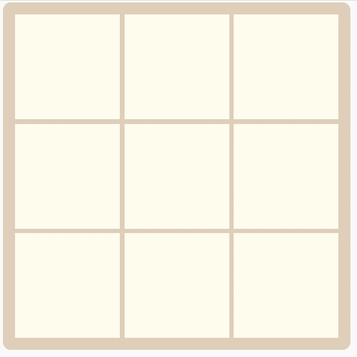
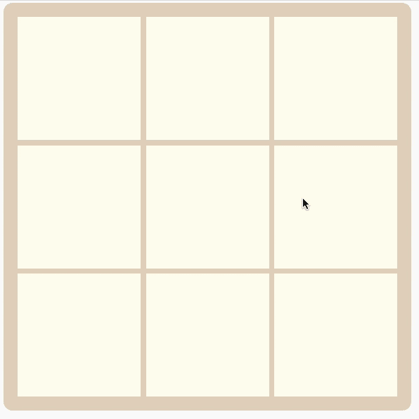

# 用发光元素建立模型

> 原文：<https://medium.com/codex/building-a-modal-with-lit-element-3bab786a5efa?source=collection_archive---------4----------------------->

## 让我们构建一个简单的具有漂亮外观和交互式按钮的模态对话框


由 [Halacious](https://unsplash.com/@halacious?utm_source=medium&utm_medium=referral) 在 [Unsplash](https://unsplash.com?utm_source=medium&utm_medium=referral) 上拍摄

注意:尽管本教程将扩展一个现有的项目，但它将为构建一个独立的模型奠定基础，该模型可以集成到基于 web 组件的应用程序中的任何地方。

在[之前的教程](/codex/building-a-tic-tac-toe-game-with-litelement-73e479f5a66d)中，我们用轻量级 Javascript 库 [Lit 元素](https://lit-element.polymer-project.org/guide)构建了一个井字游戏。现在，屏幕上的游戏有点乏味，而且对组件的美感有一点破坏。在本教程中，我们将添加一个漂亮的模型来显示游戏消息，并可以集成到其他组件和支持 web 组件的页面中。好吧，我们开始吧。

## 组件基础结构和属性

首先，让我们记住一点项目结构。正如您所记得的，有一个包含主`TicTacToe.js`组件源代码的`src`文件夹。组件。在里面，我们还为每个单独的单元定义了另一个组件。现在，在这个文件夹中，我们将生成模态组件。

```
./
├── tic-tac-toe/
│   ├── ...
│   ├── src/
│   │   ├── TicTacToe.js
│   │   ├── TicTacToeCell.js
│   │   └── ModalDialog.js
│   ├── ...
```

在这里，我把我的名字命名为`Modaldialog`，但是你可以随意命名。现在让我们用下面的代码填充这个文件:

您可能会注意到，这个文件的结构与其他组件相似。我们导入了`LitElement`库，以及`html`和`css`函数来定义模板和样式。我们还导入了一个名为`classMap`的函数，它是 litElement 包的一部分。这个函数允许我们将组件的属性映射到 css 类中。

说到属性，这里我们也定义了一些，用来定义我们的模态。首先，`open`属性是一个布尔值，它告诉组件要么显示，要么保持隐藏。然后，`title`和`text`属性将设置在模态中显示的内容。`clickAction`是显示在模态按钮上的文本。这里要注意的最后一件事是`constructor`方法，它用一些初始值初始化类，在这种情况下，当组件在页面中第一次被实例化时，`open`属性将被设置为 false 以隐藏组件。

## 样式和功能

现在，制作一个模型的全部目的就是要有一个好看的组件来显示消息。没有一些样式我们无法完成这个，所以让我们定义它们以及渲染方法和功能。请将这些方法添加到我们的组件类:

我们不会进入 css 的细节，但让我们简单回顾一下最重要的部分。这个`:host`只是为我们的模态定义了一个漂亮的字体。现在我们有了一个`wrapper` div，它将包含所有内容，并将组件置于屏幕中央。这里需要注意的是，这个包装器总是相对于它的父组件的，父组件可以是另一个组件，所以整个模态将相对于它的容器居中。接下来我们有一个`overlay` div，它不包含任何东西，它的唯一目的是在模态的背景上设置一点不透明度，并且当它被点击时禁用模态。最后,`dialog`本身就是模态的，我们为它定义了一个漂亮的样式和按钮的样式。

现在，我们有了为组件定义模板的`render`方法。组件的所有 html 内容都在这里设置。

让我们讨论一下开头提到的`classMap`函数。它接收一个带有键值对的 Javascript 对象，根据真值设置或取消设置类。在这种情况下，它将总是设置类`wrapper`，因为它总是接收这个键的真值，并且`open`类将根据组件的`open`属性设置。简而言之，当`open`属性为真时，该 div 中的类将是`class="wrapper open"`，当属性为假时，该 div 中的类只是`class=`“包装器”。

然后，`close`方法会将`open`属性设置为 false，当您单击覆盖图时，它会被触发的事件调用。它也将在按钮点击事件中被调用，这将由`handleClick`方法管理。这个`handleClick`方法还将向组件的父组件发送一个事件，让它知道按钮刚刚被按下。这将允许我们将模态中的按钮点击与父节点中的一些自定义例程连接起来，在本例中是游戏。

## 与应用程序集成

现在一切都在一起了！让我们将它与完整的应用程序集成在一起。现在，尽管本教程特别关注于上一个教程中构建的井字游戏，但事件触发和监听可以推广到任何其他实现。

现在让我们回到`TicTacToe.js`文件，也就是游戏本身。

首先在文件的顶部，让我们导入`ModalDialog`组件。现在，随着应用程序的定义，我们在构造函数中绑定了所有东西来监听`player-win`和`tie`事件，这些事件是在检查胜利或平局条件时触发的。在事件监听器中，我们简单地定义了一个箭头函数来设置模态组件的所有值，特别是`open`属性将被设置为`true`来显示模态。最后，在游戏的`render`方法中，我们将添加一个带有监听器的`<modal-dialog>` html 元素到它的`button-click`事件中。该事件被绑定到`resetGame`方法，该方法只调用`resetTiles`和`initGame`。这最后一个在之前的教程中被用来初始化游戏的变量和棋盘状态，而`resetTiles`将重置棋盘单元格中的所有符号以不显示任何符号。

# 决赛成绩

最后，这是此模态的两种情况的外观:



表示玩家胜利的模式



表示结的模态

# 结论

我们已经构建了一个与上下文无关的模态对话框组件，因此它可以添加到任何基于 web 组件的应用程序中。这个模式有一个漂亮的样式和可配置的标题和文本显示，以及一个按钮来触发父组件中的事件，以向我们的页面添加功能。

我希望你喜欢这个小教程！