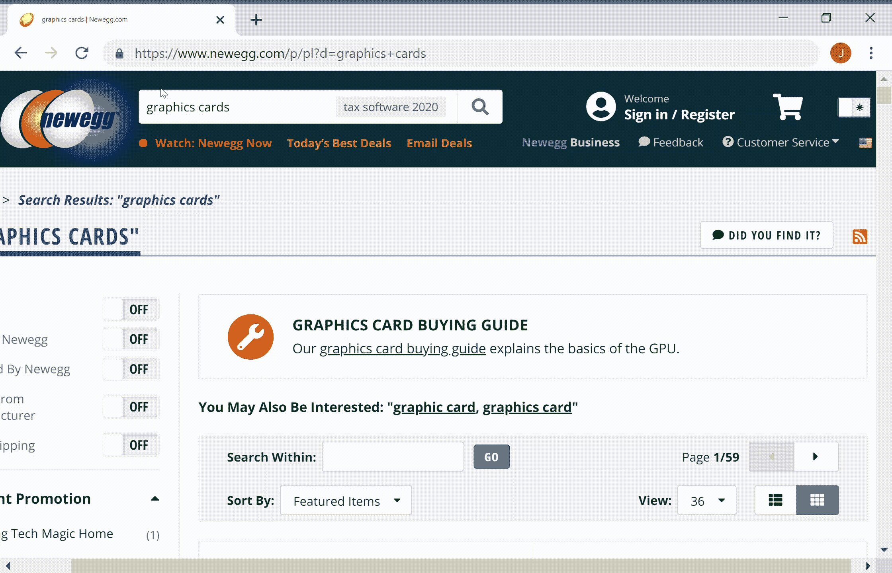

# 构建新蛋网刮刀(第 2 部分)

> 原文：<https://medium.com/codex/building-a-newegg-web-scraper-part-2-90eb8d953bde?source=collection_archive---------8----------------------->

## [法典](http://medium.com/codex)

## 将所有东西整合在一起

由[约书亚·阿拉贡](https://unsplash.com/@goshua13?utm_source=medium&utm_medium=referral)在 [Unsplash](https://unsplash.com?utm_source=medium&utm_medium=referral) 上拍摄的照片

## 添加导入

上面的代码导入了 BeautifulSoup 库、urlopen 函数、Beautiful Soup 函数和 csv 模块。随着我们继续编写代码，您将会看到这些东西是如何使用的。

## 获取 HTML 并执行解析

在 Python 中，可以通过不同的别名导入函数。所以 request(url)和 soup(page_html，' html.parser ')实际上分别是 urlopen(url)和 BeautifulSoup(page_html，' html.parser ')。

在第 3 行到第 5 行，我们打开 URL，获取 HTML，并关闭连接。第 7 行将 URL 中的 HTML 代码转换成一个经过解析的文档。第 8 行调用 find_all()来检索与我们想要抓取的显卡直接关联的 HTML 代码。在这种情况下，find_all()函数通过查找所有具有值为“item-cell”的 class 属性的 div 元素来工作。该函数将返回一个列表，其中包含所有符合属性规范的 div 元素。

作者 GIF

在上面的 GIF 中，你可以看到用 class="item-cell "导航到 div 元素突出显示了整个 MSI 显卡。这就是为什么我们需要找到所有这些特定的 div 元素，因为每个元素都包含一个单独的图形卡。

注意:当光标移动到“查看详细信息”按钮的右侧时，我执行了右键单击并单击了“检查”。录像没有获得那个动作。这就是我如何为网站打开 HTML 源代码的方法。

## 设置要写入的 CSV

在上面的代码中，我们设置了一个 CSV 文件来存储我们收集的数据。writerow()函数将创建包含四列的第一行。这一行将指示每一列中存储了什么信息。在后面的代码中，我们将再次调用 writerow()函数，将抓取的数据连续添加到各个列中。

## 广告检测、数据检索和异常处理

注意:第 1 行的 for 循环将写在“设置要写入的 CSV”一节中的 file_writer.writerow(['Brand '，' Product Name '，' Price '，' Shipping'])行的下面。

第 2 行包含对臭名昭著的广告检测的检查。在新蛋网站上搜索显卡时，你会注意到在所有其他显卡中插入了一个广告。新蛋网站上的图形卡是用一个 div 元素分类的，该元素具有属性:class="item-cell。"然而，该广告也以相同的属性被分类。这意味着第一次调用 find_all()函数会导致广告包含在返回的列表中。因此，我们必须检查不同的指示器(在本例中为“txt-ads-link”)，以确保我们的代码只在图形卡上执行。

第 4 行到第 8 行检索品牌名称和产品名称。

注意:末尾有“tag”的变量(brand_tag，tittle_tag 等)。)存储了包含相关数据(商标名、产品名等)的特定 HTML 标签。).

第 10 到 28 行检索价格和运输信息。

注:10 行占显卡缺货。如果显卡缺货，那么在获取定价和发货信息时，我们必须执行不同的程序。

异常处理是这个 web scraper 代码的关键组成部分。我对它进行了设置，这样如果出现错误，错误名称、错误消息和出现错误的单元(图形卡)将被打印到控制台/终端。web scraper 的代码非常容易出现错误。这是因为网站(尤其是新蛋)在不断更新。以前工作得非常好的代码，一旦引入了最微小的变化(由于没有考虑到变化)，就会遇到障碍。尽管在某些时候会出现错误，但异常处理允许程序处理错误并继续抓取没有潜在问题的显卡。无论是否引发异常，finally 语句都将执行，以确保数据写入 CSV 文件。

照片由[达维德·扎维亚](https://unsplash.com/@davealmine?utm_source=medium&utm_medium=referral)在 [Unsplash](https://unsplash.com?utm_source=medium&utm_medium=referral) 上拍摄

## 最后的想法

我将在我的 GitHub 上修复任何错误并维护/更新 web scraper 代码(将在下面的参考资料中链接到)。每次运行代码时，似乎都有一些新的细微差别被 Newegg 添加到他们的站点中。然而，我会继续努力解决这个过程中反复出现的问题。

## 参考

数据科学道场。(2017 年 1 月 6 日)。介绍用 Python 和漂亮的汤进行网络抓取。【YouTube 视频】。数据科学道场。从[https://www.youtube.com/watch?v=XQgXKtPSzUI&取回 t=205s](https://www.youtube.com/watch?v=XQgXKtPSzUI&t=205s)

我的 [GitHub 回购](https://github.com/wormhole85/newegg-web-scraper)的网页抓取器代码。