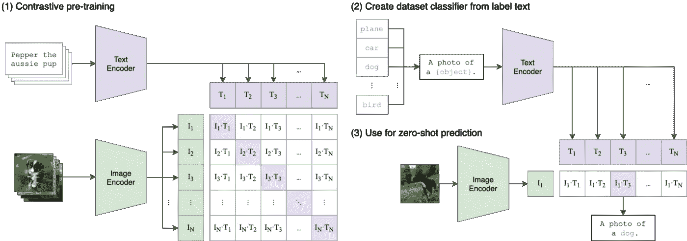
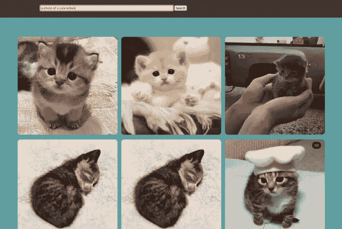
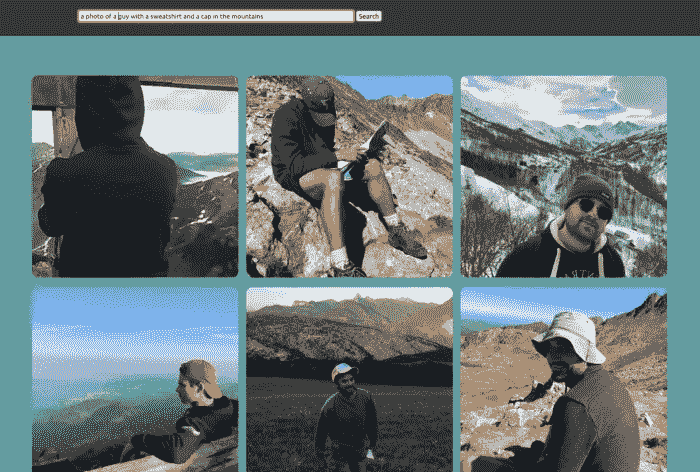
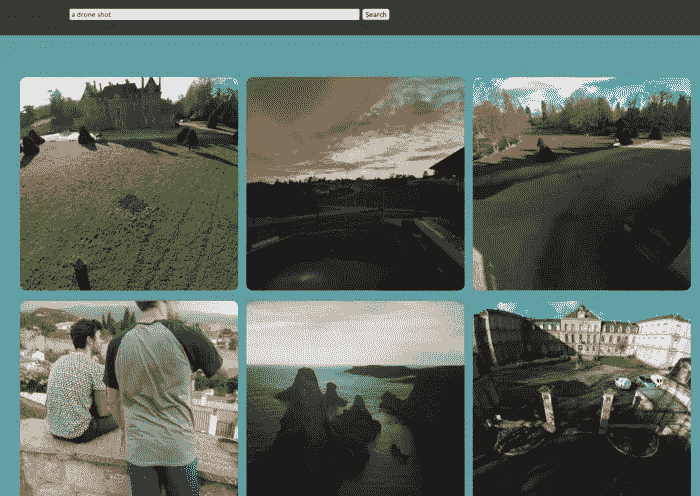

# 使用深度学习为您的图片构建强大的图像搜索引擎

> 原文：<https://medium.com/codex/building-a-powerful-image-search-engine-for-your-pictures-using-deep-learning-16d06df10385?source=collection_archive---------8----------------------->

几天前，我很想回头看看一张我记忆犹新但不知道在哪里能找到的老照片…自从这张照片被拍摄后，我换了两次手机，一次笔记本电脑，我很确定我当时已经通过 Messenger 把它发给了某个人，但是是谁呢？如果能够通过一个简单的描述性查询来搜索我所有的图片，并找到它，那该有多方便啊…

计算机视觉的最新进展提高了图像嵌入(密集矢量表示)的相关性，通过最近的 CLIP 模型，对我的本地图片实现类似 Google 的图像搜索现在变得轻而易举。

无需深究细节(更多信息请参考博文和论文:[https://openai.com/blog/clip/](https://openai.com/blog/clip/))，CLIP 是一个通过自然语言监督来学习图像特征的神经网络。基本上，它使用互联网上带有相关标题的公共图像，用类似 BERT 的语言模型嵌入文本，用视觉转换器嵌入图像。注意，所使用的技术可以应用于其他 NLP 和 CV 模型架构。使用多个图像/文本嵌入对，可以通过批量否定对比训练来微调视觉和文本嵌入模型，类似于在信息检索的 NLP 领域中可以完成的事情。基本上，目标是使图像嵌入对应于(点积)其相关联的文本嵌入，并且不同于其他图像的所有标题(1)。

剪辑训练和推理方案(【https://github.com/openai/CLIP】T2)

CLIP 通常用于“零炮”分类；给定一张图片和标题列表，它推断出图片的最佳标题是什么。在上面的例子(2)中，“一张狗的照片”是图片的最佳说明，相比之下，“一张飞机的照片”，“一张鸟的照片”，“一张汽车的照片”…

我对图像搜索引擎的想法(在这里并不新奇)，是将它翻转过来，而不是根据图像对标题进行分类，而是根据文本查询对图像进行分类。该过程如下:

*   定位给定目录中的所有图像
*   使用预先训练的 CLIP vision transformer 计算每个图像的嵌入，并将它们与图像路径一起存储，以供将来参考。
*   在运行时，使用剪辑文本转换器将用户查询转换为文本嵌入。
*   计算文本嵌入与所有存储的图像嵌入的点积，按照获得的分数对所有图像进行排序，并返回 N 个最高排序图像的路径。

这个过程，以及一些额外的特性，在我的 Github 仓库中实现:[https://github.com/ManuelFay/ImageSearcher](https://github.com/ManuelFay/ImageSearcher)。

 [## GitHub - ManuelFay/ImageSearcher:这个库旨在实现一个图像搜索引擎

### 这个存储库实现了一个基于本地照片的图像搜索引擎，由 CLIP 模型提供支持。从最初的测试来看，它…

github.com](https://github.com/ManuelFay/ImageSearcher) 

在索引阶段，代码使用`os`库查找给定目录和子目录中的所有图片，使用`transformers`和`pickle`库嵌入和存储矢量化表示。在运行时，加载经过酸洗的嵌入内容，与嵌入的查询进行匹配，然后返回排名第二的图像。提供 Flask / Gunicorn API 以能够有效地使用具有外部接口的搜索引擎。还提供了一个用 Vue.js 构建的简单的类似 Google 图片搜索的 web 界面。

# 例子

“一只可爱小猫的照片”。在这里，在我的电脑上出现两次的图像会重复出现。

为了获得大量的图片，我从脸书下载了我的信使档案，获得了我在过去几年中发送和接收的大约 10，000 张图片。

“一张穿着运动衫、戴着帽子的男人在山里的照片”:所有最上面的选项不一定与查询的完全一样，但搜索总体上非常高效。

搜索引擎允许进行非常描述性的查询。排名靠前的图像排在第一位。请注意，这些图片都来自我的大约 10，000 张本地图片，因此选择有限。

元查询也是可能的。这里我们请求无人机拍摄的照片:

“无人机拍摄”:前 6 张照片中的 5 张确实是由无人机拍摄的，而剩下的一张很容易在无人机飞过时拍摄。

这是一个快速的下午项目，但我对剪辑模型的精确度印象深刻。要自己测试，使用来自[https://github.com/ManuelFay/ImageSearcher](https://github.com/ManuelFay/ImageSearcher)的代码。欢迎贡献改进和额外的功能！