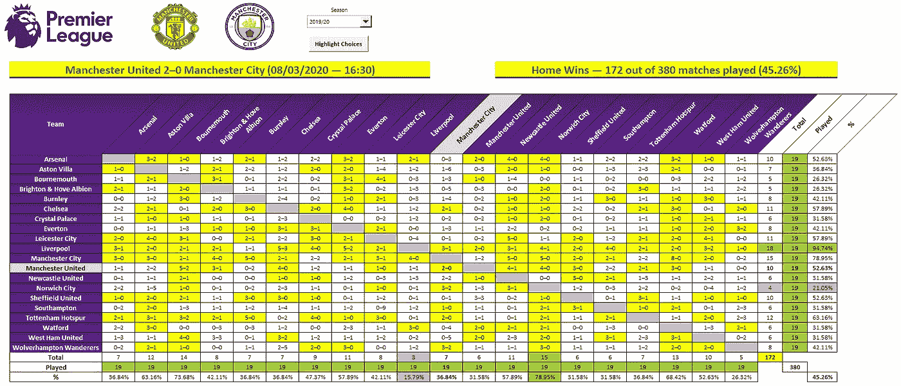

# 在 Excel 中构建英超联赛结果矩阵

> 原文：<https://medium.com/codex/building-a-premier-league-results-matrix-in-excel-b5d3a30a7c1d?source=collection_archive---------4----------------------->

## 显示赛季比赛结果的便捷方式

也许你是个足球迷，也许你不是。另外，新的英超赛季上周末开始了。在空荡荡的体育场和普遍的悲观和沮丧中，你对它的热情不如前几个赛季，这是可以原谅的。然而，我有东西给你…