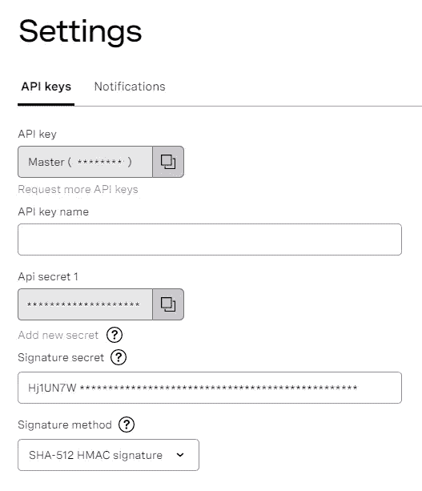
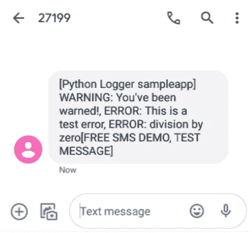

# 构建 Python 错误警报工具

> 原文：<https://medium.com/codex/building-a-python-error-alerting-tool-56f1b0c78b45?source=collection_archive---------16----------------------->

无论我们多么关心质量和测试，软件几乎肯定会在某个时候出错。因此，监控日志以跟踪应用程序的运行状况是必不可少的。

当然，有多种服务和开源项目负责监控应用程序日志。然而，以我的经验来看，它们通常要么价格昂贵、集成耗时，要么充斥着我几乎不会用到的功能。当我部署不需要复杂监控的小型项目时，有时我希望我能有一个本地 Python 解决方案，以便在代码出错时得到简单的警告。

本教程的目的正是为了满足这一需求。我们将构建一个简单灵活的 Python 错误警告工具，可以插入到任何项目中。例如，当出现新的错误或警告时，记录 HTTP 处理程序对象将通过 [Vonage SMS API](https://www.vonage.com/communications-apis/sms/) 向我们的手机异步发送警报。

# 要求

我们将在教程中使用 Python 3.9.1(最新的稳定版本)，但代码应该也可以在 Python 3.6+上工作。Python 可以在 Linux、macOS 和 Windows 上使用。按照[官网](https://www.python.org/downloads/)的说明下载安装。

您还需要一个 Vonage 帐户来通过短信接收错误提示。[如果您还没有注册，请创建一个帐户](https://dashboard.nexmo.com/sign-up)。Vonage 为新用户提供€ 2.00 积分，免费测试 API。

# Vonage API 帐户

要完成本教程，您将需要一个 [Vonage API 帐户](http://developer.nexmo.com/ed?c=blog_text&ct=2021-03-30-building-a-python-error-alerting-tool)。如果您还没有，您可以今天就[注册](http://developer.nexmo.com/ed?c=blog_text&ct=2021-03-30-building-a-python-error-alerting-tool)并开始使用免费信用点数进行构建。一旦你有了一个帐户，你可以在 [Vonage API 仪表板](http://developer.nexmo.com/ed?c=blog_text&ct=2021-03-30-building-a-python-error-alerting-tool)的顶部找到你的 API 密匙和 API 秘密。

Vonage API 密钥和秘密也是必要的；确保在[仪表板设置](https://dashboard.nexmo.com/settings)中抓取它们:

PyPI [http-logging](https://pypi.org/project/http-logging/) 库将用于日志缓存和与 [Vonage API](https://www.vonage.com/communications-apis/sms/) 的异步通信。它防止我们的主要 Python 应用程序被警报机制中断。

# 准备本地环境

## 虚拟和依赖关系

为项目创建一个目录:

创建一个[虚拟环境](https://docs.python.org/3/tutorial/venv.html)通常是一个很好的实践，所以让我们先完成这个:

在 Windows 计算机上，将上面最后一行中的`source`命令替换为:

确保环境按预期运行:

现在让我们创建 Python 依赖文件:

用您喜欢的文本编辑器打开它，并添加以下几行:

使用`pip install`命令关闭文件并安装依赖项:

## 环境变量

我们的自定义日志逻辑将需要一些信息，这些信息将通过环境变量提供。

使用 SMS 服务进行身份验证需要 Vonage API 密钥。发送短信也需要一个电话号码。

`export`命令应该可以在 Linux 和 macOS 上运行。在 Windows 上，使用`set`代替。如果您使用的是 [PowerShell](https://docs.microsoft.com/en-us/powershell/scripting/windows-powershell/starting-windows-powershell?view=powershell-7.1) 控制台，那么这个命令应该可以完成工作:

# HTTP 日志处理程序

如前所述，我们将依靠 [http-logging](https://pypi.org/project/http-logging/) 库将我们的日志连接到 Vonage APIs。

Python 标准库中的本地[日志 HTTP 处理程序](https://docs.python.org/3/library/logging.handlers.html#httphandler)也可以完成这项工作。但是，我们不打算使用它，因为它会生成阻塞的 HTTP 请求，这会对我们的主要 Python 应用程序的执行产生负面影响。

[http-logging](https://pypi.org/project/http-logging/) 库在后台线程中静默运行，并且能够在本地 SQLite 数据库中缓存日志，以减少网络请求的数量。由于这些原因，它将比原生 HTTP 处理程序少得多。

这个库是基于 [Python Logstash Async](https://python-logstash-async.readthedocs.io/en/latest/) 的，但是除了 Logstash 之外，它可以通用于任何后端(在我们的教程中，我们将使用 Vonage)。在[项目文档 wiki](https://github.com/hacktlib/py-async-http-logging/wiki) 中阅读更多相关内容。

# Vonage HTTP 传输

我们首先需要创建一个定制的 HTTP 传输类。这是一个关于如何将日志发送到 Vonage API 的指令。

在深入研究之前，让我们创建一个新的 Python 文件来包含我们的自定义日志记录代码:

现在打开这个文件——是享受 Python 乐趣的时候了！

我们自己的 HTTP 传输类将继承自`[http_logging.AsyncHttpTransport](https://github.com/hacktlib/py-async-http-logging/wiki/3.-HTTP-Transport-Class)`类。首先，在文件顶部导入必要的库，然后声明一个新类，如下所示:

现在，这个类的行为将和原来的完全一样。让我们给它添加一些自定义功能。`AsyncHttpTransport`实现了一个`send`方法，负责将日志发送到远程主机。最初，它使用[请求](https://requests.readthedocs.io/)库来完成这个任务。在我们的例子中，我们有 [Vonage SDK](https://pypi.org/project/vonage/) ，它让我们的生活变得更加轻松，并消除了 HTTP 协议的无聊。

好了，说够了。让我们通过声明一个新的`send`方法，用 [Vonage SDK](https://pypi.org/project/vonage/) 开始编码:

`send`方法接受一个`events`参数；使用`HttpTransport.__batches`方法在一批日志中转换的列表。然后处理批次，将基本数据点提取到测井字符串中。

每个日志字符串只包含日志级别名称(例如“警告”或“错误”)和一条日志消息。SMS 代表短消息服务，所以我们希望我们的提醒消息保持简短。我们的主要目标是通过 SMS 提醒，而不是支持完整的调试。发送最少的信息来提供上下文并帮助开发人员开始调试过程。

然后使用`string.join`方法将日志连接起来，并以日志记录器名称为前缀，以提供关于应用程序上下文的信息(这在多个项目使用这个警告工具的情况下会很有帮助)。

最后，我们从 [Vonage SDK](https://pypi.org/project/vonage/) 实例化了一个`vonage.Sms`客户端，并用它向我们的手机发送 SMS 消息。检查响应状态，如果不是“OK ”,我们将发出`ConnectionError`。引发的这个错误确保稍后重试日志警告机制，并且不会中断我们的主 Python 应用程序，因为`VonageHttpTransport`类将在后台线程中运行。

注意，我们在新的`send`方法中使用了一些类属性:`logger_name`、`vonage_api_key`、`vonage_api_secret`、`alert_phone_number`。让我们重写`__init__`方法，以确保在类实例化时正确设置这些方法:

我们新的 HTTP 传输类现在已经准备好了。但是在我们进入一些真正的日志动作之前，我们首先需要创建逻辑，该逻辑将使用新的`VonageHttpTransport`类实例化一个实际的 [Logger](https://docs.python.org/3/library/logging.html#logging.Logger) 对象。

# Vonage 日志处理程序

`VonageHttpTransport`级看起来不错，但不能自行上阵。我们实际上不能用它来记录我们应用程序中的任何东西，所以让我们更进一步，让它准备好战斗。

我们的难题中缺少的部分是一个实际的 HTTP 处理程序类。这应该是一个`http_logging.AsyncHttpHandler`，但是，肯定是用自定义`VonageHttpTransport`实例化的。

让我们在`logging_vonage.py`中创建一个`getLogger`函数，来模仿 Python 的本机`logging.getLogger`行为:

作为原生 Python 的`getLogger`函数，我们的函数将一个名称字符串作为参数，并返回一个`logging.Logger`类的实例。接下来，我们将一步一步地为这个函数构建功能。

我们从实例化一个`HttpHost`开始。这并不是`VonageHttpTransport`真正需要的，因为我们将 HTTP 请求委托给了 Vonage SDK，但是这是 http-logging library API 签名的必要部分:

接下来我们需要一个`SupportClass`来保存我们的 HTTP 传输对象:

这个`SupportClass`对象然后被用来实例化我们的`AsyncHttpHandler`:

最后，我们实例化一个`logging.Logger`对象，添加`vonage_handler`作为它的处理程序并返回它:

最后，我们的`getLogger`函数应该如下所示:

请注意，API 密钥和密码以及电话号码是从我们在本教程开始时设置的环境变量中检索的。这为我们在多个项目中使用这些代码提供了灵活性，也避免了硬编码 API 秘密，这通常不是一个好主意。；)

# 多个处理程序

Python 的日志机制非常强大，`logging.Logger`对象足够灵活，可以用多个处理程序来扩展它。

如上所述，由于 SMS 系统固有的文本长度限制，`VonageHttpTransport`类将发送最少的日志信息。尽管如此，如果出现需要进一步调试的错误，我们肯定会想要获取整个堆栈跟踪、关于哪一行代码失败的信息、确切的时间戳等。

我们可以通过使用`Logger.addHandler`并向 Vonage `Logger`对象添加一个或多个额外的处理程序来满足详细的日志需求。

例如，不仅要将日志发送到我们的手机，还要发送到控制台，我们可以使用`logging.StreamHandler`，如下所示:

用上述`logger`对象记录的任何东西都将被打印到控制台，并通过 Vonage SMS API 发送到我们的手机。

如果在实现中有意义的话，可以使用`logging.FileHandler`在本地文件系统中存储日志。您也可以再次使用相同的`http_logging.AsyncHttpHandler`，但是在这种情况下，将日志发送到不同于 Vonage API 的后端主机。用一个示例应用程序进行测试好了，是时候看看真实世界中的一些附加功能了。开玩笑，我们正准备用 Vonage SMS API 让我们的手机发出哔哔声。:D

在项目目录中创建一个名为`sample_app`的新文件:

打开它，添加以下内容:

注意，我们正在实例化一个来自我们之前构建的`logging_vonage`模块的`logger`对象。还使用了`logging.StreamHandler()`,以便将完整的轨迹记录到我们的控制台，而不仅仅是发送到我们的手机。

在控制台中，使用以下命令运行此脚本:

以下输出应该打印到控制台:

如果您设置正确(Vonage 帐户和 API 密钥/密码)，您应该会很快收到一条短信，内容如下:

请注意，调试消息`'Debugging...'`没有打印到控制台，也没有连接到 SMS 消息中。这是因为 Python 日志库中的默认日志级别是`WARNING`。认为`DEBUG`电平低于`WARNING`，因此将其丢弃。

如果您想要捕获`DEBUG`消息，请相应地设置级别，如下所示:

再次运行`sample_app.py`脚本，您应该看到调试消息被打印到控制台，并连接到 SMS 消息中。

请注意，尽管我们的`logger`依赖于一个自定义处理程序(`http_logging.AsyncHttpHandler`)和一个自定义传输(`logging_vonage.VonageHttpTransport`)类，但它的行为就像任何其他 Python `Logger`对象一样。这使得它完全兼容，可以作为您当前拥有的任何 Python 项目的替代产品，以防您想要在您的整个堆栈和任何未来项目中集成我们刚刚开发的 SMS 警报机制。

# 包扎

开始了。我们现在有了一个简单的非侵入式 Python 警报工具，可以随时掌握我们部署的应用程序的运行情况。它扩展了基本的 Python `logging`原生特性，使用我们习惯的 API，并且可以在任何执行 Python 应用的地方运行。从财务上来说，它没有固定成本，维护起来相对便宜(仅短信费)。

http-logging 库保存了日志的本地缓存，因此如果 Vonage API 或手机运营商遇到任何停机或网络不稳定，我们的日志程序可以稍后重试发送 SMS 警报。

*最初发布于*[*https://learn . vonage . com/blog/2021/03/30/building-a-python-error-alerting-tool/*](https://learn.vonage.com/blog/2021/03/30/building-a-python-error-alerting-tool/)