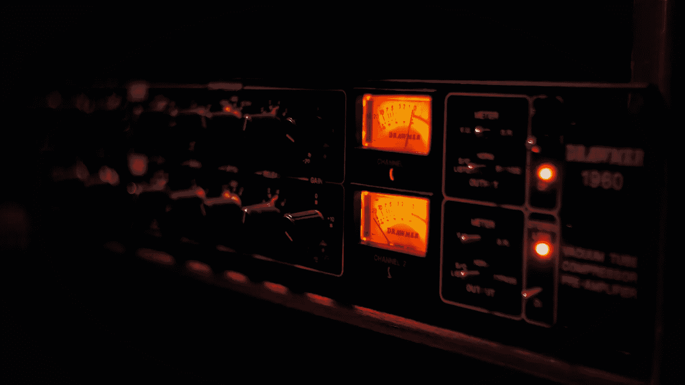

# 构建 Raspberry Pi 音频接收器

> 原文：<https://medium.com/codex/building-a-raspberry-pi-audio-receiver-6e579b7ce003?source=collection_archive---------0----------------------->

在 [Unsplash](https://unsplash.com/@teguhbas?utm_source=unsplash&utm_medium=referral&utm_content=creditCopyText) 上由 [Teguh Baskoro](https://unsplash.com/@teguhbas?utm_source=unsplash&utm_medium=referral&utm_content=creditCopyText) 拍摄的照片

# TL；速度三角形定位法(dead reckoning)

*这篇文章展示了如何使用 Raspberry Pi 构建一个支持蓝牙流媒体、AirPlay、Spotify Connect 和 UPnP 的音频接收器。*

我最近写了另一篇关于这个主题的文章，因为我想看看是否同时有另一个更好的解决方案来构建一个 Raspberry Pi 音频接收器。我的新文章介绍了 HifiBerryOS，这是一个专为……