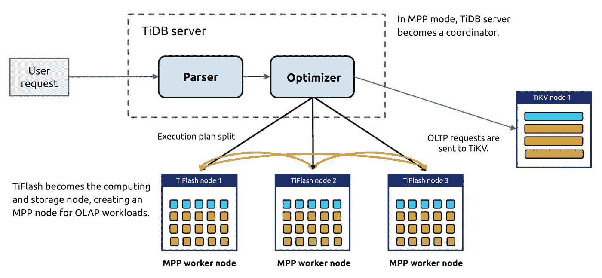

# 用 TiDB 和 Pravega 构建实时数据仓库

> 原文：<https://medium.com/codex/building-a-real-time-data-warehouse-with-tidb-and-pravega-a44fba92b3fa?source=collection_archive---------6----------------------->

*作者:***(平盖数据库架构师)。**

*拥有大量数据的公司依赖数据仓库进行数据处理和分析。要实现业务敏捷性，**离线数据仓库已经不够用了，实时数据仓库正逐渐接管**。目前，实时数据仓库通常使用 Apache Flink 来消费来自 Apache Kafka 的数据，并将数据流式传输到数据库中。然而，由于 Kafka 不在磁盘中保存数据，在极端情况下，数据会丢失。*

*在研究了市场上的数据库和存储系统后，**我们找到了一个更高效、更准确的实时数据仓库解决方案:**[**Pravega**](https://pravega.io/)**+**[**TiDB**](https://pingcap.com/products/tidb)。*

*在本文中，我将介绍分布式流存储系统 Pravega 和分布式 SQL 数据库 TiDB。这种结合解决了 Kafka 的数据持久性困境，并提供了自动伸缩能力，提高了实时数据仓库的并发性、可用性和安全性。我还提供了一个 docker-compose 演示供您尝试 Pravega 和 TiDB。我希望这篇文章对你有所帮助。*

# *Pravega，一个流存储系统*

*由戴尔 EMC 开源的 [Pravega](https://github.com/pravega/pravega) 是一个流存储系统和云本地计算基金会(CNCF)沙盒项目。它类似于 Kafka 和 Apache Pulsar，并提供流和模式注册。但是 Pravega 提供了更多的功能:*

*   *无需应用感知的自动扩展。*
*   *具有基于流的抽象的完整存储接口，支持上层计算引擎的统一访问。*

**

*Pravega 建筑*

*在分布式系统中，客户端应用程序和消息传递系统通常使用消息队列来异步传输消息。说到消息队列，大家都会想到卡夫卡。Kafka 是一个基于 Zookeeper 的分布式日志系统。它支持多个分区、多个副本和多个消费者。*

*相比之下，Pravega 是一个新的流存储系统，旨在解决卡夫卡无法解决的问题。它重构了流存储的架构。作为一个实时流存储解决方案，Pravega 本身支持长期数据保留。Pravega 将数据写入 Hadoop 分布式文件系统(HDFS)或 S3，从而消除了对数据持久性的担忧。此外，Pravega 在整个系统中只存储一份数据副本。*

**

*普拉维加的设计解决了卡夫卡无法解决的问题*

## *为什么普拉维加胜过卡夫卡*

*你可能会想，“既然已经有了卡夫卡，为什么还要重新发明轮子？”我用 Kafka 的时候，被三个问题困扰:数据丢失，数据留存，消费者再平衡。*

*卡夫卡接受的信息比它给出的要多。提交偏移后，存在数据丢失的风险。*

*   *当您设置`acks = all`时，只有当所有消费者确认消息已保存时，才会返回 ACK，因此不会丢失数据。*
*   *当`acks = 1`时，如果领导消费者保存消息，则返回 ACK。如果领导者在备份数据之前关机，数据将会丢失。*
*   *当`acks = 0`出现时，卡夫卡没有等待消费者的认可。当用户关闭时，数据会丢失。*

*Kafka 没有提供简单有效的解决方案来将数据保存到 HDFS 或 S3，因此数据保留成为一个问题。尽管 Confluent 提供了解决方案，但您必须使用两组存储接口来访问不同层的数据。*

*   *使用 Apache Flume 通过卡夫卡-> Flume -> HDFS 访问数据。*
*   *使用 kafka-hadoop-loader 通过 Kafka-> Kafka-Hadoop-loader-> HDFS 访问数据。*
*   *使用 Kafka Connect HDFS 通过 Kafka -> Kafka Connect HDFS -> HDFS 访问数据。*

*消费者再平衡也是有害的。因为队列中添加了新的使用者，所以队列可能会在重新平衡期间停止使用消息。由于提交间隔很长，使用者可能会重复处理数据。无论哪种方式，重新平衡都可能导致消息积压，从而增加延迟。*

*与 Kafka 相比，Pravega 提供了更多功能:*

**

*普拉维加与卡夫卡*

*Pravega 使用 Apache BookKeeper 以低延迟写入并发的实时数据。但是，BookKeeper 只作为批量写入的缓存层。对 Pravega 的所有读取请求都直接发送到 HDFS 或 S3，以利用它们的高吞吐量能力。*

*换句话说，Pravega 不使用 BookKeeper 作为数据缓冲层，而是提供一个基于 HDFS 或 S3 的存储层。该存储层支持对**低延迟尾随读写和高吞吐量追赶读取**的抽象。当数据在簿记员和 HDFS 或 S3 之间移动时，使用簿记员作为单独层的系统可能性能很差。相比之下，Pravega 确保了令人满意的性能。*

## *Pravega 的优势*

*通常，DBA 主要关注三个方面:**数据准确性、系统稳定性和系统可用性。***

*   *数据准确性至关重要。任何数据丢失、损坏或复制都将是一场灾难。*
*   *系统稳定性和可用性将 DBA 从繁琐的维护过程中解放出来，这样他们就可以将时间投入到改进系统上。*

*Pravega 解决了这些 DBA 关心的问题。它的长期保留确保了数据安全，精确一次语义保证了数据准确性，自动扩展使系统维护变得轻而易举。*

# *实时数据仓库体系结构*

*一个实时数据仓库通常有四个组成部分:**数据采集层、数据存储层、实时计算层、实时应用层。**通过将多种技术集成到无缝架构中，我们可以构建可扩展的大数据架构，支持数据分析和挖掘、在线交易以及统一的批处理和流处理。*

**

*实时数据仓库中的四个组件*

*数据存储层有多种选择，但并非所有选择都适合实时数据仓库:*

*   *Hadoop 或传统的 OLAP 数据库无法提供令人满意的实时处理。*
*   *像 HBase 这样的 NoSQL 解决方案可以实时扩展和处理数据，但不能提供分析。*
*   *独立的关系数据库不能向外扩展以容纳海量数据。*

*然而，TiDB 解决了所有这些需求。*

## *分布式 HTAP 数据库 TiDB*

*[TiDB](https://pingcap.com/products/tidb) 是一个开源的分布式 SQL 数据库，支持混合事务和分析处理(HTAP)工作负载。它与 MySQL 兼容，具有水平可伸缩性、强一致性和高可用性。*

***相比其他开源数据库，TiDB 的 HTAP 架构更适合构建实时数据仓库。** TiDB 拥有一个混合存储层，由基于行的存储引擎 TiKV 和列存储引擎 TiFlash 组成。这两个存储引擎使用 TiDB 作为共享 SQL 层。TiDB 回答联机事务处理(OLTP)和联机分析处理(OLAP)查询，并根据执行计划的成本从任一引擎获取数据。*

**

*TiDB HTAP 建筑*

*此外，TiDB 5.0 引入了[大规模并行处理(MPP)架构](https://docs.pingcap.com/tidb/stable/release-5.0.0#mpp-architecture)。在 MPP 模式下，TiFlash 补充了 TiDB 的计算能力。在处理 OLAP 工作负载时，TiDB 成为一个主节点。用户向 TiDB 服务器发送请求，所有 TiDB 服务器执行表连接，并将结果提交给优化器进行决策。优化器评估所有可能的执行计划(基于行、基于列、索引、单服务器引擎和 MPP 引擎)并选择最佳的一个。*

**

*TiDB 的 MPP 模式*

*例如，在销售活动期间，订单处理系统可能会遇到突然的流量高峰。在高峰期，企业需要执行快速分析，以便能够及时对客户行为做出反应。传统的数据仓库很难在短时间内处理海量数据，后续的数据分析处理可能需要很长时间。*

*借助 MPP 计算引擎， **TiDB 可以预测即将到来的流量高峰，并动态扩展集群，为活动提供更多资源。** It 可以在几秒钟内轻松响应聚合和分析请求。*

## *当 TiDB 遇到 Pravega*

*在 Flink 的帮助下，TiDB 与 Pravega 合作建立了一个实时、高吞吐量、稳定的数据仓库。该数据仓库能够满足用户对大数据的各种需求，并一站式处理 OLTP 和 OLAP 工作负载。*

*为了更好地展示 Pravega 和 TiDB 的用法，我们提供了一个基于 docker-compose 的[演示，演示了数据如何从 Pravega 通过 Flink 流向 TiDB。您可以通过 Flink SQL 客户端编写和提交 Flink 作业，并在`<HOST_IP>:8081`观察执行情况。](https://github.com/wangtianyi2004/tidb-pravega-quick-start)*

**原载于 2021 年 8 月 19 日*[*www.pingcap.com*](https://pingcap.com/blog/building-a-real-time-data-warehouse-with-tidb-and-pravega)*