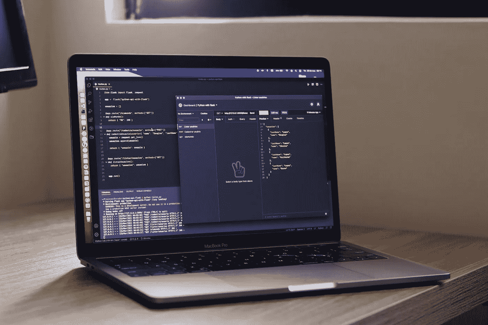
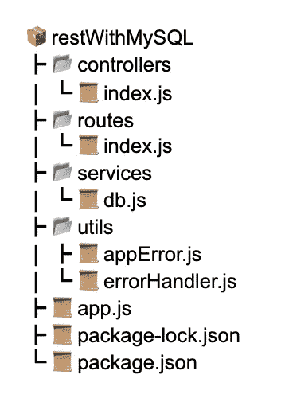
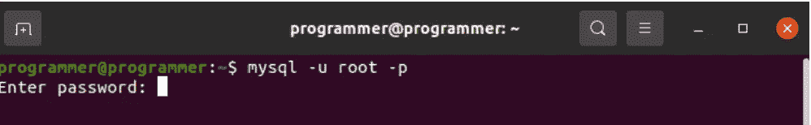
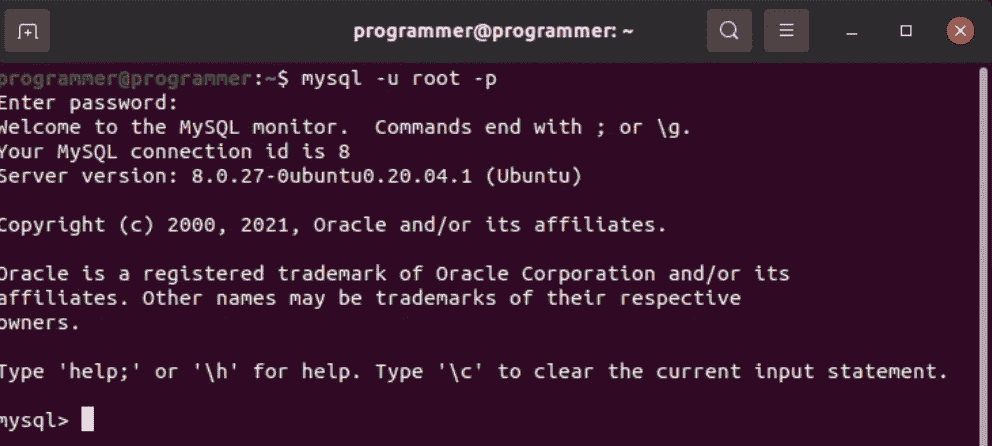
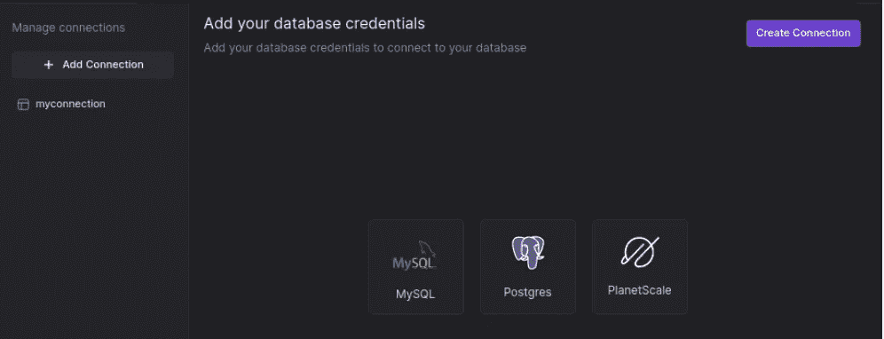
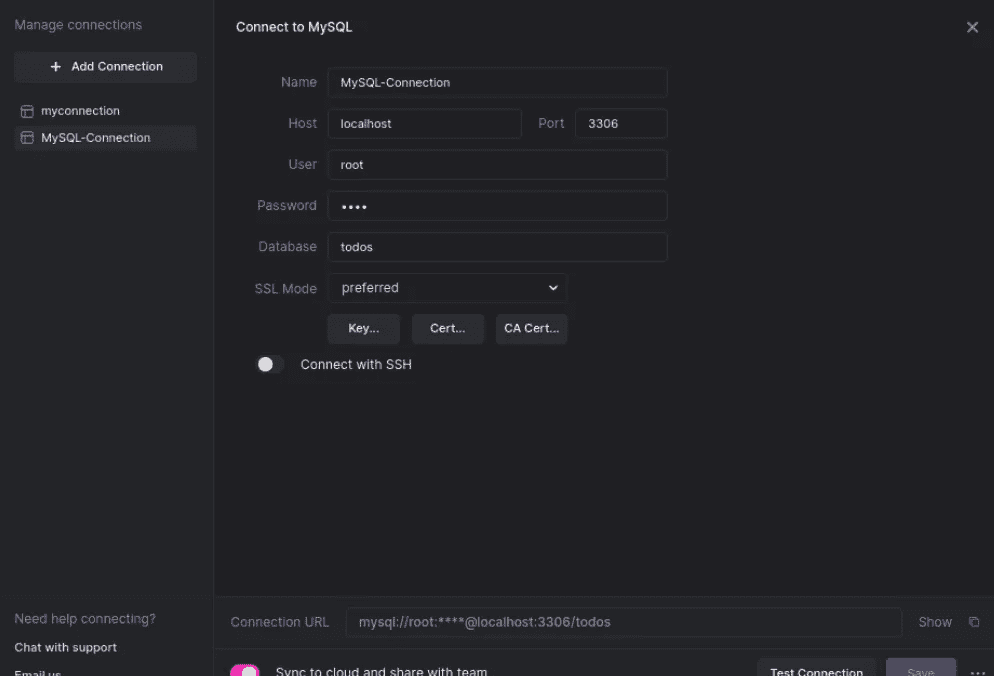
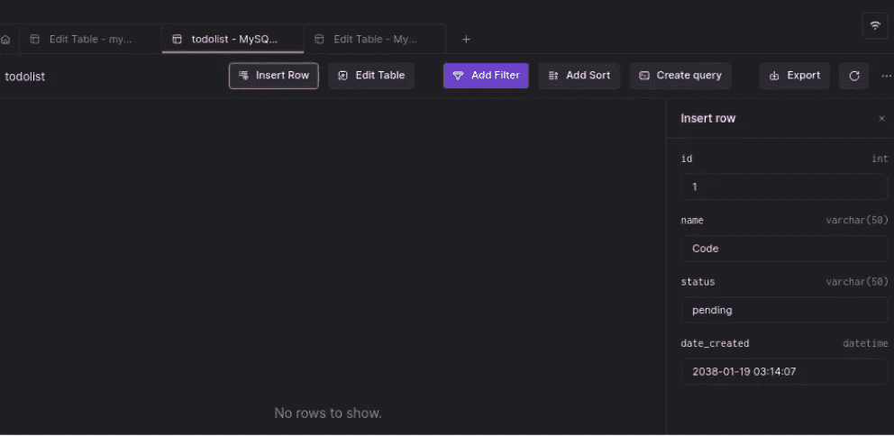

# 用 Node.js、MySQL 和 Express 构建 REST API

> 原文：<https://medium.com/codex/building-a-rest-api-with-node-js-mysql-and-express-d55c090d171e?source=collection_archive---------0----------------------->



Node.js 通常与 MongoDB 等 NoSQL 数据库结合使用，尽管它也可以很好地与 MySQL、PostgreSQL 等关系数据库配合使用。MySQL 已经存在了几十年，是广泛使用的关系数据库管理系统(RDBMS)之一。世界上最开放源代码的数据库是小型和大型应用程序的理想 RDBMS。

本教程将通过创建一个简单的数据库来添加、更新和删除 todos，探索如何用 Express 和 MySQL 构建 REST API。您可以通过克隆这个项目的 [GitHub 库](https://github.com/icode247/Serverside-rendering-FastAPI)来跟进。我们开始吧！

## 先决条件

本教程是一个实践演示。在开始之前，请确保您准备好了以下内容:

1.  [MySQL](https://docs.arctype.com/connect/mysql) 服务器安装在你的电脑上。
2.  [你电脑上安装的 Node.js](https://nodejs.org/en/download/) 。

所有的演示都将使用 Ubuntu 20.04 和 Node 14 LTS。它也适用于其他操作系统和其他版本的 Linux。

# 什么是休息？

REST(表述性状态转移)是一种软件架构风格，开发人员建立这种风格是为了帮助创建和开发万维网的架构。REST 规定了一组标准，这些标准是关于互联网规模的分布式超媒体系统(如 Web)的体系结构应该如何运行的。这是应用程序、服务器和网站传递数据和服务的各种方式之一。它通常为处理数据和服务的开发人员如何通过 API 表示元素提供规则。其他程序可以适当地请求和接收 API 提供的数据和服务。

# 为什么要用 REST？

REST 有几个独特的特征，使其成为软件工程师广泛采用的顶级软件架构风格之一。

1.  **它是轻量级的**:REST API 使用 HTTP 标准。因此，您可以使用 XML、JSON、HTML 和其他数据格式。因此，REST APIs 快速、轻量，是开发移动应用程序、物联网设备和其他应用程序的绝佳选择。
2.  **它是独立的:**REST API 中客户端和服务器的分离使得它是独立的。REST 协议将数据存储和用户界面从服务器中分离出来，使得开发人员可以轻松地协作构建项目。
3.  **可扩展且灵活**:由于客户端和服务器端的分离，REST API 的使用是可扩展且灵活的，允许开发人员集成 REST API，而无需任何额外的工作。
4.  **它是无状态的**:调用是独立进行 REST 的，这些调用的每一个都包含了完成请求的所有数据。
5.  **它有一个统一的接口**，允许应用程序独立发展，而无需将应用程序的服务或模型和动作紧密耦合到 API 层本身。
6.  **这是一个分层架构系统**，它构建了一个层次结构，有助于创建一个更具可伸缩性和模块化的应用程序。

# MySQL 数据库概述

MySQL 是一个开源的关系数据库管理系统(RDBMS)。它是 PHP 使用的最流行的数据库系统。MySQL 是一种完全托管的数据库服务，用于部署云原生应用。集成的高性能查询加速器 HeatWave 将 MySQL 性能提升了 5400 倍。

MySQL 由 Oracle Corporation 开发、发布和支持，具有以下特性。

*   MySQL 数据库中的数据存在于由列和行组成的表中。
*   MySQL 是一个运行在服务器上的数据库系统。
*   MySQL 是小型和大型应用程序的理想选择。
*   MySQL 是一个非常快速、可靠且易于使用的数据库系统。它使用标准的 SQL。
*   MySQL 可以在多种平台上编译。

# 创建 Node.js 应用程序

既然我们已经探索了 REST 是什么，并且对 MySQL 数据库有了一个快速的概述，那么让我们开始创建我们的 RESTFul 应用程序。首先，我们需要用下面的命令为我们的项目创建一个文件夹:

```
mkdir rest-with-mysql && cd rest-with-mysql
```

上面的命令将创建一个 *rest-with-MySQL* 文件夹，并将目录更改为该文件夹。接下来，我们将使用下面的命令初始化一个新的 node.js 项目:

```
npm init -y
```

上面的命令将初始化一个新的 Node.js 项目，跳过所有关于项目细节的提示。该命令还将在我们项目的根目录中创建一个 package.json 文件，该文件将记录关于我们项目的所有重要元数据。您可以通过删除命令中的标志来决定根据提示输入项目详细信息。

接下来，我们将安装项目所需的依赖项。

```
npm install express MySQL cors
```

上面的命令需要一点时间来完成，但是我们会在最后安装 [Express](https://www.npmjs.com/package/express) 、MySQL 和 [Cors](https://www.npmjs.com/package/cors) 。最后，让我们看看我们的项目结构。在本教程结束时，我们的项目结构将如下所示:



# 设置 Express 服务器

现在我们已经安装了我们的依赖项，让我们通过首先设置我们的 express 服务器来让它们工作。

创建一个 *app.js* 文件，并将下面的代码片段添加到其中。我们将导入以下内容:

*   **Express:** 创建我们的服务器。
*   **Cors:** 允许并重定向请求资源。
*   **路由器:**这是我们的 API 路由将在后面的章节中定义的地方。
*   AppError 和 errorHandler: 这些是我们的全局错误处理函数。我们稍后将创建它们。

```
const express = require("express");
const cors = require("cors");
const router = require("./routes");
const AppError = require("./utils/appError");
const errorHandler = require("./utils/errorHandler");
….
```

接下来，我们从 express 创建一个**应用**实例，使用我们应用中的 **express.json()** 中间件来解析 URL 编码的主体。最后，我们让 API 路由器中间件监听对指定 URL 的传入请求。

然后，我们检查端点中丢失的 URL，如果它们被访问，就向用户抛出一个 [404](https://www.ionos.com/digitalguide/websites/website-creation/what-does-the-404-not-found-error-mean/) 错误。全局错误处理程序将处理这个问题(我们将在后续部分中创建它)。

```
app.use(api, router);

app.all("*", (req, res, next) => {
 next(new AppError(`The URL ${req.originalUrl} does not exists`, 404));
});
app.use(errorHandler);
...
```

最后，我们将配置我们的应用程序来监听端口 **3000。**

```
const PORT = 3000;
app.listen(PORT, () => {
 console.log(`server running on port ${PORT}`);
});

module.exports = app;Choosing port 3000 for our listening port.
```

# 设置并连接到 MySQL

现在，我们已经设置好了 Express 服务器。让我们继续设置我们的 MySQL 数据库。首先，我们将使用下面的命令打开我们的 MySQL shell:

```
//On Windows
MySQL

//Ubuntu
mysql -u root -p
```

上述命令将提示您输入 root 密码。



输入密码，然后按 Enter 键继续。如果一切顺利，您应该会在您的终端上看到与下面的屏幕截图类似的输出。



接下来，在 MySQL shell 上执行下面的 SQL 语句，创建我们的 **todos** 数据库。

```
CREATE DATABASE todos
```

然后，执行下面的命令来创建我们的 **todolist** 表。该表将有一个 **id** 、**名称、状态、创建日期**字段。该 id 字段将成为我们的表的主键。

```
CREATE TABLE todolist(id int NOT NULL AUTO_INCREMENT,
name varchar(50) NOT NULL, 
status varchar(50), 
date_created DATETIME DEFAULT CURRENT_TIMESTAMP ON UPDATE CURRENT_TIMESTAMP, 
PRIMARY KEY (id));
```

接下来，在我们的项目根目录下创建 ***服务*** 文件夹。在**服务**文件夹中，创建一个 **db.js** 文件，并将以下代码片段添加到其中。

```
const mysql = require('mysql');
const conn = mysql.createConnection({
 host: "localhost",
 user: "root",
 password: "1234",
 database: "todos",
});

conn.connect();

module.exports = conn;
```

上面的代码将使用 MySQL **createConnection** 方法连接到我们的 MySQL 数据库。createConnection 方法将**主机**、**用户名**、**密码**和**数据库**名称作为必需的参数。

# 创建应用程序控制器

我们已经成功连接了我们的 MySQL 数据库。让我们继续为我们的应用程序创建路由。

在我们的项目根目录下，创建一个 ***控制器*** 文件夹，然后在 ***控制器*** 文件夹下创建一个 **index.js** 文件。

首先，我们将导入全局错误处理程序和 MySQL 数据库连接。

```
const AppError = require("../utils/appError");
const conn = require("../services/db");
```

接下来，我们将创建我们的 **getAllTodos** 处理程序来获取数据库中的所有 Todos。这个处理程序将使用 MySQL 查询方法，该方法将一个 SQL 查询和一个回调函数作为参数。如果在操作过程中出现错误，我们将使用 **AppError** 类将错误返回给用户。然后，当操作成功运行时，我们用一个 **200 状态**代码将数据返回给用户。

```
exports.getAllTodos = (req, res, next) => {
 conn.query("SELECT * FROM todolist", function (err, data, fields) {
   if(err) return next(new AppError(err))
   res.status(200).json({
     status: "success",
     length: data?.length,
     data: data,
   });
 });
};
```

接下来，我们将创建我们的 **createTodo** 处理程序来将新的 Todo 添加到我们的数据库中。然后我们检查客户端是否发送了一个空表单，并返回一个 **404 错误**消息。

然后，我们从请求体中获取 todo 名称，并将创建的每个 todo 的状态默认设置为 **pending** 。使用 query mysql 方法，我们创建一个插入查询，将 todo 添加到我们的数据库中。

```
exports.createTodo = (req, res, next) => {
 if (!req.body) return next(new AppError("No form data found", 404));
 const values = [req.body.name, "pending"];
 conn.query(
   "INSERT INTO todolist (name, status) VALUES(?)",
   [values],
   function (err, data, fields) {
     if (err) return next(new AppError(err, 500));
     res.status(201).json({
       status: "success",
       message: "todo created!",
     });
   }
 );
};
```

接下来，我们创建一个 **getTodo** 处理程序来通过 id 获取我们的 Todo。首先，我们将检查请求参数中是否指定了 id，如果没有找到，则向客户端返回一个错误。

我们将执行一条 SQL 语句来获取其 id 在请求参数上的 todo，并将其返回给客户端。

```
exports.getTodo = (req, res, next) => {
 if (!req.params.id) {
   return next(new AppError("No todo id found", 404));
 }
 conn.query(
   "SELECT * FROM todolist WHERE id = ?",
   [req.params.id],
   function (err, data, fields) {
     if (err) return next(new AppError(err, 500));
     res.status(200).json({
       status: "success",
       length: data?.length,
       data: data,
     });
   }
 );
};
```

接下来，我们将创建我们的 **updateTodo** 处理程序来更新我们的 Todo，这次将修改其 **id** 在要完成的请求参数中的 todo。

```
exports.updateTodo = (req, res, next) => {
 if (!req.params.id) {
   return next(new AppError("No todo id found", 404));
 }
 conn.query(
   "UPDATE todolist SET status='completed' WHERE id=?",
   [req.params.id],
   function (err, data, fields) {
     if (err) return next(new AppError(err, 500));
     res.status(201).json({
       status: "success",
       message: "todo updated!",
     });
   }
 );
};
```

最后，我们将创建一个 **deleteTodo** 处理程序来从我们的数据库中删除一个 Todo。我们将执行一个 delete 语句来删除一个 todo，它的 **id** 是请求参数。

```
exports.deleteTodo = (req, res, next) => {
 if (!req.params.id) {
   return next(new AppError("No todo id found", 404));
 }
 conn.query(
   "DELETE FROM todolist WHERE id=?",
   [req.params.id],
   function (err, fields) {
     if (err) return next(new AppError(err, 500));
     res.status(201).json({
       status: "success",
       message: "todo deleted!",
     });
   }
 );
}
```

# 创建全局错误处理程序

现在，让我们快速创建我们的全局错误处理程序。首先，在我们的项目根目录中创建一个 **utils** 文件夹。然后，创建一个 **appError.js** 和 **errorHandler.js** 文件。将下面的代码片段添加到 **appError.js** 文件中。

```
class AppError extends Error {
 constructor(msg, statusCode) {
   super(msg);

   this.statusCode = statusCode;
   this.error = `${statusCode}`.startsWith('4') ? 'fail' : 'error';
   this.isOperational = true;

   Error.captureStackTrace(this, this.constructor);
 }
}
module.exports = AppError;
```

上面的代码创建了一个 **AppError** 类，它扩展了内置的 **Error** 类。然后我们将把错误**消息**和**状态**传递给错误类构造函数。然后，我们将从状态代码开始检查应用程序中发生了什么类型的错误，并将该错误添加到错误堆栈跟踪中。

接下来，打开 **errorHandler.js** 文件并添加下面的代码片段:

```
module.exports = (err, req, res, next) => {
 err.statusCode = err.statusCode || 500;
 err.status = err.status || "error";
 res.status(err.statusCode).json({
   status: err.status,
   message: err.message,
 });
};
```

上面的代码将检查我们的应用程序中可能存在的错误，并将相应的错误和状态代码发送给客户端，而不会破坏我们的应用程序。

# 创建应用程序路由

在我们的项目根目录中，创建一个 ***routes*** 文件夹，然后创建一个 **index.js** 文件，并将下面的代码片段添加到其中。

```
const express = require("express");
const controllers = require("../controllers");
const router = express.Router();

router.route("/").get(controllers.getAllTodos).post(controllers.createTodo);
router
 .route("/:id")
 .get(controllers.getTodo)
 .put(controllers.updateTodo)
 .delete(controllers.deleteTodo);
module.exports = router;
```

上面的代码从 express router 类创建了一个 **router** 对象。然后，我们在应用程序中创建以下路线。

*   获取路线:获取我们数据库中的所有 todos。
*   发布路线:向我们的数据库添加新的待办事项
*   获取路由:通过 id 获取 todo
*   Put Route:按 id 更新 todo
*   删除路线:按 id 删除待办事项。

然后我们导出路由器对象。

# 使用 Arctype 查看数据

现在我们已经创建了所有的路线。现在，让我们连接到 Arctype 以可视化数据库中的数据。为此，我们需要从官网下载 [Arctype](https://arctype.com/) 。下载并安装 Arctype，然后将数据库连接到它。当您启动 Arctype 时，单击 MySQL 创建一个连接— [如果您需要帮助，请遵循本指南](https://docs.arctype.com/connect/mysql)。



然后，我们将添加我们的连接凭证，并按下**保存**按钮。



我们已经成功连接到我们的数据库。您应该会在 Arctype 仪表盘的右侧看到我们的数据库表。点击 **todolist** 表，对 Arctype 上的数据库进行一些查询。

我们可以通过点击**插入行**选项卡向数据库添加新记录。



我们还可以**编辑**并使用 Arctype 查询我们的数据库表…等等。

# 结论

现在您已经了解了如何使用 Express 框架构建 REST API 安装 Express Node.js 包，创建 MySQL 数据库，并创建一个简单的待办事项应用程序。这就够了！

或许你可以在这里了解更多关于如何使用 MySQL 和 Node.js [的信息。如果您有任何问题，请随时联系 Twitter。](https://arctype.com/mysql/drivers/node-mysql)