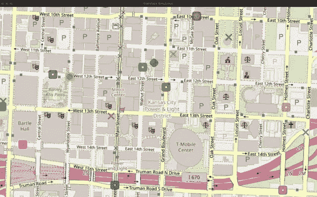
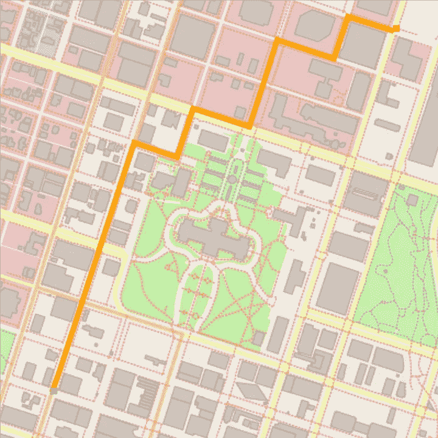
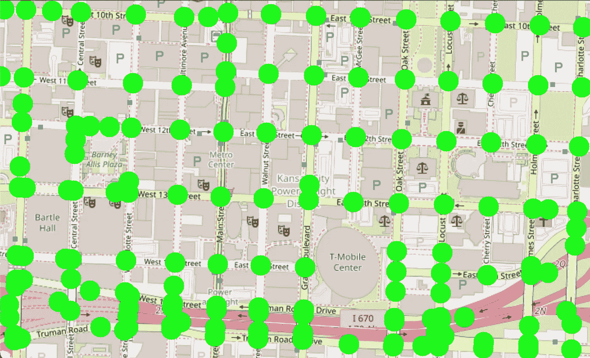
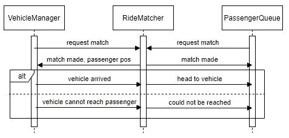
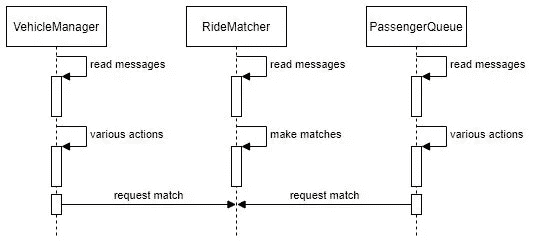
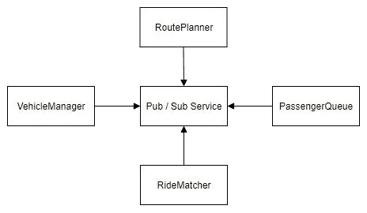
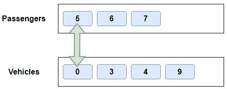
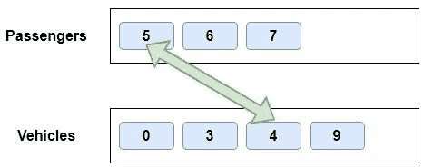

# 用 C++构建一个 Rideshare 模拟器

> 原文：<https://medium.com/codex/building-a-rideshare-simulator-in-c-b6c6eff4b623?source=collection_archive---------5----------------------->

*在 OpenStreetMap 的真实地图数据上接送乘客。这里提到的代码和数据可以在我的* [*Github 资源库*](https://github.com/mvirgo/Rideshare-Simulation) *中找到。*



来自 Rideshare 模拟器的图像，使用堪萨斯市中心作为地图。视频包含在下面。

我最近用 C++编写了一个 rideshare 模拟器，能够接收 OpenStreetMap 数据和相关图像，并显示车辆行驶、搭载乘客以及将他们带到目的地。

我构建了这个项目作为我在 Udacity 的 C++纳米学位(ND)项目的顶点项目。顺便提一下，我在 Udacity 工作，虽然这是一个个人项目，所以我不会深入研究 ND 本身，除非它与给我灵感的项目中的几个早期项目有关。

ND 中的第一个项目是构建一个路线规划器，它在 OpenStreetMap 数据文件上使用 [A* Search](https://en.wikipedia.org/wiki/A*_search_algorithm) ，同时允许用户输入起点和终点，以找到这些点之间的路线。倒数第二个项目是一个并发交通模拟，在使用“街道”和“十字路口”的硬编码地图的同时，让车辆四处行驶，在红灯时停下来(并在绿灯时继续行驶)。你可以在下面看到一个简单的例子。



左边是路线规划器项目输出(同样使用 OpenStreetMap 数据)；右边是并发流量模拟器(使用硬编码地图)。

虽然交通模拟器没有使用真实的地图数据，但尝试像早期项目一样将类似的原则应用到 OpenStreetMap 数据似乎是一种自然的扩展。我决定尝试将交通模拟器中的类似概念推广到我目前居住的密苏里州堪萨斯市中心的 OSM 数据上。



检查我是否能够(大部分)准确地从 KC 地图数据中找到所有的交叉点

在上面的图像中，我使用了交通模拟器使用的相同的“绘制”技术，在我发现不止一条道路(或 OSM 的说法是“路”)共享的节点处放置了一堆绿点，并看到它们非常接近图像排列。所以，我相信我的方法可以构建一个完整的拼车模拟。

# 例子

在我们深入讨论之前，让我们看一下最终输出的例子，这样你就可以知道你是否真的想阅读整篇文章！我首先要注意的是，模拟器的典型设置在任何给定时间最多有 10 个每种类型的“地图对象”——这意味着最多 10 辆车，最多 10 名“乘客”等待乘坐，尽管车上也可能有其他乘客。它还被设置为每 3-5 秒随机添加一名新的等待乘客，直到达到最大值。“卡”在地图上(无法到达的位置)的车辆或乘客最终会被移除-这可能发生在 KC 市区地图上，因为某些高速公路位置无法从市区主干道到达(因为匝道不在有限的地图上)。最后，模拟器目前不关注单向。

在 KC 市中心运行的 rideshare 模拟器，每种对象类型最多 10 个

方形物体是这里的交通工具，上面有钻石乘客，X 标记是他们想要的目的地。目前，当车辆到达离他们位置最近的道路节点时，乘客确实会传送到车辆中，同样，当到达离他们目的地最近的道路节点时，他们也会传送出去——这是我希望在未来的更新中改进的一点。

为了表明模拟器可以推广到其他地图数据，我还包括了下面的视频，以其他类似的设置，显示了法国巴黎凯旋门附近的区域(像硬编码的交通 Sim，但这次是真实的地图数据)。

显示模拟器可以推广到其他地图数据-在这种情况下靠近凯旋门

# 构建流程

在这里，我将描述我构建模拟器功能的一般过程，稍后在某些方面进行扩展。

1.  在看到我可以准确地找到 OpenStreetMap 数据中的所有十字路口后，我下一步决定构建等待乘客的生成。这相当简单，因为“乘客”基本上是当前地图位置和地图目的地，通过向地图模型本身请求地图数据外部坐标内的两个随机位置来确定。我还为每一个添加了一些随机的颜色，这样它们在地图上就可以彼此区分开来。
2.  接下来，我把重点放在添加车辆到地图上，并让它们随机地四处行驶。这直接使用了早期项目中的路线规划器以及每辆车的随机“目的地”。然而，路径规划器生成的路径在地图上有“分离的”节点，它们之间通常有很大的空间。因此，我还添加了一种方法，在每个循环中在道路节点之间递增地行驶，以获得平稳行驶的外观。我将在下面进一步讨论车辆状态。
3.  从那时起，我添加了搭车匹配器，以实际上告诉车辆何时有等待的乘客要接。我稍后还会讨论更多关于如何匹配的内容。
4.  最后一个“主要”步骤是让车辆实际上从其起始位置搭载乘客，并在目的地让他们下车。在这种情况下，当乘客到达离他们的起始位置或目的地位置(不一定在道路上)最近的道路节点时，车辆将分别让乘客上车或下车。

# 项目架构

项目架构利用了并发性，因此图形可以在主线程上绘制，而对车辆和乘客的更新在后台线程中完成。traffic sim 项目让每辆车和交通灯都有自己的线程，但我采用了不同的方法，一个线程用于车辆管理器(有多辆车)，一个线程用于乘车匹配器，一个线程用于乘客队列。虽然路线规划器是由车辆管理器或乘客队列调用的，但它现在并不在自己的线程上。

这种方法的第一次实现相当幼稚，从并发的角度来看并不合适。一个给定的线程，比如车辆管理器，将直接调用搭车匹配器类(由一个共享指针表示)，这个类*将更新搭车匹配器，而它可能正在做别的事情*。这可能会产生所谓的[竞争条件](https://en.wikipedia.org/wiki/Race_condition)，根据事件的顺序，结果可能会有所不同。



最初的“幼稚”方法，在线程之间创造了竞争条件(在某种程度上被屠杀的 UML 中)

解决这个问题的方法是在线程之间传递“消息”。每个周期，一个线程将读取它的新消息，并根据这些消息采取行动。在读取时，消息被一个[互斥锁](https://en.wikipedia.org/wiki/Lock_(computer_science))锁定，因此无法接收新消息(其他线程将等待发送这些消息)。读取后，这是解锁的，所以其他线程现在可以发送进一步的消息，但当前线程不会读取它们，直到下一个周期。



当前架构，在周期开始时读取新的“消息”，并基于这些消息采取行动。发送的消息，像请求一个匹配，被存储(和互斥保护)直到下一个周期。

这甚至可能通过使用类似于[发布者-订阅者架构](https://en.wikipedia.org/wiki/Publish%E2%80%93subscribe_pattern)的东西来进一步改进。车辆管理器和乘客队列目前都需要*包括*乘车匹配器和路线规划器接口，以便能够与它们通信，反之亦然。在这种潜在的架构中，每个人只需要知道要在整个服务上发布或订阅的相关主题，而不需要知道其他类的任何细节(或实际存在的细节)。



一个潜在的进一步改进的架构，其中并发类改为发布或订阅，并且不需要与其他类的任何耦合。

# 匹配车辆和乘客

首先关注其他功能，模拟器中的初始匹配非常简单——匹配器中的第一个乘客 ID 和第一个车辆 ID 被匹配在一起。由于匹配请求被放入有序集合中，一个包含乘客 ID，另一个包含车辆 ID，这就意味着最低的乘客 ID(也意味着等待时间最长的乘客，因为对于每个新的地图对象，ID 都会增加)总是第一个尝试匹配的。然而，这也意味着获得匹配的车辆将是请求匹配的最低 ID，而不管它们是否离等待的乘客最远，例如，车辆 0 将总是优先于车辆 4。



简单匹配—匹配每个 by ID 的第一个(假设之前没有取消匹配)。与较早的 ID 相比，车辆#9 在任何时间点都不太可能被给予匹配。

这实际上工作得很好，但当然不是最佳的。我最终还需要添加一个步骤，以确保跳过之前失败的任何潜在匹配(由于车辆无法联系到乘客)，否则它将基本上保证至少车辆，可能还有乘客，会由于太多的失败而从地图上删除，即使其中一个或另一个实际上没有被卡住。

当前的匹配类型是更符合逻辑的方法——将给定的乘客(仍然是第一个)匹配到离它最近的车辆(使用欧几里德距离)。然而，如果地图上有大量车辆，为了稍微节省时间，它还会将它们与“足够接近”的车辆(如果有的话)进行匹配——当前设置为地图大小的大约 15%。这样，如果模拟器被设置为使用 100 辆车(甚至更多)，它不需要检查所有 100 辆车中最近的一辆，如果任何一辆车在“足够近”的距离内，匹配就成功了。



对于最接近(或“足够接近”)的匹配，最早的乘客仍然首先被匹配，但是 ID 对匹配到他们的车辆没有影响-只有他们在地图上的接近程度。

请注意，如果不同的乘客后来比最初匹配的乘客更靠近车辆，则不会进行任何取消匹配——如果匹配的乘客是可到达的，则车辆将总是去获取他们。

# 车辆状态和处理问题

每辆车在每个循环中如何行动的一个中心思想是基于它的“状态”。我想出了五个，每个都有不同的行为:

1.  *没有乘客请求* —车辆要么刚刚开始行驶，要么刚刚放下一名乘客，尚未请求搭车匹配者给他们分配新的乘客。这将开车到地图上的随机目的地。
2.  *没有乘客排队*——与上面类似，但是现在已经请求匹配，还没有收到匹配。
3.  *乘客排队*——搭车匹配者通知它(或者更确切地说是车辆管理者，它告诉单个车辆)匹配，以及等待的乘客在哪里。它会行驶到离乘客位置最近的节点。
4.  *等待* —目前非常短暂的状态，车辆已经到达乘客位置，正在等待接收乘客。在未来，这可能是乘客在可视化中“走向”车辆的地方。
5.  *驾驶乘客* —车辆搭载了乘客，正行驶到距离目的地最近的道路节点。一旦它们到达，它们将“放下”(即移走)乘客，并转换回第一个状态。

## 驾驶时的问题

实施上述内容后，车辆可能会在四个主要方面遇到问题(此时，崩溃程序，直到这些问题得到解决)。

1.  *车辆未请求匹配，但无法获得初始路径* —这实际上很容易处理，可能意味着车辆“被困”在地图上无法到达大多数道路的位置。通过增加车辆的故障计数器并尝试新的随机目的地来处理。如果失败 10 次或更多，它将被删除。
2.  *车辆已请求匹配，但无法获得路径* —处理方式几乎与上述完全相同，但如果确实发生移除，我们必须通知乘车匹配器，因此它不会再尝试匹配车辆。
3.  *车辆与一名乘客匹配，但无法联系到他们* —这种情况的处理方式与上述类似，尽管必须始终通知搭车匹配者。乘车匹配器将取消匹配，并且还通知乘客失败，以防乘客可能被“卡住”并且需要被移除。实际上，通过让乘客在创建时也检查从他们的位置到他们的目的地的“路径”,这种情况大大减少了——如果没有可行的路径，他们会在请求匹配之前立即从地图上删除。然而，乘客的起始位置和目的地都在 KC 地图中的高速公路上的可能性很小，因此对他们来说，路径是存在的，但车辆无法到达他们。
4.  *车辆可以到达乘客，但不能到达乘客的目的地* —这个问题实际上已经通过上面第 3 条中的检查完全解决了，尽管我最初试图先解决这个问题。这是一个潜在的问题，但在当前代码中是无法解决的。

# 输出信息

模拟器还将一些相关信息输出到控制台，因此您可以更好地了解正在发生的情况。例如，下面是运行早期的一小段输出:

```
Vehicle #3 picked up Passenger #1.Vehicle #1 dropped off Passenger #5.Passenger #6 requesting ride from: 39.0991, -94.579.Vehicle #6 matched to Passenger #6.Vehicle #6 picked up Passenger #6.Passenger #7 requesting ride from: 39.1008, -94.5877.Vehicle #7 matched to Passenger #7.Vehicle #8 picked up Passenger #0.Vehicle #2 dropped off Passenger #4.Vehicle #3 dropped off Passenger #1.
```

也有其他输出，如车辆开始行驶，卡住/无法到达的车辆或乘客被移走，或不匹配(通常是因为车辆无法到达指定的乘客，通常是由于一个或另一个被卡住)，但这些不太常见。

# 可量测性

我在前面的例子中提到过，它们被设置为最多 10 个地图对象，并且每 3-5 秒就可能产生新的等待乘客。这是一种武断的决定，因为更容易实际观察驾驶和接送-它实际上可以处理更多！下面的视频显示它运行良好，最大 100 个对象，新乘客生成时间为 0-1 秒。

最大值为 10 是相当随意的——这里我们有 100 辆车和最多 100 名等待乘客，新的等待乘客有 0-1 秒的生成时间

更难缩放的一点是更大的 OpenStreetMap 区域——您可能已经注意到，市中心的 KC 地图和巴黎地图(稍微大一点)都不一定是很大的区域。虽然我没有检查可以使用多大的区域，但是随着区域变大，开始时加载地图的时间确实会变长-巴黎地图的 OSM 数据有近 163，000 行 XML 数据。

# 未来的改进

目前的模拟器有许多改进的方法，但这里是我最想改进的地方:

1.  改变目前乘客进出车辆的“传送”方式，代之以从他们原来的位置平稳地“行走”到他们的最终目的地。
2.  车辆目前不理会街道的方向。“修复”这可能会导致更多车辆或乘客被“卡住”的情况。
3.  某些路由在交叉路口附近有点挑剔，导致轻微的回溯。路径规划器可能需要一些进一步的改进，以保证节点总是“向前”靠近交叉路口。
4.  围绕潜在供应/需求，使车辆/乘客生成更具活力。这可能导致车辆/乘客离开地图，如果他们必须为匹配等待太长时间，或者如果乘客等待更长时间，将会出现更多的车辆，反之亦然。
5.  允许用户输入来切换匹配的类型，或者甚至给出一个位置并调用 OpenStreetMap API 来使用新的位置。

# 结论

正如开始时提到的，您也可以在我的 [GitHub 库](https://github.com/mvirgo/Rideshare-Simulation)中查看模拟器的相关代码。感谢您阅读本文，希望您觉得有趣！