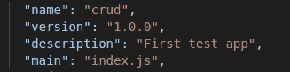
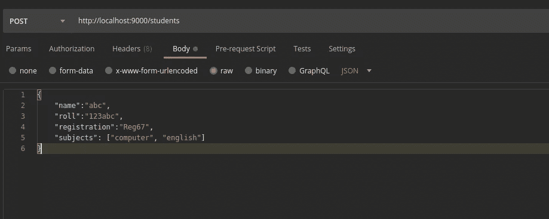

# 用 Node JS、Express JS 和 MongoDB 构建一个简单的 CRUD 应用程序

> 原文：<https://medium.com/codex/building-a-simple-crud-app-with-node-js-express-js-and-mongodb-6e96d13edae7?source=collection_archive---------0----------------------->


目前，大多数网站运行在基于 API 的后端结构上，我们只需通过调用 API 从网站前端发送请求，并获得所需的结果。在本文中，我们将从基础开始，用 Node JS、Express JS 和 MongoDB 的应用程序构建一个简单的 CRUD(创建、读取、更新和删除)应用程序。在我们进入应用程序之前，让我们看看我们将要使用的工具。

## 所需元素

MongoDB :这是最常用的 NoSQL 数据库之一。它不需要任何特定的模式，是一个文档类型的数据库，也就是说，它以键值格式存储数据。可以根据需要的版本从[这里](https://docs.mongodb.com/manual/installation/)安装。随着 MongoDB 的安装，我们还需要安装 Mongo Compass。Mongo Compass 是一个帮助我们可视化 MongoDB 数据库的工具。对于这个应用程序，我们可以将其作为一个集群安装在我们的私有系统上，并将其托管在本地主机上，以便与我们的应用程序进行交互，或者我们也可以使用 [Mongo Atlas](https://www.mongodb.com/cloud/atlas) 。Mongo Atlas 是 MongoDB 的云数据库服务。某些资源是免费的。我们可以在那里创建一个免费的数据库，并从我们的应用程序中访问它。要设置 MongoDB Atlas，请遵循以下步骤:

1.  如果你还没有注册 Mongo Atlas。创建一个新帐户。
2.  点击:创建集群->找到这个演示项目的免费版本->点击创建->保持默认规范->点击创建集群。
3.  现在我们需要添加访问数据库的用户。这类似于创建配置文件来访问资源。进入数据库访问->设置用户名和密码->最后添加用户
4.  我们还需要添加 IP，我们将使用它来访问数据库。转到网络访问->转到添加 IP ->添加当前 IP
5.  我们必须等到 MongoDB 数据库云部署完毕。
6.  部署后，我们需要转到群集->然后单击连接->单击连接到应用程序->然后指定应用程序->我们需要复制 URL。
7.  在 URL 中，我们需要替换用户名和密码，并将其作为常量字符串传递。

**Node JS:** Node JS 是一个开源的服务器环境，在后台使用 Javascript。Node JS 使用事件驱动的异步非阻塞编程方法。这是什么意思？Node JS 实际上运行在单线程上。因此，从技术上讲，它应该能够一次服务一个请求。因此，在这种情况下，当有多个请求时，请求会排队，系统会变慢。对节点 JS 的请求大多是基于 IO 的。这里，Node JS 的非阻塞 IO 理论就发挥作用了。当主节点 JS 线程接收到一个 IO 请求时，它只是将该请求传送给一些工作线程，这些工作线程主要是服务器系统的内核级线程，然后返回去处理另一个用户请求，而不是仅被一个请求阻塞。这就是为什么说节点 JS 有一个非阻塞 IO。现在，您可能想知道，节点 JS 如何处理请求的响应。这就是编程方法的异步特性的来源。Node JS 中的每个 IO 请求都有一个**回调函数**，当响应返回时激活。然后，节点 JS 线程再次以异步方式获取响应。这就是为什么说节点 JS 是异步的。节点 Js 包由 NPM 或节点包管理器安装和管理。节点 JS 可以从[这里](https://nodejs.org/en/download/)安装。也可以使用以下方式进行安装:

```
sudo apt update
sudo apt install nodejs
sudo apt install npm
```

我们可以使用以下方式验证已安装服务的版本:

```
nodejs -v
npm -v
```

Express JS: Express 是一个最小且灵活的 Node.js web 应用程序框架，它为 web 和移动应用程序提供了一组健壮的特性。它充当中间件，支持 HTTP 请求。Express JS 还有助于为应用程序创建路由架构。

现在，我们已经看到了所有需要的元素，让我们继续应用程序。

## **构建应用**

要构建一个应用程序，我们首先需要使用以下命令启动文件夹中的节点数据包管理器:

```
npm init
```

一旦我们启动了包管理器，它就会创建一个 package.json 文件，其中包含以下必填字段和 author 字段。



接下来，我们需要使用 npm install <package_name>为节点 JS 安装所需的依赖项。</package_name>

对于一个简单的 CRUD 应用程序，我们需要一些特定的库。它们是:

1.  **Express:** 我们讨论过，需要 Express JS，所以需要安装。安装: **npm 快速安装**
2.  **Nodemon:** 这个库有助于在我们对源代码做一些修改时自动更新服务器。安装: **npm 安装节点。**
3.  **mongose:**帮助建立连接，查询 MongoDB。安装: **npm 安装猫鼬。**

一旦安装了库依赖项，我们需要再次转到 package.json，并将" **scripts** "字段更改为

```
"start": "nodemon index.js"
```

改变这一点的原因是，实际上我们的整个应用程序是从“index.js”文件启动的。现在，每当我们对源代码进行更改时，我们都希望 Nodemon 以开发模式启动应用程序脚本。

像 Node JS 这样的系统目前是在 MVC(模型视图控制器)架构上运行的。这是一种设计模式。这个想法是，它有助于专注于应用程序的特定部分，并在模块化的基础上构建它。这些组件是:

**模型:**它表示数据库中存储的数据的结构和约束。

**视图:**根据用户的需求，将所需数据呈现给用户的方式。

**控制器:**这个部分控制用户的请求，并生成适当的响应，反馈给用户。

现在，在完成基本结构之后，我们将开始创建所需的文件和文件夹。

所以，我们首先创建一个文件“index.js”，这是我们的启动脚本页面。

在“index.js”文件中，我们包括 express 和 mongoose，并初始化 express 应用程序:

```
const express= require('express');
const mongoose= require('mongoose');const app=express();
```

“require”关键字用于将模块导入我们的程序代码。不过这是旧的格式。在新版本中，我们可以使用“导入”关键字。

接下来，我们需要建立与 MongoDB 服务器的数据库连接。

```
const url= "mongodb://localhost:27017";mongoose.connect(url,{useNewUrlParser: true});
const con= mongoose.connection;
app.use(express.json());
try{
    con.on('open',() => {
        console.log('connected');
    })
}catch(error)
{
    console.log("Error: "+error);
}
```

上面的脚本将帮助我们连接到 MongoDB。如果我们使用 Mongo Atlas，我们只需要将变量“url”替换为如上图所示从 Atlas 中获取的 URL。语句 **app.use()** 让应用程序使用某些特性。这里的元素“express.json”帮助节点应用程序解析 json 数据。为此，我们也可以使用主体解析器库。

现在，我们已经准备好托管应用程序了。

```
const port=9000;
app.listen(port, () =>{
    console.log('Server started');
})
```

我们只需要我们的应用程序监听一个特定的端口。我们在这里选择了端口 9000。

一旦我们成功托管了应用程序，让我们来看看如何定义我们将用于应用程序的数据结构。在这个应用程序中，我们将简单地创建一个学生记录应用程序。

我们创建一个名为“模型”的文件夹。该文件夹保存项目数据库中存储的所有数据的模型结构。我们将使用 NoSQL，但我们仍然需要一个基本的结构来说明应该有哪些字段以及对这些字段的约束。因此，在模型文件夹中，我们创建了一个“studentdata.js”文件。该文件应该包含数据库中学生数据条目的结构。现在，对于每个组件，我们都需要一个模型文件。因为我们只有一个组件，只有学生数据，所以在“Model”文件夹中只有一个文件。那么，我们来看看如何定义模型。

为了构建模型，我们需要使用 Mongoose 库中的模式和模型函数。mongoose.schema()函数帮助定义数据库的模式，mongoose.model()函数帮助转换模式并将其导出为数据模型。

```
const mongoose =require('mongoose');const studentSchema = mongoose.Schema({
    name: {
        type: String,
        required: true,
    },
    roll: {
        type: String,
        required: true,
        unique: true,    
    },
    registration: {
        type: String,
        required: true,
        unique: true,
    },
    subjects: {
        type: [String],
        required: true,
    },
    registered_on: {
        type: Date,
        default: new Date(),
    },})var studentdata=mongoose.model('studentdata',studentSchema);
module.exports= studentdata;
```

上面的代码展示了如何创建一个模式和数据模型。对于每个字段，我们必须定义如下所示的特性。“主题”字段是一个数组，因此表示为一个字符串数组。同样，对于每个字段，我们必须定义变量的类型。声明之后，我们需要导出模型，这样我们就可以使用后端其他部分的功能。因此，我们将模型导出为变量“studentdata”。这里我们使用了" module.exports "命令，但它在 ES6 以后的版本中" export "关键字起作用。

接下来，我们来看两个最重要的部分:路线和控制器。路由是实际创建和托管 API 的部分。通常情况下，我们不需要创建控制器，但这是一个很好的做法，因为有时如果有太多的控制功能，如果我们将它们全部堆叠在路由文件中，管理起来会变得非常困难。因此，我们在控制器部分定义函数，并将它们导入到路由部分，以保持操作处理更加流畅。

那么，让我们看看路由实际上是什么。当用户想要从数据库中查询数据或者想要将数据推入数据库时，类似地删除或更新，前端以 API 调用的形式发出请求。现在，每个问题都有不同的要求。对于查询，我们有 GET 请求，对于发送数据，我们有 POST 请求。这些被称为 HTTP 请求。它们支持客户端和服务器之间的交互，并作为请求-响应协议工作。HTTP 请求包括:

**GET 用于从指定的资源请求数据。**

**POST 用于向服务器发送数据以创建/更新资源。**

**HEAD:与 GET 相同，但是它只传输状态行和头部分。**

PUT:用上传的内容替换目标资源的所有当前表示。

删除:删除 URI 给出的目标资源的所有当前表示。

**连接:建立到由给定 URI 标识的服务器的隧道。**

**补丁:补丁方法将部分修改应用于资源**

现在，要使用这些请求，express js 具有路由功能。**路线定义采用以下结构:**

```
**app.METHOD(PATH, HANDLER)**
```

**其中:**

*   **app 是 express 的一个实例。**
*   **方法是一个 HTTP 请求方法，小写。**
*   **PATH 是服务器上的路径。(网址路径)**
*   **处理程序是路径匹配时执行的功能。(处理函数)**

方法是必需的请求，如果是查询，方法将是 GET 方法，依此类推。该路径是请求 URL。说，我们请求

```
www.abc.com/xyz
```

那么“/xyz”就是路径。处理函数是在请求完成时执行的异步回调函数。那么，让我们看看路由器实际上是如何创建的。

首先，我们创建一个“Routes”文件夹，在其中创建所有路由文件。对于域的每个子部分，我们创建一个单独的文件。例如:

```
[www.abc.com/xyz](http://www.abc.com/xyz)
www.abc.com/pqr
www.abc.com/cde
```

“xyz”、“pqr”、“cde”都是 abc.com 域名的子域名。对于每条路线，我们在 routes 文件夹中创建单独的 js 文件。我们的应用程序非常简单，只有“/students”路径，所以我们的 Routes 文件夹中只有一个 js 文件。

```
const express = require("express");const  student_Act = require("../controllers/students");const router = express.Router();router.get('/', student_Act.getStudents);
router.get('/:roll', student_Act.getspecStudent);
router.post('/', student_Act.createstudent);
router.patch('/:roll', student_Act.updatestudent);
router.delete('/:roll', student_Act.deletestudent);module.exports=router;
```

上面的代码显示了如何创建一个路由器。现在，你可以看到我们使用了“/”作为路径，而不是“/学生”。这是因为当我们将整个东西嵌入到 index.js 文件中时，我们将在路径中使用扩展名“students”。我们已经从控制器文件夹中导入了所有的函数，接下来我们将创建这个文件夹。每个路由都相应地传递了处理函数。现在，在一些地方，我们看到路径是“/:roll”，这是参数传递的方式。在这个项目中，我们使用 roll 字段作为主键来标识每个学生。因此，它在一些路由中作为参数传递，作为标识学生的主键。当我们需要获取特定学生的数据、更新或删除特定学生数据时，已经传递了这些参数。

我们可以将参数传递为:

1.  使用参数字符串形式的参数字符串示例:[www.abc.com/student/23](http://www.abc.com/student/23)其中 23 是参数，我们需要将后端的 URL 构造为:
    app.get('/path/:id ')
2.  使用查询字符串:我们可以以查询字符串的形式传递参数:
    例如:app.get('path ')

一旦我们创建了路由器，我们就将它导出并嵌入到索引 js 文件中。

现在，让我们转到控制器部分，定义要在 Routes 部分使用的函数。

首先，我们创建一个名为“控制器”的文件夹。其中我们用 Routes 文件夹结构相应地定义了 js 文件。在这种情况下，我们相应地在“Routes”文件夹中创建文件“students.js”。

在 js 文件中，我们首先导入依赖项、我们创建的模型、express 路由器和 mongoose。接下来，我们将函数定义如下:

**查询所有学生数据**

```
const getStudents = async (req, res) => {
    try {
        const student= await Student.find();

        res.status(200).json(student);
    } catch(error) {
        res.status(404).json({message: error.message});
    }
}
```

上面的函数用于从数据库中查询所有的学生数据。我们可以使用。来自 mongoose 的 find()函数。我们使用了“async”和“await”关键字，因为数据库查询需要时间，所以需要使用节点 js 的异步属性。现在，我们已经传递给参数“请求”和“响应”。对于从客户端到服务器的每个 HTTP 请求，都会传递这两个参数。

**查询所有学生数据**

```
const getspecStudent = async (req,res) => {
    const roll = req.params.roll;try {
        const stud = await Student.findOne({roll: roll});res.status(200).json(stud);
    } catch(error) {
        res.status(404).json({ message: error.message});
    }
}
```

正如我们所看到的，在第二条语句中，我们已经从 URL 中检索了 roll 参数。我们可以使用 findone()以 roll 作为查询字段来查找特定的学生。

**将学生数据发布到数据库**

```
const createstudent =  async (req, res) => {
    console.log(req.body);
    const newstudent = new Student({
        name:req.body.name,
        roll:req.body.roll,
        registration:req.body.registration,
        subjects:req.body.subjects,
        created_on:req.body.created_on})
    try {
        await newstudent.save();res.status(201).json(newstudent);} catch(error) {
        res.status(400).json({ message : error.message});
    }
```

对于这里的 post 请求，我们已经获得了如下所示的请求体。

类似地，我们还创建了更新和删除功能。在我们创建了所有的函数之后，我们将它们导出，以便在我们的路由文件中导入和使用。

一旦所有东西都创建好了，我们就回到我们的“index.js”文件并在那里嵌入路由，如图所示。

```
const studentrouter= require("./routes/students");
app.use('/students',studentrouter)
```

因此，student.js 文件中的每条路径都可以在“/students”路径中访问。

## 结果呢

一切就绪后，我们可以使用以下工具启动我们的服务器:

```
npm start
```

我们可以使用像邮递员这样的应用程序来可视化结果。



上图显示了我们如何使用 Postman 在[http://localhost:9000/students](http://localhost:9000/students)URL 上创建 POST 查询。主体作为原始 JSON 传递。

## **结论**

这就是我们如何创建一个简单的 CRUD 应用程序。

项目链接可以在[这里](https://github.com/abr-98/CRUD-App-)找到。

希望这有所帮助！！！。