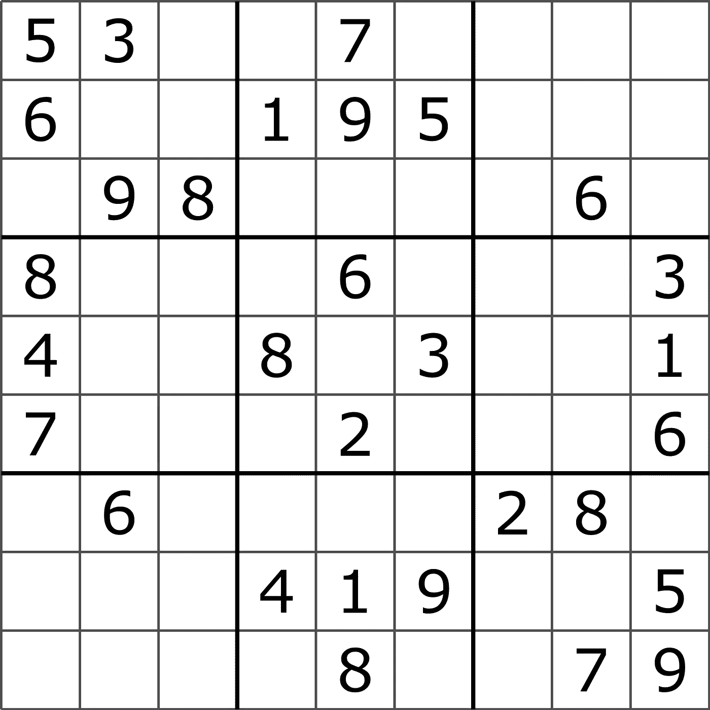
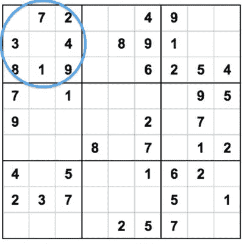
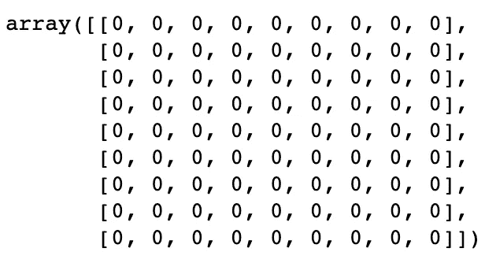
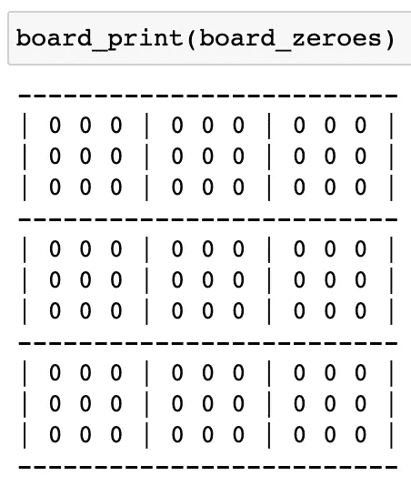
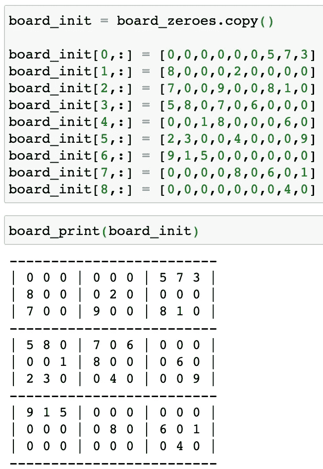
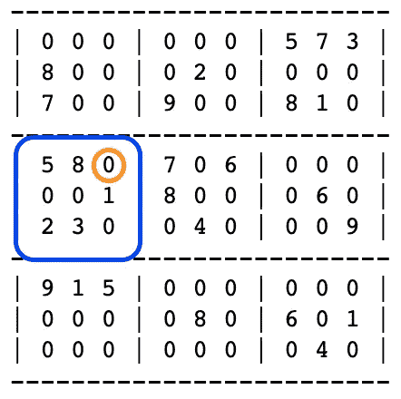
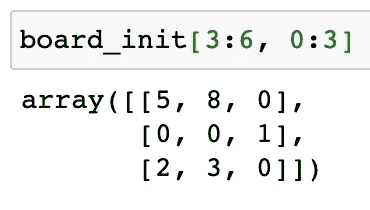
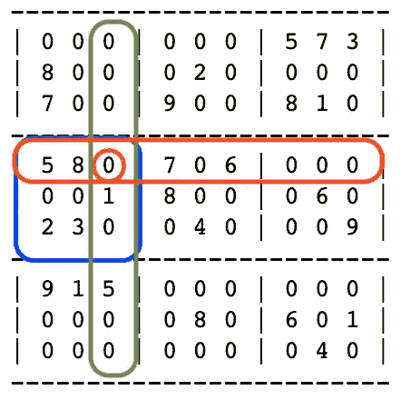
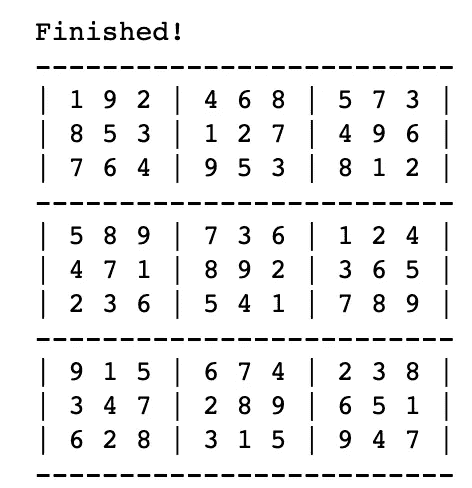

# 用 numPy 在 Python 中构建一个简单的数独求解器

> 原文：<https://medium.com/codex/building-a-simple-sudoku-solver-in-python-with-numpy-1a8ea6f5bff5?source=collection_archive---------1----------------------->

## 让你思考基本算法的 10 分钟项目

一个数独谜题，来源:[维基百科](https://en.wikipedia.org/wiki/Sudoku)

**【如果你只想看最终的算法，我已经在本文末尾链接了我的完整笔记本】。**

数独是一个非常普遍的谜题，它甚至有[自己的世界冠军](http://World_Sudoku_Championship)你相信吗？

这是一个从超级简单到难度令人沮丧的“拔头发”的难题。

对于外行来说，规则如下:

*   您从一个 9x9 的网格(如上)开始，填充一些数字
*   您必须用 1-9 之间的数字填充网格中的所有空白方块

有点棘手的是，必须遵循以下规则:

*   任何行中都不能有重复的数字
*   任何列中都不能有重复的数字
*   在任何 3x3 子网格中，数字都不能重复*

a*子网格是 9 个不重叠的 3x3 网格之一，如下所示，由较粗的黑线分隔。

一个“子网格”，来源:[sudoku.com](https://sudoku.com/how-to-play/sudoku-rules-for-complete-beginners/)

所以到最后，你将得到一个 9x9 的网格，其中从 1 到 9 的所有数字重复**正好** 9 次:每行 1 个，每列 1 个，每个子网格 1 个。

这个谜题的美妙之处在于，假设它已经被[恰当地设计](https://puzzling.stackexchange.com/questions/2/what-is-the-maximum-number-of-solutions-a-sudoku-puzzle-can-have)，那么只有一个解决方案，并且这个解决方案可以不需要任何猜测而仅仅通过逻辑来实现。

# 自动化的机会

罗伯特·威德曼在 [Unsplash](https://unsplash.com?utm_source=medium&utm_medium=referral) 上拍摄的照片

如果这是一个仅用逻辑就能解决的问题，那么我们没有理由不能使用编程来获得解谜的乐趣！

我们需要什么？

*   将数独棋盘表示为矩阵的一种方式(用数字的行和列来表示的奇特方式)
*   一种检查每个空单元格可能接受的数字的方法
*   当只有一个可能的数字时填充单元格的一种方式

我们开始吧！

我们首先制作一个由 0 组成的 9x9 网格(其中 0 代表一个空单元格)。

让我们快速看一下输出。

作者图片

它有点像是在工作，但它可以更整洁——能够看到 3x3 的子网格将非常有帮助。

我们为什么不创建一个函数来使黑板看起来更好一点呢？

现在让我们来看看这个新函数。

作者图片

可能有一些库可以让它看起来更好，但是现在这样就可以了。

## 设置初始电路板

我在这里使用了一个随机的拼图作为例子，但是你可以随意使用你自己的拼图——或者一个更有创造性的方法来设置初始的板。

作者图片

现在开始有趣的部分！

## 逻辑

当解决任何涉及逻辑的问题时，在编写任何代码之前，在纸上写下你要做的事情会有所帮助。

在这种情况下，我们希望:

1.  从左上角开始遍历每个空单元格(0)
2.  将该单元格的可能值设置为从 1 到 9 的数字列表，即第一次检查时的
3.  **检查同一行中的所有数字，从可能匹配的值列表中删除所有数字**
4.  **对同一列中的数字执行上述操作**
5.  **对同一子网格中的数字执行上述操作**
6.  **对剩余的空单元格重复步骤 1-5**
7.  **如果棋盘被解决(没有剩余的 0)，则完成，否则重复步骤 1-6**，不包括**步骤 2**

**检查矩阵中的行和列的数字很简单，但是检查子网格中的数字需要更多的思考。**

## **子网格**

**我们需要能够选取任何一个细胞，并计算出它位于哪个子网格中。**

**例如，第 4 行第 3 列的单元格位于从左上角向下的第二个子网格中。**

****

**作者图片**

**我们可以将一个子网格表示为一个 3x3 的矩阵，矩阵中包含的数字。**

**为了得到一个单元格所在的 3×3 矩阵，我们需要能够将该单元格的行和列位置向上舍入到 3 的下一个最大倍数。**

**在上例中，行位置(4)的下一个最大倍数 3 是 **6** ，列位置(3)的下一个最大倍数 3 是 **3** 。**

**然后我们可以简单地取这些末端位置，并从每个位置减去 3，得到子网格的起始位置。**

**例如，上面的子网格可以用 board_init[3:6，0:3]表示，记住 Python 从 0 开始索引(计数)。**

****

**作者图片**

**让我们来做一个函数，它可以向上舍入到 3 的下一个最大倍数。**

**让我们来看看行索引-3(同样，行位置 4 在 Python 中表示 3 的行索引**并看看它会做什么:****

*   **取指数+ 1 (4)**
*   **除以 3 (1.333…)**
*   **使用`ceil` (2)将其向上舍入为最接近的整数**
*   **把它乘以 3 (6)**

## **独特的价值观**

**现在，我们可以进入逻辑的核心了——获取与给定单元格共享的行、列和子单元格中的唯一值的列表。**

**不要担心它会在这里拾取 0，因为我们会在后面的步骤中处理它们。**

**对于我们之前的例子，我们预计是这样的:**

****

**作者图片**

**独特的价值观:**

*   **第 5、6、7、8 排**
*   **列:1，5**
*   **子单元:1，2，3，5，8**
*   ****总体:** 1，2，3，5，6，7，8**

**对于这个单元格，我们希望将`4,9`存储为唯一可能的值，因为它们是从 1 到 9 中唯一没有出现在我们的行/列/子单元格唯一列表中的数字。**

**如果我们发现一个单元格只有**个**可能值，我们希望将该值写入该单元格。**

# **付诸行动**

**最难的部分已经过去了，现在来试运行一下吧！**

**我将省去中间的打印输出，但这是最终输出的样子。**

****

**作者图片**

**这就是我们的，一个简单的数独解算器。**

****如果你想看到上面所有代码的完整笔记本，这里有******。******

****感谢阅读！****