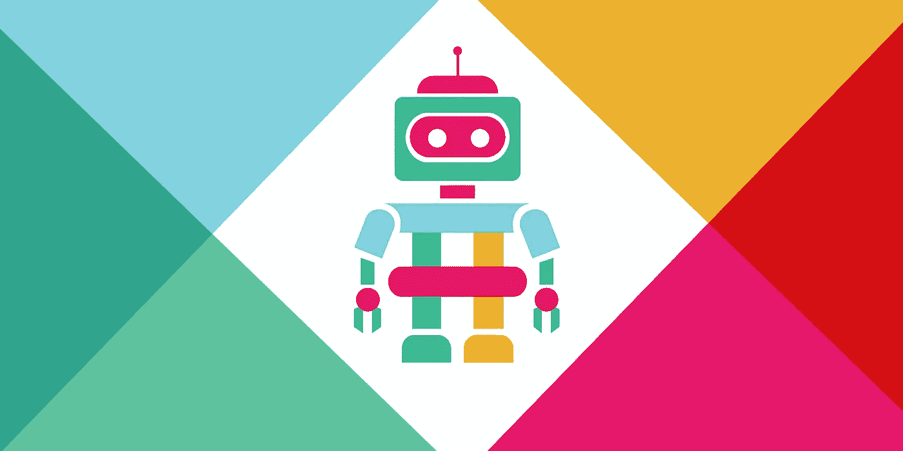
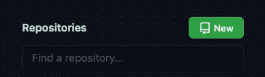

# 使用 Node.js 构建 Slack Bot(第 1 部分)

> 原文：<https://medium.com/codex/building-a-slack-bot-using-node-js-part-1-7b3e7d54e9b6?source=collection_archive---------1----------------------->



我最近使用 Node.js、Express、PostgreSQL 和 Sequelize 构建了一个 slack bot。我花了很多时间来学习使用这些技术和玩 slack api。学习使用所有这些技术的过程是乏味的(尽管是有教育意义的)，所以我决定写这一系列的博客文章，这样你就可以开始运行，同时避免花时间研究。

要构建一个 slack bot，您需要以下东西:

1.  [安装在计算机上的节点和 NPM](https://docs.npmjs.com/downloading-and-installing-node-js-and-npm)。
2.  安装在您的计算机上的 ngrok(这允许您将发生在您的 slack 工作空间上的事件转发到本地主机服务器进行开发)
3.  (可选)在您的计算机上安装 PostgreSQL(实际上，我们要到第 2 部分才会谈到这一点)。

好吧！我们开始吧！

本指南的前几个步骤将介绍如何设置初始文件结构和依赖关系。如果您不在乎，只想让自己开始运行，只需派生并克隆[这个 GitHub repo](https://github.com/andy-aguilar/Slackbot-Boilerplate) 并跳过步骤 1-4。

如果您想从头开始构建项目，请按照下列步骤操作:

## 步骤 0:检查您的授权

首先确保您有权在工作空间中创建应用程序。转到[此链接](https://api.slack.com/apps/)，点击`Create New App.`点击`from scratch`选项，将会打开一个模式，其中包含您的应用名称输入和选择工作区下拉列表。点击`Select a Workspace`,确保在列表中看到你想要添加应用的工作区。如果您没有看到它，请向您的工作区管理员请求访问权限，或者创建一个新的工作区，您可以在其中构建/测试 bot(将 bot 从一个工作区移动到另一个工作区很容易)。

给你的应用起一个名字，选择工作区，点击`Create App.`保持这个标签打开或者加书签(我们在第 6 步需要它)。

## 步骤 1:创建项目文件夹

打开你的终端，导航到你想要保存这个项目的文件夹，使用`mkdir`为这个项目创建一个新文件夹。打开您在首选代码编辑器中创建的文件夹。然后运行`npm init`来初始化一个 npm 项目。这个命令将允许您设置这个项目的属性，包括它的名称、版本、描述等。您可以将这些值设置为您想要的任何值，但是我喜欢将入口点设置为 app.js(默认为 index.js)。您随时可以在以后更改这些值。

## 步骤 2:创建一些文件

创建以下文件:

```
app.js
.env
.gitignore
README.md
```

打开。gitignore 文件并添加以下代码(以及这个项目中您不想添加到 github 的任何内容):

```
/*.env
/node_modules
.DS_Store
```

## 步骤 3(可选):为这个项目设置 GitHub 存储库

从终端运行以下命令:

```
git init
git add .
git commit -m “First commit”
```

前往 GitHub.com 并登录您的帐户。在屏幕左侧，您应该会看到这个绿色图标:



单击它创建一个新的存储库。给它一个名称和描述，然后在下一个屏幕上单击`Create Repository.`，将代码复制到`...or push an existing repository from the command line .`下，它应该看起来像这样:

```
git remote add origin git@github.com:your-github-username/repo-name.git
git branch -M main
git push -u origin main
```

## 步骤 4:设置依赖关系

从您的终端运行`npm install.`,然后运行以下命令:

```
npm install express --save
npm install dotenv
npm install @slack/events-api
npm install @slack/web-api
npm install --save-dev nodemon
```

打开 package.json 文件，将以下内容添加到`"scripts"`部分:

```
"start": "node app.js",
"dev": "nodemon app.js"
```

这将允许您在运行`npm start`时运行`app.js`，并允许您在运行`npm run dev`时使用 nodemon(它会在您将更改保存到项目中的文件时重启服务器)。

## 步骤 5:设置你的 app.js 文件

打开 app.js 文件并添加以下代码:

```
require('dotenv').config({path: __dirname + '/.env'})
const express = require("express")
const app = express()
const PORT = process.env.PORT || 3000//YOUR CODE HEREapp.listen(PORT, () => {
    console.log(`App listening at [http://localhost:${PORT}`)](http://localhost:${PORT}`))
})
```

这将设置一个运行在 localhost:3000 上的 express 服务器(除非您在。env 文件，我将在以后的文章中讨论它)。

要测试一切是否正常，运行`npm start`，您应该会看到类似这样的内容:

```
> your-app-name@your-app-version start
> node app.jsApp listening at [http://localhost:3000](http://localhost:3000)
```

用 ctrl-c 关闭服务器，然后运行`npm run dev`，您应该会看到:

```
> your-app-name@1.0.0 dev
> nodemon app.js[nodemon] 2.0.9
[nodemon] to restart at any time, enter `rs`
[nodemon] watching path(s): *.*
[nodemon] watching extensions: js,mjs,json
[nodemon] starting `node app.js`
App listening at [http://localhost:3000](http://localhost:3000)
```

一旦你有这两个工作，让我们把这个东西连接到 slack。

## 第六步:设置你的 slack 应用程序

打开您在步骤 0 中保存的选项卡/链接。在页面左侧的`Features`菜单下，点击`OAuth & Permissions.`，在这里你可以为你的机器人设置权限。对于添加哪些权限，一个好的规则是检查这些方法，决定您想要使用哪些方法，并点击它们以查看它们需要哪些权限。现在，让我们只添加一个:

在`Bot Token Scopes`下点击`Add an OAuth Scope`并添加`chat:write.`这将允许你的机器人发送消息。点击页面顶部附近的`Install to Workspace`，然后点击`Allow`安装应用程序。

## 步骤 7:保存您的令牌和签名机密

在浏览器左侧的`Settings`部分，点击`Basic Information`向下滚动，直到你看到`Signing Secret`点击`Show`显示秘密，然后将其复制到你的剪贴板。

进入你的项目文件夹，打开`.env`文件。在文件中添加:

```
SIGNING_SECRET=paste-your-signing-secret-here
```

再次点击`OAuth & Permissions`并复制`Bot User Auth Token.`保存到您的。环境文件为

```
BOT_TOKEN=paste-your-OAuth-Bot-Token-Here
```

## 步骤 8:将你的快速应用程序连接到你的 Slack 应用程序

在`app.js:`的`//YOUR CODE HERE`部分添加以下代码

```
const token = process.env.BOT_TOKEN
const eventsApi = require('@slack/events-api')
const slackEvents = eventsApi.createEventAdapter(process.env.SIGNING_SECRET)
const { WebClient, LogLevel } = require("@slack/web-api");
const client = new WebClient(token, {
    logLevel: LogLevel.DEBUG
});app.use('/', slackEvents.expressMiddleware())slackEvents.on("message", async(event) => {
    console.log(event)
})
```

这里发生了几件事。此代码:

```
const eventsApi = require('@slack/events-api')
const slackEvents = eventsApi.createEventAdapter(process.env.SIGNING_SECRET)***app.use('/', slackEvents.expressMiddleware())slackEvents.on("message", async(event) => {
    console.log(event)
})
```

允许我们的应用程序接收它已添加到的频道上出现的消息。目前，该应用程序将简单地记录任何进来的东西。

这部分:

```
const { WebClient, LogLevel } = require("@slack/web-api");
const client = new WebClient(token, {
    logLevel: LogLevel.DEBUG
});
```

将允许我们的应用程序响应部分(或全部)消息。

让我们启动我们的应用程序！转到您的 app.js 并运行`npm run dev.`同样，让我们通过从终端运行`ngrok http 3000`在另一个终端窗口中启动一个 ngrok 服务器。您应该会看到如下所示的响应:

```
Session Status                online
Session Expires               1 hour, 59 minutes
Version                       2.3.40
Region                        United States (us)
Web Interface                 [http://127.0.0.1:404](http://127.0.0.1:404)
Forwarding                    http://feaf909adcfc.ngrok.io -> [http://localhost:3](http://localhost:3)
Forwarding                    https://feaf909adcfc.ngrok.io -> http://localhost:
```

复制`https`链接(在- >之前)。

现在让我们回到 slack api 网站，点击`Features`部分下的`Event Subscriptions`。翻转开关打开事件订阅，应该会弹出一个标记为`Request URL`的输入字段。将 ngrok 服务器 url 粘贴到该字段中。您应该会在字段旁边看到一个`Verified`复选标记。向下滚动到`Subscribe to bot events,`然后点击`Add Bot User Event,`然后添加`message.channels.`现在，点击`Save Changes.`会弹出一个黄色横幅，指示您将应用程序重新安装到工作区。重新安装它，你应该准备好接收信息。

最后，转到一个 slack 通道(理想情况下是您为测试而创建的通道)，并将 bot 添加到该通道中。你可以点击频道名称旁边的下拉菜单，然后点击`Integrations`，再点击`Add Apps`，找到你的应用。在运行 node.js 应用程序的终端中，您应该会看到如下内容:

```
{
  type: 'message',
  subtype: 'channel_join',
  ts: '***',
  user: '***',
  text: '<@[*](http://twitter.com/U02797SMTGB)**> has joined the channel',
  inviter: '***',
  channel: '***',
  event_ts: '***',
  channel_type: 'channel'
}
```

每当有人在该通道中发送消息时，您还应该看到一个新的 console.log。

## 第九步:让你的机器人回复！

转到您的`app.js`文件并更改此代码:

```
slackEvents.on("message", async(event) => {
    console.log(event)
})
```

对此:

```
slackEvents.on("message", async(event) => {
    if(!event.subtype && !event.bot_id)
        client.chat.postMessage({
            token, 
            channel: event.channel, 
            thread_ts: event.ts, 
            text: "Hello World!"
        })
    }
})
```

`if(!event.subtype && !event.bot_id)`确保机器人不会对人们加入频道之类的事情做出响应，也不会回复自己(或其他机器人)的消息。[这些文档](https://api.slack.com/methods)描述了如何使用`chat.postMessage` api 方法。我选择通过传入事件的 ts 号来回复线程。如果你没有包含一个`thread_ts`属性，那么响应将被简单地发送到通道本身(而不是线程)。在您的 slack 通道中发送一条消息，您应该会看到类似这样的内容:

## 第十步:让它做酷的事情！

在这一点上，你可以用这个应用程序做各种事情。探索此处列出的[方法，感受各种可能性。在第 2 部分(将于 7/14 发布)中，我们将讨论如何将数据库连接到这个应用程序。](https://api.slack.com/methods)