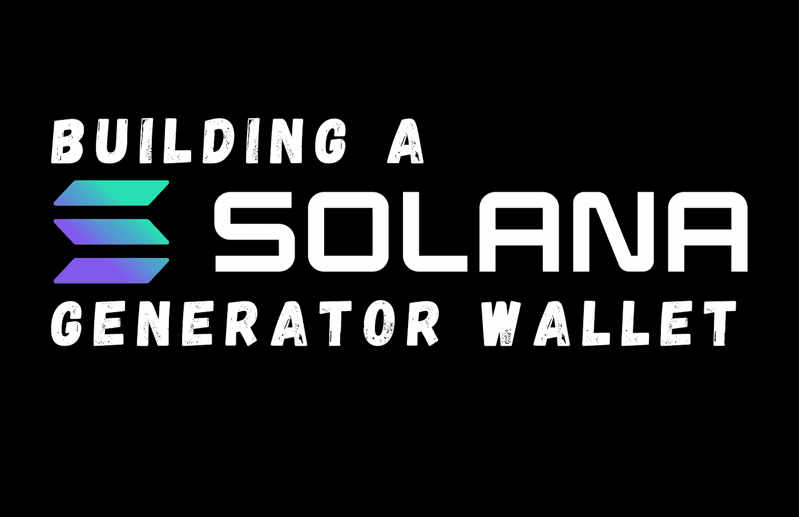
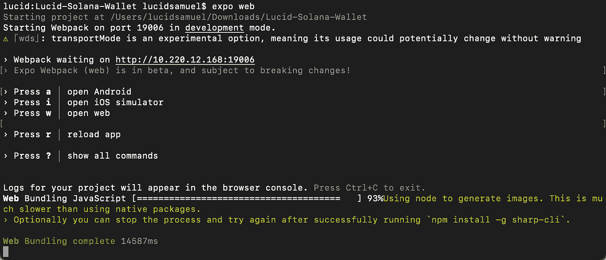
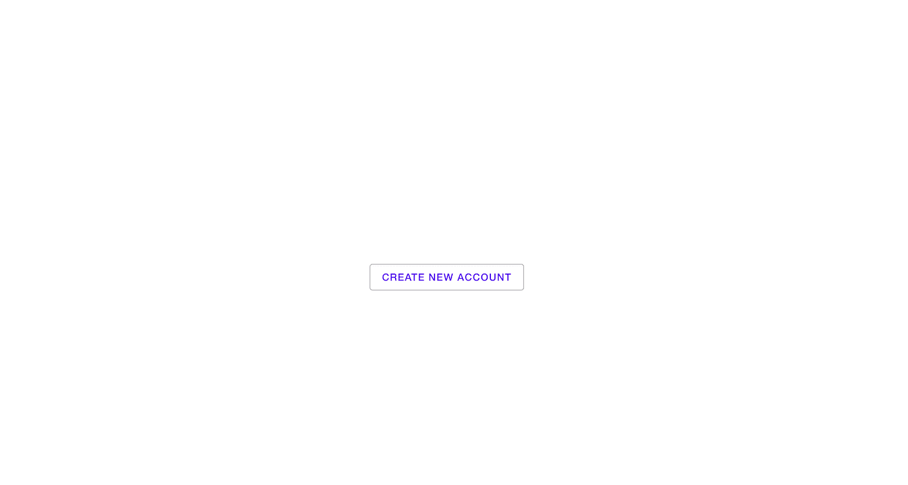
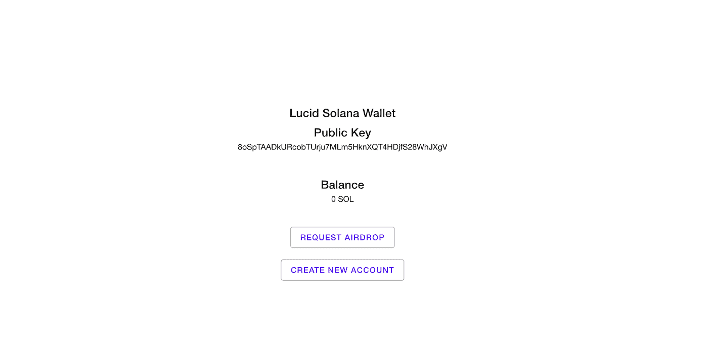
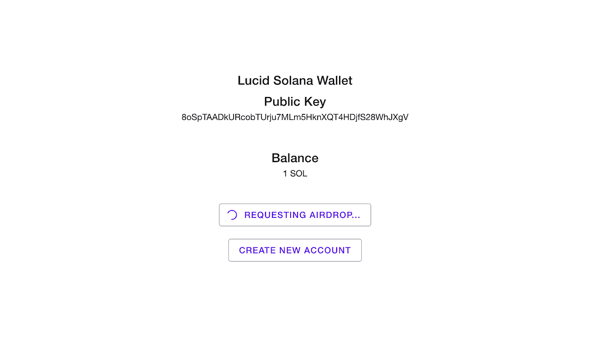

# 用 React 构建一个 Solana 钱包生成器

> 原文：<https://medium.com/codex/building-a-solana-wallet-generator-with-react-d992b0b1932f?source=collection_archive---------7----------------------->



钱包对于进入加密或开发任何 dAPP(去中心化应用程序)至关重要，因为它们在 Web3 生态系统中提供了各种重要的功能。因此，在本文中，我们将深入探讨 Solana 生态系统，它是世界上第一个网络规模的开源区块链协议，允许全球各地的开发人员在其平台上构建分散式应用程序(dApps)。Solana 现在能够处理 50，000 TPS(每秒事务)，成为世界上最快的区块链。

# 先决条件

JavaScript 基础知识 React JS 的一些使用经验[Expo CLI](https://docs.expo.dev/get-started/installation/?ref=hackernoon.com#1-expo-cli)Watchman(仅 macOS 或 Linux 用户需要) [Git](https://git-scm.com/?ref=hackernoon.com)

# 介绍

在本实用指南中，您将使用 React 和 Web3 构建一个与 Solana Network 交互的基本钱包应用程序。

# 设置环境:

让我们先设置并安装 Node.js 和 Npm。

在这里下载节点[，如果你已经安装了，跳过这一步。](https://nodejs.org/en/download/?ref=hackernoon.com)

*   确认是否安装了节点

```
node -v
```

Node.js 附带了 Npm，所以您可以使用下面的代码来确认它已经安装。

```
npm -v
```

现在我们已经设置好了环境，让我们初始化项目并开始构建。

# 设置样板文件

我创建了一个样板存储库，以便更容易地构建这个钱包应用程序。

它包含:

我们将在教程中用空方法实现一个基本框架。展示我们将从索拉纳网络获得的数据的布局。@solana/web3.js 包与 solana 网络通信。

首先，我们将安装 Watchman，使我们能够安装 Expo(只有 macOS 或 Linux 用户需要):

```
$ brew update
$ brew install watchman
```

接下来，我们安装 Expo 或检查是否已经安装

```
npm install -g expo-cli
```

现在我们已经准备好设置样板文件，要继续，您需要克隆存储库:

```
git clone [https://github.com/LucidSamuel/solana-wallet.git](https://github.com/LucidSamuel/solana-wallet.git)
```

克隆存储库后，在目录上安装必要的依赖项:

```
cd solana-wallet    // the folder directory
yarn install
```

最后，办世博会

```
expo web
```

您应该在终端上看到类似这样的内容:



要完成该过程，请按照终端中的指示按`w`,在网络浏览器上打开服务器，您应该会在浏览器上看到如下屏幕:



现在一切都已设置好，服务器也已启动并运行，是时候开始钱包应用程序的工作了。

在遵循本教程时，请确保不要关闭终端并始终保持 Expo 运行。

# 连接到索拉纳网络

与您可能需要连接到 RPC 或从第三方服务请求 API 密钥的其他区块链相反，连接到 Solana 网络非常简单，只需几个步骤就可以完成。

如果您从克隆的存储库中打开 [App.js](https://github.com/LucidSamuel/solana-wallet/blob/master/App.js?ref=hackernoon.com) ，您会注意到您需要实现的导入和空函数已经包含在内:

```
import {
  Connection, // connection receives an endpoint argument containing the full node's URL.
  clusterApiUrl,
  Keypair,
  LAMPORTS_PER_SOL,
} from "@solana/web3.js";
```

我们将使用`devnet`，它被设计成一个沙箱，供所有对构建 Solana 网络测试环境感兴趣的人使用，在这个测试环境中，令牌是不真实的。

我已经定义了必要的函数；所以剩下的就是你去实现它们了。

为此，您需要在代码中找到 **createConnection** 函数，并使用以下代码编辑注释代码:

```
const createConnection = () => {
  return new Connection(clusterApiUrl("devnet"));
};
```

最后，我们将调用这个函数并在控制台中打印以下内容，以测试它是否连接到网络:

```
console.log(createConnection());
```

如果一切顺利，您应该会在浏览器的控制台中看到类似这样的内容:

```
Object{
   "_commitment":"undefined",
   "_confirmTransactionInitialTimeout":"undefined",
   "_rpcEndpoint":"https://api.devnet.solana.com",
   "_rpcWsEndpoint":"wss://api.devnet.solana.com/",
   "_rpcClient":{
      "…"
   },
   "_rpcRequest":"createRpcRequest(method",
   "args)",
   "_rpcBatchRequest":"createRpcBatchRequest(requests)",
   "_rpcWebSocket":{
      "…"
   },
   "_rpcWebSocketConnected":false,
   "_rpcWebSocketHeartbeat":null,
   "…"
}
```

# 创建帐户

地址对于区块链上的通信至关重要，因为它充当唯一的标识符以及加密货币可以发送和接收的数字点。要创建一个帐户，我们必须首先生成一个包含秘密密钥和公开密钥的密钥对。

您可以在代码中找到必要的导入:

```
import {
  Connection,
  clusterApiUrl,
  Keypair,      // the keypair import
  LAMPORTS_PER_SOL,
} from "@solana/web3.js";
```

接下来，第 1 行:定义函数。

第 2 行:定义一个 keypair 变量，调用函数的结果是生成一个随机的 Keypair。

第 3 行:定义一个 initialBalance 变量并设置为 0。

第 4 行:用两个键设置状态变量:keypair 和 balance。

在我们的代码中查找`createAccount`函数，并实现以下代码:

```
const createAccount = () => {
   const keypair = Keypair.generate();
   const initialBalance = 0;
   setAccount({ keypair: keypair, balance: 0 });
 };
```

应用程序应该重新加载，你将能够创建新的随机帐户，每次你点击按钮“创建新帐户”。



# 获取帐户余额

要获得帐户余额，您需要在代码中查找`getBalance`函数，并像这样实现它:

```
const getBalance = async (publicKey) => {
 const connection = createConnection(); const lamports = await connection.getBalance(publicKey).catch((err) => {
   console.error(`Error: ${err}`);
 }); return lamports / LAMPORTS_PER_SOL; // In the Solana Network, a lamport is the smallest unit: 1 SOL = 1 billion lamports.
 };
```

# 请求空投

Devnet 令牌并不是真正的令牌。Solana Network 允许我们请求令牌，以便在开发应用程序时进行测试。

Solana Web3 `requestAirdrop`函数接受两个参数:

**至**:账户公钥
**端口**:端口数量

为此，我们需要在代码中实现空的`requestAirdrop`函数，如下所示:

```
const requestAirdrop = async (publicKey) => {
    setRequestAirdropButton({ text: BUTTON_TEXT_LOADING, loading: true });
    const connection = createConnection(); const airdropSignature = await connection.requestAirdrop(
      publicKey,
      LAMPORTS_PER_SOL
    ); const signature = await connection.confirmTransaction(airdropSignature); const newBalance = await getBalance(publicKey); setAccount({ ...account, balance: newBalance });
    setRequestAirdropButton({ text: BUTTON_TEXT, loading: false });
  };
```



# 最终代码

我们最终的`App.js`代码应该是这样的:

[https://gist . github . com/LucidSamuel/ce 8 e 391 a 841 B2 C2 c22 d 318 c 85 a 9 E1 FDD](https://gist.github.com/LucidSamuel/ce8e391a841b2c2c22d318c85a9e1fdd.js)

# 结论

我们成功地开发了一个具有基本功能的 Solana 钱包生成 web 应用程序。从这里开始，您可以继续构建具有更动态用户界面的独特应用程序。

*也在这里发表*[](https://hackernoon.com/building-a-solana-wallet-generator-with-react)