# 使用 Python 构建股票价格预测器

> 原文：<https://medium.com/codex/building-a-stock-price-predictor-using-python-eab852531449?source=collection_archive---------3----------------------->

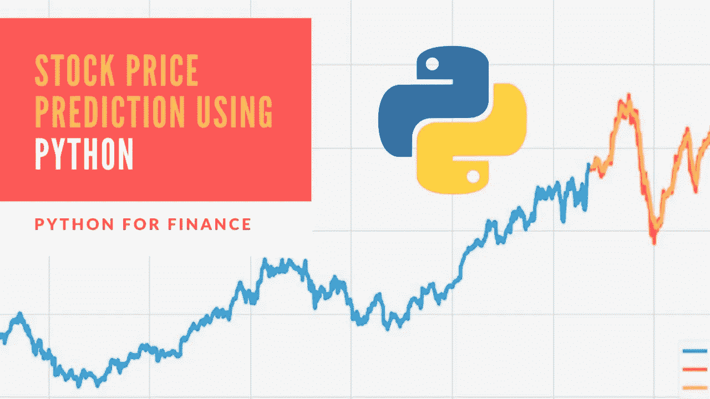

# 1.项目概述

世界各地的金融机构每天都在进行数十亿美元的交易。投资公司、对冲基金甚至个人一直在使用金融模型来更好地理解市场行为，并进行有利可图的投资和交易。大量的信息以历史股票价格和公司业绩数据的形式存在，适合于[机器学习算法](https://thecleverprogrammer.com/2020/11/27/machine-learning-algorithms-with-python/)来处理。

# 2.问题陈述

在这个项目中，我将使用[雅虎财经](https://finance.yahoo.com/)的数据来构建一个股票价格预测器，该预测器将特定日期范围内的每日交易数据作为输入，并输出给定查询日期的预计估计值。请注意，输入将包含多个指标，如开盘价(Open)、股票交易的最高价格(High)、交易的股票数量(Volume)以及根据股票分割和股息调整的收盘价(Adjusted Close)。

这个项目中我想回答的一些问题如下:

1.  人们真的能预测股票的价格吗？还是股票价格取决于某些因素，如经济因素。
2.  实践中有没有好的模型可以用来预测股票价格？

在这个项目中，我将尝试不同的模型并比较它们的性能。然而，我在这里只是预测股票调整后的收盘价。

# 3.韵律学

我将使用平均绝对误差来比较三种不同的模型及其性能。公式如下所示:

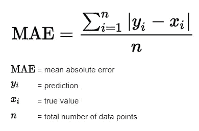

具有最低平均绝对误差的模型被认为比具有较高值的其他模型执行得更好。目标是选择误差最小的模型。

# 4.数据探索性分析和可视化

在我开始建模过程之前，我会花一些时间来查看数据，计算一些统计数据和图表，以便更好地理解数据。这是我将用于分析的苹果、亚马逊、福特、谷歌、强生、辉瑞和标准普尔 500 股票的前 5 行数据。

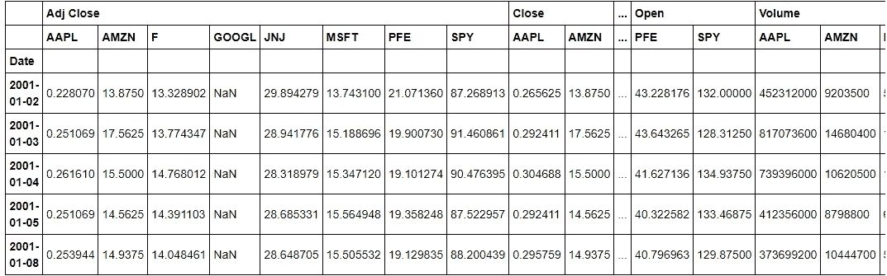

图 1 前 5 行数据

从上面，我们可以看到 Google 有一些丢失的值，我将使用 Python 的`fillna`方法来处理它。更多细节可以在我的 [Jupyter 笔记本](https://github.com/blessokeke/Investment-and-Trading-Capstone-Project/blob/main/investment_trading_capstone_project_main.ipynb)里找到。我们需要对数据进行归一化处理，但在此之前，让我们先来看看调整后收盘价的一些统计数据。

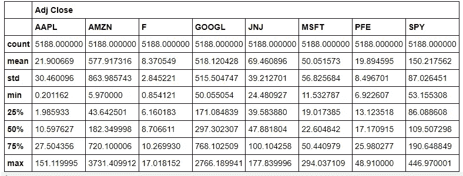

图 2 调整后的收盘价统计

## **归一化数据**

我们想知道不同类型的股票相对于其他股票是如何涨跌的。为此，我们将对数据进行标准化。我们通过将每一列的值除以第一天来确保每只股票从 1 美元开始。

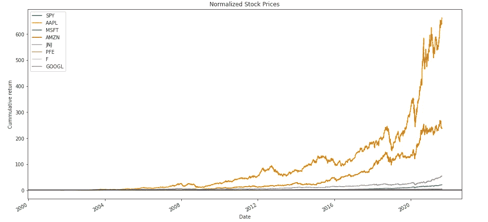

图 3 标准化股票价格数据

从上面的累积回报图中，我们可以看到苹果历年来的回报最高，而亚马逊第二，谷歌第三，微软第四。谷歌和微软的增长看起来比苹果和亚马逊稳定得多。仔细看看剧情，可以看出苹果尤其是近几年的波动性和风险股票很多。

## 累积回报

我将计算累积回报，看看疫情如何影响这些公司的股价。

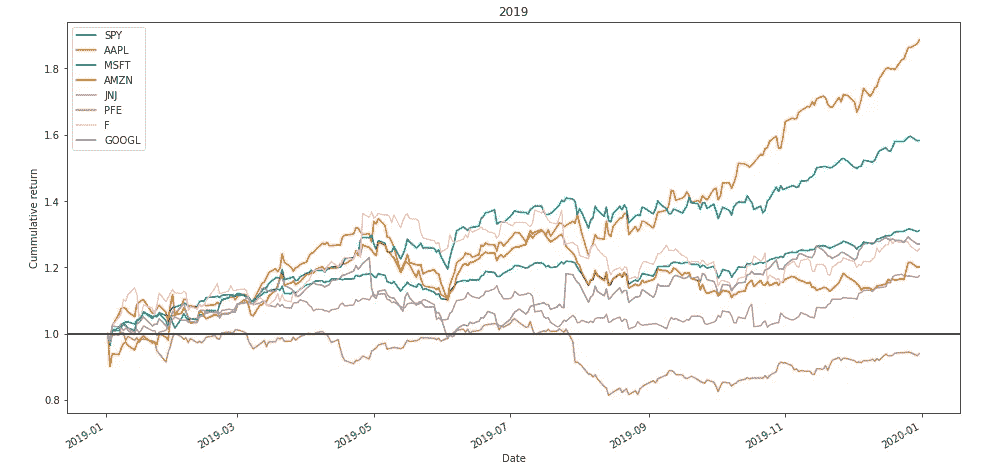

图 4 2019 年累计回报

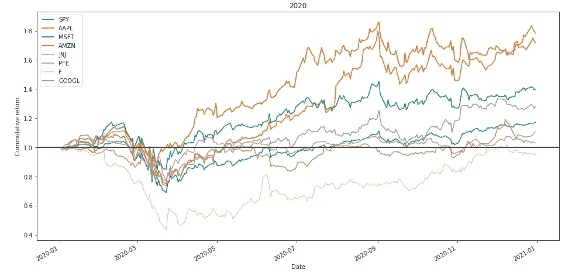

图 5 2020 年累计回报

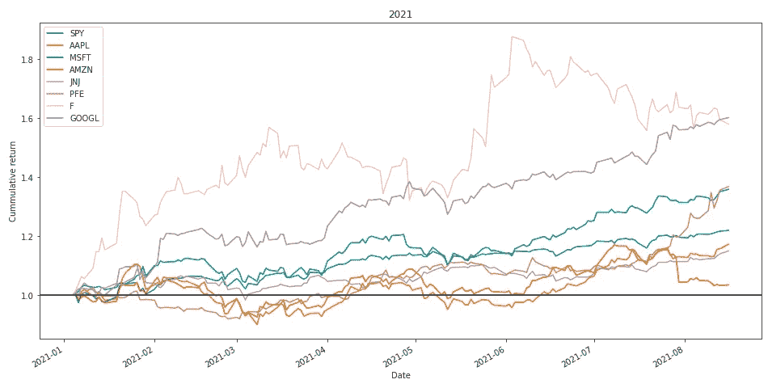

图 6 2021 年累计收益

从上面的情节中，我们来注意以下几点:

1.  2019 年:在疫情之前，我们注意到大多数公司的股票表现相对较好，苹果和微软领先，辉瑞落后。
2.  **2020 年:**在春天左右疫情开始的时候，我们注意到所有公司的股价都出现了下跌，但之后像亚马逊、苹果、微软和谷歌这样的科技公司又开始增长了。但是像辉瑞、福特和标准普尔 500 这样的公司表现不佳，尤其是福特。
3.  **2021 年:**随着疫苗推出和封锁开始解除，我们可以看到福特的股价大幅增长，特别是考虑到其股价在 2020 年因疫情而处于低位。像谷歌和微软这样的公司，标准普尔 500 指数也在增长。总的来说，我们考虑的所有公司的股价都有所上升。

## 滚动平均线和布林线

[滚动平均值](https://en.wikipedia.org/wiki/Moving_average)可能会让我们对一只股票的真实潜在价格有所了解。如果有明显的低于或高于滚动平均值的偏差，这可能会给我们一个潜在的买卖机会的想法。[布林线](https://en.wikipedia.org/wiki/Bollinger_Bands)是一个统计图，包含金融工具随时间的波动性。布林观察到，看看股票最近的波动，如果它非常不稳定，我们可能要放弃高于和低于平均水平的运动。但如果它不是非常不稳定，我们可能要注意它。

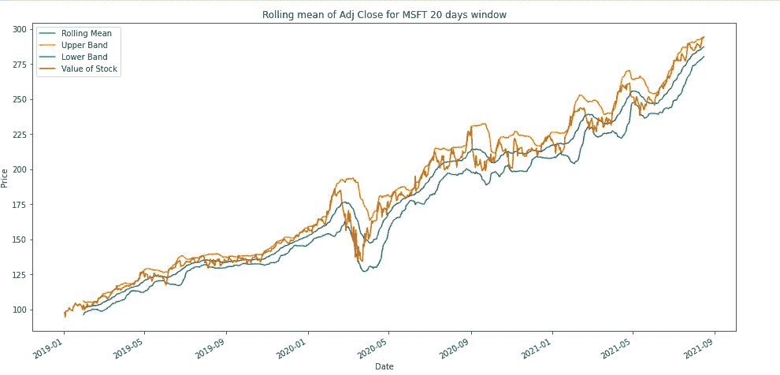

图 7 微软滚动平均

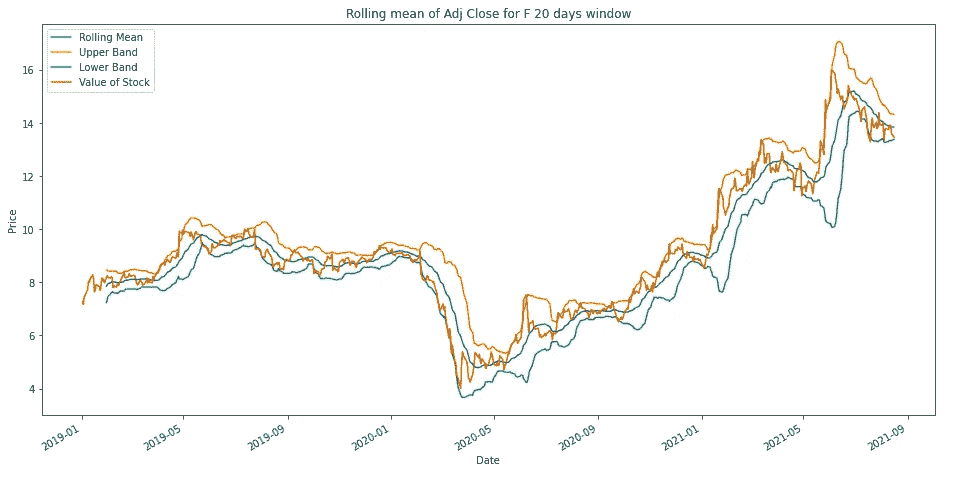

图 8 福特滚动装置

从上面的图中，我们可以看到滚动平均值的初始值丢失了。这是我在开始时使用的 20 天窗口期的结果，它没有值。我们还可以观察到滚动平均值跟随原始股票价格的运动，并且不那么尖锐。我们也可以看到福特在 2020 年的股价低于微软的预期。

## 每日回报

每日回报告诉我们股票价格在某一天的涨跌幅度。我们可以使用以下公式来计算它:

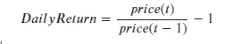

其中`price(t)`是今天股票的价格，`price(t-1)`是昨天股票的价格。

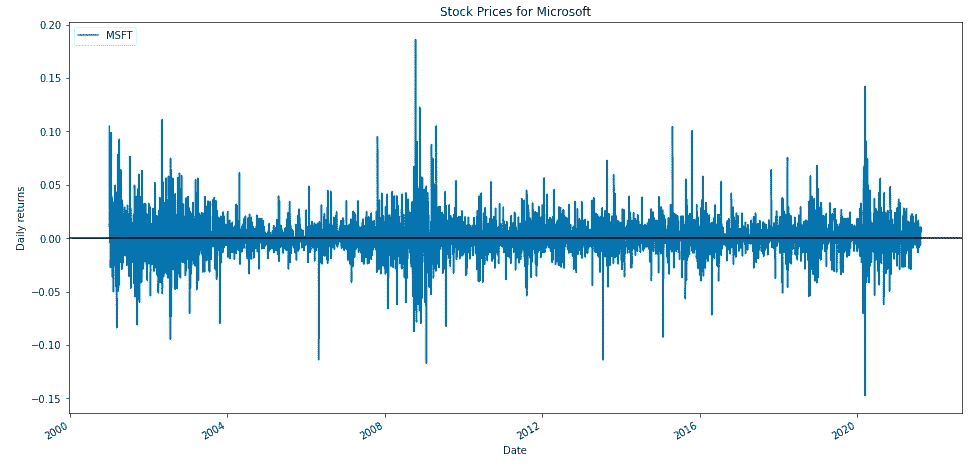

图 9 微软每日回报

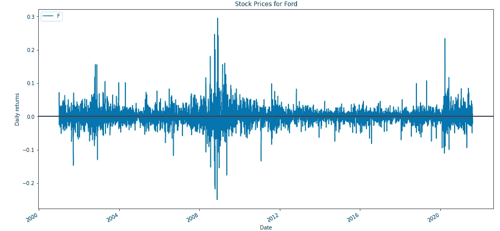

图 10 福特每日收益

从上面的图中，我们可以看到福特的波动范围高于微软。这可能是因为像微软这样的科技公司在疫情期间反弹得更快。

# 5.建模方法和结果

在这一部分，我将尝试一些模型来预测股票调整后的收盘价。在开始建模之前，我使用了 python `[fillna](https://pandas.pydata.org/docs/reference/api/pandas.DataFrame.fillna.html)`方法来处理缺失数据。更多细节可以在我的 [Jupyter 笔记本](https://github.com/blessokeke/Investment-and-Trading-Capstone-Project/blob/main/investment_trading_capstone_project_main.ipynb)里看到。

## **使用长短期记忆的预测(LSTM):**

[LSTM](https://en.wikipedia.org/wiki/Long_short-term_memory#:~:text=Long%20short%2Dterm%20memory%20(LSTM)%20is%20an%20artificial%20recurrent,networks%2C%20LSTM%20has%20feedback%20connections.&text=A%20common%20LSTM%20unit%20is,gate%20and%20a%20forget%20gate.) 是一种用于深度学习的人工递归神经网络(RNN)架构，能够学习长期依赖关系。它通过向前传播信息来处理数据，并具有链状结构。我用 Adam optimizer 作为我的模型，用均方差作为我的损失函数。下面是我的 LSTM 模式总结。

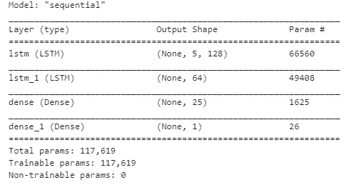

图 11a LSTM 模型总结

对于我的初始模型，我使用 1 和 5 个时期的批量大小，这给了我 0.0942 的平均绝对误差。这还不算太糟，但是通过调整参数，我的模型还有改进的空间，希望得到更好的预测。

## 精炼

现在，我将尝试调整几个模型参数，看看我的模型表现如何。下面是我为微软股票调整的不同参数及其相应的平均绝对误差的表格。

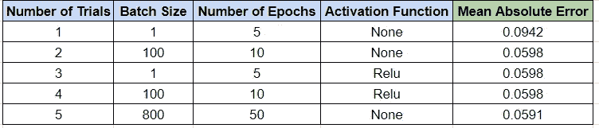

图 11b LSTM 精化表

从上表中，我们可以看到，随着批量大小和时期数的增加，模型表现得更好(即平均绝对误差更低)。此外，包括激活功能(Relu)并没有提高模型性能。

我的最终结果(上述细化表中的第 5 次试验)LSTM 预测的批次大小为 800，时期数为 50，如下所示:

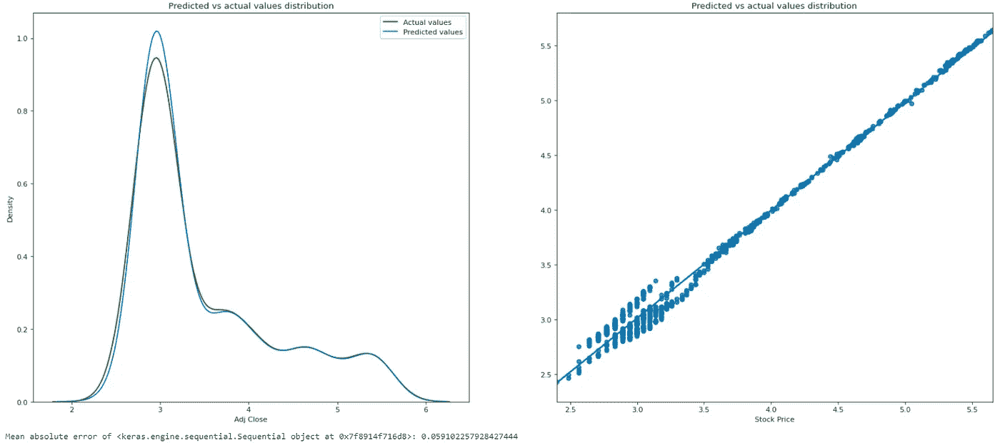

图 11c LSTM 预测结果

从上面，我们可以看到，预测和实际的可调整股票价格图看起来比较相似，变化不大，但平均绝对误差为 0.0591，不算太差。我们还可以得出结论，如上表所示，花费更多时间调整参数确实会改进模型。但是，仍有改进的空间，并尝试其他模型进行比较。

## **使用线性回归的预测**

[线性回归](https://en.wikipedia.org/wiki/Linear_regression)试图通过将线性方程与观察到的数据进行拟合，对响应与一个或多个解释变量之间的关系进行建模。我的线性回归预测的结果如下所示:

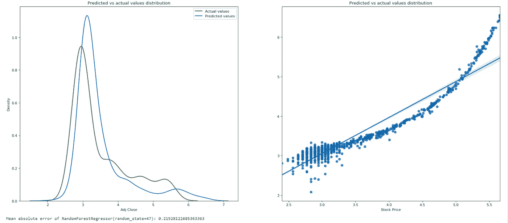

图 12 线性回归预测

从上面，我们可以看到，预测和实际的可调整股票价格图有变化，但平均绝对误差为 0.215，比 LSTM 模型稍差。但是，仍有改进的空间，并尝试其他模型进行比较。让我们再试试一个模型，看看它的性能如何。

## **使用随机森林回归预测**

随机森林回归是一种监督学习算法，使用集成学习方法进行回归。随机森林通过在训练时间期间构建大量决策树并为回归任务输出个体树的平均预测来运行。对于分类任务，它输出大多数树选择的类。

下面是使用随机森林回归的 Microsoft 调整后的收盘价的实际值和预测值表。

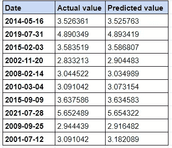

从表中可以看出，随机森林回归方程表现非常好，实际值和预测值非常接近。现在让我们来看看这些图。

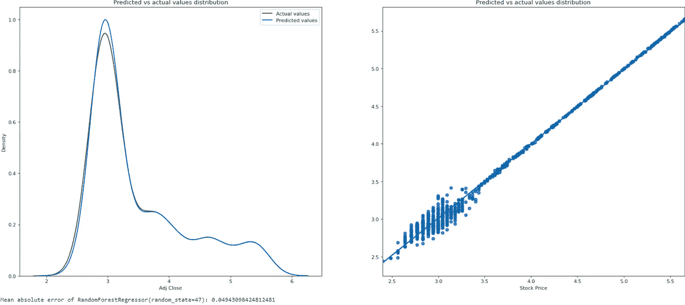

图 13 微软股票的实际值和预测值

从上面可以看出，预测的和实际的可调整股票价格图相对相似，平均绝对误差为 0.0497，这是好的。让我们看看它对谷歌股票的表现如何。

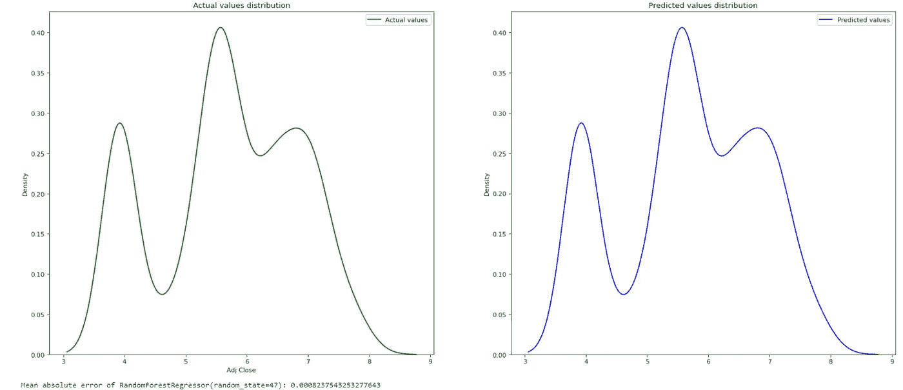

图 14 谷歌股票的实际价值和预测价值

从上面，我们可以看到预测和实际的可调整股票价格图非常相似，平均绝对误差为 0.000824，这是非常好的。鉴于这两个图有重叠，我将它分开绘制，这样我们可以清楚地看到它的相似性。

## 模型评估和结果

从我对三个不同模型的研究中，我观察到，对于微软和谷歌的股票，随机森林回归提供了比 LSTM 或线性回归低得多的平均绝对误差(见下面的图 15)。我还观察到，花时间调整 LSTM 模型的参数(例如，时期数和批量大小)会产生更好的预测。

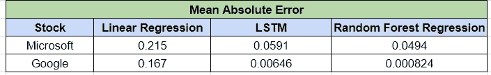

图 15 模型比较

## 正当理由；辩解

从我的分析中，我们可以看到，人们实际上可以预测股票的价格，经济因素确实对股票价格有一些影响。第二，有几个模型在实践中提供了很好的结果，可以用来预测股票价格。

随机森林回归器是一种将多种机器学习算法结合在一起的集成方法，非常适合使用，因为它比任何单个模型都更准确，如我在上面的分析部分所示。

# 6.结论

总之，对于微软和谷歌的股票，随机森林回归比 LSTM 或线性回归产生了更低的平均绝对误差。我还观察到，调整 LSTM 的参数(例如，时期数和批量大小)会产生更好的预测，但这可能需要一些时间。

在研究数据时，有趣的是看到不同公司的股价如何因疫情而变化，以及科技公司的股价如何比其他公司考虑的更快地反弹。有趣的是，随着疫苗的推出，辉瑞的库存也有所增加。

## 潜在的改进

我的工作可能会有以下一些潜在的改进:

1.  花一些时间来调整模型参数，并加入更多可能与股票价格预测相关的特性。
2.  尝试更多模型，看看是否有比随机森林回归性能更好的模型。出于简单和时间限制，我只尝试了三种模型。
3.  探索其他公司的股票，看看用不同的模型预测他们的股票价格有多好。

要获得包括代码在内的更详细的分析，请查看我的 GitHub 页面。