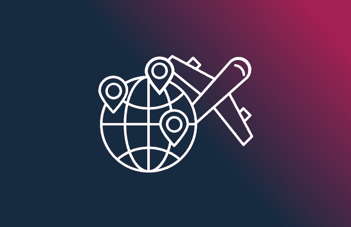
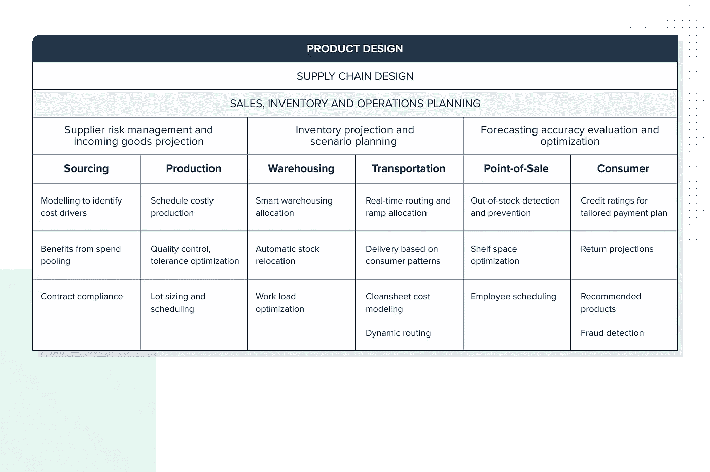
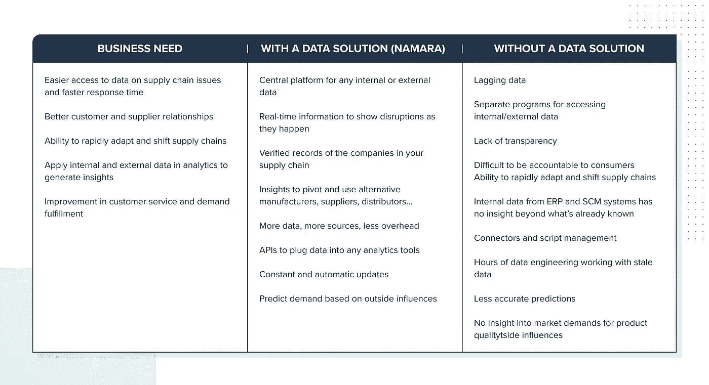

# 用数据构建更强大的供应链

> 原文：<https://medium.com/codex/building-a-stronger-supply-chain-with-data-7f6f81596877?source=collection_archive---------5----------------------->

## [法典](http://medium.com/codex)

数据使组织能够了解他们所处的系统，评估它们的相互依赖性，并为他们在未来几个月将面临的情况做好准备。我们探索这如何应用于建立一个强大的，有弹性的供应链。

如果说企业能从新冠肺炎疫情中学到什么的话，那就是它们不能回到过去的样子了。我们被邀请去经营的新环境不太稳定，不太确定，并且考验着关于全球化、供应链和消费者行为的假设。这些环境通常被称为 VUCA，即不稳定、不确定、复杂和不明确的环境，要求企业调整其战略、流程和预测模型。

**重点推荐:**

*   访问新数据以丰富您当前的知识，并了解更广泛的范围
*   协调整个供应链的洞察，揭示从源头到生产、物流到客户的相互依存关系
*   通过提高透明度改善客户和供应商关系
*   通过在供应链中嵌入数据策略获得预测能力

为了让企业在这种情况下变得更强大、更有弹性，为了“ [**在回合中获胜**](https://www.gartner.com/en/information-technology/glossary/winning-in-the-turns) ”，它们必须应用战略性的、有纪律的方法来适应它们的商业模式，并加速变革，这将给它们带来竞争优势。那些明白自己必须快速行动、依赖公正信息并根据需要进行调整的公司将会脱颖而出。做出这些明智的战略决策的能力将在很大程度上依赖于组织对良好数据的访问和理解能力。

## 绘制系统图

采用系统方法进行供应链设计将使领导者能够考虑更广泛的选择，并在经济衰退后建立反应灵敏、适应力强的公司。对于那些生存能力依赖于互联供应链和商品跨境流动的公司来说，系统思维尤其重要。面对意想不到的短缺，公司必须拓宽视野，了解机会在哪里。

数据对于公司绘制供应链地图以及了解供应链如何受到更广泛环境的影响至关重要。可以改善供应链状况的数据来源包括全球贸易流动、劳动力流动、监管变化、运输路线和仓库容量。

对于严重依赖全球供应商的组织来说，运输网络是难题的关键部分。数据可以帮助公司了解成本、进口港交通和船队流动的变化，所有这些都是关键指标。

了解这一更广阔的图景使公司能够超越企业资源规划(ERP)和供应链管理(SCM)系统上保存的传统内部数据，以了解更广泛的全球系统，并更快地发现新的机会和障碍。

这超出了从 A 地到 B 地获取货物或比较原材料成本所涉及的信息。为公司提供道德、环境和社会福利指标信息的第三数据有助于实现三重底线。关于参与生产的劳动力、生产和运输的环境影响以及资源真实性的分层信息为公司赢得了更大的信任和消费者的信心。在新冠肺炎疫情期间，对整个供应链透明度的需求变得更加明显，这突出了供应链风险****，这是由于暴露在不稳定的劳动力市场中，工人无法自我隔离，并且获得的医疗保健有限。****

******数据解:******

****[**Namara market place**](https://app.namara.io/)是数十万个标准化、可查询数据集的便捷访问点，可帮助您拓宽数据范围，从而了解整个供应链。****

## ****评估相互依赖性****

****正如 Gartner research 指出的那样，供应链领导者明白缺乏透明度是一个重大风险，尤其是在供应来源不透明的情况下。如果没有对潜在联系的清晰理解，由劳动力短缺引发的连锁故障将影响消费品公司履行订单的能力，导致客户失去信心。新冠肺炎·疫情是需要这种外部洞察力的最好例子。****

****了解供应链中的每个环节是如何连接的，需要协调生产过程所有阶段的数据——采购、生产、运输、储存、分销和消费(见图 A)。使用数据来了解相互依赖关系，使组织能够提前抓住机会，并在必要时随时转向替代方案。****

******图 A:摘自麦肯锡&公司《供应链分析——从基于数据的决策中获取价值》******

********

******数据解:******

****理解相互依赖关系需要 [**将数据集**](https://www.thinkdataworks.com/products/unity) 整合在一起，并将它们转换成一个单一的产品，从而看到一个整体画面。****

## ****为任何情况做好准备****

****对于希望获得可预测和经得起未来考验的供应链的公司来说，发展更成熟的数据战略和支持数字基础设施至关重要。正如 [**麦肯锡指出的**](https://www.mckinsey.com/business-functions/mckinsey-digital/our-insights/the-digital-led-recovery-from-covid-19-five-questions-for-ceos) ，现代化的数据架构、向云迁移以及基于新现实的再培训算法将使领导者能够从他们的数据中获得最大价值。****

****通过将数据策略嵌入到您的供应链流程中，您的公司可以:根据影响消费者偏好的因素，准确预测不同产品的需求；实时识别模式(消费者购买行为)；并通过准备订单来满足预测的需求，从而优化库存和资产生产率。应用“新数据”为您的预测模型提供动力，将使您能够提前发现问题，在危机时刻快速做出反应，甚至在您的直接网络之外也能看到全貌。****

******数据解:******

****一旦您的公司投资了数据战略，您就需要合适的工具来支持该战略。是时候从一个遗留数据仓库过渡到一个[**可扩展的集中式数据平台**](https://www.thinkdataworks.com/products/namara) 了。****

## ****数据满足您的业务需求****

****新冠肺炎疫情给了公司一个转变经营方式的机会。在不确定和不稳定的环境中，清晰的信息和分析信息的能力是唯一的出路。以下概述了如何利用供应链中的数据解决方案来帮助您的组织实现其业务需求:****

********

## ****走向****

****虽然没有人能够预测新常态会是什么样子，但我们知道公司需要更有效地利用更多数据，不仅是在供应链模型中，而且是在整个组织中。能够做出这一战略决策的公司将变得更有弹性，并为未来的中断做好更充分的准备。****

****想了解有关协调业务和数据战略的更多信息吗？****

****[**请求向我们的数据专家之一咨询**](https://meetings.hubspot.com/eugene) 或 [**浏览**](https://marketplace.namara.io/) 解决方案就绪数据的最大目录，以确定 [**ThinkData 的技术**](https://www.thinkdataworks.com/products/namara) 如何推进您的项目。****

*****原载于*[*https://blog.thinkdataworks.com*](https://blog.thinkdataworks.com/building-a-stronger-supply-chain-with-data)*。*****