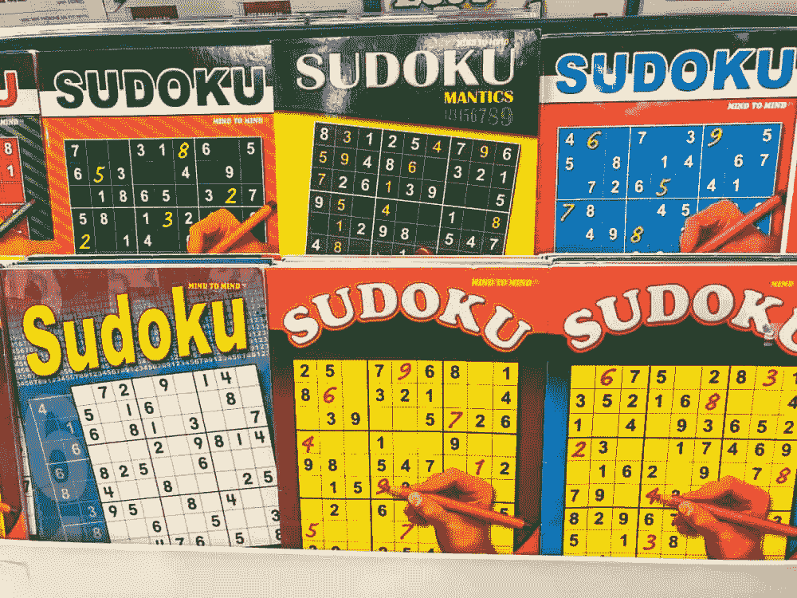

# 用 Python 构建数独解算器和生成器(1/3)

> 原文：<https://medium.com/codex/building-a-sudoku-solver-and-generator-in-python-1-3-f29d3ede6b23?source=collection_archive---------2----------------------->

# I 简介

在这个由 3 部分组成的教程中，我将向你展示如何创建你自己的数独“引擎”,它能够在没有外部库的情况下用纯 Python 来解决和生成数独。请记住，我今天将向你展示的算法是非常[贪婪的](https://www.freecodecamp.org/news/what-is-a-greedy-algorithm/)，并且不是最快的方法。如果你想创建一个快速的数独解算器/生成器，那么考虑使用一种更快的编程语言，如 c。本教程是为那些对 Python 有基本了解，但试图继续学习的人准备的。点击此[链接](https://github.com/1Blademaster/sudoku_engine)查看 Github 回购！

以下是本教程接下来 3 个部分的内容列表:

1.  求解器的介绍和创建(此处)
2.  [启动发电机 1](https://kushm.medium.com/building-a-sudoku-solver-and-generator-in-python-2-3-5eef3141702c)
3.  [完成发电机 2](https://kushm.medium.com/building-a-sudoku-solver-and-generator-in-python-3-3-cac73d340973)

## 注意:

这些是在每个难度级别生成一个数独游戏的平均时间，超过 100 个数独游戏生成 ***** :

*简单(0):0.221 秒*

*中等(1):2.107 秒*

*硬(2):20.466 秒*

***** 这些时间是在我的电脑(锐龙 5 3600X cpu、24GB DDR4 ram、RX590 gpu)上记录的，可能与您在电脑上体验到的时间有所不同。

# 数独是什么？

数独是一种逻辑思维游戏，你需要根据 3 条严格的规则用数字填充 9x9 的网格:

> 1.有一个 9x9 的网格，每个网格必须填充一个从 1 到 9 的数字
> 
> 2.在一行或一列中不能有两次相同的数字
> 
> 3.在同一个内部盒子中不能有相同的数字(3x3 部分)

展示不同规则如何在数独棋盘上应用的图表

在左图中，你可以看到一个 9x9 的数独棋盘被分成 9 个内部方块。

如果您试图将一个数字放在最中间的方块中，那么该数字不能存在于绿色方框(行)、粉色方框(列)和蓝色方框(内部方框)中。

如果这是你第一次接触数独，我强烈推荐你在这里玩几个游戏来熟悉这个游戏以及它是如何运作的。

# 创建主程序

我们需要做的第一件事是创建一种方法，用计算机和我们人类易于理解的方式来表示数独棋盘。在 python 中，可以使用列表通过 2D 数组来表示棋盘。这使得我们很容易改变和编辑板上的单个单元格，因为我们可以简单地调用我们想要编辑的单元格的索引值。

带注释的 2D Python 列表数组，用于显示行和列以及如何访问它们

电路板也可以描述为一个字符串，这使得它可以方便地传递，甚至可以保存到文件中，以备后用。该字符串将是整个数独板，其中字符串的开始将是板的左上角，并从左到右，最终向下到板的右下角。在这两种情况下，空的方块将由 0 表示。

我们将从导入两个必需的内置模块开始，copy 和 random。然后，我们可以开始创建一个代表数独板的类，这是所有东西都将被“容纳”的地方:

在这段代码中，我们创建了 Board 类和 magic init 方法，当创建一个新对象时，这个方法会被立即自动调用。在 init 方法中，我们将首先通过调用私有的 resetBoard 方法来创建一个空的板子。私有方法用名字前面的双下划线来表示。如果电路板代码作为参数传入，则电路板将根据输入的代码进行填充。

下一个要实现的方法是 resetBoard 方法。这相对简单，因为它只是将我们的 board 类的 Board 属性分配给一个空的 9x9 列表，该列表用零填充，表示空的正方形:

我们还需要一种将电路板转换成代码的方法，因此我们接下来将使用可选的 input_board 参数实现 boardToCode 方法:

在这个简单的方法中，我们遍历 board 的每个内部列表中的每个对象，将其转换为一个字符串，并将其附加到一个空字符串的末尾。

# 最后的想法

这是我的数独解算器和生成器系列的第 1 部分，下一部分我们将讨论如何使用递归来解数独板。如果您有任何想法、建议或问题，请随时在下面留下您的评论！

点击[此处](https://kushm.medium.com/building-a-sudoku-solver-and-generator-in-python-2-3-5eef3141702c)查看第 2 部分。

感谢您阅读第 1 部分！💖