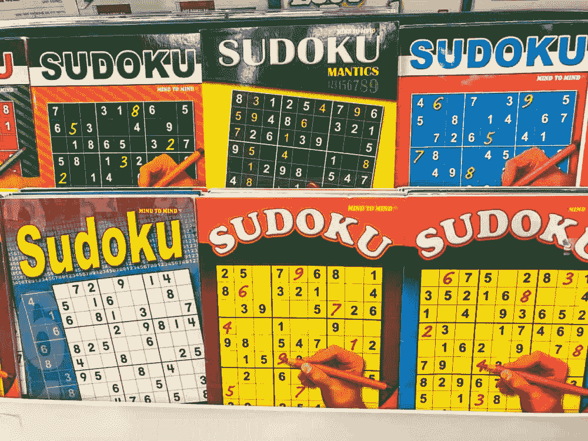
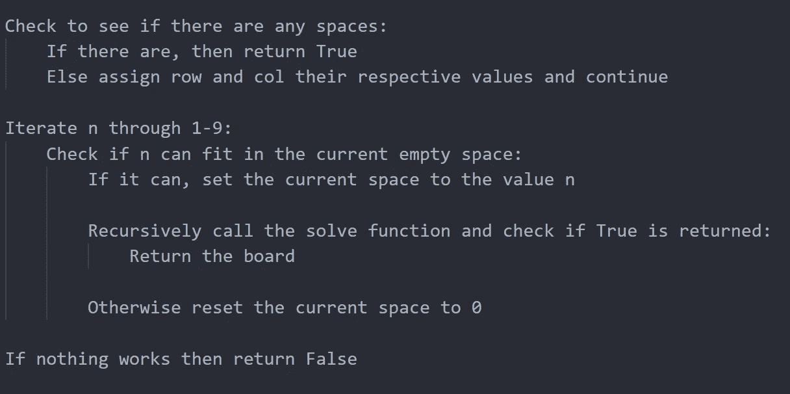
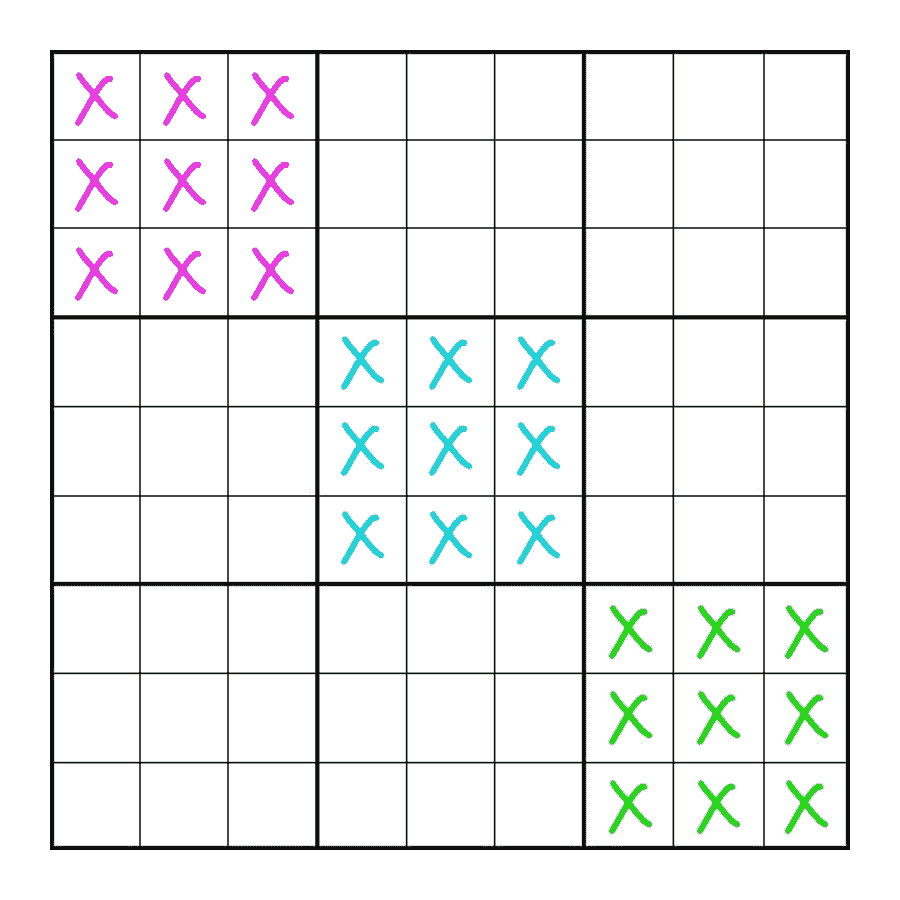

# 用 Python 构建数独解算器和生成器(2/3)

> 原文：<https://medium.com/codex/building-a-sudoku-solver-and-generator-in-python-2-3-5eef3141702c?source=collection_archive---------6----------------------->

# 创建求解器

欢迎回到这个 3 部分教程的第 2 部分，在这一部分我们将为数独引擎创建求解器，所以让我们直接进入代码。但是，首先我们需要创建两个方法来辅助主求解方法。

这里我们遍历棋盘，返回我们遇到的第一个空方块的索引位置的行和列，如果没有方块，则返回 False。

接下来，我们将创建一个方法，它可以检查并告诉我们某个数字是否可以输入到某个单元格中:

这个方法有两个必需的参数，一个是试图输入到空间中的数字，第二个参数是包含行和列索引的元组。该方法将首先检查试图放入空格中的数字是否出现在同一行或列中，如果出现，则该数字不能放在那里，并返回 False。接下来，检查内部框 3x3 框，如果该数字已经出现在框中，则返回 False。如果到目前为止没有返回任何东西，那么我们试图放置数字的空间被认为是有效的，并且返回 True。

最后，为了创建求解器，我们需要考虑如何求解数独棋盘，我创建了一些伪代码来表示求解算法:

主求解算法的伪代码

将它转换成 python 后，我们得到:

在这个方法中，我们将创建求解算法，该算法将利用递归的能力来实现回溯解决方案，以完成数独谜题。首先，搜索任何空单元格，如果没有空单元格，则返回 True，因为函数已经到达其基本情况，否则函数继续。

然后，for 循环将变量 n 从 1 递增到 9(包括 1 和 9 ),在每次迭代过程中，都会检查 n 是否适合当前的空白空间，这是由 findSpaces 方法在前面找到的。如果可以，则用值 n 填充该空间，并且递归地调用求解函数，直到达到基本情况，这发生在棋盘上没有剩余的空间或者没有数字可以放入空白空间的时候。如果后者发生，则返回 False，并且不返回板，而是将先前由值 n 填充的空间重置为 0，并且 for 循环继续。

我们还可以创建另一种方法，将求解的纸板转换成易于打印和存储的代码:

# 世代入门

要生成一个可以作为问题填写的数独板，我们首先需要创建一个由完全有效的数字填充的板(遵循数独规则)。为此，我们可以使用一个简单的小技巧和一些递归来生成一个完全填充的电路板。我们将使用的技巧会稍微加快我们的生成时间，但是有总比没有好，对吗？它是这样工作的:

显示如何独立安装 3 个内部盒子而不会相互干扰的图表

在此图中，您可以在一条对角线上看到 3 个内部方框，粉红色方框中的内容不会干扰蓝色和绿色方框中的内容，反之亦然。从生成过程开始，我们可以创建一个生成完全填充电路板的方法:

在上面的方法中，我们检查了 3 个内部方框，并用数字 1-9 填充它，同时确保该数字不能通过从我们的临时数字列表中删除而被随机选取。最后，私有的 *generateCont* 方法被调用，这样它可以填充棋盘上剩余的 54 个空单元格。这个函数看起来是这样的:

该方法也是递归的，因为它在生成填充电路板的过程中调用自身，并且遵循与 solve 方法非常相似的原理。它的工作方式是遍历棋盘并选择一个随机数，如果当前单元格是空的，那么它会尝试将该数字放在允许的位置，然后检查棋盘是否仍可解。如果它是可解的，那么它将移动到下一个单元格，否则它将重置该单元格的值。

# 最后的想法

这是 3 部分数独求解器和生成器教程的第 2 部分，在下一部分，我们将通过确保每个创建的数独只有一个解决方案来完成我们的生成器。请务必在下面评论您的任何疑问和想法。

点击[此处](https://kushm.medium.com/building-a-sudoku-solver-and-generator-in-python-3-3-cac73d340973)查看第三部分。

感谢您阅读第 2 部分！💖