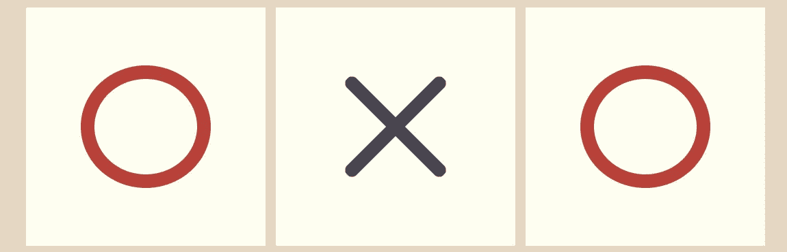
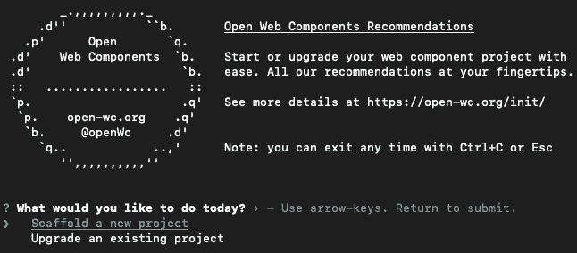

# 用 LitElement 构建井字游戏

> 原文：<https://medium.com/codex/building-a-tic-tac-toe-game-with-litelement-73e479f5a66d?source=collection_archive---------13----------------------->

## 使用 web 组件构建交互式游戏

在本文中，我们将使用基于 web 组件的库元素来构建经典的井字游戏。



# 项目初始化

首先，让我们做一些脚手架。为此，我推荐使用方便的 dandy [open-wc](https://open-wc.org) 生成器工具，它为我们建立了一个 lit-element 组件。我们将在终端中键入以下命令:

```
$ npm init @open-wc
```

该命令将初始化脚手架工具，以生成 Lit 元素组件或应用程序。我们将看到以下屏幕:



要创建一个新项目，选择第一个选项:*搭建一个新项目*。之后，该工具会询问我们是否要创建一个组件或应用程序。为了制作一个可重用的组件，我们将选择`Web Component`。

然后，我们会被问及是否要添加一些额外的功能，如林挺(代码样式)，测试和演示。这些都是完全可选的，但是您可以考虑至少包含测试模块来为组件运行自动化测试。

然后这个工具会问我们是否要使用 typescript，这个项目不会这样，所以我们点击 *No* 。

我们将继续命名我们的组件。随便你怎么命名，我就简单的给我的命名:井字游戏。记住 Lit 要求至少用两个连字符分隔的单词来命名它，如:my-component。不允许使用一个单词的名字。

最后，它将向您展示将要写入磁盘的组件的文件结构。选择 *yes* 后，工具会询问我们是否要安装依赖项。我们将选择第 *y* es， *w* i *个 npm* ，这样我们就可以使用 npm 作为我们的依赖项管理器*。然后，它将最终为我们的新组件创建所有的文件夹和文件。*

## 项目结构

open-wc 工具使用指定的组件名(在本例中是 tic-tac-toe)在文件夹中生成以下项目结构。

```
./
├── tic-tac-toe/
│   ├── demo/
│   │   └── index.html
│   ├── src/
│   │   └── TicTacToe.js
│   ├── .editorconfig
│   ├── .gitignore
│   ├── custom-elements.json
│   ├── index.js
│   ├── LICENSE
│   ├── package.json
│   ├── README.md
│   ├── tic-tac-toe.js
│   └── web-dev-server.config.mjs
```

最重要的文件是:

*   **package.json** 包含 npm 项目的规范，以及它的依赖项和脚本。
*   将我们的元素定义为本地 web 组件。
*   **demo/index.htm** l 为我们的组件创建了一个展示页面，我们可以在这里看到它的实际显示。
*   **src/TicTacToe.js** 组件本身。包含主组件的类的文件

# 游戏组件

现在我们有了一个组件，让我们开始把我们的小游戏组件分割成更小的部分，这样代码库更容易管理。主游戏实例将在我们的`TicTacToe.js`文件中，它将运行游戏逻辑并包含棋盘。然后，我们将有一个`TicTacToeCell.js`来代表我们的每个棋盘单元格，并包含一个十字或一个圆。因此，继续创建一个新文件，将第一个元素的内容复制到第二个元素中，或者复制第一个组件，只是不要忘记重命名它。项目结构现在应该看起来像这样:

```
./
├── tic-tac-toe/
│   ├── ...
│   ├── src/
│   │   ├── TicTacToe.js
│   │   └── TicTacToeCell.js
│   ├── ...
```

现在，如果我们看一下文件`TicTacToe.js`，它应该包含了很多我们不需要的支架代码。随意删除`__increment`方法和所有方法的内容。现在，让我们开始编码。

## 属性和模板

让我们设置一些属性来管理棋盘状态和游戏条件。将`properties`方法内容替换为以下内容:

这里我设置了一个`board`属性，它将保存一个数组来表示每个玩家在棋盘上的移动。属性将依次保存玩家的号码，1 或 2。`plays`是一个保存每个玩家移动次数的对象，以防我们以后想要实现某种统计。最后`turn`保存了出于同样原因的播放次数。

然后，为了初始化所有这些变量，我们使用所有 web 组件固有的构造函数方法:

由于游戏初始化发生多次，该功能在`initGame`函数中被重构，该函数在构造函数中被调用一次，然后在每次游戏需要重置时再次被调用。我们还设置了一些事件监听器，以便在游戏达到结束条件时显示确认消息，即玩家获胜或平局。我们稍后将设置这些事件的触发器。

然后，让我们为主要组件设置模板:

在这里，我们只设置了一个 div 作为我们的板。然而，这里有趣的事情是我们使用我们的`tic-tac-toe-cell`来实际呈现单元格的内容，可能是一个十字或者一个圆。为了实现这一点，我们将单元格的属性`.symbol`设置为一个空字符串，因为我们还不想让它显示任何符号。然后，为了让游戏逻辑工作，我们需要将我们的棋盘状态的数据表示(在这种情况下是我们的`this.board`属性)与每个单元格的可视化表示(每个`tic-tac-toe-cell`)结合起来，这就是为什么我们还在单元格中设置了一个`.col`和一个`.row`属性。最后，我们需要在单元格中有一个事件监听器，在用户单击它时监听它。方法`this._handleClick`将用于该目的:

`handleClick`方法将根据当前玩家依次为点击的单元格设置相应的符号。它还会更新棋盘数组，以表示最新的棋步和游戏次数。最后，它会将回合传递给下一个调用`changePlayer`方法的玩家。这里需要注意的是，如果所选单元格已经被选中，上面的任何操作都将被执行。

现在进行实际的`tic-tac-toe-cell`:

它由一个简单的组件组成，具有属性:`row`、`col`和`symbol`。它有一个非常简单的模板，我们只需要它根据作为参数传递的`symbol`显示一个带有类的 div。也许这个组件中最值得注意的是它的样式，它们反映了符号属性。为了显示一个漂亮的图标一样的符号，我们使用普通的 css。

## 样式和项目开始命令

谈到风格，让我们也为我们的董事会设定一个风格，好吗？将以下方法添加到我们的`TicTacToe`类中:

我们的井字游戏组件现在可以展示了。现在，在 shell 中键入以下命令来可视化您的项目，只需确保您在项目的文件夹中:

```
$ npm run start
```

这将服务于项目的文件。具体来说，我们将可视化`demo/index.html`文件中的所有内容，这是我们组件的展示窗口，还记得吗？


只需几行代码，我们的组件就活了过来！

很简单，不是吗？请注意，它甚至会根据当前玩家的身份来改变填充单元格的符号。然而，我们的小井字游戏无法确定谁赢了，或者比赛是否以平局结束，也不会在比赛结束后重置，让我们解决这个问题。

# 游戏逻辑

首先，我们需要告诉我们的组件，一旦移动完成，就检查双方的胜利。为此，我们需要设置一些方法来检查什么是玩家的胜利。

## 检查胜利

有三种方式玩家可以赢:如果一排只有一个玩家的符号(水平检查)；如果一列仅由该玩家的符号组成(垂直检查)；或者如果两个棋盘的对角线中的任何一个只包含玩家的符号(对角线检查)。

让我们创建进行这些检查的方法:

这不是最精彩的算法，但这是针对之前描述的三种情况的三种不同的方法。请随意用您自己的实现来替换它们，但这也很好。最后，有一个包装器`checkVictory`函数可以在需要时轻松调用这三个方法。

现在我们需要在玩家每次移动时调用这些。我们已经有了一个`_handleClick`方法，每当玩家点击单元格时就会触发。让我们给这个方法添加胜利检查。

还记得我们一开始在构造函数中设置的事件监听器吗？那些收听*玩家赢*和*平局*事件的人。这个新的实现触发了那些事件。超时功能防止事件在棋盘实际更新最后一步棋之前被调度，然后并且只有在那时游戏结束确认消息才可以显示。

# 结论

我们用 lit-element 构建了一个简单而有趣的井字游戏组件。它可以打包并部署在任何 web 应用程序中，就像在`demo/index.html`中一样。唯一困扰我的是确认消息真的很不美观，所以让我们在接下来的教程中构建一个漂亮的模态组件来显示游戏消息。