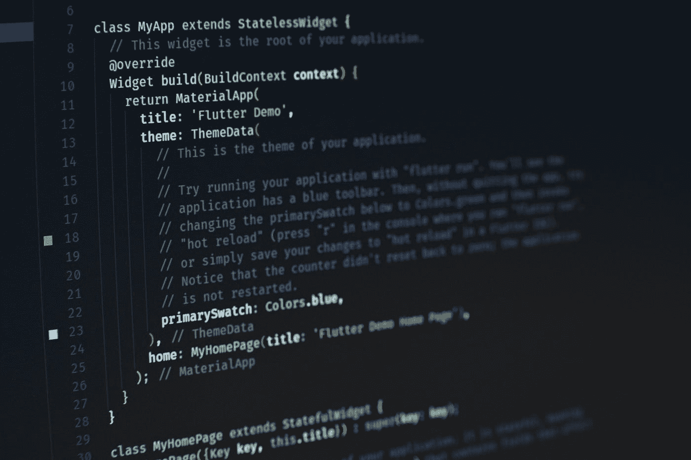
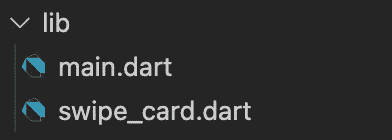
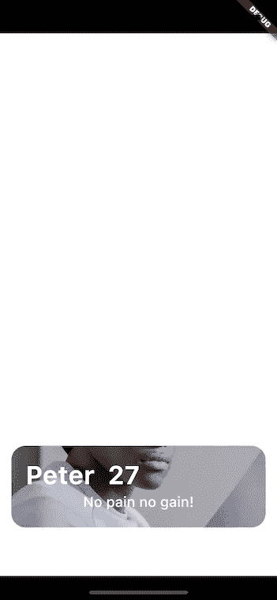

# 在 Flutter 中构建类似火绒的滑动界面

> 原文：<https://medium.com/codex/building-a-tinder-like-swiping-interface-in-flutter-5a799901df74?source=collection_archive---------3----------------------->

TL；DR:如果你只对滑动功能感兴趣，你可以直接跳到[这里](#2201)，或者在 [GitHub](https://github.com/florianabel/swiping-interface) 上查看最终项目。



照片由[桑杰·梅赫拉](https://unsplash.com/@sanjaymehra?utm_source=medium&utm_medium=referral)在 [Unsplash](https://unsplash.com?utm_source=medium&utm_medium=referral) 上拍摄

# **简介**

在这篇文章中，你将一步一步地被引导使用 Flutter 框架开发一个类似 tinder 的滑动界面。

我喜欢这个界面的简单性，它允许用户很容易地决定是支持还是反对卡片上列出的选择。这对于需要简单的是/否选择过程的所有类型的应用程序都是有用的。


# 颤振框架

因为这个界面最适合在移动设备上使用，而且我的目标是跨不同平台的可重用性，所以我决定在 Google 的 Flutter 框架中构建这个项目。它提供了开发多平台应用程序的功能，这些应用程序可以在 Android 和 Apple 手机、平板电脑上使用，甚至可以从单个代码库开发 web 应用程序。

# **使用的元素**

在这个项目中构建刷卡界面的主要组件是:

*   [集装箱](https://api.flutter.dev/flutter/widgets/Container-class.html)
*   [展开](https://api.flutter.dev/flutter/widgets/Expanded-class.html)
*   [附属建筑](https://api.flutter.dev/flutter/widgets/LayoutBuilder-class.html)
*   [可拖动](https://api.flutter.dev/flutter/widgets/Draggable-class.html)

此外，我们将使用 [dart:convert 库](https://api.dart.dev/stable/2.17.3/dart-convert/dart-convert-library.html)和[模型类序列化](https://docs.flutter.dev/development/data-and-backend/json#serializing-json-inside-model-classes)来读取和解码一些 JSON 数据，以便填充要刷卡的 profile 卡。

# **设置**

*请注意，本文假设您已经预先设置了颤振开发环境。如果你以前没有使用过 Flutter，你可以在他们的官方网站上找到大量关于如何开始构建自己的应用程序的免费资源，* [*这里*](https://docs.flutter.dev/get-started/install) *。*

## 创建颤振项目

*设置 Flutter 项目模板的过程略有不同，这取决于您正在使用的 IDE。为了使它最好地可访问并独立于任何 IDE，我将在本文的所有步骤中使用终端。*

让我们从在我们的终端中设置一个 Flutter 模板项目开始:

```
flutter create swiping_interface
cd swiping_interface
```

接下来，让我们清理模板项目，构建我们的应用程序的主框架。' **lib/main.dart** 内部:

应用程序框架

# **导入资产**

为了在屏幕上显示一些漂亮的简介卡片，我们需要数据来填充这些卡片。对于这个项目，我们将把一些配置文件图片和附加的配置文件信息作为 JSON 本地存储在 applications assets 文件夹中。

## 创建文件夹结构

在我们的应用程序文件夹中，让我们创建一个名为“资产”的新文件夹，并在资产文件夹中创建另一个名为“json”和“profilepictures”的文件夹。


## 添加个人资料图片

对于个人资料图片，我去 [Pexels](https://www.pexels.com/) ，抓了几张合适的个人资料图片，放到“个人资料图片”文件夹中。

## 添加配置文件数据

在“json”文件夹中，我们可以创建一个“profiles.json ”,如下所示:

## 使数据在您的应用程序中可用

在 pubspec.yaml 的“flutter”部分，我们添加了一个“assets”部分，告诉 Flutter 哪些文件夹可以在应用程序中用作资产。关于这个话题的更多信息可以在[这里](https://docs.flutter.dev/development/ui/assets-and-images)找到。

# 应用程序布局

现在是时候在屏幕上展示更多了。让我们从一个基本的应用大纲开始。

## 材料部件和安全区

我们添加了一个[材质小部件](https://api.flutter.dev/flutter/material/Material-class.html)用于一些基本的样式，以及一个[安全区域](https://api.flutter.dev/flutter/widgets/SafeArea-class.html)来确保我们的应用程序不会超出不安全的边界，比如轻推。此外，让我们添加一个基本的[容器](https://api.flutter.dev/flutter/widgets/Container-class.html)来保存布局中的所有元素。

## 容器样式和基本布局

现在是时候给这个容器填充一些样式和它的第一个生命了，把它放在屏幕的中央，给它一个白色的背景。在内部，我们定义了一个包含三个子部件的列:

*   一个装标志的容器
*   我们最终要刷的卡
*   保存导航的另一个容器

由于“SwipeCard()”尚未定义，您的 IDE 可能会在此阶段显示一个错误。我们将在下一节中解决这个问题。

下面你可以看到完整的“main.dart”文件。

# 构建卡片布局

在上一节中，我们使用了一个尚未定义的“SwipeCard()”小部件。让我们首先在“lib”文件夹中创建另一个文件，并将其命名为“swipe_card.dart”。



在这个文件中，我们将为一个用户的配置文件构建我们的卡片界面。

## 基本布局

首先，我们为卡片创建一个基本布局，然后我们将在接下来的步骤中开始设计它的样式。

在我们的 main.dart 文件中，我们导入了 SwipeCard 小部件，所以 Flutter 实际上可以访问它。

## 显示个人资料图片

它可能看起来不怎么样，但我们已经为构建我们的界面和滑动功能奠定了基础。现在让我们继续在屏幕上画些东西:

首先，我们将一个 [BoxDecoration](https://api.flutter.dev/flutter/painting/BoxDecoration-class.html) 小部件添加到容器的装饰属性中，这给了我们添加背景图片和一些漂亮的圆角的可能性。

然而，由于[容器](https://api.flutter.dev/flutter/widgets/Container-class.html)窗口小部件默认继承了其子窗口小部件的大小，并且我们在这里没有子窗口小部件，所以我们在屏幕上看不到太多。因此，我们在容器周围添加了一个[扩展的](https://api.flutter.dev/flutter/widgets/Expanded-class.html)小部件，使其填满所有可用空间。

最后，为了让这张卡片看起来更漂亮，我们还增加了一些页边空白。

*如果你往回看一点，你会发现到目前为止我们为 SafeArea 占据了一些空间，顶部 60 像素的 logo 容器和底部 60 像素的导航容器。因此，我们的 SwipeCard 小部件现在将填充剩余的可用空间。*


应用程序布局，顶部是徽标容器，中间是 SwipeCard，底部是导航容器

# 使 SwipeCard 可重复使用并向其中添加更多数据

正如你可能已经注意到的，在最后一步中，我们已经对背景图片的路径进行了硬编码。这使得我们无法在其他配置文件中重用我们的小部件。

## 使小部件可重用

首先，让我们添加一些类变量并调整我们的构造函数。这样，我们可以将必要的信息传递到我们的小部件中，并使其可重用。我们正在定义:

*   身份证明（identification）
*   用户名
*   用户年龄
*   用户描述
*   profileImageSrc

如您所见，图像的路径不再是硬编码的，而是依赖于传递给小部件的路径。

稍后，我们将使用之前在 JSON 文件中定义的数据来填充这个小部件。现在，当我们在“main.dart”中调用它时，我们将手动填充它。因此，请调整“main.dart”中的 *SwipeCard()* ,如下所示:

*如果一切顺利，你的应用程序应该仍然像以前一样运行，看起来也完全一样。*

## 向布局添加附加信息

对于附加信息，我们将添加一个容器、一个列和两个带有某种样式的子元素。

*   该列的第一个子列显示用户名和用户年龄
*   该列的第二个子列显示用户描述。确保添加溢出属性，以便用户的描述不会溢出可用的屏幕大小。

*如果你在* ***颜色控件*** *上收到一个错误，你可能仍然在导入****‘flutter/widgets . dart’****而不是****‘flutter/material . dart’****，只要调整那行就可以了。*

现在你的布局应该是这样的:


滑动界面的最终布局

# 构建滑动功能

在我们完成布局后，现在是时候给我们的界面添加一些功能了。

为了浏览一堆档案，我们需要一些东西:

*   一堆我们可以浏览的资料
*   一种向左和向右刷我们的个人资料卡并在下面露出卡片的方法
*   一些容器来理解滑动手势和之后做什么

## 滑动界面容器

我们将创建一个新的有状态小部件，它保存所有必要的信息，并跟踪向用户显示什么。

在这篇文章中，我不打算讨论无状态和有状态小部件的细节。如果这个概念对你来说比较新或者不清楚，请更深入的看一下 [*这里*](https://docs.flutter.dev/development/ui/interactive) *。*

首先，我们创建一个新文件‘swipe _ interface . dart’，并为我们的有状态小部件建立基础。目前，我们使用以前构建的 SwipeCard 小部件作为唯一的子部件，并用新创建的 SwipingInterface 替换 main.dart 中的 SwipeCard。

用 SwipeInterface()替换了 SwipeCard()，swipe interface()又将 SwipeCard()作为子小部件

## 从我们的档案中填充一叠档案卡。JSON 文件

我们已经使 SwipeCard 小部件可重用，但是我们用来填充它的数据仍然是硬编码的。让我们改变一下，从我们的 JSON 文件中创建一个概要文件列表，然后我们可以用它来用数据填充 SwipeCard。

我们正在创建一个名为“profile.dart”的新文件来保存 profile 类。在这个类中，我们将创建一个工厂构造函数来从 JSON 数据构建一个 Profile 对象:

*关于工厂构造器的更多信息，可以在这里阅读*[](/nerd-for-tech/factory-constructor-in-dart-part-1-1bbdf0d0f7f0)**关于 JSON 和在 Flutter 中序列化的更多信息，可以在这里阅读*[](https://docs.flutter.dev/development/data-and-backend/json)**。***

**有了这个 Profile 类，我们现在可以很容易地从 JSON 数据中创建 Profile 对象。这就是我们要在 SwipeInterface 中做的事情，或者实际上我们要创建一个配置文件对象列表。**

**在 SwipeInterfaceState 内部，我们处于:**

*   **定义一个 Profile 类型列表，我们手动地用两个条目预先填充它(稍后将详细介绍)。**
*   **定义一个函数，从 assets 中的 profiles.json 文件加载数据，然后从中创建一个概要文件列表，最后用它更新我们的 profiles 变量。**
*   **从构造函数中调用这个函数，获取数据并在小部件构建时创建我们的配置文件列表。**

**接下来，我们将使用配置文件列表中的数据替换 SwipeCard 的硬编码数据。因为我们正在处理一个数据列表，我们需要一个计数器来指示应该加载哪个概要文件。**

**现在，我们根据计数器从配置文件列表中填充 SwipeCard 小部件。**

**在这里你可以看到完整的参考文件:**

**现在，我们的应用程序应该从您定义的 JSON 文件中加载所有数据，并在屏幕上显示第一个条目。**

## **将刷卡功能添加到一叠个人信息卡中**

**现在我们已经有了所有的构建模块，是时候使用 [Draggable](https://api.flutter.dev/flutter/widgets/Draggable-class.html) 和 [LayoutBuilder](https://api.flutter.dev/flutter/widgets/LayoutBuilder-class.html) 小部件最终添加滑动交互了，这些小部件涵盖了许多开箱即用的所需功能。**

*   **可拖动的小部件可以在屏幕上拖动，并显示不同的状态，以便对拖动过程给出反馈。**
*   **LayoutBuilder 小部件提供其父级的约束，因此可用于根据父级的大小设置约束。**

**首先，我们将用一个 LayoutBuilder 替换静态 SwipeCard 小部件，它返回一个可拖动的小部件。**

**Draggable 有很多属性。其中三个表示正在使用的不同 UI 元素:**

*   **反馈→被拖动的元素(对我们来说，这是当前的个人资料卡)。**
*   **childWhenDragging →显示在小部件原始位置的元素(对我们来说，这是隐藏在当前配置文件卡片下的卡片)。**
*   **子元素→在拖动过程开始之前最初显示的元素(对我们来说，这是当前的概要文件卡)。**

**对于反馈属性，我们将把 SwipeCard 包装在一个 SizedBox 小部件中。这使我们有可能根据 LayoutBuilder 提供的约束来定义它的高度和宽度属性。我们需要这样做是因为似乎有一个 [*持续 bug*](https://github.com/flutter/flutter/issues/39406) *带反馈属性，不提供约束，渲染后也不更新。***

**现在，您的应用程序看起来很可能是这样的:**

****

**这里的问题是基于扩展的小部件，它目前尽可能地扩展了 SwipeCard。因为我们现在使用 LayoutBuilder 来包装我们的 Draggable 和 SwipeCards，所以我们需要在 LayoutBuilder 周围使用扩展的小部件。**

**现在，我们已经可以随心所欲地刷个人资料卡了，唯一缺少的是某种利用刷手势的逻辑。**

***注意:在这里你可以看到，反馈卡的样式与原来的不同。这很可能也是由前面提到的 bug 引起的。***

## **构建逻辑以利用滑动手势**

**我们希望应用程序注意到用户“喜欢”或“不喜欢”某个配置文件，对该信息做任何它应该做的事情，然后显示堆栈中的下一个配置文件。**

**Draggable 有一个我们可以利用的名为“onDragEnd”的回调函数。一旦拖动运动完成，它就会被调用，并向我们提供 x 和 y 方向的偏移(dx 和 d y)。**

**我们将检查 x 方向的偏移(dx ),如果它超出了定义的阈值，我们将调用适当的函数来处理它。**

**首先，让我们定义一个阈值和一些方法:**

**接下来，在 Draggable 内部，让我们调用 onDragEnd 并传递 dx:**

**在这里，您可以看到 SwipeInterface 小部件的最终版本:**

# **结论**

**现在，你可以为你自己的滑动界面感到骄傲，内置在 Flutter 中。它并不完美，仍有一些棱角。我相信有更多/不同的方式来建立这个，有些可能比其他人更适合，这也取决于你对你的项目的具体要求。我希望它能给你一个试验这种类型界面的良好开端，并且你能在它的基础上进行构建。**

**我很乐意听听你的经历和/或你会在哪里采取另一种方式来建立这种关系。请随时在评论区或在[Twitter](https://twitter.com/florian_abel_)([@ Florian _ Abel _](https://twitter.com/florian_abel_))联系我。**

****