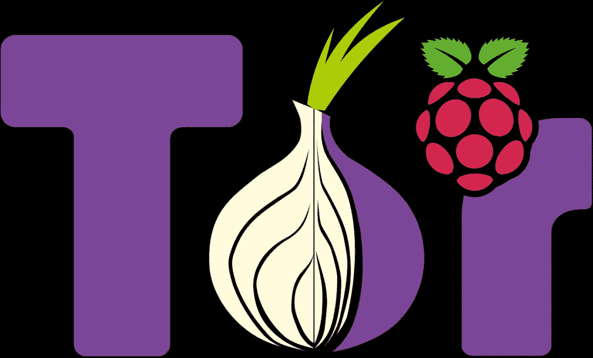

# 在 Raspberry Pi 上构建 Tor 桥中继

> 原文：<https://medium.com/codex/building-a-tor-bridge-relay-on-raspberry-pi-e78a2e4eed77?source=collection_archive---------0----------------------->

帮助绕过审查，促进自由开放的互联网

# 你为什么要这么做？

Tor 是一个分布式网络，通过分布式中继网络发送流量，为流量增加了一定程度的匿名性。这些中继是众所周知的，有一个公共目录，可以被互联网服务提供商和政府封锁，以防止进入 Tor…