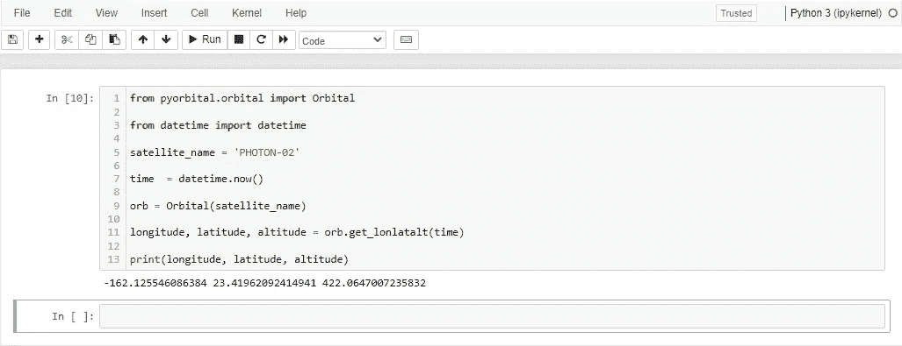
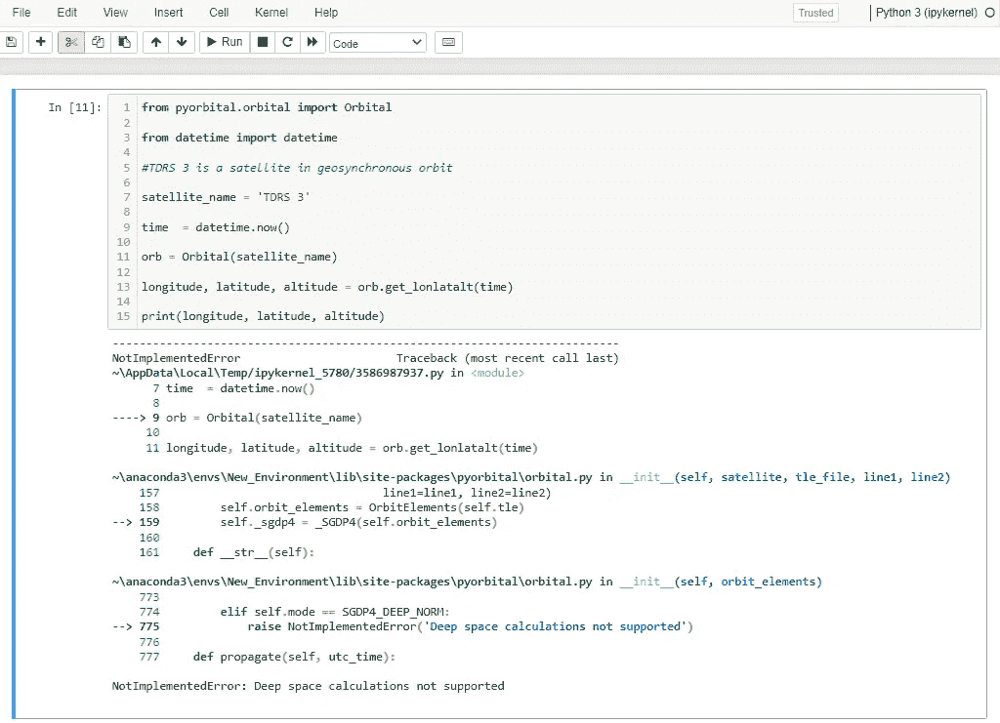
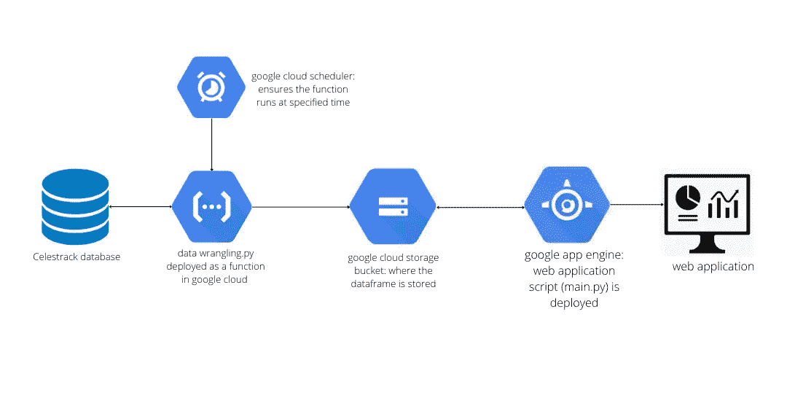
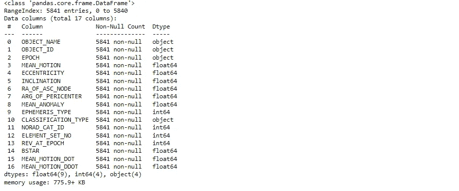
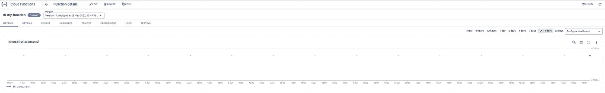

# 为主动低地球轨道卫星构建 web 应用程序

> 原文：<https://medium.com/codex/building-a-web-application-for-active-low-earth-orbit-satellites-74fcafb16df?source=collection_archive---------21----------------------->

## **简介**

最近，我的一个活跃的兴趣是“空间”。你会看到我观看火箭发射和最终卫星部署(大多数时候是动画部署)进入轨道的现场直播。

看到不同的工程领域(材料、推进、仪器、软件、流体等)如何确保火箭发射成功总是令人着迷的。

我想开发一个 web 应用程序，其中的数据几乎是实时变化的，并且显示卫星如何改变绕地球运行的位置似乎是一个完美的选择。因此，我决定建立一个显示低地球轨道上活跃卫星位置的系统(稍后我会详细说明为什么要在轨道上运行)


由 [SpaceX](https://unsplash.com/@spacex?utm_source=unsplash&utm_medium=referral&utm_content=creditCopyText) 在 [Unsplash](https://unsplash.com/s/photos/rocket?utm_source=unsplash&utm_medium=referral&utm_content=creditCopyText) 上拍摄的照片

**Pyorbital**

Pyorbital 是一个 python 库，提供关于卫星在轨道上的位置的数据。该库使用所谓的“TLEs(双线元素集)[](https://en.wikipedia.org/wiki/Two-line_element_set)*”条目，用于后端的单个卫星，以找到卫星的位置。*

*一个只需要提供卫星名称，和感兴趣的时间，图书馆照顾其余如下所示；*

**

*使用 Pyorbital 库查找卫星的位置*

*Pyorbital 有一个限制。只能用于近地轨道(LEO-轨道，高度在 160km 到 2000km 之间)的卫星(阅读更多轨道分类[*https://en . Wikipedia . org/wiki/List _ of _ orbits #:~:text = planet % 20 Uranus。-，高度% 20 分类% 20 对于% 20 地心% 20 轨道，-% 5b 编辑%5D*](https://en.wikipedia.org/wiki/List_of_orbits#:~:text=planet%20Uranus.-,Altitude%20classifications%20for%20geocentric%20orbits,-%5Bedit%5D)*

*当该库用于低地球轨道以外的其他轨道的卫星时，它返回“NotImplementedError:不支持深空计算”，如下所示；*

**

*对于不在低地球轨道的卫星，轨道库返回 NotImplementedError*

***工作流程***

*构建 web 应用程序的工作流程如下所示；*

**

*构建 web 应用程序的工作流*

*为了建立网络应用程序，我需要活跃卫星上的数据，这正是 https://celestrak.com/NORAD/elements/?的 CelesTrak 数据库( [*FORMAT = JSON #:~:text = or % 20so)% 20 bright-，Active%20Satellites，-Analyst % 20 satellites*](https://celestrak.com/NORAD/elements/?FORMAT=json#:~:text=or%20so)%20Brightest-,Active%20Satellites,-Analyst%20Satellites)*)*提供*。**

***数据扯皮. py 文件***

*总之，data wrangling.py 从 CelesTrak 数据库中访问数据，清理数据并将清理后的数据帧存储在 google 云存储桶中。*

*下面详细解释 data wrangling.py 文件；*

*   *将活动卫星数据读入数据帧并检查数据帧的信息属性*

```
*import pandas as pd active_sat_df = pd.read_csv(‘https://celestrak.com/NORAD/elements/gp.php?GROUP=active&FORMAT=csv')active_sat_df.info()*
```

**

*数据帧的信息属性*

*由于 Pyorbital 的限制，低地球轨道上的活动卫星需要从活动卫星数据帧中滤除。*

*为了做到这一点，我参考了低地球轨道的另一个定义，即“平均运动和偏心率”。*

> *一个**近地轨道** ( **狮子座**)是一个靠近行星的[地球中心轨道](https://en.wikipedia.org/wiki/Geocentric_orbit)，通常被指定为具有 128 分钟或更少的[轨道周期](https://en.wikipedia.org/wiki/Orbital_period)(使得每天至少 11.25 个轨道(每天轨道指的是平均运动)和小于 0.25 的[偏心率](https://en.wikipedia.org/wiki/Orbital_eccentricity)。(来源:[https://en.wikipedia.org/wiki/Low_Earth_orbit](https://en.wikipedia.org/wiki/Low_Earth_orbit))*

```
*#active satellites in the low earth filtered out of the active satellites DataFrame using Mean Motion and Eccentricity features of the satellites.active_leo_sat_df = active_sat_df.loc[(active_sat_df[‘MEAN_MOTION’]>=11.25) & (active_sat_df[‘ECCENTRICITY’]<0.25)]#reset the indexactive_leo_sat_df.reset_index(drop = True, inplace = True)*
```

*因为 Pyorbital 库只需要卫星名称(在本例中是 OBJECT_NAME)和时间，所以我决定删除 OBJECT_ID 之外的所有其他列。*

```
*#dropping all other columnsactive_leo_sat_df = active_leo_sat_df.drop(active_leo_sat_df.loc[:,’EPOCH’:’MEAN_MOTION_DDOT’], axis = 1)*
```

*OBJECT_ID 列包含每颗卫星的国际指示符，国际指示符数据的第一部分是卫星的发射年份(*来源:*[*https://en.wikipedia.org/wiki/International_Designator*](https://en.wikipedia.org/wiki/International_Designator))。我决定仅用数据的第一部分替换 OBJECT_ID 列数据，以获得低地球轨道上每颗活动卫星的发射年份，重命名这些列并删除重复的数据(如果有的话)。*

```
*#replace the OBJECT_ID column data with the first part of the datafor object_id in active_leo_sat_df['OBJECT_ID']:

    if '-' in object_id:

        index = object_id.find('-')

        object_id_format = object_id[0:index]

        active_leo_sat_df['OBJECT_ID'] =  active_leo_sat_df['OBJECT_ID'].replace(to_replace = object_id, value = object_id_format)

    else:

        pass#rename the columnsactive_leo_sat_df.columns = ['ObjectName', 'YearOfLaunch']#dropping duplicates if anyactive_leo_sat_df = active_leo_sat_df.drop_duplicates(subset = 'ObjectName')active_leo_sat_df.reset_index(drop = True, inplace = True)*
```

*CelesTrak 还提供根据用途对卫星进行分组的数据，如通信、天气、地球观测、导航等，我想我可以为网络应用程序使用更多的信息。因此，我将每个类别中的所有链接收集到一个列表中。*

```
*#collecting all the data links in each category into a listweather_sat_list = ['[https://celestrak.com/NORAD/elements/gp.php?GROUP=weather&FORMAT=csv'](https://celestrak.com/NORAD/elements/gp.php?GROUP=weather&FORMAT=csv'),

                    '[https://celestrak.com/NORAD/elements/gp.php?GROUP=noaa&FORMAT=csv'](https://celestrak.com/NORAD/elements/gp.php?GROUP=noaa&FORMAT=csv'),

                    '[https://celestrak.com/NORAD/elements/gp.php?GROUP=goes&FORMAT=csv'](https://celestrak.com/NORAD/elements/gp.php?GROUP=goes&FORMAT=csv')]earth_observation_sat_list = ['[https://celestrak.com/NORAD/elements/gp.php?GROUP=resource&FORMAT=csv'](https://celestrak.com/NORAD/elements/gp.php?GROUP=resource&FORMAT=csv'),

                              '[https://celestrak.com/NORAD/elements/gp.php?GROUP=sarsat&FORMAT=csv'](https://celestrak.com/NORAD/elements/gp.php?GROUP=sarsat&FORMAT=csv'),

                              '[https://celestrak.com/NORAD/elements/gp.php?GROUP=dmc&FORMAT=csv'](https://celestrak.com/NORAD/elements/gp.php?GROUP=dmc&FORMAT=csv'),

                              '[https://celestrak.com/NORAD/elements/gp.php?GROUP=tdrss&FORMAT=csv'](https://celestrak.com/NORAD/elements/gp.php?GROUP=tdrss&FORMAT=csv'),

                              '[https://celestrak.com/NORAD/elements/gp.php?GROUP=argos&FORMAT=csv'](https://celestrak.com/NORAD/elements/gp.php?GROUP=argos&FORMAT=csv'),

                              '[https://celestrak.com/NORAD/elements/gp.php?GROUP=planet&FORMAT=csv'](https://celestrak.com/NORAD/elements/gp.php?GROUP=planet&FORMAT=csv'),

                              '[https://celestrak.com/NORAD/elements/gp.php?GROUP=spire&FORMAT=csv'](https://celestrak.com/NORAD/elements/gp.php?GROUP=spire&FORMAT=csv')]communications_sat_list = ['[https://celestrak.com/NORAD/elements/gp.php?GROUP=intelsat&FORMAT=csv'](https://celestrak.com/NORAD/elements/gp.php?GROUP=intelsat&FORMAT=csv'),

                  '[https://celestrak.com/NORAD/elements/gp.php?GROUP=ses&FORMAT=csv'](https://celestrak.com/NORAD/elements/gp.php?GROUP=ses&FORMAT=csv'),

                  '[https://celestrak.com/NORAD/elements/gp.php?GROUP=iridium&FORMAT=csv'](https://celestrak.com/NORAD/elements/gp.php?GROUP=iridium&FORMAT=csv'),

                  '[https://celestrak.com/NORAD/elements/gp.php?GROUP=iridium-NEXT&FORMAT=csv'](https://celestrak.com/NORAD/elements/gp.php?GROUP=iridium-NEXT&FORMAT=csv'),

                  '[https://celestrak.com/NORAD/elements/gp.php?GROUP=starlink&FORMAT=csv'](https://celestrak.com/NORAD/elements/gp.php?GROUP=starlink&FORMAT=csv'),

                  '[https://celestrak.com/NORAD/elements/gp.php?GROUP=oneweb&FORMAT=csv'](https://celestrak.com/NORAD/elements/gp.php?GROUP=oneweb&FORMAT=csv'),

                  '[https://celestrak.com/NORAD/elements/gp.php?GROUP=orbcomm&FORMAT=csv'](https://celestrak.com/NORAD/elements/gp.php?GROUP=orbcomm&FORMAT=csv'),

                  '[https://celestrak.com/NORAD/elements/gp.php?GROUP=globalstar&FORMAT=csv'](https://celestrak.com/NORAD/elements/gp.php?GROUP=globalstar&FORMAT=csv'),

                  '[https://celestrak.com/NORAD/elements/gp.php?GROUP=swarm&FORMAT=csv'](https://celestrak.com/NORAD/elements/gp.php?GROUP=swarm&FORMAT=csv'),

                  '[https://celestrak.com/NORAD/elements/gp.php?GROUP=amateur&FORMAT=csv'](https://celestrak.com/NORAD/elements/gp.php?GROUP=amateur&FORMAT=csv'),

                  '[https://celestrak.com/NORAD/elements/gp.php?GROUP=x-comm&FORMAT=csv'](https://celestrak.com/NORAD/elements/gp.php?GROUP=x-comm&FORMAT=csv'),

                  '[https://celestrak.com/NORAD/elements/gp.php?GROUP=other-comm&FORMAT=csv'](https://celestrak.com/NORAD/elements/gp.php?GROUP=other-comm&FORMAT=csv'),

                  '[https://celestrak.com/NORAD/elements/gp.php?GROUP=satnogs&FORMAT=csv'](https://celestrak.com/NORAD/elements/gp.php?GROUP=satnogs&FORMAT=csv'),

                  '[https://celestrak.com/NORAD/elements/gp.php?GROUP=gorizont&FORMAT=csv'](https://celestrak.com/NORAD/elements/gp.php?GROUP=gorizont&FORMAT=csv'),

                  '[https://celestrak.com/NORAD/elements/gp.php?GROUP=raduga&FORMAT=csv'](https://celestrak.com/NORAD/elements/gp.php?GROUP=raduga&FORMAT=csv'),

                  '[https://celestrak.com/NORAD/elements/gp.php?GROUP=molniya&FORMAT=csv'](https://celestrak.com/NORAD/elements/gp.php?GROUP=molniya&FORMAT=csv')]navigation_sat_list = ['[https://celestrak.com/NORAD/elements/gp.php?GROUP=gnss&FORMAT=csv'](https://celestrak.com/NORAD/elements/gp.php?GROUP=gnss&FORMAT=csv'),

                '[https://celestrak.com/NORAD/elements/gp.php?GROUP=gps-ops&FORMAT=csv'](https://celestrak.com/NORAD/elements/gp.php?GROUP=gps-ops&FORMAT=csv'),

                '[https://celestrak.com/NORAD/elements/gp.php?GROUP=glo-ops&FORMAT=csv'](https://celestrak.com/NORAD/elements/gp.php?GROUP=glo-ops&FORMAT=csv'),

                '[https://celestrak.com/NORAD/elements/gp.php?GROUP=galileo&FORMAT=csv'](https://celestrak.com/NORAD/elements/gp.php?GROUP=galileo&FORMAT=csv'),

                '[https://celestrak.com/NORAD/elements/gp.php?GROUP=beidou&FORMAT=csv'](https://celestrak.com/NORAD/elements/gp.php?GROUP=beidou&FORMAT=csv'),

                '[https://celestrak.com/NORAD/elements/gp.php?GROUP=sbas&FORMAT=csv'](https://celestrak.com/NORAD/elements/gp.php?GROUP=sbas&FORMAT=csv'),

                '[https://celestrak.com/NORAD/elements/gp.php?GROUP=nnss&FORMAT=csv'](https://celestrak.com/NORAD/elements/gp.php?GROUP=nnss&FORMAT=csv'),

                '[https://celestrak.com/NORAD/elements/gp.php?GROUP=musson&FORMAT=csv'](https://celestrak.com/NORAD/elements/gp.php?GROUP=musson&FORMAT=csv')]scientific_sat_list = ['[https://celestrak.com/NORAD/elements/gp.php?GROUP=science&FORMAT=csv'](https://celestrak.com/NORAD/elements/gp.php?GROUP=science&FORMAT=csv'),

                    '[https://celestrak.com/NORAD/elements/gp.php?GROUP=geodetic&FORMAT=csv'](https://celestrak.com/NORAD/elements/gp.php?GROUP=geodetic&FORMAT=csv'),

                    '[https://celestrak.com/NORAD/elements/gp.php?GROUP=engineering&FORMAT=csv'](https://celestrak.com/NORAD/elements/gp.php?GROUP=engineering&FORMAT=csv'),

                    '[https://celestrak.com/NORAD/elements/gp.php?GROUP=education&FORMAT=csv'](https://celestrak.com/NORAD/elements/gp.php?GROUP=education&FORMAT=csv')]miscellaneous_sat_list = ['[https://celestrak.com/NORAD/elements/gp.php?GROUP=military&FORMAT=csv'](https://celestrak.com/NORAD/elements/gp.php?GROUP=military&FORMAT=csv'),

                          '[https://celestrak.com/NORAD/elements/gp.php?GROUP=radar&FORMAT=csv'](https://celestrak.com/NORAD/elements/gp.php?GROUP=radar&FORMAT=csv'),

                          '[https://celestrak.com/NORAD/elements/gp.php?GROUP=cubesat&FORMAT=csv'](https://celestrak.com/NORAD/elements/gp.php?GROUP=cubesat&FORMAT=csv'),

                          '[https://celestrak.com/NORAD/elements/gp.php?GROUP=other&FORMAT=csv'](https://celestrak.com/NORAD/elements/gp.php?GROUP=other&FORMAT=csv')]*
```

*然后我定义了一个函数。*

*   *读取每个列表中的所有链接。*
*   *连接单个链接中的数据。*
*   *删除不需要的列，并重命名剩下的唯一一列。*

```
*#function to read all the links in a list, concatenates data from the individual link, drop unwanted columns and rename the only column left.def sat_classification(sat_list):

    df = pd.DataFrame()

    for url in sat_list:

        sats_df = pd.read_csv(url)

        df = pd.concat([df, sats_df])

    df.reset_index(drop = True, inplace = True)

    df = df.drop(df.loc[:,'OBJECT_ID':'MEAN_MOTION_DDOT'], axis = 1)

    df.columns = ['ObjectName']

    return df*
```

*然后，我可以使用该函数按用途获取每个卫星类别的数据(DataFrame ),并创建一个名为“用途”的新列。*

```
*weather_sat_df = sat_classification(weather_sat_list)weather_sat_df['Purpose'] = 'Weather'earth_observation_sat_df = sat_classification(earth_observation_sat_list)earth_observation_sat_df['Purpose'] = 'Earth Observation'communications_sat_df = sat_classification(communications_sat_list)communications_sat_df['Purpose'] = 'Communications'navigation_sat_df = sat_classification(navigation_sat_list)navigation_sat_df['Purpose'] = 'Navigation'scientific_sat_df = sat_classification(scientific_sat_list)scientific_sat_df['Purpose'] = 'Scientific'miscellaneous_sat_df = sat_classification(miscellaneous_sat_list)miscellaneous_sat_df['Purpose'] = 'Miscellaneous'*
```

*之后，我将所有单独的卫星类别数据帧连接成一个主数据帧。*

```
*master_df = pd.concat([weather_sat_df, earth_observation_sat_df, communications_sat_df, navigation_sat_df, scientific_sat_df, miscellaneous_sat_df])master_df.reset_index(drop = True, inplace = True)*
```

*然后，我使用“ObjectName”列作为合并/连接条件，将低地球轨道数据帧中的活动卫星与主数据帧合并，合并类型为左类型…类似于在 SQL 中使用左外连接查询。*

```
*active_leo_sat_df = pd.merge(active_leo_sat_df, master_df, how ='left', on =['ObjectName'])*
```

*这是使用两个数据帧中的对象名称相等/相同的条件，向低地球轨道数据帧中的活动卫星添加额外的列“目的”。*

*最后，对于不符合条件的 ObjectName，我将目的列中的“nan”替换为“Miscellaneous”，删除任何重复项，并将数据帧作为 CSV 文件保存在名为“active-leo-satellites”的 google 云存储桶中。*

```
*#replaces nan with Miscellaneous  in the purpose column
active_leo_sat_df['Purpose'] = active_leo_sat_df['Purpose'].replace(np.nan, 'Miscellaneous')#drops duplicates in the DataFrame and reset indexactive_leo_sat_df = active_leo_sat_df.drop_duplicates(subset = 'ObjectName')active_leo_sat_df.reset_index(drop = True, inplace = True)#stores the DataFrame in a google cloud storage bucket as a csvactive_leo_sat_df.to_csv('gs://active-leo-satellites/active leo satellites.csv', index = False)*
```

*完成后，我将 data wrangling.py 文件部署为 google cloud function 中的一个函数，使其成为事件驱动的。触发器是一个 HTTP 触发器([*)https://Europe-west 2-Leo-satellite-overview-project . cloud functions . net/my-function*](https://europe-west2-leo-satellite-overview-project.cloudfunctions.net/my-function)*)*，确保函数(data wrangling.py)在 HTTP 加载的任何时候运行。*

*每当 http 被加载时，它返回“函数成功运行”*

**

*触发该函数的 HTTP 响应*

*为了确保我不必随机加载 HTTP，我决定使用 google cloud scheduler 设置一个 cron 作业。这确保了该功能在每个午夜运行。*

**

*google 云调度程序上的 Cron 作业*

**

*函数的度量:显示函数每天运行的情况*

*这一切的美妙之处在于确保捕获新的卫星数据，同时还确保现在不活动的卫星也被从 web 应用程序中删除。*

***main.py 文件***

*在 main.py 文件中，我读取了由 data wrangling.py 文件生成的 CSV 文件，然后继续使用 Dash 库为 web 应用程序创建 web 框架，并使用 Plotly 库创建可视化。*

*main.py 文件可以在[这里](https://github.com/0ladayo/Low-Earth-Orbit-Satellites-Project/blob/master/Dash-Plotly/main.py)找到。*

*通过运行 main.py 文件生成的 web 应用程序在本地计算机上运行，因此为了能够与其他人共享 web 应用程序，我必须将它部署到 google app engine。*

*main.py 文件以及 requirements.txt 文件(使用的库的名称)、assets 文件夹(包含一个 CSS 文件，用于设置 web 应用程序的背景颜色和边距)和 app.yaml(设置应用程序引擎的文件)随后被部署到 google 应用程序引擎。*

***快速洞察***

*自 2019 年以来，发射到低地球轨道的卫星数量逐年增加，这主要是因为发射了越来越多的通信卫星(主要是 Starlink 和 OneWeb ),为地球上的每个地方提供互联网。*

*随着更多的通信卫星(Kuiper，ASTS)项目在未来几年投入运营，这种增长趋势肯定会继续下去。*

*这里可以看到[的网络应用](https://leo-satellite-overview-project.nw.r.appspot.com/)。*

*这里可以找到[的储存库](https://github.com/0ladayo/Low-Earth-Orbit-Satellites-Project)。*

*在[*https://medium.com/me/stories/public*](/me/stories/public)阅读我的其他帖子*

*有趣的事实:一枚较低高度的火箭可以进入轨道，而另一枚较高高度的火箭可能无法进入轨道(这次发射高度为 531 公里，速度为 6.5 公里/秒[*https://youtu.be/HztFm2XGO7s?t=8420*](https://youtu.be/HztFm2XGO7s?t=8420)没有进入轨道，而这次发射[*https://youtu.be/6nODVPGHQcc*](https://youtu.be/6nODVPGHQcc)进入轨道高度为 216 公里，速度为 7.93 公里/秒)。*

*虽然轨道高度从大约 160 公里开始，但确保火箭发射到达轨道的是火箭的行进速度必须达到大约 7.5 公里/秒的轨道速度*

*感谢您的阅读。*