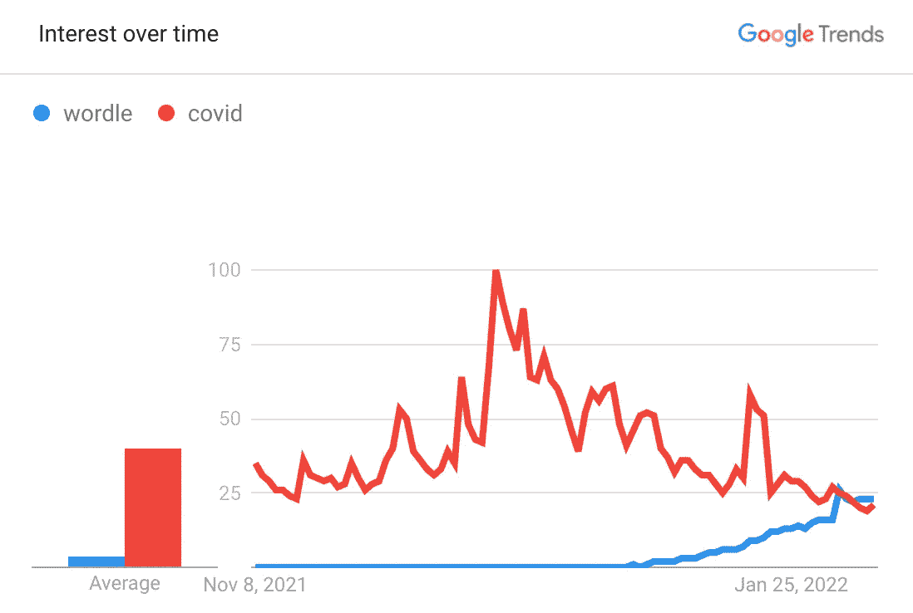

# 用 Python 构建 Wordle 求解器

> 原文：<https://medium.com/codex/building-a-wordle-solver-with-python-77e3c2388d63?source=collection_archive---------2----------------------->

解决率超过 99%！

鉴于我写的最后一件事是用 Python 创建一个[数独解算器，并且我的 Wordle 分数在过去几天里受到了打击——我萌生了建造一个“Wordle 机器人”的想法，看看它是否能被击败。](/codex/building-a-simple-sudoku-solver-in-python-with-numpy-1a8ea6f5bff5)

你可以在我的笔记本[这里](https://github.com/jack-cook-repo/wordle-solver/blob/main/Wordle%20solver%20-%20exploration.ipynb)跟随任何代码，我计划做一个后续的工作，我会把它移动到 [Streamlit](https://streamlit.io/) 应用程序(一个用于构建简单应用程序的 Python 库)——如果我这样做，我会把代码移动到 Python 文件中。

# 沃尔多是什么？

对于外行人来说，Wordle 是一款基于浏览器的免费游戏,自去年 10 月发布以来已经在社交媒体上掀起了风暴。

它甚至被《纽约时报》以 7 位数的价格收购。

Wordle 变得比 COVID 更受欢迎，来源:[谷歌趋势](https://trends.google.com/trends/explore?date=today%203-m&geo=GB&q=wordle,covid)

游戏本身足够简单。你有 6 次机会猜测一个 5 个字母的单词，每次你猜的字母被涂上如下颜色:

*   **绿色**:正确的字母，正确的位置
*   **黄色:**字母不对，位置不对
*   **无颜色**:字母错误

一个示例游戏可能是这样的:

猜单词 4 个回合，[来源](https://en.wikipedia.org/wiki/Wordle)

正如你所想象的，不同的 5 个字母的单词有很多种可能，但是一定有一些逻辑可以帮助我们解决这个问题。

# 获取数据

第一步是获得一个可能的 5 个字母单词的列表，这些单词可以用作答案。

幸运的是，在对 stackexchange 上的[这个宝石](https://puzzling.stackexchange.com/a/114518)进行了一番挖掘和摸索之后，我发现 Wordle 应用程序本身使用了两个单词列表:

*   2315 个可能的 5 个字母的列表**答案**单词
*   一个包含 10，657 个可能的 5 个字母的参考单词的列表(没有一个用于回答，但是可以用作猜测)

这两个列表背后的逻辑似乎是，前者是一个更“常见”的单词列表，更有理由期待人们去猜测。

10，657 列表是从答案中排除的“有效”5 个字母单词的剩余部分。

无论哪种方式，你都可以在这里找到这两个列表[。对于这一点，不出所料，我们将使用](https://www.powerlanguage.co.uk/wordle/main.e65ce0a5.js)[2315 个单词列表](https://github.com/jack-cook-repo/wordle-solver/blob/main/answers.txt)作为我们的潜在猜测列表(列表`var La`)。

# 一个策略

马库斯·温克勒在 [Unsplash](https://unsplash.com?utm_source=medium&utm_medium=referral) 上的照片

在我们开始编写游戏和策略之前，我们需要一个计划。乱猜单词没那么有帮助，那么我们的策略应该是什么呢？

我们要猜单词**排除尽可能多的错误答案**。我们可以通过数字母来做到这一点。

[正如我在开始时提到的，你可以用我的笔记本[跟随本文中的所有代码，或者只是跟随截图]](https://github.com/jack-cook-repo/wordle-solver/blob/main/Wordle%20solver%20-%20exploration.ipynb)

让我们从可能的答案集中的单词开始，找出每个位置的字母。

作者图片

为了消除位置 1 中尽可能多的错误字母，我们想知道字母在列 1 中出现的频率，并选择我们猜测中最常见的一个。

作者图片

所以对于位置 1，字母‘A’出现了 141 次，字母‘B’出现了 173 次。因此，要缩小位置 1 的范围，以字母“B”开头的单词比“A”更合适。

为了通过猜测消除尽可能多的错误*答案*，您需要选择一个单词来消除**所有**位置上尽可能多的字母。

为了做到这一点，我们的策略是计算每个位置的字母数量，并选择所有位置中字母出现频率最高的单词。

使用上述逻辑，Wordle 的最佳初始猜测是**‘SLATE’**，5 个位置的组合频率为 1，437。

这种方法并不完美，因为它会重复计算频繁出现的字母(例如，位置 4 和 5 是“ER”，4 中“E”和 5 中“R”的频率会分别计入我们的频率)。但是，正如我们将在后面看到的，这种方法已经足够好了。

# 编码第 1 部分:Game()类

足够的计划。现在我们可以开始编码了！

首先，我们希望能够使用 Python 类创建一个**游戏**。

对于那些不熟悉类的人来说，它们是 Python 中面向对象编程(OOP)的基石。在*非常高的层次上，它们是可以拥有属性(特性)和功能(方法)的“事物”。*

举个例子 Python 中的“Dog”类可以有高度/颜色/重量属性和一个`bark()`方法。

对于我们的用例，我们希望能够创建一个**游戏**类。

## 那么我们的游戏类应该包含什么呢？

如果我们远离这个 Python 问题，我们希望在我们的 Wordle 游戏中的任何给定时间知道这些事情:

*   哪些字母我们猜对了，在什么位置
*   字母表中的哪些字母我们还能猜出来(排除任何不正确的猜测之后)
*   哪些字母放错了位置(正确的字母，错误的位置—突出显示的黄色)
*   还有哪些可能的 5 个字母答案
*   对于剩余的 5 个可能的字母答案，字母在 5 个位置中的出现频率(让我们猜测)

我们可以通过我们的**构造函数**或者众所周知的`__init__`来实现。这只是一个奇特的函数，当我们使用游戏类创建一个对象时，它会设置属性。

作者图片

然后我们可以简单地通过调用`MyGame = Game(df_words_5l)`来创建我们的类(使用我们之前创建的数据框架)。

如果你试一下，然后试一下`MyGame.possible_letters`，你应该会看到字母表中所有字母的列表，因为我们还没有删除任何一个！

## 这些功能

正如我之前提到的，我将在这里分享截图，但是你可以在笔记本的[中看到任何源代码。](https://github.com/jack-cook-repo/wordle-solver/blob/main/Wordle%20solver%20-%20exploration.ipynb)

如果你还记得我们上面的策略部分，我们需要能够根据可能单词的数据框架中的 5 个位置中的每一个位置有多少个字母来计算每个单词的“频率分数”。

作者图片

现在我们可以得分了！我们可以用这个来猜测。

作者图片

该数据帧的顶行可以用作我们每回合的猜词，因为它具有最高的频率分数。

从我们的可能单词列表中筛选出包含正确字母的单词(例如位置 1 中的“S”)非常简单。过滤那些不包含不正确字母的**和**也很简单。然而，过滤放错位置的字母要复杂得多。

作者图片

该功能依赖于我们首先过滤可能答案的数据帧以得到正确答案，并过滤出放错位置的字母——过滤出字母出现在放错位置的行。希望文档能清楚地说明这一点！

现在，我们游戏类的最后一个难题是**如何根据猜测更新属性，以及结果**。

以下代码来自`update`函数，该函数采用以下参数:

*   **猜:** 5 个字母的字符串
*   **结果:**以[N，N，N，N，N]的格式列出，其中 0 是不正确的，1 是放错了位置，2 是正确的，相对于我们的猜测

这第一块处理我们的输入，然后处理正确的答案。

作者图片

为了获得正确答案，我们要删除任何之前放错位置、现在已经被正确猜测的字母(例如，猜测 1 中位置 3 的“E”是黄色的，而猜测 2 中位置 2 的“E”是绿色的)。我们还想过滤可能答案的数据框架。

第二块有点棘手。放错的信需要:

*   在可能的答案数据帧中筛选出在错误位置包含错误字母的单词
*   **计算**以处理我们可能有> 1 个相同字母放错位置的情况(例如 2 个放错位置的‘E’)！

作者图片

`numpy.vectorize`在数据帧上运行函数比标准数据帧快得多。apply(有过惨痛的教训)。

请记住，我们的`check_misplaced_letters`功能只是检查数据帧中的剩余单词是否包含至少**相同数量的错位字母。**

这个函数的最后一部分处理不正确的字母，将它们从可能猜测的字母列表中删除，然后相应地过滤可能答案的数据框架。

作者图片

*一个警告是，一封信可能是“不正确的”，但仍然是我们有效信件列表的一部分。

如果答案是“珍珠”,而我们的猜测是“输入”,我们猜测中的第一个“E”将显示为黄色(放错了位置),但第二个不会突出显示(不正确)。

这只说明单词中没有 2 个 E，并不是说 E 是不正确的字母！所以我们在筛选可能的字母列表时必须小心。

## 快速测试

在我们着手构建一些可以为我们玩游戏的东西之前，让我们在今天(2022 年 2 月 9 日)的世界里尝试一下使用我们的新类。

作者图片

还不错！虽然我是英国人，但我不确定我是否同意幽默的拼写..

证明！

# 编码第 2 部分:游戏功能

现在我们有游戏了！为了验证上述内容不是偶然的，我们需要一些可以:

*   为我们创建一个 Game()的实例(一个“实例”就是当你设置一些东西时，例如`MyGame = Game(dataframe)`)
*   取一个目标词，根据该目标词评估一个猜测，给我们一个结果列表
*   将结果反馈给我们的 Game()实例，并计算我们的下一个猜测
*   循环上面的步骤，直到所有的字母都正确(结果= `[2,2,2,2,2]`)，或者猜对了 6 次

接下来的代码部分摘自[本本](https://github.com/jack-cook-repo/wordle-solver/blob/main/Wordle%20solver%20-%20exploration.ipynb)中的`play_game`函数，整篇文章中都有链接。这个函数接受`target_word`、`df_possible_words`(用于构造我们的游戏类)和`debug`的参数，我将在后面介绍。

我们首先初始化游戏，然后猜一猜。然后，我们首先检查正确的字母，因为这些字母最容易处理。

作者图片

函数中的下一段代码查看剩余的字母(位置)。如果没有剩余的位置(正确的猜测)，我们可以在这里打破循环，或者继续玩。

然后，我们检查剩余的目标字母，并检查我们的猜测字母是否在目标单词中至少出现一次。

假设我们猜的是‘东西’，目标是‘图表’。' h '是正确的，所以我们排除位置 2，留下' T_ING '和' C_ART '。我们希望在猜测中用 1 标记 T，其余的用 0 标记。

作者图片

这种复杂性的部分原因是由于双字母。如果我们猜测“GREET ”,而目标是“STAGE ”,我们希望将第一个**标记为“放错位置”( 1 ),而将第二个标记为“不正确”( 0)。**

我将把函数的最后一部分留在这里，因为它主要是调试或输出相关的，通过它的使用可以更好地显示出来。

设置`debug=True`打印每轮的猜测和结果，而设置`debug=False`则在游戏结束后返回 2 个结果(正确的猜测或 6 轮通过)——目标单词和回合数。

让我们用`debug=True`试一试。

到目前为止一切顺利　‘

然而，为了真正刺激这种方法，我们想在所有的*2315 个可能的答案上进行测试，看看效果如何。这是`debug=False`的工作。*

循环所有单词

我想使用数据帧可能会减慢这个速度。可能有更有效的方式来运行我的代码，但是一次性 2 分钟也不错！

作者图片

好消息——我们平均只需*超过*3.5 圈就能解决**任何**字谜！

坏消息是——我们有 13 个单词打败了我们的工具。

那些逃走的人

在花了一些时间一步一步地挖掘这些之后，似乎这些都是我们的工具不能处理的不幸的边缘情况。

我想有一种方法可以改善这一点——也许排除或降低过去 Wordle 答案的权重可能会有所帮助——但 2302/2315 (99.4%)的命中率已经相当不错了！

# 结论

我们能够建造一些相当成功的东西！

如果你对如何击败前 13 名或任何其他改进有任何想法，请告诉我。

作为下一步，我可能会将它构建成一个 Streamlit 应用程序，使它更具交互性。

上面的所有代码都是从[的这个笔记本](https://github.com/jack-cook-repo/wordle-solver/blob/main/Wordle%20solver%20-%20exploration.ipynb)中摘录的。感谢阅读！