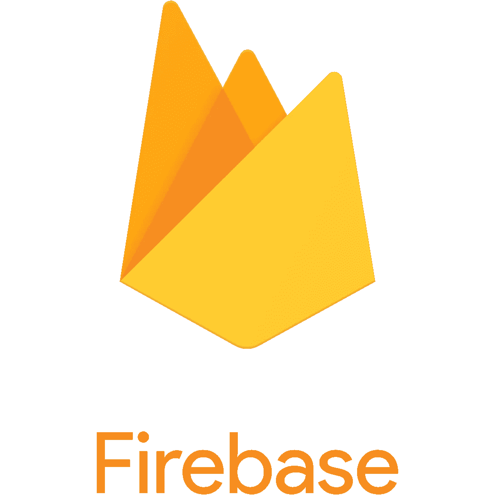

# 颤动的丑陋真相

> 原文：<https://medium.com/codex/building-an-app-from-scratch-part-3-b0b40db3ecee?source=collection_archive---------2----------------------->

## 从头开始构建应用程序:第 3 部分

在本系列的 [**第 0 部分**](/@garrdbyrd/building-an-app-from-scratch-part-0-f93c9a4c62b) 中，我表达了对利用图形数据库以及 GraphQL 来管理我的未来社交媒体应用 Gotu 的后端的强烈兴趣。在 [**第 1 部分**](/@garrdbyrd/building-an-app-from-scratch-part-1-43e64987ccfa) 中，我提供了使用 Flutter 代替 Javascript 框架的优势和权衡的高级概述。

如果我为一个数百万(十亿？)美元公司需要生产一种安全的产品，这超出了遵循行业标准的合理范围(同样，类似 React/React Native)。然而，我没有那样做。如果我现在还没有把它敲进去的话，Flutter 是一个新兴的框架，有它独特的问题和优势。

让我们考虑一下 Python 的时间轴和该语言的一些常见包。Python 在 1991 年有了第一个[版本](https://www.geeksforgeeks.org/history-of-python/)，1.0 直到 1994 年 1 月才发布。NumPy 的[初始版本](https://pypi.org/project/numpy/1.0/#history)和 1.0 直到 2006 年才发布。Matplotlib 在 2004 年发布了第一个版本[,但是直到 2010 年才发布 1.0。SciPy 的](https://matplotlib.org/stable/users/release_notes.html)[初始版本](https://docs.scipy.org/doc/scipy/release.0.7.0.html)于 2001 年问世，但软件包直到 2017 年才达到 1.0。

如果你还不明白:编程语言会随着时间的推移而成长、成熟并变得标准化——有时需要几十年的时间。如果你看一下状态管理解决方案的官方文档，它提供了 14 个不同的选项。虽然，只有大约 5 个有相当大的优点。这还是很多的！当然，这个问题仍然存在于内部层面:项目组织、状态管理等。

这些问题的出现对外部产生了更大的影响。也就是说，在 API 的情况下。如果你不知道 API(应用程序编程接口)是什么，就把它想象成计算机通信的方式。API 是各种软件和服务之间最快、最有效通信级别。例如，允许您将脸书登录用于许多其他服务的底层代码和协议。这是红帽公司关于这个主题的一页。

自从我第一次深入了解后端开发以来，API 的问题一直是我最关心的问题。最初，我的目标是利用图形数据库后端开发 Gotu，并通过 GraphQL 进行交互。也许我被有争议的[史蒂夫·沃尔夫勒姆](https://en.wikipedia.org/wiki/Stephen_Wolfram)所左右，陷入了对[图](https://en.wikipedia.org/wiki/Graph_theory)和[超图](https://en.wikipedia.org/wiki/Hypergraph)的神秘热爱中，并且很可能是尖端技术的吸引将我吸引进来。实际上，我需要先走后跑。

我对图形后端的搜索引导我找到了两个候选者: [Dgraph](https://dgraph.io) 和 [Neo4j](https://neo4j.com) ，这是目前最流行的两个图形数据库服务。

技术上有*一个 dart 包*与 Dgraph 通信并充当临时 API ( [链接](https://pub.dev/packages/dgraph))，但截至本文发布时，这个包已经一年多没有更新了。

对于后者，有[*neo4driver*](https://pub.dev/packages/neo4driver)*Dart*包。它最近在两个月前更新过，但似乎只由一个人维护，没有重要的追随者。我对这个项目作为我的解决方案抱有很高的期望，但是这个包抛出了一个关于正在运行的 Flutter 版本的持久错误。**

**我也考虑过 [AWS Neptune](https://aws.amazon.com/neptune/faqs/) (亚马逊网络服务的图形数据库解决方案)，它在技术上也有一个 Dart 包([链接](https://pub.dev/packages/aws_neptune_api))，但是在这一点上我决定转向另一个解决方案。**

# **重火力点**

****

**如果你曾经涉足移动应用或网络应用开发领域，你应该听说过 [Firebase](https://firebase.google.com) 。Firebase 是谷歌在后端即服务(BaaS)战场上的实时、基于云、基于 JSON 的 NoSQL 超级战士。**

**不仅有对添加 Firebase 到一个人的颤振应用程序的广泛支持，还有由 Firebase 维护的**官方**对颤振的支持。(这并不完全令人震惊，因为 Dart、Flutter 和 Firebase 都是谷歌的产品。)Firebase 确实是一个完整的包，提供了一系列具有良好可扩展性的分析工具。有太多的文章和视频解释了 Firebase 的细节，以及为什么它是开发世界中如此重要的力量，所以我不会在已经提出的观点上逗留。**

**为了将这种转变与我使用图形后端的最初目标进行比较，让我们重新评估一下我们的优先级。**

****(1)我想要一个性能良好的后端。****

**图形数据库一般被认为适合社交媒体平台的需求。想象一下进入社交媒体的朋友、评论、喜欢、消息和其他组件的复杂网络。它被称为社交网络是有原因的。见鬼，脸书是 2015 年发布 GraphQL 的实体。尽管如此，Gotu 可能永远不会有超过 100 个用户。比如说，对我来说，Dgraph 和 Firebase 之间的性能差异可以忽略不计。**

****(2)想学习如何搭建一个 app，获取行业知识。****

**音乐学生不会进入他们的第一堂音乐理论课就立即投入到凯奇、勋伯格和扎帕的音乐中。研究巴赫、莫扎特和贝多芬是有原因的(尽管我确实对凯奇和扎帕都情有独钟)。他们的音乐非常优秀，为西方艺术音乐(即“古典”音乐)的世界树立了标准。同样，Firebase 也是一个标准。我还在学习一些有用的东西，可以说比不太出名的基于图形的解决方案更有用。**

# **为什么要满足于我不想要的东西？**

**读者可能仍然想知道类似于:**

> **但是为什么要满足于 Firebase 呢？您需要一个图形数据库解决方案。你被迫去做别的事情，因为这可能是 Flutter 能提供的最简单的解决方案。为什么不直接使用 JavaScript 框架呢？冒险有什么好处？**

**一个艺术版的我会听林·曼努埃尔-米兰达的《马不停蹄》中的一句台词(出自*汉密尔顿的《T3》)。我会更直接——在一个已经被证实的项目上冒险是利益和损害的平衡。当然，抱着“没有规则”的心态摸索人生对个人和周围的人来说都是危险的(无论是从字面意义上还是从专业角度)。然而，在学术和工业标准的安全中度过一生，很难回报头脑的探索本性。让我们想象未来几年颤振的两种情况。***

# **案例 1: Flutter 继续存在并成为行业标准。**

**毫不夸张地说，Flutter 在移动应用领域有着重要的立足点。从 T4 的应用展示中，Google Pay、字节跳动、易贝和腾讯脱颖而出，成为巨头。这里的结论不应该令人震惊——如果这样的事情发生了，当然值得我花时间来获得关于 Flutter 框架的经验。五年后，我将拥有五年使用主流移动应用程序开发包的经验。**

# **案例 2:颤振死亡。**

**当然，这是次优选项。尽管如此，认为任何编程语言都会永远成为主流还是太天真了。更糟糕的是，有很多很多语言从未真正起步。对于颤振来说，起飞是成功的，但仍然有比我们现在的海拔更高的山。在这种情况下，“死亡”更准确地模拟了技术停滞。不过，假设 Flutter 在未来五年内功能性死亡。我会浪费时间去学习一门无用的语言吗？绝对不会。是不是所有的 Objective-C 开发人员都被踢到了路边，取代了崭露头角的 Swift 开发人员？不。事实上，在许多情况下，这两种类型的开发人员是同一个人；这是一种偏见。然而，“了解”一门编程语言(不管它真正的意思是什么)是成功的一半。真正可取的是行业知识。让我们再次考虑 Swift 的例子。当然，在 2014 年，Swift 对于一个经验丰富的 Objective-C dev 来说可能就像对于一个刚毕业的大学生一样陌生。但是，Objective-C 开发人员已经有了 app 开发领域的经验。正如我们将在后面提到的，这个职位上的人已经具备数据库、SQL/NoSQL、通用服务 API(如 Google maps)和金融机构等方面的知识。，并对该领域的预期有一个定性的感觉。**

***是的，我知道 Fortran 仍然被广泛用于科学计算，许多网站仍然使用 PHP，Objective-C 仍然得到苹果的技术支持。关键是，我提供的四个例子中的每一个都曾经是最常用的编程语言，但是现在已经淡出了人们的视线。**

# **下一步是什么？**

> **也许经理想自己写该死的登录页面……
> -乔纳森·科尔顿，《代码猴子》(2006)**

**现在，一条鹅卵石路终于从杂草丛生的云数据库森林中出现了，是时候迈出我们的第一步了。下一次，我将不会回到我在上一部分中构建的 UI。相反，我将致力于一个简单的登录页面应用程序。会有婴儿的脚步；也就是说，从一个向 Firebase 发送某种数据的按钮开始。**

**我也想在展示我的项目时稳住我的手。期待在我的 github 上对项目的第一次提交(以及许多许多后续提交)。**

**[**上一篇**](/@garrdbyrd/building-an-app-from-scratch-part-2-b7997c8d0033)**

**接下来(即将推出！)**

# **关于作者**

**非常感谢你的阅读！我是加勒特——一名应用数学研究生，音乐理论爱好者，业余爱好者作家。我的研究重点是计算流体力学，但我也对一般的偏微分方程、图/超图理论、几何代数、细胞自动机和 STEM 的许多其他领域感兴趣。**

**本系列记录了我试图从学术科学计算领域过渡到全栈应用程序开发领域的过程。**

**请随意接触，我喜欢与来自各种背景的人交谈，希望我们每个人都能在这个过程中学到一些新东西。您可以通过我的个人页面找到我:**

**[garrettbyrd.com](http://garrettbyrd.com/)**