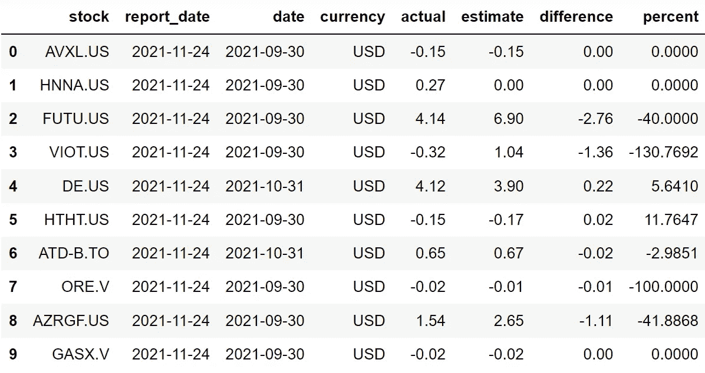
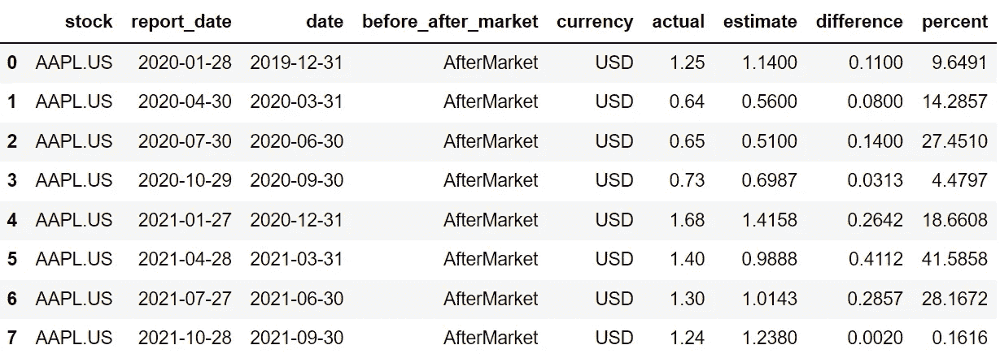
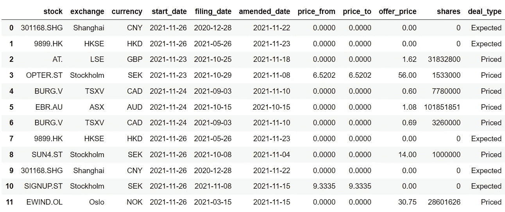

# 使用 Python 和 API 构建经济日历

> 原文：<https://medium.com/codex/building-an-economic-calendar-using-python-and-apis-9abe4a40dc9a?source=collection_archive---------2----------------------->

## 承认最近经济事件的一种简短而甜蜜的方式


尼克·希利尔在 [Unsplash](https://unsplash.com?utm_source=medium&utm_medium=referral) 上的照片

金融新闻不仅是影响股票市场的主要因素，也是另一个突出的方面，即经济事件。用简单的英语来定义，经济事件是指与公司财务相关的具有经济意义并影响股票市场和公司财务状况的事件。

就像股票筛选程序是如何构建的，以轻松获得所需股票的最新价格变化信息一样，经济日历也用于更新最新和即将发生的经济事件，并据此进行投资。

由于我不太喜欢使用外部经济日历工具，而自己动手制作东西是我的强项，所以我总是使用 Python 来完成这项任务，在 EOD 历史数据公司(EODhd)API 的帮助下，这个过程变得更加容易。在本文中，我们将使用 EOD 历史数据公司的 Python 经济日历 API 构建两种不同类型的经济日历。事不宜迟，让我们进入文章吧！

> **注**:本文强烈基于 [EOD 史料](https://eodhistoricaldata.com/?utm_source=medium&utm_medium=post&utm_campaign=building_an_economic_calendar_using_python_and_apis)提供的 API。因此，为了顺利地跟进即将到来的内容，请确保您拥有自己的帐户，因为它使您能够访问您的私有 API 密钥。您可以在 处使用 [**链接创建账户。此外，并非本文中提到的所有 API 都是免费提供的，但需要订阅。点击**](https://eodhistoricaldata.com/register?utm_source=medium&utm_medium=post&utm_campaign=building_an_economic_calendar_using_python_and_apis) 查看所有套餐的价格，并选择最适合您的套餐。

# 导入包

让我们首先将所需的包导入到我们的 python 环境中，因为这是任何编程项目中最重要的过程。本文中我们需要的唯一包是进行 API 调用的请求和处理数据的 Pandas。如果您尚未安装这两个软件包，请在命令行中输入以下代码行:

```
pip install requests
pip install pandas
```

安装完包后，我们现在可以使用下面的代码将它们导入到我们的 python 环境中:

```
import requests
import pandas as pdapi_key = 'YOUR API KEY'
```

现在，我们已经成功地将基本包导入到我们的环境中，并将 API 键存储到`api_key`变量中。

# 收入经济日历

我们将在本文中构建的第一种日历是收益日历。对于那些不知道收益日历是什么的人来说，它是一种揭示特定公司收益表的报告和发布日期的日历。投资者利用收益报表来评估股票的表现，并据此调整他们的投资组合。因此可以说，收益表对投资者和市场有着直接的影响，具有经济意义。

在本文中，我们将建立两种不同类型的收益日历:一个即将到来的收益日历和一个特定股票的历史收益日历。让我们从第一种日历开始。

## 即将到来的收益日历

本节的基本思想是定义一个函数，该函数构建一个基本的即将到来的收益日历，该日历表示特定收益报表的报告日期及其对市场的影响。构建日历的 python 代码如下所示:

```
def get_upcoming_earnings(start_report_date, end_report_date, currency, api_key, n_limit):

    url = f'https://eodhistoricaldata.com/api/calendar/earnings?api_token={api_key}&fmt=json&from={start_report_date}&to={end_report_date}'
    u_earnings = requests.get(url).json()

    u_earnings_df = pd.DataFrame(u_earnings['earnings']).drop('before_after_market', axis = 1).fillna(0)
    u_earnings_df = u_earnings_df[u_earnings_df.currency == f'{currency}']
    u_earnings_df = u_earnings_df[u_earnings_df.actual != 0]
    u_earnings_df = u_earnings_df.rename(columns = {'code':'stock'})
    u_earnings_df = u_earnings_df.iloc[-n_limit:]
    u_earnings_df.index = range(len(u_earnings_df))

    return u_earnings_df

us_stocks_u_earnings = get_upcoming_earnings('2021-11-23', '2021-11-26', 'USD', api_key, 10)
us_stocks_u_earnings
```

现在让我们来分解上面的代码。首先，我们定义一个名为`get_upcoming_earnings`的函数，它将以下内容作为参数:收益日历的开始日期(`start_report_date`)、收益数据的货币(`currency`)、收益日历的结束日期(`end_report_date`)、API 键(`api_key`)，最后是输出的长度(`n_limit`)。

在函数内部，我们首先将 API URL 存储到`url`变量中，然后，我们使用 Requests 包提供的`get`函数进行 API 调用，提取 JSON 格式的数据。现在让我们花点时间来看看 API URL 的结构。这是在上面定义的函数中使用的 URL:

```
https://eodhistoricaldata.com/api/calendar/earnings?api_token={api_key}&fmt=json&from={start_report_date}&to={end_report_date}
```

URL 中的第一个参数是`api_token`参数，我们必须在这里指定 API 键。第二个参数是`fmt`参数，这是一个可选参数，这里我们必须提到我们想要的输出类型，JSON 或 CSV。第三和第四个参数是`from`和`to`参数，其中需要指定收益日历的开始和结束日期。

回到代码，在将 API 响应存储到`data`变量之后，我们将它转换成一个 Pandas 数据帧，同时进行一些数据操作，并将其存储到另一个变量`u_earnings_df`。下面几行代码是基于给定输入执行的进一步数据操作。最后，我们将返回最终的数据帧，并调用创建的函数来构建即将到来的收益日历，如下所示:



作者图片

## 历史收入日历

本节的概念是创建一个日历，表示特定时间范围内给定股票的历史收益数据，其中包含报表报告日期的信息及其对市场的影响。代码的结构或多或少类似于我们之前在创建即将到来的收益日历时看到的代码，如下所示:

```
def get_historical_earnings(stock, start_date, api_key):

    url = f'https://eodhistoricaldata.com/api/calendar/earnings?api_token={api_key}&fmt=json&symbols={stock}&from={start_date}'
    h_earnings = requests.get(url).json()
    h_earnings_df = pd.DataFrame(h_earnings['earnings']).rename(columns = {'code':'stock'})

    return h_earnings_df

aapl_h_earnings = get_historical_earnings('AAPL.US', '2020-01-01', api_key)
aapl_h_earnings
```

正如我之前所说的，除了函数的参数和 API URL 略有不同之外，代码的结构与前一节的代码几乎相同。因此，我们现在将重点关注这两个不同的领域。

第一个是函数的参数。上面定义的函数有三个参数:股票的符号(`stock`)、收益数据的开始日期(`start_date`)，最后是 API 键(`api_key`)。第二个是 API URL。这个部分的 URL 和前面的没有太大的区别，但是我们只是增加了一个参数，即`stock`参数，来指定我们想要访问其历史收益数据的股票。该函数的输出是一个日历，如下所示:



作者图片

# IPO 日历

IPO 是最重要的经济事件之一，对市场有直接影响。要定义 IPO，它是首次公开募股的缩写，一家公司成为公开交易的资产，通过欢迎新的投资者来为他们的公司筹集资金。本文这一部分的概念是创建一个日历，显示即将到来的 IPO 日期以及一些信息，创建 IPO 日历的代码如下所示:

```
def get_upcoming_ipos(start_report_date, end_report_date, api_key):

    url = f'https://eodhistoricaldata.com/api/calendar/ipos?api_token={api_key}&fmt=json&from={start_report_date}&to={end_report_date}'
    u_ipos = requests.get(url).json()
    u_ipos_df = pd.DataFrame(u_ipos['ipos']).drop('name', axis = 1).rename(columns = {'code':'stock'}).fillna(0)
    u_ipos_df = u_ipos_df[u_ipos_df.amended_date != 0]
    u_ipos_df = u_ipos_df[u_ipos_df.stock != 'N/A']
    u_ipos_df.index = range(len(u_ipos_df))

    return u_ipos_df

upcoming_ipos = get_upcoming_ipos('2021-11-20', '2021-11-26', api_key)
upcoming_ipos
```

上面定义的函数与之前看到的代码片段没有太大的不同，但是 API URL 发生了变化，所以我们只关注它。代码中使用的 API URL 如下所示:

```
https://eodhistoricaldata.com/api/calendar/ipos?api_token={api_key}&fmt=json&from={start_report_date}&to={end_report_date}
```

API URL 与我们之前看到的不太一样。在前面看到的 URL 中，我们将从“收益”页面(`/calendar/earnings`)提取数据，但由于我们愿意访问不同类型的信息，在我们的 IPO 数据中，我们将从“IPO”页面(`/calendar/ipos`)提取数据。谈到参数，这是非常相同的，在这方面没有什么大的变化。输出将是一个 IPO 日历，包含所有重要的细节，如下所示:



作者图片

# 结束语

在本文中，我们看到了如何使用 EODhd 的日历 API 来构建几种不同类型的经济日历。还有更多的方法来定制日历以及一些其他的 API 特性，这些在本文中没有涉及，但是我认为值得花时间来看一看。

这篇文章的重要信息是，据我所知，许多人完全依赖新闻进行市场预测和投资，但那些也在关注和更新重大经济事件的人将在市场上占据强大的优势。在本文中，我们找到了一种轻松管理这项任务的方法。

话虽如此，你已经到了文章的结尾。希望你学到了新的有用的东西。此外，如果您想查看原始文档以了解更多信息，请使用以下链接查看:[https://eodhistoricaldata . com/financial-APIs/calendar-upcoming-earnings-IPOs-and-splits/](https://eodhistoricaldata.com/financial-apis/calendar-upcoming-earnings-ipos-and-splits?utm_source=medium&utm_medium=post&utm_campaign=building_an_economic_calendar_using_python_and_apis)