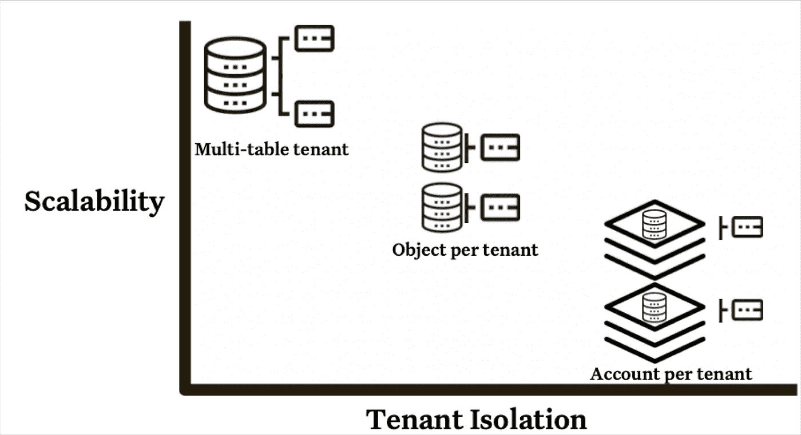
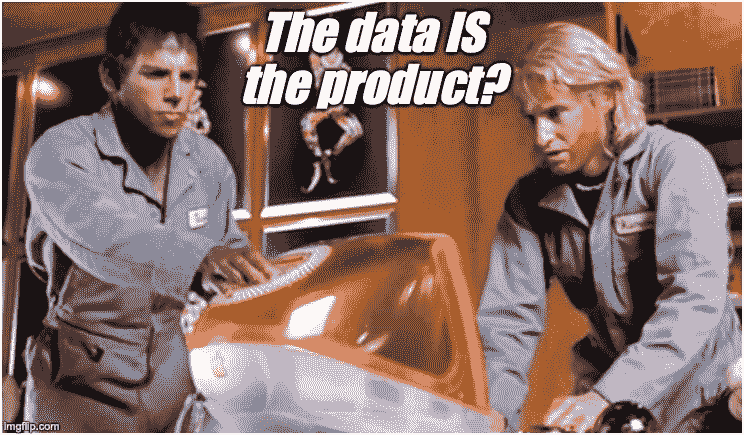
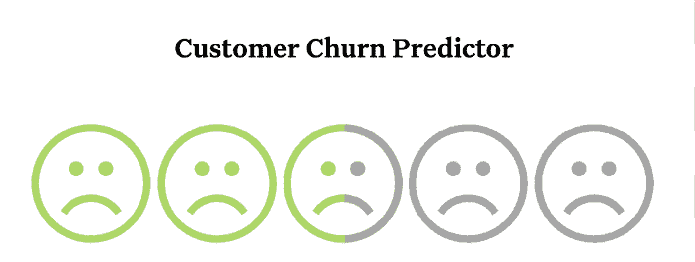

# 构建外部数据产品是不同的。相信我。(但无论如何要读这个)

> 原文：<https://medium.com/codex/building-an-external-data-product-is-different-trust-me-but-read-this-anyway-3906e419aab3?source=collection_archive---------15----------------------->

在 [Unsplash](https://unsplash.com/s/photos/data-application?utm_source=unsplash&utm_medium=referral&utm_content=creditCopyText) 上由 [Carlos Muza](https://unsplash.com/@kmuza?utm_source=unsplash&utm_medium=referral&utm_content=creditCopyText) 拍摄的照片

数据世界发展速度之快毋庸置疑。

似乎就在去年，我们开始谈论数据团队如何从提供服务[转变为像对待产品一样对待数据](https://www.montecarlodata.com/blog-how-to-treat-your-data-like-a-product/)，甚至跨分散的数据网格架构构建内部产品。

等等，那是今年一月的***支票票据*** ？？哇哦。

开发内部数据产品——无论是高性能的执行仪表板、用于营销的机器学习驱动的预测买家模型，还是 BI 团队的新客户模型——仍然是数据团队为组织增加价值的最有力方式之一。

但是开发一个外部数据产品在附加值和难度上都要高出一筹。这是一个不同的运动，需要你的团队建立新的肌肉记忆。

这是一种新的思维方式，需要更高水平的协调性、纪律性和严谨性。

这并不是说不能由同一个团队来完成，也不是说您的内部数据消费者不能获得与外部客户相同的服务水平。

Noah Abramson 是 Toast 的数据工程经理，Toast 是一家餐馆销售点提供商，最近[向我们](https://www.montecarlodata.com/blog-5-non-obvious-things-to-consider-when-building-your-data-platform/)讲述了他们这样做的经验。

> “我们的一个大价值广告是向我们的客户——餐馆——提供商业见解。随着时间的推移，他们表现如何？他们昨天的销售额是多少？谁是他们的顶级客户？
> 
> 与我们的餐厅客户互动是数据平台团队的工作…我们说我们的客户都是 Toast 员工。我们试图用尽可能多的数据来支持它们。我们的团队为所有内部数据请求提供服务，从产品到上市，从客户支持到硬件操作。"

在本帖中，我们将思考这些经验，并介绍数据团队如何通过理解不同于构建内部产品的 5 个关键维度来成功推出外部数据产品，包括:

1.  **架构**
2.  **用户期望**
3.  **ROI**
4.  **自助服务**
5.  **迭代**

但是首先，重要的是要准确理解什么是外部数据产品或数据应用程序，以及您开发的应用程序类型将如何指导您的许多决策点。

# 什么是外部数据产品？有哪些数据应用示例，它们如何影响您的决策？

外部数据产品是任何面向或影响客户的数据资产。从客户计费流程中使用的数据集到完全独立的数据密集型应用程序，都有自己的用户界面为客户提供洞察。

目前数据领域最热门的趋势之一是公司创建数据应用程序或在其 SaaS 产品中添加一个额外的层来帮助客户分析他们的数据，就像前面提到的 Toast 示例一样。

一些可能的外部数据产品应用示例包括:

*   帮助客户沟通
*   分析大量物联网数据
*   识别安全威胁
*   训练机器学习模型
*   更多

然而，外部数据产品不一定需要是完全构建的应用程序或集成到主要的 SaaS 产品中。它可以跨越光谱。

您可以拥有一个数据密集型的 SaaS 应用程序，该应用程序可以在您自己的 UI 中进行监控、发出警报并提供沿袭。您还可以在 UI 中向客户提供洞察报告，并提供在另一个数据平台中呈现数据的选项。

在后一种情况下，您只是为客户提供构建块，以便他们能够进一步定制他们希望如何可视化它或将其与其他数据相结合。

对什么是数据应用程序或外部数据产品有一个扩展的观点是很重要的，因为这应该触发团队确保它被赋予一个更高的严格级别，并且最好是在过度与欠工程化方面出错。

重要的是要问:

*   **我们有哪些外部数据产品，都是什么类型？**
*   **他们在为谁服务？有哪些用例？**
*   **他们满足这些期望了吗？我们如何衡量呢？**
*   **我们有合适的工具和流程吗？**

从以下五个方面评估外部数据产品也很重要。从…开始

# 体系结构

像内部产品一样，外部数据产品可以利用各种各样的数据云服务作为其平台的基础，包括数据湖或数据仓库。

然而，许多人会利用 BigQuery、Redshift 或 Snowflake 等解决方案来优化大规模存储和查询关系数据的方式。没什么新鲜的。

***与*不同的是，这可能是您的团队第一次讨论多租户架构。**在为外部客户服务时，这是一个巨大的变化和决策点。

当利用数据仓库作为产品的基础时，有三个多租户设计选项， [Snowflake 将](https://developers.snowflake.com/wp-content/uploads/2021/05/Design-Patterns-for-Building-Multi-Tenant-Applications-on-Snowflake.pdf)描述为:

*   **多租户表**:将租户集中在单个共享对象中，使租户能够高效地共享计算和其他资源。
*   **每个租户的对象**:将租户隔离到同一个帐户中不同的表、模式、数据库和仓库中。
*   **每个租户的账户**:将租户隔离到单独的雪花账户中。

每个选项都有优点和缺点，但简单来说，这取决于需要更高效地扩展什么—共享计算/存储还是基于角色的数据访问。

图片由蒙特卡洛提供。

大多数内部产品都是在同一个公司保护伞下交付的，具有相同的广泛的内部政策和法规。例如，如果营销团队的数据资产与法律团队的数据资产在同一个仓库中，他们不会感到不安。外部客户可能会更加关心。

当然，您可以在整个堆栈中选择其他架构来减轻这些权衡。

例如，在中，您可以使用行业最佳实践(如多表租户架构中的令牌化)在逻辑上分离客户数据。

与内部数据产品类似，架构决策过程的另一部分是**理解用例及工作负载**。

频率、规模和要求的及时性是什么？客户会在设定的时间接收数据，能够按需查询数据，实时访问数据，还是三者兼而有之？

了解工作负载对于做出[经济高效的](https://www.montecarlodata.com/blog-snowflake-cost-optimization/)架构选择非常有帮助。然而，与外部产品不同的是，可能有更广泛的用例需要支持。

例如，您不仅要考虑任务关键型生产工作负载，还要考虑您的内部团队如何访问这些面向外部的数据。是不是内部分析很多？数据科学研究？

# 用户期望

假设您有一个数据产品，您的用户通常可以信任它来帮助回答他们的一些问题。数据每天都会刷新，控制面板上有一些可点击的元素，用户可以在其中深入查看更详细的信息。

对于一些内部用户来说，这可能已经足够了。他们可以完成他们的工作，他们的绩效甚至比他们无法访问您的光滑仪表板时有所提高。

另一方面，你的外部用户很生气。他们希望完全信任你的产品，并让它随时实时地回答他们的所有问题。

为什么他们不应该感到不安？毕竟，他们是在为你的产品买单，他们可能会选择竞争对手。

**当数据是产品，数据质量就是产品质量。**

是的，德里克，数据就是产品。不，文件实际上不在电脑里。[来源](https://memegenerator.net)。

当数据面向客户或支持面向客户的应用时，**质量差甚至会破坏产品**。例如，涉及应用程序创建具有相同主键[的重复对象的数据问题实际上在网飞](https://www.infoq.com/presentations/data-validation-netflix/)造成了中断。

就规模和速度而言，外部客户从来不想等待数据，他们想要更多的数据维度，以便他们可以切片和拼接到自己喜欢的内容。

例如，一家金融服务机构不仅关注数据新鲜度，还关注数据延迟，换句话说，就是在支持查询的同时近乎实时地加载和更新数据的能力。

最后，当涉及到数据安全和隐私时，您的外部数据产品可能不仅要在理论上考虑 PII，还要通过 SOC II 到**等行业标准，以实际证明有效的安全控制。**

# 投资收益率

绝大多数数据团队都没有被评估硬投资回报。

Red Ventures 的产品管理和数据平台总监 Brandon Beidel 将他的团队从定性指标转移到了更定量的指标。

> “下一层是衡量绩效。这些系统的表现如何？如果有大量的问题，那么也许我们没有以一种有效的方式建立我们的系统。或者，它可以告诉我们在哪里优化我们的时间和资源……拥有记录也使我们的数据团队的评估从一种感觉'我觉得团队做得/不好'发展到更有证据基础的东西。”

内部数据产品也是如此。成功往往是临时获得的，“由于我们新的客户数据平台，我们的广告支出回报增加了 3 倍”，而不是根据生产成本或每用户成本进行系统衡量。

**当您构建外部数据产品时，这种奢侈就消失了。**产品经理需要明白如何给它定价，它必须是盈利的(在某个点上)。

他们需要知道制造产品的启动成本以及提供服务的每个组件的成本(商品成本)。

这对于数据团队来说是一个挑战，因为他们没有为自己的数据产品构建内部按存储容量使用计费模型，以便根据使用规模来区分、跟踪和收取客户费用。

# 自助服务

“啊哈！”你说。“我们的团队已经允许我们的内部消费者自助服务，这不是什么新鲜事。”这可能是真的，但是自助服务和可用性的标准也提高了。

你的外部客户不能让你问一些关于数据的问题，或者你如何得出这个客户流失的可能性是“5 个皱眉头中的 3.5 个”数据产品不能是黑匣子，你需要展示你的作品。

3.5 皱眉脸好吗？为什么它们是绿色的，不应该是红色的吗？这是怎么算出来的？我需要这个假想产品的更多背景信息！图片由蒙特卡洛提供。

用户如何消费您的外部数据产品并与之交互也需要三思。对于许多数据团队来说，他们内部数据产品的答案是，“……然后它在 Looker 中出现。”

用户界面必须是直观的，相关性必须是即时的，上下文必须是明显的。

# 迭代次数

当您构建您的内部数据产品时，当您收集需求、构建和与业务涉众迭代时，开始时通常进展缓慢。

之后，团队通常会离开，奔向下一个项目。会有针对数据宕机的补丁和修复，或者如果你喜欢的话，可能会满足内部 SLA，但总的来说，你不会每个季度都重构这些仪表板。

如前所述，付费客户有更高的期望，他们也有更多的反馈。根据客户反馈在几天内发布改进并不罕见。

你需要知道它的到来，并为此而努力。例如，Toast 非常关注他们流程的效率。

> Toast 数据工程师 Angie Delatorre 表示:“我们不仅倾听业务需求并给予支持，而且还关注内部并解决可扩展性问题。“如果一项工作过去需要一个小时，现在需要三个小时，我们总是需要回去看看那些实例，这样也可以塑造我们的 okr。”

谈到规模化运营，雪花产品管理总监 Chris Child 建议:

> “首先，以最高的保真度将您的所有数据放在一个地方。把原始数据放进去。第二，想出可重复的管道来为您的分析师获取数据。你不想每次想做什么事情的时候都回到原始数据上。”

前优步数据产品经理 Atul Gupte 讨论了迭代数据产品时了解以下内容的重要性:

> “…如何确定产品路线图的优先级，以及您需要为谁(通常是工程师)构建，还是为谁(包括分析师在内的日常平台用户)设计。”

# 装运它

虽然这篇博客可能读起来像是一个不应该构建外部数据产品的原因列表，但我希望它有助于揭开与这项令人生畏但值得努力相关的挑战的神秘面纱。

您不会在第一次 sprint 中构建完美的外部数据应用程序(没有人会这样做)，但是我鼓励您构建、发布、迭代、清洗和重复。