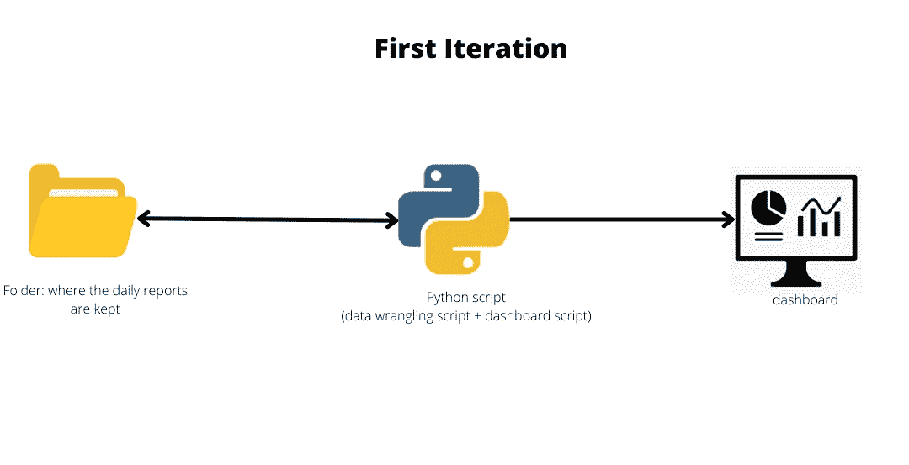
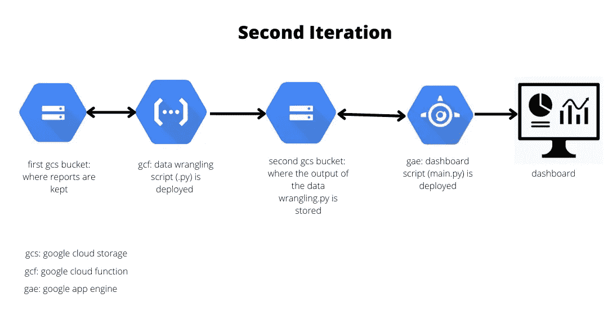

# 构建油田生产监控仪表板

> 原文：<https://medium.com/codex/building-an-oilfield-production-surveillance-dashboard-1629865e2ec9?source=collection_archive---------9----------------------->

….从零开始到部署

安德烈·德·森蒂斯峰在 [Unsplash](https://unsplash.com/?utm_source=unsplash&utm_medium=referral&utm_content=creditCopyText) 上拍摄的照片

## **简介**

简而言之，生产监控(油田环境)意味着监控生产油田中每口井的井参数变化。油井参数包括速率、压力、节流器尺寸、基本沉积物和水、气油比、正常运行时间等。

这样做是为了:

1.  识别可能的异常数据。
2.  解释一个或多个参数的变化如何影响最感兴趣的参数(采油速度)，以及如何更好地优化这些参数以实现生产目标。

为了有效的生产监督，我决定建立一个仪表板。

**要求**

在构建仪表板时，我提出了一些要求；

1.  仪表板上的数据需要动态更新。
2.  仪表板可以回答一些经常被问到的常见问题，例如某段时间内的平均产量是多少等等。
3.  需要部署仪表板的 web 框架，以便团队中的任何人都可以访问它。

**建造过程**

构建过程中的第一次迭代如下所示:

作者图片:第一次迭代

在第一次迭代中，我有一个保存 92 份每日报告的文件夹(大约 3 个月)。每日报告是一个 excel 文件，其中包含每天从油田生产设施发送的大量数据。

python 脚本可以说是两部分；

1.  数据争论脚本:这部分脚本从保存在文件夹中的每日报告中访问感兴趣的数据，清理数据并将数据组织成结构化格式(数据帧)。
2.  仪表板脚本:该部分创建带有可视化和 web 框架的仪表板。

第一次迭代的仪表板输出(短视频)可以在这里看到:

 [## 17-39-38.mp4 2022-04-22

### 编辑描述

drive.google.com](https://drive.google.com/file/d/1jDJi6jHXlOOWtFPu6buKF_YuNoKBNK7x/view?usp=sharing) 

第一次迭代的仪表板输出的限制是它没有满足我提出的需求；

1.  每次在文件夹中添加新的每日报告时，我都必须手动运行脚本。
2.  仪表板输出仅在我的计算机上本地运行。
3.  在布局和呈现数据方面，我肯定可以更好地处理仪表板输出。

为了解决上面的前两个限制，我必须学习谷歌云平台工具，对于第三个限制，我必须学习 dash bootstrap 组件库。

这些经验导致了第二次迭代，如下所示；

作者图片:第二次迭代

在第二次迭代中，

在第一次迭代中，我将文件夹中的每日报告移动到 google 云存储(gcs)桶中。

第一次迭代中 python 脚本的数据争论脚本部分被审查以从 gcs 桶中的报告中访问数据，然后被部署为 google cloud function (gcf)中的一个函数。

gcf 的美妙之处在于它是事件驱动的，这意味着该函数仅在有触发器时运行(在我的例子中，仅当我向 gcs bucket 添加新的每日报告时)。

数据争论脚本的输出是一个数据帧，然后作为 excel 文件存储在一个新的 gcs 存储桶(第二个存储桶)中。无论何时，只要触发了函数，新的输出就会覆盖 gcs 存储桶中的现有输出。

对第一次迭代中 python 脚本的仪表板脚本部分进行了审查，以访问第二个(新的)gcs 存储桶中的数据，web 框架在使用 dash bootstrap 组件的基础上进行了改进，并部署在 google app engine 中。

dash bootstrap 组件的美妙之处在于，它允许您以行和列的形式组织布局。这使得人们很容易控制布局的设计。

google app engine 允许以无服务器的方式部署 web 应用程序，这意味着仪表板输出可以与任何其他人共享。

为了验证第二次迭代，我上传了 30 个额外的每日报告到第一个 gcs 桶中(一次开始一个报告，在第三次上传之后，我一次上传了剩余的 27 个每日报告)。

谷歌云功能和应用引擎的指标可以在这里看到:

 [## 云函数 metric.jpg

### 编辑描述

drive.google.com](https://drive.google.com/file/d/1xzreHg1T9163flybGGJW9yTAE4wovrmu/view?usp=sharing)  [## 云函数度量 II.jpg

### 编辑描述

drive.google.com](https://drive.google.com/file/d/1hO8MIw6QWJK056bze5FEHR5DdFkFF42m/view?usp=sharing)  [## 应用引擎 metric.jpg

### 编辑描述

drive.google.com](https://drive.google.com/file/d/1BL-hVD99ndCP1mvq6D637FtZvgelGWfW/view?usp=sharing) 

指标显示，云功能和应用引擎都运行得非常好，没有任何错误。

第二次迭代的仪表板输出可以在这里看到:[https://dummy-surveillance-project.nw.r.appspot.com/](https://dummy-surveillance-project.nw.r.appspot.com/)

*   ***注**:由于数据隐私政策，实际的油井数据已被随机生成的数据所取代。

# **结论**

第二次迭代的仪表板输出满足了我最初提出的需求。做这个项目让我意识到**尺度**可以是多维的，而不是一维的。

虽然仪表板输出对于来自后续每日报告的额外(同一口井)数据工作得非常好，但它肯定不会从全新的井捕获数据(在新井上线且数据被添加到每日报告的情况下)。

另外，因为我使用了基于整数位置的索引(。iloc)来访问每日报告中的数据，围绕每日报告中感兴趣的单元格所做的任何更改(插入新行或新列)都会影响仪表板的输出。

在未来的迭代中，我将努力解决这些问题。

感谢您的阅读。

知识库可以在这里找到:[https://github.com/0ladayo/production_surveillance_project](https://github.com/0ladayo/production_surveillance_project)