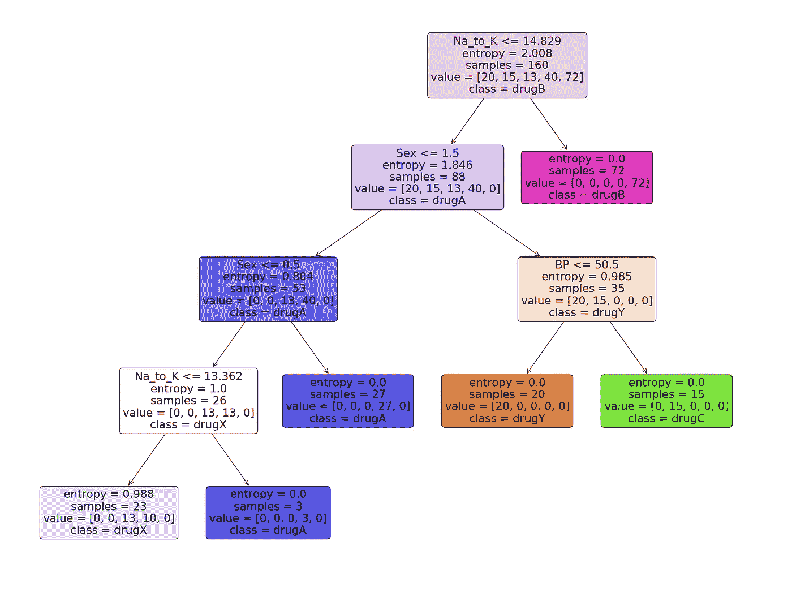

# 用 Python 构建和可视化决策树

> 原文：<https://medium.com/codex/building-and-visualizing-decision-tree-in-python-2cfaafd8e1bb?source=collection_archive---------0----------------------->

## 药典

## 学习使用 scikit 构建和可视化决策树模型——学习 Python 语言


伊利亚·Vjestica 在 [Unsplash](https://unsplash.com?utm_source=medium&utm_medium=referral) 上的照片

# 决策图表

D 决策树是当今使用的一些最强大的监督学习方法的构建模块。

> 决策树基本上是一个二叉树流程图，其中每个节点根据一些特征变量分割一组观察值。决策树的目标是将数据分成组，这样一个组中的每个元素都属于同一类别。

决策树的一个重要特性是它们非常容易解释。你根本不需要熟悉机器学习技术就能理解决策树在做什么。决策树图是可行的解释。

# 用于决策树的 Python

Python 是一种通用编程语言，为数据科学家提供了强大的机器学习包和工具。在本文中，我们将使用 python 最著名的机器学习包“scikit-learn”来构建决策树模型。我们将使用 scikit-learn 提供的*‘decision tree classifier’*算法创建我们的模型，然后使用*‘plot _ tree’*函数可视化模型。我们开始吧！

## 步骤 1:导入包

构建我们的模型所涉及的主要软件包是 pandas、scikit-learn 和 NumPy。按照代码导入 python 中所需的包。

在导入了构建我们的模型所需的所有包之后，是时候导入数据并对其进行一些 EDA 了。

## 步骤 2:导入数据和 EDA

在这一步中，我们将利用 python 中可用的“Pandas”包来导入并在其上进行一些 EDA。我们将用于构建决策树模型的数据集是一个药物数据集，它是根据特定标准为患者开出的处方。我们用 python 导入数据吧！

**Python 实现:**

输出:

```
 **Age Sex      BP Cholesterol  Na_to_K   Drug
0   23   F    HIGH        HIGH   25.355  drugY
1   47   M     LOW        HIGH   13.093  drugC
2   47   M     LOW        HIGH   10.114  drugC
3   28   F  NORMAL        HIGH    7.798  drugX
4   61   F     LOW        HIGH   18.043  drugY**
```

现在我们对数据集有了一个清晰的概念。导入数据后，让我们使用*‘info’*函数获取数据的一些基本信息。该函数提供的信息包括条目数、索引号、列名、非空值计数、属性类型等。

**Python 实现:**

输出:

```
**<class 'pandas.core.frame.DataFrame'>
RangeIndex: 200 entries, 0 to 199
Data columns (total 6 columns):
 #   Column       Non-Null Count  Dtype  
---  ------       --------------  -----  
 0   Age          200 non-null    int64  
 1   Sex          200 non-null    object 
 2   BP           200 non-null    object 
 3   Cholesterol  200 non-null    object 
 4   Na_to_K      200 non-null    float64
 5   Drug         200 non-null    object 
dtypes: float64(1), int64(1), object(4)
memory usage: 9.5+ KB**
```

## 步骤 3:数据处理

我们可以看到像性别、血压和胆固醇这样的属性在本质上是分类的和对象类型的。问题是，scikit-learn 中的决策树算法不支持 X 变量本质上是“对象”类型。因此，有必要将这些“对象”值转换为“二进制”值。用 python 来做吧！

**Python 实现:**

输出:

```
 **Age  Sex  BP  Cholesterol  Na_to_K   Drug
0     23    1   2            1   25.355  drugY
1     47    1   0            1   13.093  drugC
2     47    1   0            1   10.114  drugC
3     28    1   1            1    7.798  drugX
4     61    1   0            1   18.043  drugY
..   ...  ...  ..          ...      ...    ...
195   56    1   0            1   11.567  drugC
196   16    1   0            1   12.006  drugC
197   52    1   1            1    9.894  drugX
198   23    1   1            1   14.020  drugX
199   40    1   0            1   11.349  drugX

[200 rows x 6 columns]**
```

我们可以观察到，所有的“对象”值都被处理成“二进制”值来表示分类数据。例如，在胆固醇属性中，显示“低”的值被处理为 0，“高”的值被处理为 1。现在我们准备从数据中创建因变量和自变量。

## 步骤 4:拆分数据

将数据处理成正确的结构后，我们现在开始定义“X”变量或自变量和“Y”变量或因变量。用 python 来做吧！

**Python 实现:**

输出:

```
**X variable samples : [[ 1\.     2\.    23\.     1\.    25.355]
 [ 1\.     0\.    47\.     1\.    13.093]
 [ 1\.     0\.    47\.     1\.    10.114]
 [ 1\.     1\.    28\.     1\.     7.798]
 [ 1\.     0\.    61\.     1\.    18.043]]**
**Y variable samples : ['drugY' 'drugC' 'drugC' 'drugX' 'drugY']**
```

现在，我们可以通过使用 scikit-learn 中的*‘train _ test _ split’*算法，使用我们定义的 X 和 Y 变量将我们的数据分成训练集和测试集。按照代码在 python 中分割数据。

**Python 实现:**

输出:

```
**X_train shape : (160, 5)**
**X_test shape : (40, 5)**
**y_train shape : (160,)**
**y_test shape : (40,)**
```

现在我们有了构建决策树模型的所有组件。因此，让我们继续用 python 构建我们的模型。

## 步骤 5:建立模型和预测

在 scikit-learn 软件包提供的“决策树分类器”算法的帮助下，构建决策树是可行的。之后，我们可以使用训练好的模型对数据进行预测。最后，我们的预测结果的精确度可以使用“精确度分数”评估标准来计算。我们用 python 来做这个过程吧！

**Python 实现:**

输出:

```
**Accuracy of the model is 88%**
```

在代码的第一步中，我们定义了一个名为*‘model’*的变量，我们在其中存储了 DecisionTreeClassifier 模型。接下来，我们使用我们的训练集来拟合和训练模型。之后，我们定义了一个名为*‘pred _ model’*的变量，其中存储了我们的模型对数据的所有预测值。最后，我们计算了我们的预测值与实际值的精度，结果是 88%的准确度。

## 步骤 6:可视化模型

现在我们有了决策树模型，让我们利用 python 中 scikit-learn 包提供的“plot_tree”函数来可视化它。按照代码用 python 为您的决策树模型制作一个漂亮的树形图。

**Python 实现:**

输出:



图片作者[作者](https://nikhiladithyan.medium.com/)

# 结论！

有很多技术和其他算法用于调整决策树，避免过度拟合，比如修剪。虽然决策树通常是不稳定的，这意味着数据的微小变化会导致最佳树结构的巨大变化，但它们的简单性使它们成为广泛应用的有力候选。在神经网络流行之前，决策树是机器学习中最先进的算法。至此，我们结束了，如果您忘记了遵循任何编码部分，不要担心，我已经为本文提供了完整的代码。

**快乐的机器学习！**

完整代码: