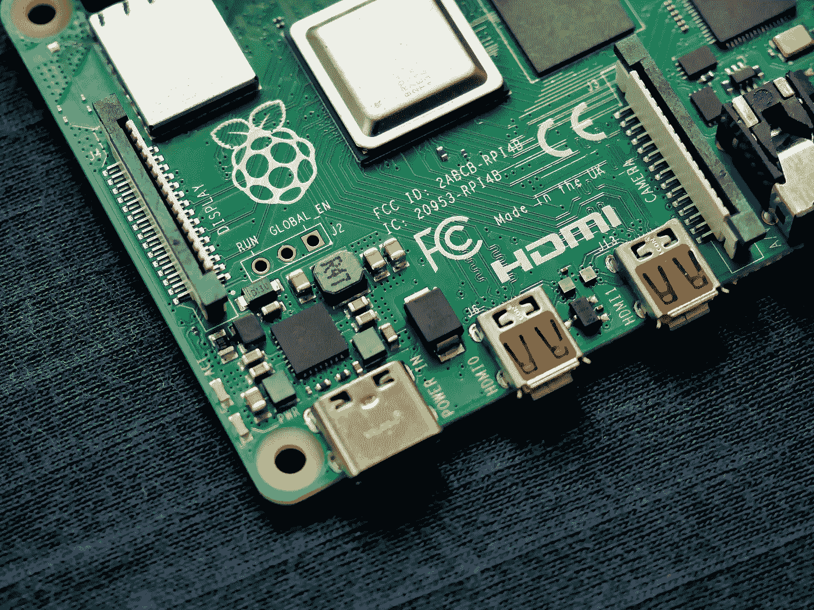

# 用 GitLab-Runner 构建 ARM Docker 映像

> 原文：<https://medium.com/codex/building-arm-docker-images-with-gitlab-runner-6195e8326094?source=collection_archive---------0----------------------->

Vishnu Mohanan 在 [Unsplash](https://unsplash.com/s/photos/raspberry-pi?utm_source=unsplash&utm_medium=referral&utm_content=creditCopyText) 上的照片

# TL；速度三角形定位法(dead reckoning)

*构建 ARM docker 映像有多种方式，并不总是需要一台 ARM 计算机或服务器来完成。使用 QEMU ARM 架构也可以在普通的 AMD64 计算机或笔记本电脑上进行仿真。只有当不得不在 ARM 上编译许多包时，最好的建议是不要使用仿真，因为这将花费很长时间。此外，重要的是* …