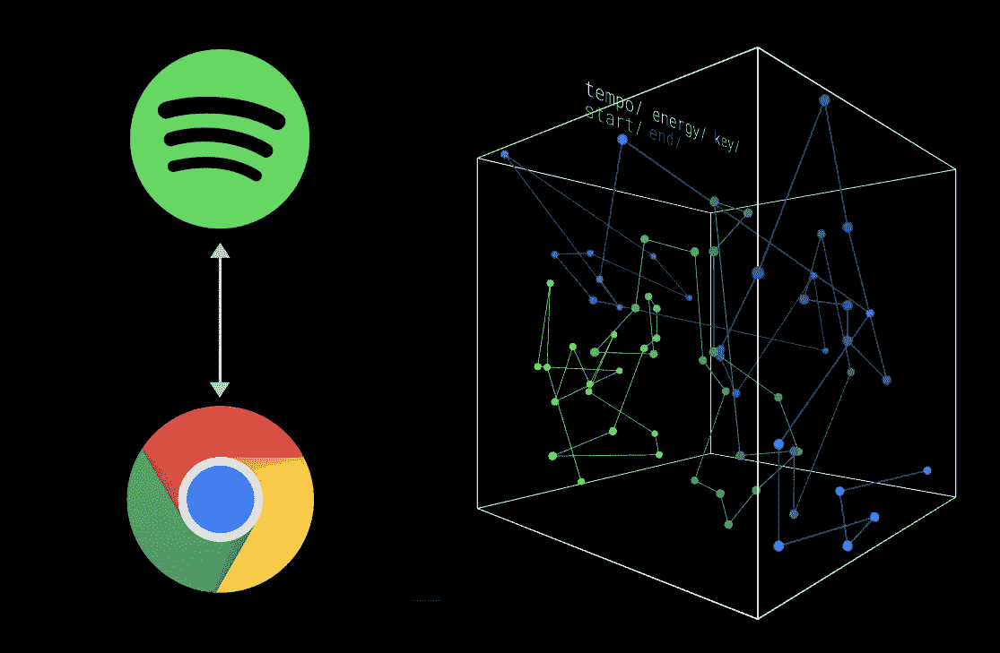
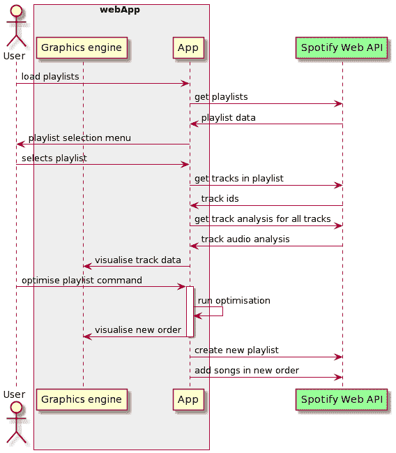
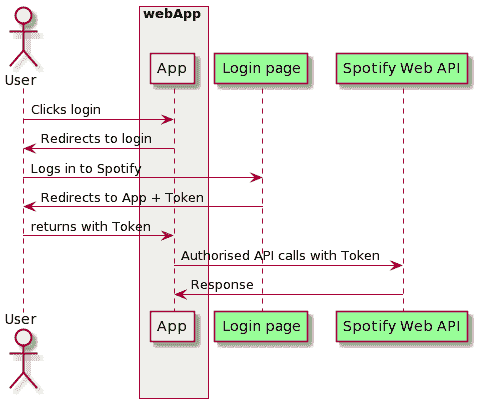
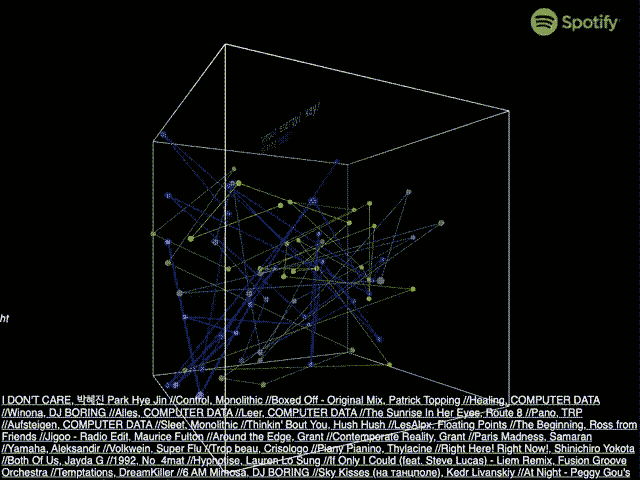

# 构建更好的播放列表:Spotify 集成

> 原文：<https://medium.com/codex/building-better-playlists-spotify-integration-2f86565a5888?source=collection_archive---------5----------------------->

对于那些对自己的播放列表引以为豪的人来说，我的播放列表很一般。当然，我可能喜欢这些歌曲，但是播放的顺序还有很多需要改进的地方——皮特保罗和维罗妮卡当然属于同一个播放列表，但是你可能不希望他们的热门歌曲连续播放！这是我对这个小问题的过度设计的解决方案。

## 动机

Spotify 是一项出色的服务，它彻底改变了我们寻找、聆听和分享音乐的方式。他们的技术前沿方法还允许发布新功能，进一步提升用户与他们的音乐互动的能力，例如 *discover weekly* 播放列表或最近发布的 [blend](https://newsroom.spotify.com/2021-08-31/how-spotifys-newest-personalized-experience-blend-creates-a-playlist-for-you-and-your-bestie/) 工具，将两个人的音乐品味合并到一个播放列表中。

Spotify 用户体验的核心是播放列表，它允许用户以一种让人想起 20 世纪 80 年代盒式混音带的方式对歌曲进行分类和组织。如果没有播放列表，Spotify 上的收听体验将是短暂的，用户需要在无尽的曲目库中搜索，以找到“他们的”音乐。因为这样的播放列表向用户提供了某种程度的所有权和对系统中什么是“他们的”音乐的控制，该系统没有所有权和音乐和流派的宇宙。

鉴于播放列表的重要性以及将新歌曲添加到播放列表中的机制(只需将它们放在最后)，个人播放列表很快变得不连贯就不足为奇了，这是口味不断变化以及重新排序和组织歌曲所需努力水平的结果。

为了避免我自己的播放列表遭遇这种命运，我已经开始通过使用 Spotify 的开发工具来创建我自己的方法，以与 Spotify 音乐世界进行互动，从而为这个问题构建解决方案。

这是系列文章的第一部分，在本文的底部有其他部分的链接。

## Spotify web API

Spotify 提供了一个免费的 Web API，允许你以编程方式访问 Spotify 的各个方面，并修改用户帐户的部分内容——至少在得到用户许可的情况下！

我希望能够访问用户的播放列表和曲目，并且能够修改这些播放列表或创建新的播放列表。这需要 4 种关键能力:

*   能够列出所有用户的播放列表
*   能够在播放列表中列出曲目
*   能够获得关于一个轨道的数据
*   能够创建或修改用户的播放列表

幸运的是，web API 提供了所有这些功能(以及更多功能)，以及将许多请求捆绑到单个 HTTPS 调用中的能力，这减少了加载播放列表中所有曲目的曲目数据时所需的请求数量。

作为参考，所需的播放列表级交互包含在[播放列表 API](https://developer.spotify.com/documentation/web-api/reference/#category-playlists) 中，而曲目级交互包含在[曲目 API](https://developer.spotify.com/documentation/web-api/reference/#category-tracks) 中。

基本流程可总结如下:

## 授权

要使用任何 API 功能，用户必须以有效的 Spotify 用户身份登录。Spotify 为用户提供了多种登录方式，并向应用程序提供访问他们的数据和进行更改所需的授权。

对于我的申请，我选择了使用*隐式授权*方法，因为我不需要长期持续授权，并且隐式授权仅允许申请成为前端。这个流为应用程序提供了一个令牌，然后在所有后续的 API 调用中使用这个令牌。

## 页码

由于用户可能有大量的播放列表和歌曲，所有使用的 API 调用都有一个最大返回长度以及分页，以便获取下一个数据块(如果存在的话)。这使得每个 api 调用的大小易于管理，特别是当数据包含在 URL 参数而不是头中时，因此受到浏览器严格的字符限制。

## 该工具

对于那些感兴趣的人来说，播放列表优化工具可以在[https://www.grantholtes.com/smartshuffle](https://www.grantholtes.com/smartshuffle)获得

## 其他故事

*   第 2 部分:[播放列表优化作为一个旅行推销员问题](https://grantholtes.medium.com/playlist-optimisation-as-a-traveling-salesperson-problem-f31f73c417fa)