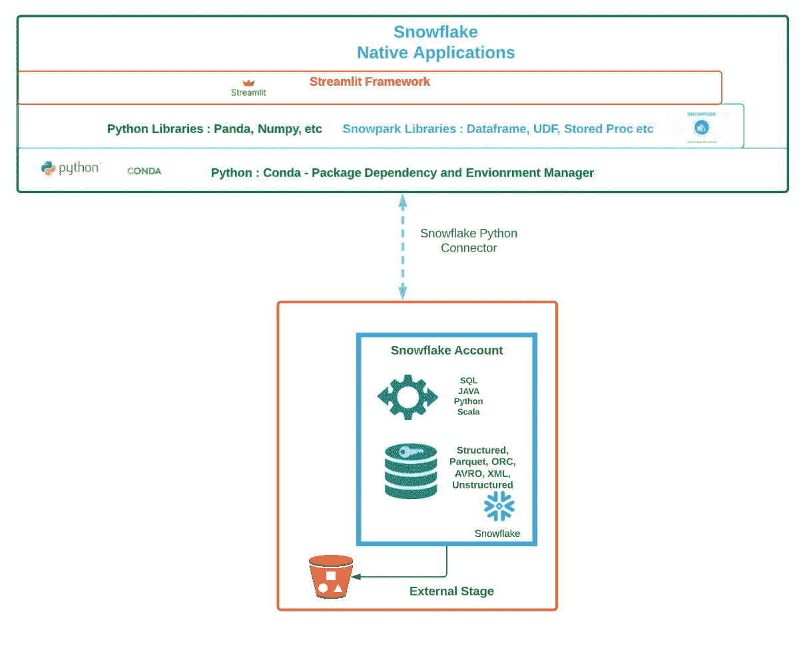
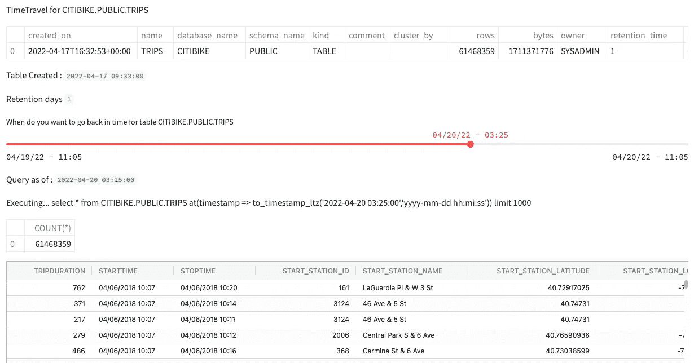
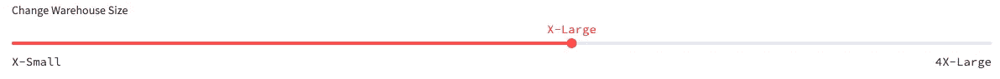
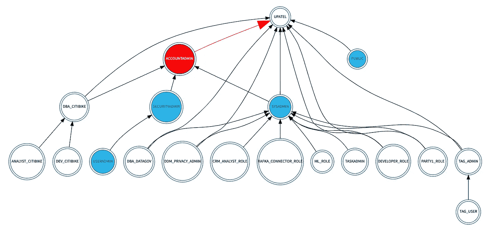
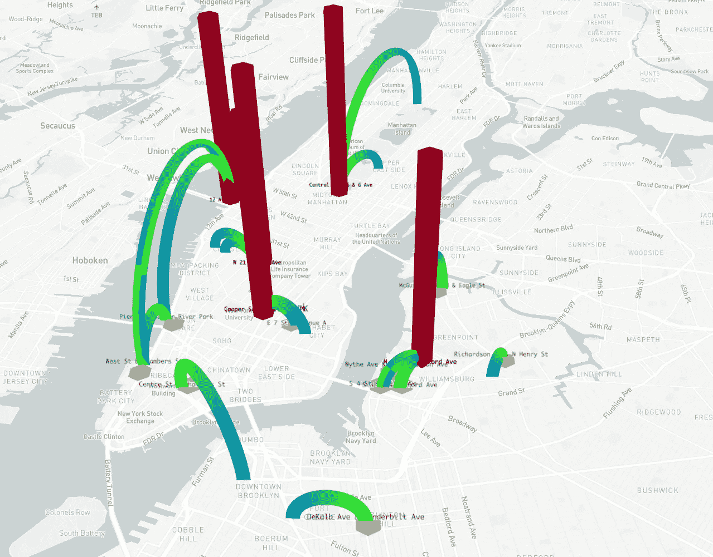
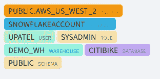

# 使用 Streamlit 和雪花构建酷炫应用

> 原文：<https://medium.com/codex/building-cool-applications-with-streamlit-and-snowflake-af1cafbc6964?source=collection_archive---------2----------------------->

Streamlit(最近宣布)被雪花收购，这将增加数据工程师、数据科学家和开发人员与数据交互的能力，并构建应用程序，为非技术/业务用户带来数据。Streamlit 是 Python 中的一个开源应用程序开发框架。Streamlit 具有数据可视化功能，极大地帮助雪花社区和合作伙伴构建应用程序，并可视化雪花和[雪花市场](https://www.snowflake.com/data-marketplace/)中存在的数据。

这篇博客的目的是向您展示如何使用 Streamlit 和 Snowflake 构建具有数据可视化的云原生应用程序。Streamlit 应用程序可以部署在 [Streamlit 云](https://share.streamlit.io/)中并共享，也可以在云计算、服务器和笔记本电脑中运行。

这是雪花与细流的架构



细流雪花

初始设置

1.  获取雪花账号:确保你有雪花账号和登录凭证，如果没有，你可以[注册免费试用。](https://signup.snowflake.com/)
2.  使用雪花快速启动，自定步调，引导[归零到雪花](https://quickstarts.snowflake.com/guide/getting_started_with_snowflake/index.html?index=..%2F..index#0)。如果您想要一个讲师指导的虚拟动手实验室，您可以在这里注册。我们将使用从该实验室创建的数据。
3.  [安装 snowsql](https://docs.snowflake.com/en/user-guide/snowsql-install-config.html) :我们将使用它将样本数据上传到雪花表中
4.  安装 [Conda](https://docs.conda.io/en/latest/miniconda.html) : Conda 是一个开源的包管理和环境管理系统。
5.  创造新的康达环境

```
conda create -n snowflake python=3.8
conda activate snowflakepip install streamlit
pip install snowflake-sqlalchemy
pip install streamlit-aggrid
pip install graphviz
pip install st-annotated-text
```

5.创建一个目录并使用它，在那里你保存所有的代码

```
mkdir streamlitapp
cd streamlitapp
```

6.使用以下格式创建凭证文件“creds.json ”:请保护此文件，因为它具有雪花凭证，并且不要将其复制到您的 GitHub 帐户中，如果您将应用程序部署到 Stereamlit cloud，请使用 [Streamlit Secret](https://docs.streamlit.io/streamlit-cloud/get-started/deploy-an-app/connect-to-data-sources/secrets-management) 来存储凭证

{
" account ":" snowfalkeaccount "，
"user": "username "，
"password": "password "，
"warehouse": "warehousename "，
"database" : "citibike "，
"schema" : "public "，
"role": "sysadmin"
}

如果您在 Streamlit Cloud 上部署应用程序并使用 Streamlit Secret，则使用以下 python 代码连接到雪花:

```
def create_session():    
       conn = snowflake.connector.connect(**st.secrets["snowflake"])          
       return conn
```

# 建筑应用

1.  导入库

```
import sys
import streamlit as st
import json
import pandas as pd 
import snowflake.connector
from datetime import datetime
import datetime as dt
import pytz
#  map chart
import pydeck as pdk# for data frame tables display
from st_aggrid import AgGrid as stwrite
from st_aggrid.grid_options_builder import GridOptionsBuilder
# for role chart
import graphviz as graphviz
#annoated text
from annotated_text import annotated_text as atext
```

2.连接到雪花

```
def create_session():
    with open('creds.json') as f:
        cp = json.load(f)
    conn = snowflake.connector.connect(
                    user=cp["user"],
                    password=cp["password"],
                    account=cp["account"],
                    warehouse=cp["warehouse"],
                    database=cp["database"],                    
                    role=cp["role"],
                    schema=cp["schema"]
                    )

    return conncurr_sess = create_session()
```

3.可视化雪花时间旅行和零拷贝克隆功能

雪花提供[时间旅行](https://docs.snowflake.com/en/user-guide/data-time-travel.html#understanding-using-time-travel)功能，允许你访问过去任何一点的数据。本模块的目的是展示数据科学家如何轻松回到过去，并针对该数据运行模型。



时间旅行滑块

```
asof_time = st.slider(
            "When do you want to go back in time for table "+curr_table,
            value=end_date,
            max_value=end_date,
            min_value=table_created,
            step=dt.timedelta(minutes=1),
            format="MM/DD/YY - HH:mm")
```

这里 st.slider 根据日期在 min_value 和 max_value 之间画一条线，它以 1 分钟的增量移动，一旦滚动，值将被返回。使用该值动态创建 SQL 并运行它来获取和显示数据。

你可能已经注意到上图中的数据显示使用了 AgGrid 库，它允许终端用户以交互的方式在屏幕上对数据进行排序、分组、过滤等。

您可以将此用于其他用例，我也曾使用滑块来更改仓库的大小:



更改仓库大小

4.可视化层次结构中的雪花角色

雪花提供了[基于角色的访问控制](https://docs.snowflake.com/en/user-guide/security-access-control-overview.html) (RBAC)作为一种机制，允许或拒绝用户、服务等安全主体访问各种数据库对象和动作。许多客户使用角色层次结构来控制对雪花对象的粒度访问。模块的这一部分帮助您向安全合规办公室展示角色层次结构，并了解如何向用户授予访问权限。蓝色阴影角色是系统定义的雪花角色，红色是系统定义的 ACCOUNTADMIN 角色，白色形状是自定义角色。



雪花帐户中的角色

下面是构建该图表的代码片段:

```
rolechart = graphviz.Digraph()
            rolechart.attr("node", shape="doublecircle")
            rolechart.attr("node", color="#11567f")  
            rolechart.attr( rankdir="BT")  
            rolechart.attr( "node", fontsize="6pt")            
            for num, row in rdf.iterrows():
                if row["CHILD"] == 'ACCOUNTADMIN':
                    rolechart.edge(row["CHILD"], row['PARENT'],color="red", arrowsize="3",size="double")
                else:
                    rolechart.edge(row["CHILD"], row['PARENT'])
            rolechart.node("ACCOUNTADMIN",style="filled",fillcolor="red",fontcolor="white")                    

st.graphviz_chart(rolechart)
```

Graphviz 库允许以你喜欢的方式定制图表。edge 元素允许创建图表的分支，这是在 for 循环中；rankdir 属性允许图表从上到下、从右到左等；其他定制是不言自明的。

5.可视化地图中的数据

Streamlit 允许在[各种图表](https://docs.streamlit.io/library/api-reference/charts)中可视化数据，包括 pydeck 地图。通常你想在地图上显示数据。从我们的“从零到雪花”快速入门的例子中，我们有 citibike 数据，并希望在地图上直观地看到哪些是最受欢迎的路线。见下文:



纽约的城市自行车热门行程

上面的图表是通过加载在[https://gbfs . citibikenyc . com/gbfs/en/station _ information . json](https://gbfs.citibikenyc.com/gbfs/en/station_information.json)以 JSON 格式公开发布的车站信息创建的。您可以将这些数据加载到 snowflake 中，并将其与来自车间的行程数据相结合。下面是您需要运行的代码。从上面的[链接](https://gbfs.citibikenyc.com/gbfs/en/station_information.json)下载站点数据到您的本地目录，并使用 snowsql 上传数据并为图表做好准备。

```
$ snowsql -a <snowflakeaccount>
## input your username and password and run following commandsuse database citibike;
use schema public;
create stage citibike_stage;
create or replace file format json_format type = 'json';put file://station_information.json [@citibike_stage](http://twitter.com/citibike_stage);ls [@citibike_stage](http://twitter.com/citibike_stage);create or replace table station_data as
  with s as (
        select parse_json($1) payload from  [@citibike_stage](http://twitter.com/citibike_stage) (file_format=>json_format)
   )
  select value station_v
  from s, lateral flatten (input => payload:data.stations);select * from station_data;create or replace view stations_vw as
   select station_v:station_id::number station_id,
    station_v:name::string station_name,
    station_v:lat::float station_lat,
    station_v:lon::float station_lon,
    station_v:station_type::string station_type,
    station_v:capacity::number station_capacity,
    station_v:rental_methods rental_methods
  from station_data ;select * from stations_vw;create or replace view trips_stations_vw as (
  with
    t as (select * from trips),
    ss as (select * from stations_vw),
    es as (select * from stations_vw)
  select starttime, stoptime, start_station_id,
    ss.station_name start_station,ss.station_lat start_lat, ss.station_lon start_lon,
    end_station_id, es.station_name end_station,
    es.station_lat end_lat, es.station_lon end_lon,
    bikeid, usertype, birth_year, gender
  from t left outer join ss on t.start_station_id = ss.station_id
    left outer join es on t.end_station_id = es.station_id
  );
```

在 python 代码中，创建 pydeck 图表。

```
def exec_sql(sess, query):
    try:
        df=pd.read_sql(query,sess)
    except:
            st.error("Oops! ", query, "error executing ", sys.exc_info()[0], "occurred.")
    else:
        return df
    return###########df=exec_sql(curr_sess,'  select  \
          any_value(start_station) from_station_name, any_value(end_station) end_station_name, start_lat, start_lon, end_lat, end_lon, \
          count(*) num_trips, \
          avg(datediff("minute", starttime, stoptime))::integer avg_duration_mins \
          from citibike.public.trips_stations_weather_vw \
          where    \
          (start_lat is not null and end_lat is not null)  \
          and start_lat <> end_lat  \
          group by  start_lat, start_lon, end_lat, end_lon  \
          order by num_trips  desc \
         limit 20;')    

    lay1 = pdk.Layer(
            "ArcLayer",
            data = df,
            get_source_position=["START_LON", "START_LAT"],
            get_target_position=["END_LON", "END_LAT"],
            #get_source_color=[200, 30, 0, 160],
            #get_target_color=[200, 30, 0, 160],
            get_source_color=[64, 255, 0],
            get_target_color=[0, 128, 200],
            auto_highlight=True,
            width_scale=0.0004,
            get_width="NUM_TRIPS",
            width_min_pixels=3,
            width_max_pixels=30,
        )
    lay2 = pdk.Layer(
            "TextLayer",
            data=df,
            get_position=["START_LON", "START_LAT"],
            get_text="FROM_STATION_NAME",
            get_color=[0, 0, 0, 200],
            get_size=15,
            get_alignment_baseline="'bottom'",
        )    
    lay3 = pdk.Layer(
            "HexagonLayer",
            data=df,
            get_position=["START_LON", "START_LAT"],
            radius=200,
            elevation_scale=4,
            elevation_range=[0, 1000],
            extruded=True,
        )    
    st.pydeck_chart(pdk.Deck(
            map_style="mapbox://styles/mapbox/light-v9",
            initial_view_state={"latitude": 40.776676,
                                "longitude": -73.971321, "zoom": 11, "pitch": 50},
            layers=[lay1,lay2, lay3],
            tooltip={"text": "{FROM_STATION_NAME} to {END_STATION_NAME}"}
        ))    
    stwrite(df)
```

我们创建了三个层:

第一层显示从一个地图点到另一个地图点的弧线，它使用数据框中的 START_LON 列和 START_LAT 列。NUM_TRIPS 列根据弧的值给出弧的宽度。

第二层是显示站名，这里我们显示的是始发站名。

第三层是显示一个六边形，这表明哪个站是受欢迎的。

“initial_view_state”参数用于根据经度和纬度将地图缩放到纽约市。

# 小贴士:

我使用带注释的文本库来显示雪花环境上下文，如下所示:



```
def write_env(sess):
    df=exec_sql(sess,"select  current_region() region, current_account() account, current_user() user, current_role() role, current_warehouse() warehouse, current_database() database, current_schema() schema ")
    df.fillna("N/A",inplace=True)    
    csp=df.at[0,"REGION"]
    cspcolor="#ff9f36"
    if "AWS"  in csp :
        cspcolor="#FF9900"
    elif "AZURE" in csp:
        cspcolor = "#007FFF"
    elif "GCP" in csp:
        cspcolor = "#4285F4"    
    atext((csp,"REGION",cspcolor)," ",
          (df.at[0,"ACCOUNT"],"ACCOUNT","#2cb5e8")," ",
          (df.at[0,"USER"],"USER","#afa" )," ",
          (df.at[0,"ROLE"],"ROLE", "#fea"), " ",             
          (df.at[0,"WAREHOUSE"],"WAREHOUSE","#8ef"), " ",               
          (df.at[0,"DATABASE"],"DATABASE"), " ",         
          (df.at[0,"SCHEMA"],"SCHEMA"),                           
          )
....
with st.sidebar
     st.write_env(curr_sess)
```

还有一个提示…你可以添加 st.snow()使其在页面上变成雪花动画。

# 综上所述:

使用以下代码构建您自己的应用程序。

点击“查看原始”复制代码，粘贴到文件 **snowapp.py**

# 运行 Streamlit 应用

一旦您的代码准备好了，您就可以运行 streamlit 应用程序了，确保您在同一个目录中有 snowapp.py 和 creds.json 文件来运行这些代码。

```
streamlit run snowapp.py
```

# 结论:

在 Snowflake 上使用 Streamlit 构建应用极其简单**，这意味着快速适应和学习的能力是发布时间和更快上市时间的战略管理的关键能力**。****

****此外，该应用程序可以被内部和外部受众轻松使用，也可以被**共享**。****

# ****资源:****

*   ****streamlit Sandbox—[https://share . streamlit . io/samdobson/streamlit—Sandbox/main/app . py](https://share.streamlit.io/samdobson/streamlit-sandbox/main/app.py)****
*   ****简化备忘单—[https://docs.streamlit.io/library/cheatsheet](https://docs.streamlit.io/library/cheatsheet)****
*   ****30 天简化流程—[https://share.streamlit.io/streamlit/30days](https://share.streamlit.io/streamlit/30days)****
*   ****我的同事 [Dash Desai](https://medium.com/u/4a43d8bfb9e1?source=post_page-----af1cafbc6964--------------------------------) 写了一篇文章，使用 Snowpark [在 Streamlit 中开发一个应用](/snowflake/getting-started-with-snowpark-for-python-and-streamlit-908b52b7bcc8)****

****编码快乐！****

*****免责声明:本文表达的观点是我个人的，不一定代表我雇主的观点。*****