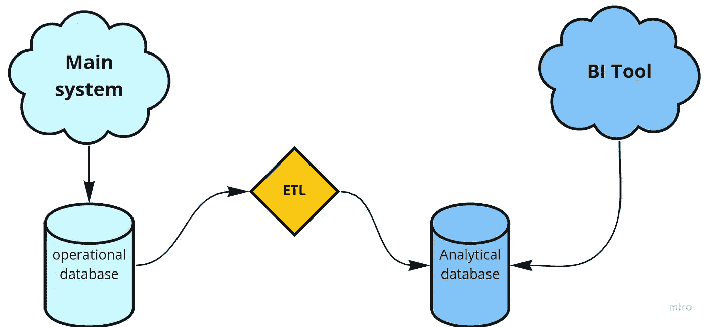
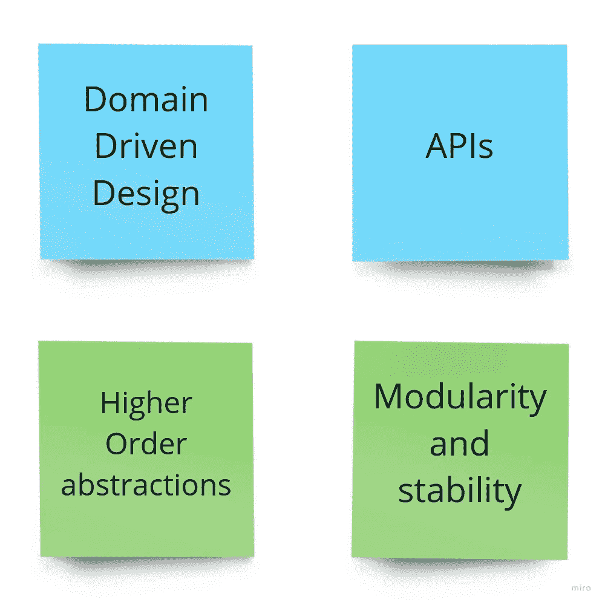

# 构建数据平台 I——ETL 偏好

> 原文：<https://medium.com/codex/building-data-platforms-the-etl-bias-d589733ce4cc?source=collection_archive---------0----------------------->

[第二部分现已开始—[https://link.medium.com/f6Ixe9Htbhb】](https://link.medium.com/f6Ixe9Htbhb])

[第三部分现已发布[此处](https://joaovasques.medium.com/building-data-platforms-iii-the-evolution-of-the-software-engineer-bdb3d9c1dd71)

这是构建数据平台系列的第一篇文章。你可能会问，为什么要这样做？很简单。如果你退后一步，看看软件行业处理数据的方式，你会发现与过去 10-15 年中发生的其他转变相比，它并没有发生根本性的变化。我们有了 Kafka、Spark、Flink 和 Snowflake 等新工具，但我们没有改变构建数据平台的思维模式。正如你将会看到的，这有很多后果，从缺乏生产力，破碎的系统，知识筒仓，不快乐的人，等等。

让我们从我认为的构建数据平台的最大问题开始这个系列 ETL 偏差。

# 什么是 ETL？

ETL 代表提取、转换和加载，在 20 世纪 70 年代非常流行。在那十年中，公司开始拥有多个数据存储库，并希望将相关信息保存在一个地方进行分析。ETL 成为执行这些类型操作的事实上的标准。

## 提取

这一步负责从一组数据源中读取数据。这些通常是关系数据库、NoSQL 数据库、JSON、CVS 或 XML 文件等。大多数情况下，这一步需要对数据所在的位置进行直接只读访问。

## 改变

转换源数据以匹配目标系统的格式。此阶段的操作包括更改数据类型、合并或拆分字段、应用更复杂的公式来派生新字段。

## 负荷

这个步骤获取转换阶段产生的数据，并将其持久化到目标数据系统中。目标系统通常是数据仓库或文件系统。

ETL 可以链接在一起以创建计算管道，并且通常被安排以给定的频率运行(例如每小时、每天、每月等)。

现在我们有了 ETL 的定义，让我们开始理解它的一些问题。

# 第一个数据产品

公司中的第一个数据产品通常是相同的，并满足以下需求

> “我们需要关于我们主要产品的指标和 KPI”。

值得一提的是，我们现在谈论的不是平台，而是一个简单的数据产品。该数据产品的目标是让公司的每个人都能使用数据进行分析。

大多数时候，第一个数据产品是使用某种 ETL 完成的，如下所示。

经典的 ETL 管道

让我们仔细看看这里正在发生的事情:

*   我们有一个主操作数据库的只读副本
*   我们完全理解领域模型和模式
*   有一个 cron 作业(或可视化拖放工具)运行一组 MongoDB 和 SQL 查询，应用一些转换并将其加载到另一个 SQL 数据库(例如，另一个 Postgres/MySQL 实例，因为人们没有时间学习新的数据库技术。)

该领域很小，其知识在所有工程团队中共享，从操作系统到 KPI 的映射逻辑非常简单，这使得它可以很快交付。ETL 管道完成后，公司能够从其操作系统中提取数据，并拥有一套很好的仪表板来支持其业务。

第一个数据产品取得了巨大的成功，每个人都很满意。

# 复杂性开始出现

有一个时间点，每个公司都开始将他们的整体分成更小的组件，即所谓的微服务。在这个微服务之旅中，工程团队通常应用[领域驱动设计概念](https://martinfowler.com/tags/domain%20driven%20design.html#:~:text=Domain%2DDriven%20Design%20is%20an,through%20a%20catalog%20of%20patterns.)和 API 最佳实践，目标是封装复杂性(通过更高阶的抽象)，同时使系统可扩展。所有这些都在操作可靠性、开发速度和体验的口号下进行，最终目标是更快地构建更好的产品。

在扩展到微服务的过程中，团队可能会决定采用不同的数据库技术，因为它们在系统运行的领域和范围内是有意义的。因为系统通过 API 通信，所以拥有不同的数据库技术没有问题。

在公司决定打破这种单一模式几个月后，工程师们加快了代码的发布速度，产品变得稳定了，新的功能也在开发中。打破巨石柱的任务成功了！

但是，我们的数据产品呢？

在过去的几个月里，ETL 不断发展，变得更加复杂。ETL 不必查询一个数据库来获取数据，而是必须连接到多个数据源。除了复杂性的明显增加，还有什么变化呢？

**所有权—** 维护和开发 ETL 现在是构建它的第一批工程师的共同责任。这些工程师现在在负责特定领域的不同系统上工作。谁是 ETL 的所有者？

**数据库技术—** 不同的系统可能有不同的数据库技术(例如，MongoDB、MySQL、Postgres、Cassandra 等..).这意味着 ETL 逻辑将混合所有这些技术和不同的查询语言。这增加了 ETL 需要实现的业务逻辑的复杂性。

**稳定性—** 使用 API 的主要目的是允许团队在不破坏客户逻辑的情况下改变他们的系统。然而，由于 ETL(大多数时候)连接到只读数据库，模式中的变化可能会中断 ETL 并导致**数据停机**(我将在本系列的后面更深入地讨论这个主题)。此外，在操作系统中构建数据提取 API 并不是优先考虑的事情，因为团队需要专注于构建和改进主要产品。

有一个时间点，公司意识到他们需要为他们的数据产品、他们的 ETL 拥有一个所有者。他们可能会承认这一点，因为:

*   人们开始抱怨丢失数据
*   ETL 管道破裂的频率越来越高，工程师们花费更多的时间来修复它们
*   工程师们声称数据产品的查询逻辑太复杂，他们缺乏对特定数据库的深入了解
*   构建复杂的数据对象需要更深入的数据库专业知识

解决办法很简单

> 他们需要一个数据工程团队

# 涨落

该公司现在有一个数据工程团队，他们对正在使用的一些数据库有着丰富的知识。一开始，团队可能能够解决一些与当前 ETL 管道的性能和稳定性相关的问题。这种情况发生后，组织中就会出现积极的趋势。这一趋势基于以下事实:

1.  有(终于有了！)拥有不同数据库技术的广泛知识的团队
2.  有一个团队知道几个系统的细微差别，因为他们需要知道他们的本体
3.  数据收集过程工作正常
4.  工程团队可以专注于构建特性，因为数据组件已经被处理好了

数据工程团队完成了许多人认为不可能完成的任务

> **他们让数据产品再次变得伟大**

拥有一家数据驱动型公司的快乐— [来源](https://giphy.com/gifs/borat-great-success-a0h7sAqON67nO)

有了这种对数据的积极乐观的新感觉，产品和工程团队开始规划新功能。这些新特性带来了产品的重要变化，以支持可用的新用例和新指标。数据工程团队的积压工作开始变得挤满了新的问题，以支持新的功能和业务中的其他领域，例如面向客户的团队。这导致了与工程团队的一系列会议，讨论数据模型中的变化，以及它们如何影响当前的 ETL 管道。由于要进行多项更改，工程师们突然意识到更改数据管道 Dag 的复杂性非同小可。使当前的数据产品保持最新并不像人们最初认为的那样简单。

因为没有人愿意呆在一个不断修补破损数据管道的地方，所以后果很简单:新功能的发布速度不会像产品和其他业务部门计划的那样快。这导致了沮丧、摩擦和一种普遍的感觉..

> **“数据让我们慢了下来”**

事实是，他们都是对的。

# 为什么数据断了又慢？

关于数据损坏和速度慢的问题并不新鲜。每个从事或曾经从事数据系统工作的人都知道这一点。

我认为问题的根源与技术经验无关，而是看数据的心态。自从 ETL 成为标准，数据团队就负责维护它们并确保它们正常工作。数据团队大部分是具有数据库专业知识的团队(所谓的 DBA)

产品和工程团队不认为数据是一等公民，因为数据团队的存在就是为了“处理数据”。对于构建特性的团队来说，担心谁需要他们生成的数据是没有意义的。很长一段时间以来，这一直是该行业的标准(我认为是从 70 年代开始)。然而，让我问你以下问题

> “如果数据是公司最宝贵的资产，那么只有一个团队负责数据有意义吗？”

答案当然是**没有**。然而，大多数公司处理数据的方式仍然是一样的，这是我称之为 ETL 偏差的结果。这意味着有一个团队(数据工程)必须:

*   从所有操作系统中提取数据
*   了解公司中的所有数据库模式
*   为报告构建所有数据模型

而其他工程团队必须:

*   为产品构建功能
*   不要担心“数据资料”，以免减缓产品开发

为了让公司获得成功，并利用数据获得优势，他们需要改变思维模式。近年来，敏捷和 DevOps 改变了软件构建的方式。如果我们回顾这两次运动背后的原因，就会发现它们解决了同一个问题:某种东西从根本上拖慢了公司的发展。当时的 it 软件和处理基础设施。今天是数据。

在本系列的第二部分，我们将讨论我认为 R&D 团队应该如何处理数据，因为众所周知，数据是 21 世纪现代互联网公司最重要的资产。现在是开始这样对待它的时候了。