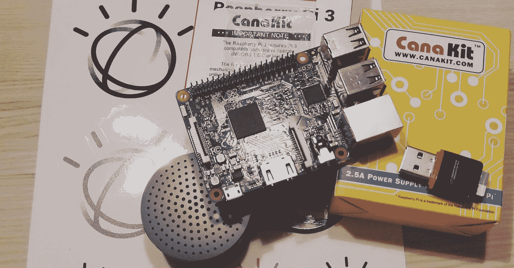

# 用 IBM Watson 和树莓 PI 构建我的认知盒子

> 原文：<https://medium.com/codex/building-my-cognitive-box-with-ibm-watson-and-a-raspberry-pi-719547e4b238?source=collection_archive---------3----------------------->

## [法典](https://medium.com/codex)

当几乎所有东西都是互联网设备时会发生什么？其结果是“物联网”——一个巨大的、无形的全球网络，其中几乎每一种产品和物理对象，包括烤面包机、树木、牛奶盒、商场停车位、汽车、道路、智能手表和医疗设备，都被贴上了传感器标签，这些传感器收集和传输有关人们消费、使用模式、位置等数据到云。

在过去的几年里，物联网已经走到了最前沿，传感器和执行器变得越来越常见。电梯、汽车、火车、飞机、地板、管道——它们都可以连接起来——共享关于其状况或用途的重要信息。

已经有超过 290 亿的东西连接在一起，记录和处理数据。这就是为什么物联网将在 2025 年创造 11 万亿美元的经济活动。

物联网已经在改变我们与世界互动的方式。物联网正在增强与我们日常生活中所依赖的事物的互动，它几乎存在于我们生活和工作的方方面面。

我有一个梦想:生活在一个互联的世界。我在家里做我的小部分，连接我公寓里几乎所有我能连接的东西，从智能电视到我的机器人吸尘器……但现在我要去一个新的层次……我带着人工智能的甜蜜味道独自把它们带到云上……或者我们这里称之为:认知。

自从我开始在 IBM 工作以来，我一直在后台学习和工作物联网，我总是对 Watson 和物联网的世界感到惊讶，现在我决定通过使用 IBM Watson 物联网服务和一个 Raspberry Pi 来将它们放在一起。

上个月我买了一个覆盆子，但是我没有太多时间去做它..但是每天在我上班的路上，我都有时间参加一些关于沃森物联网和编程的非常有趣的培训，所以我觉得现在已经准备好开始我最伟大的物联网项目了。

像往常一样，我有一些非常高的期望，所以我计划建立一个完整的认知箱，集成尽可能多的 IBM Watson 服务，如 Watson Conversation、Tone Analyzer、Discovery、Text2Speech、Speech2Text，当然还有 Watson IoT。

最终，我希望能够执行几个动作，连接和控制我的许多家庭设备，并通过我的认知盒使用自然语言与沃森交谈。最后，我会学到很多关于物联网的知识。

因此，在将我的 [Canakit Raspberry PI 3](https://www.canakit.com/raspberry-pi/raspberry-pi-3-kits) 组装在一个由 [C4Labs](https://c4labs.net/products/the-bel-aire-raspberry-pi-b) 制造的非常别致且生态的激光切割木箱中，并在上面贴上一根漂亮的 IBM Watson 棒之后……我准备开始了。

第一步是按照官方 [Raspberry PI 网站](https://www.raspberrypi.org/help/)上非常清晰的说明安装操作系统。操作系统的安装非常简单流畅，几分钟后我就可以登录 Raspbian(一个 Raspberry 专用的 Linux Debian 版本)。

有了一个通过 wifi 连接到互联网的非常稳定和快速干净的 Linux 盒子，以及我脑海中的许多想法，第一步要做的是将我的 CognitiveBox 连接到沃森物联网平台。我的计划包括使用**沃森物联网**服务、 **Node-Red、**和许多脚本来控制这个**树莓 PI** 。

在沃森物联网平台上[注册](https://developer.ibm.com/recipes/tutorials/how-to-register-devices-in-ibm-iot-foundation/)树莓派的程序非常简单。IBM Watson 物联网平台是一种完全托管的云托管服务，可以轻松地从物联网(IoT)设备中获取价值。当与 IBM Bluemix 平台结合使用时，Watson IoT 为物联网设备和数据提供了简单而强大的应用程序访问。

我将使用一些分析和一些非常好的可视化仪表板来处理我从认知箱中收集的数据。我在 [IBM DeveloperWorks](https://developer.ibm.com/recipes/tutorials/how-to-register-devices-in-ibm-iot-foundation/) 网站上找到了一篇文章，这篇文章准确地展示了我必须做些什么来建立我的 Watson 物联网组织并在其中注册设备，最后不到 10 分钟就完成了。现在我的覆盆子已经准备好成为一个认知盒子了！

为了进行一些编程练习，我部署了一对脚本来将我的 CognitiveBox 连接到 IBM Watson 物联网平台。我正在使用 [Node-RED，](https://nodered.org/)一种编程工具，用于以新的有趣的方式将硬件设备、API 和在线服务(如 Watson)连接在一起。

Node-RED 提供了一个基于浏览器的编辑器，使用调色板中的大量节点可以轻松地将流连接在一起，只需单击一下就可以将这些节点部署到它的运行时。

像第一个练习一样，我所做的只是将我的 CognitiveBox 连接到 Watson IoT，以按照本文[这里](https://developer.ibm.com/recipes/tutorials/deploy-watson-iot-node-on-raspberry-pi/)实时收集我的 CPU 温度。事实上，我没有在我的认知盒上安装一个有趣的东西，我正打算超频它..所以留意一下我的 CPU 温度是很有用的…不管怎样，下周我会安装一个有趣的东西。几分钟后，我可以看到我的认知盒向沃森发送数据。但是我想要更多…

下一步有点复杂。我有三个 MiPow 的智能 Playbulb 灯，我想用 Node-RED 和 Watson IoT 来控制它们。Playbulb 可以通过蓝牙进行控制，因此控制流包括将其与我的 CognitiveBox 的蓝牙系统配对，将蓝牙输入和输出发送到 Node-RED 流，并从那里发送到 Watson IoT，以便通过简单的命令进行分析、报告和控制。

所有的程序都包含在这篇文章中，完整的代码可以在 Github 上找到。基本上，在配对蓝牙蜡烛并设置环境和脚本后，我将继续将 CognitiveBox 指向 Watson IoT 平台，在。js 脚本来发布事件和接收设备命令，以使用 Node-RED 来控制蜡烛。

通过 Watson IoT 连接云上的灯，我可以根据阈值、状态和条件执行许多有趣的操作。例如，我可以使用 Bluemix 中可用的天气公司服务，并将其添加到 IoT/Node-Red 实例中。基本上，我可以建立一个温度的可视化表示，如蓝色=冷，红色=暖，闪烁的蓝色=非常冷，并根据这些状态设置灯的颜色。或者我可以使用 IBM Watson Tone Analyzer 和 Twitter，根据我基于标签的 Twitter 情绪来改变蜡烛的颜色。例如#Winter(白色)、#IBM(蓝色)或#Hot(红色)。可能性是无限的。

这是第一部分..下周，我将完成与 IBM Watson 会话和语音服务的集成…这样我的认知箱将开始说话！！！我非常兴奋，我等不及了！

如果你想了解更多关于 IBM Watson 物联网平台的信息..大家来说说吧！

谢谢！

贾伊尔·里贝罗

负责数据中心迁移的 Wave 项目经理|设计思考者| IBM 的认知学习领导者

*原载于 2017 年 9 月 1 日*[*【https://www.linkedin.com】*](https://www.linkedin.com/pulse/building-my-cognitive-box-ibm-watson-raspberry-pi-jair-ribeiro/)*。*