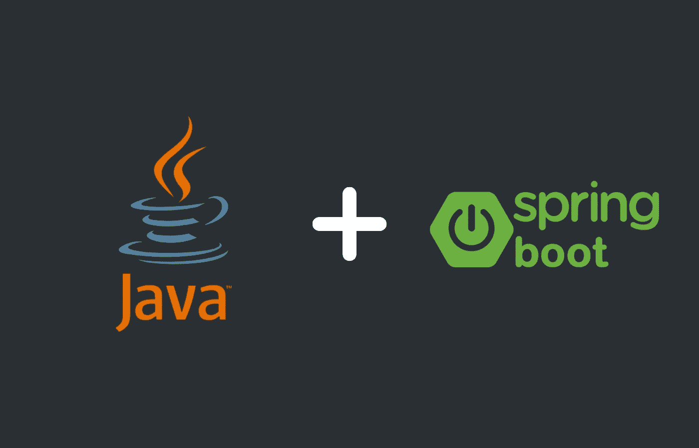

# 构建您的第一个 REST API: Java 和 Spring Boot

> 原文：<https://medium.com/codex/building-your-first-rest-api-java-and-spring-boot-5f3573f59f55?source=collection_archive---------0----------------------->

使用 Spring Boot 和 Java 构建第一个 RESTful web 服务的初学者友好指南。从项目创建到发布您的第一个 REST 请求。

爪哇和 Spring Boot

# 介绍

随着多年来网络开发的进步，了解如何将你的网站和应用连接到后台服务变得越来越有必要，即使它是…