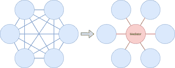
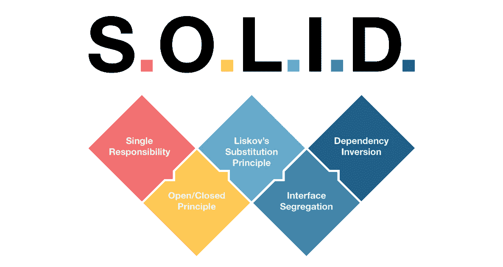

# 低编码商业应用开发指南—第 1 部分

> 原文：<https://medium.com/codex/business-apps-development-guide-with-low-coding-part-1-40061b394d5?source=collection_archive---------17----------------------->

## 与 Ernesto Diezhandino 合作撰写。


乐高汽车装配线

如何在不发疯的情况下，在一周或更短时间内构建一个商业应用**？你可以使用像 [Mendix](https://www.mendix.com) 或 [Powerapps](https://powerapps.microsoft.com/) 这样的低代码平台，并支付昂贵的订阅费用，或者你可以在一点帮助(和一些代码)下构建自己的“**低代码**”解决方案**

首先，我选择了一个[低代码](https://en.wikipedia.org/wiki/Low-code_development_platform)概念的变体，因为它拥有相同的目标，但获得它的机制非常不同，基本上是使用一个**架构、框架和工具来帮助实现软件可靠性**，只编码业务逻辑的特殊用例或“低代码”。

在这里，你可以获得可能对你有帮助的**开源代码、技巧和见解**，特别是如果你是初学者的话。当然，我花了很多年才得出这些结论，所以我希望这能帮助你。

您可以将这些知识应用于任何编程语言，但是源代码是用。网标和**。网 5** 。

在了解更多细节之前，以下是您可以从这种低编码解决方案中获得的亮点:

*   它基于开源软件，Apache 许可或类似的软件。
*   它建立在各种低耦合和可配置的组件之上，使用简洁的架构。
*   遵循坚实的原则和最佳编码实践。
*   不是黑匣子，它是你的。

# TL；速度三角形定位法(dead reckoning)

非常重要的是要注意，这个想法的种子来自于构建业务应用程序和独立面对以下挑战的长期经验，几乎所有现有的。Net 框架(来自。Net 3.5 to。Net 5，显然是几个版本；).

这是关于用低编码方法构建业务应用程序的三篇文章中的第一篇，它们是:

1.  架构、最佳实践、想法和编码技巧(就在这里！).
2.  [后端解决方案](/@manueljimenezmatilla/business-apps-development-guide-with-low-coding-part-2-backend-3016eee91c10?sk=bd139dd3ece75b018aa1110a36bda2f3)。
3.  [前端解决方案](/@manueljimenezmatilla/business-apps-development-guide-with-low-coding-part-3-ui-406694e08bc5)。

# 架构、最佳实践、想法和编码技巧

选择一个好的架构解决方案将帮助你进行项目组织，这在中型和大型项目中是最有价值的事情。然而，如果你在一个小的开发中使用它，也会有所帮助。

基于组件的六边形架构是我个人最喜欢的，但是一个干净的架构更适合低编码的解决方案，这就是为什么在这篇文章中，我将使用一个干净的架构组织，但是使用组件进行开发。

选择这种方法的主要原因是组件是制作可重用和可配置代码模块的最自然的方式。

# 调解人



你可以从维基百科的这篇[文章](https://en.wikipedia.org/wiki/Mediator_pattern)中读到:

*在* [*软件工程*](https://en.wikipedia.org/wiki/Software_engineering) *中，* ***中介模式*** *定义了一个对象，即* [*封装了*](https://en.wikipedia.org/wiki/Encapsulation_(computer_programming)) *一组对象如何交互。这种模式被认为是一种* [*行为模式*](https://en.wikipedia.org/wiki/Behavioral_pattern) *，因为它可以改变程序的运行行为*。

在后端解决方案中，我们将使用大量的组件，其中一些组件需要以严格的顺序调用，因此该模式将帮助我们:

*   **为信息流建立唯一的路径**。
*   在其中注册组件。
*   监控和审计信息流。

# 坚实的原则——单一责任



很好地掌握这些原则是很难的，当你达到时，你会觉得自己已经是一个前辈了。也许最有价值也是最难解决的问题是**单一责任原则**。从头开始牢记这一点将有助于我们使事情变得可重用、可扩展和可靠，这些软件属性是最大化项目生命周期的关键。

设计基于组件的软件有助于实现这个目标，因为每个组件都有一个单一的入口点，这将有助于您轻松地扩展它。举个例子:如果您为您的解决方案考虑一个通知组件，而不是调用一些助手库来发送通知，您将获得一个单一的入口点，您可以在其中轻松地添加审计功能。

# 命名事物

或者选择一个好名字如何促进你的发展

*“计算机科学只有两个硬东西:缓存失效和事物命名。”*

—菲尔·卡尔顿

关于“命名事物”,有一个明显的部分是低年级学生用来开玩笑的，尽管它肯定不是，你可以在这篇[媒体文章](/hackernoon/naming-the-things-in-programming-230590016f00)中读到它。

但是名字应该是什么样的呢？除了作为一个符合良好实践的惟一标识符(如前一篇文章所述)，它还应该遵循一种模式，这使得下一个技巧代码生成器成为可能。

# 代码生成器


如果我告诉你，你可以生成几乎所有的应用程序代码，或者至少是它的第一个版本，即使你遵循一些简单的指导方针就可以做到，你也不能全信。像许多其他工具一样，它可能真的很危险，所以有一些正确使用它的技巧:

1.  永远记住可扩展的固体原理。
2.  使用模板保持简单，避免黑盒。
3.  记录您的生成器所使用的模式。
4.  最好把它作为一个助手，而不是代码的替代品。

**生成器的能力利用了名称中的模式**，并在此基础上应用转换。你可以用它们解决的第一件事是数据库实体模型方案，这里有很多你可能不会用到的信息。

您可以很好地利用数据库表元数据，如:列名，数据类型，主键和外键，可空，最大长度，默认值…可以生成:

*   实体模型类。
*   验证类。
*   实体表单*。

```
*Note: If you work with database views, probably this can bring you some valuable data for building more complex UI components, such as grids with filters, for example.
```

接下来，您可以利用的是项目结构，它可以基于数据库模型层次结构，也可以位于 UI 路径或 API 路径中。这些信息可以帮助您构建或建模:

*   项目结构。
*   API 路线。
*   导航组件。

制作生成器非常简单，你可以找到一个 **C# POCO objects builder** ，遵循自底向上的方法[。](https://codverter.com/src/sqltoclass)

你也可以像[entity framework Reverse POCO Code First Generator](https://marketplace.visualstudio.com/items?itemName=SimonHughes.EntityFrameworkReversePOCOGenerator)一样使用付费库。

也有在线生成器，这是我个人最喜欢的将 [Json 转换成 C#](https://json2csharp.com) 的工具之一。

# 隐藏物


使用缓存存储数据是提升应用程序的最佳方式之一，开发缓存组件很简单，只要您从一开始就实现它。

有很多缓存库可以让你很快玩起来，我最喜欢的是 [Redis](https://redis.io/) 。

您可以用几行代码构建自己的缓存组件，但是正确使用它是另一回事。

我建议**为您的数据库访问**建立一个单一入口点，然后您可以做以下事情:

*   当数据被修改时，使缓存无效。
*   读取缓存中的数据，如果不存在，则加载到缓存中。

另一件重要的事情是配置“可缓存的”实体，以避免 Ram 过度消耗。

# 配置器模式


组件需要配置，尽管为了解决配置问题，我们必须考虑到每个配置通常取决于外部变量，即:系统环境、用户语言、设备类型等。

简而言之，配置器模式应该帮助您:

*   **整理**你的组件配置参数。
*   **过载**你的组件为每个外部变量配置。
*   通过避免问题的代码类来配置组件。

让我们用**控制反转** (IoC)技术创建一个简单的通用配置器。

IoC 技术提供了一种为每个组件解耦多个配置的方法，但是让我先解释一下它是如何工作的:

*   注册类(配置)
*   寻找合适的类别(配置)
*   注射它

要将基本的 IoC 控件转换成配置组件，我们需要添加:

*   具有接口的基本配置抽象类
*   配置类属性来查找正确的配置。这些属性是查找配置所需的过滤关键字，即基于实体类型和外部变量。

最后，配置组件作业包括:

*   注册配置类型
*   根据类型和外部变量获取配置
*   调用配置界面发布的配置方法。

我们还可以使用缓存系统来存储静态配置，为了达到这个目标，我们可以简单地添加一个“可缓存的”布尔属性。

该组件有一个部分隐藏的功能，对于部署具有相同原始属性的不同功能非常有帮助，例如:为不同设备开发 ui。在这种情况下，您可以通过拥有一个共享属性的公共库来利用此配置组件，然后在最终项目中覆盖属性来扩展它。

# 审计员

直到灾难降临，这个组件的相关性才被注意到。那你可能会希望你有一个。这是最可重用的组件之一，你可以编写一次代码，然后在你所有的项目中使用，或者使用像 Audit.Net 这样的库。

审核员的任务是:

*   编译关于会话、请求和响应的信息。
*   将这些信息写入数据库。

这个组件的技巧是使用动态类型和 Json 转换器。

最后，您应该在中介路径中注册这个组件，使它可以在开始时调用它，然后在结束时调用它。

# 结论

**考虑长远**，考虑制造可重用和可配置的组件，不要回避使用复杂的高级开发概念。听起来很奇怪，但很有效。

我鼓励你们把目光放在奥林匹克精神的地平线上:“hendiatris Citius，Altius，Fortius”。翻译成 IT 术语:**快，用顶尖技术，做可靠产品**。

本文的第二部分将处理解决方案的核心，后端开发，您将获得更多的技巧、见解和代码:)我希望它对您有用。